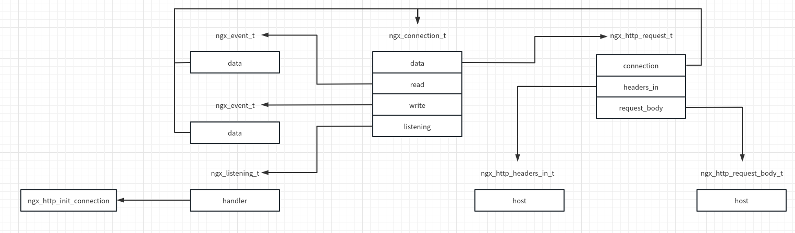
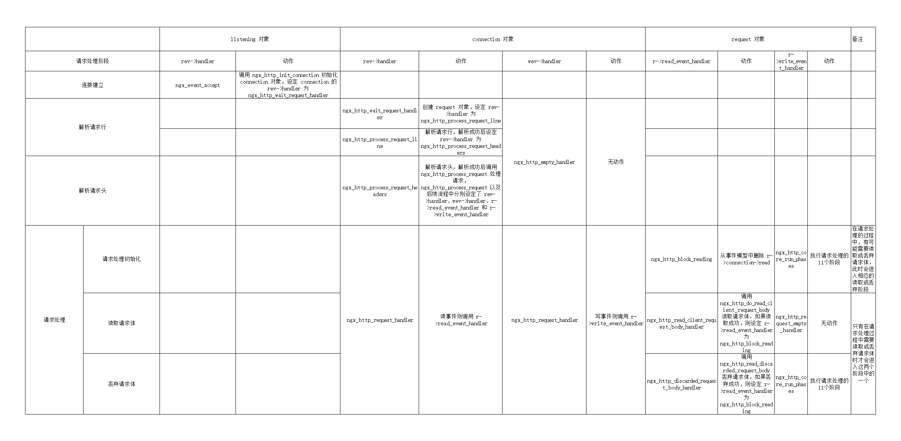
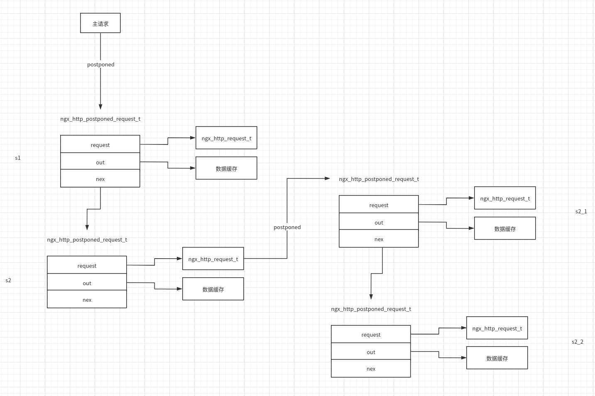

# http 模块

nginx 中处理 [http](https://zhuanlan.zhihu.com/p/346408612) 请求的大致流程为：服务器与客户端建立连接，接收对应的请求头、请求行并解析，根据配置找到对应的模块并处理（处理过程中可能涉及对请求体的处理），然后产生响应头和响应体并返回给客户端，最后完成请求的处理以及资源释放。

## http 服务初始化

http 服务的初始化可以分为3个步骤：1.模块初始化；2.事件初始化；3.http 会话的建立。

### 模块初始化

nginx 中 http 模块的相关定义如下

```C
//src/http/ngx_http.c
static ngx_command_t  ngx_http_commands[] = {//http 核心模块命令集

    { ngx_string("http"),
      NGX_MAIN_CONF|NGX_CONF_BLOCK|NGX_CONF_NOARGS,
      ngx_http_block,//配置解析回调函数，在解析到最外层的 http 指令时调用
      0,
      0,
      NULL },

      ngx_null_command
};


static ngx_core_module_t  ngx_http_module_ctx = {//http 核心模块上下文
    ngx_string("http"),
    NULL,
    NULL
};


ngx_module_t  ngx_http_module = {//http 核心模块定义
    NGX_MODULE_V1,
    &ngx_http_module_ctx,                  /* module context *///上下文
    ngx_http_commands,                     /* module directives *///命令集
    NGX_CORE_MODULE,                       /* module type *///类型
    NULL,                                  /* init master */
    NULL,                                  /* init module */
    NULL,                                  /* init process */
    NULL,                                  /* init thread */
    NULL,                                  /* exit thread */
    NULL,                                  /* exit process */
    NULL,                                  /* exit master */
    NGX_MODULE_V1_PADDING
};
```

http 模块的初始化过程可以参考《nginx 启动流程》中的内容。

### 事件初始化

http 模块的初始化工作主要在 `ngx_http_block` 中完成。

```C
//src/http/ngx_http.c
/*
	http 指令的回调函数
*/
static char *
ngx_http_block(ngx_conf_t *cf, ngx_command_t *cmd, void *conf)
{
    //配置解析
    //初始化 http 处理流程所需要的回调函数
    /* optimize the lists of ports, addresses and server names */

    if (ngx_http_optimize_servers(cf, cmcf, cmcf->ports) != NGX_OK) {//初始化监听端口
        return NGX_CONF_ERROR;
    }

    return NGX_CONF_OK;

failed:

    *cf = pcf;

    return rv;
}
```

在 `ngx_http_optimize_servers` 中，nginx 完成了对所配置的 ip 和端口的进一步解析，调用栈为 `ngx_http_optimize_servers -> ngx_http_init_listening -> ngx_http_add_listening -> ngx_create_listening`，最终将解析结果存储到了 `cf->cycle->listening` 上，并将事件处理函数设置为 `ngx_http_init_connection`。

```C
//src/http/ngx_http.c
/*
	添加监听 fd 到 cf->cycle->listening
*/
static ngx_listening_t *
ngx_http_add_listening(ngx_conf_t *cf, ngx_http_conf_addr_t *addr)
{
    ngx_listening_t           *ls;
    ngx_http_core_loc_conf_t  *clcf;
    ngx_http_core_srv_conf_t  *cscf;

    ls = ngx_create_listening(cf, addr->opt.sockaddr, addr->opt.socklen);
    if (ls == NULL) {
        return NULL;
    }

    ls->addr_ntop = 1;

    ls->handler = ngx_http_init_connection;//设置事件处理函数
    /*...*/
}

//src/core/ngx_connection.c
/*
	从 cf->cycle->listening 获取一个元素
*/
ngx_listening_t *
ngx_create_listening(ngx_conf_t *cf, struct sockaddr *sockaddr,
    socklen_t socklen)
{
    size_t            len;
    ngx_listening_t  *ls;
    struct sockaddr  *sa;
    u_char            text[NGX_SOCKADDR_STRLEN];

    ls = ngx_array_push(&cf->cycle->listening);
    if (ls == NULL) {
        return NULL;
    }
    /*...*/
}
```

在监听信息解析完成之后，nginx 通过 `main -> ngx_init_cycle -> ngx_open_listening_sockets` 完成了端口监听的工作。

```C
//
/**/
ngx_int_t
ngx_open_listening_sockets(ngx_cycle_t *cycle)
ngx_int_t
ngx_open_listening_sockets(ngx_cycle_t *cycle)
{
    int               reuseaddr;
    ngx_uint_t        i, tries, failed;
    ngx_err_t         err;
    ngx_log_t        *log;
    ngx_socket_t      s;
    ngx_listening_t  *ls;

    reuseaddr = 1;
#if (NGX_SUPPRESS_WARN)
    failed = 0;
#endif

    log = cycle->log;

    /* TODO: configurable try number */

    for (tries = 5; tries; tries--) {
        failed = 0;

        /* for each listening socket */

        ls = cycle->listening.elts;
        for (i = 0; i < cycle->listening.nelts; i++) {

            if (bind(s, ls[i].sockaddr, ls[i].socklen) == -1) {//bind
                err = ngx_socket_errno;

                if (err != NGX_EADDRINUSE || !ngx_test_config) {
                    ngx_log_error(NGX_LOG_EMERG, log, err,
                                  "bind() to %V failed", &ls[i].addr_text);
                }

                if (ngx_close_socket(s) == -1) {
                    ngx_log_error(NGX_LOG_EMERG, log, ngx_socket_errno,
                                  ngx_close_socket_n " %V failed",
                                  &ls[i].addr_text);
                }

                if (err != NGX_EADDRINUSE) {
                    return NGX_ERROR;
                }

                if (!ngx_test_config) {
                    failed = 1;
                }

                continue;
            }
            
            if (listen(s, ls[i].backlog) == -1) {//listen
                err = ngx_socket_errno;

                /*
                 * on OpenVZ after suspend/resume EADDRINUSE
                 * may be returned by listen() instead of bind(), see
                 * https://bugzilla.openvz.org/show_bug.cgi?id=2470
                 */

                if (err != NGX_EADDRINUSE || !ngx_test_config) {
                    ngx_log_error(NGX_LOG_EMERG, log, err,
                                  "listen() to %V, backlog %d failed",
                                  &ls[i].addr_text, ls[i].backlog);
                }

                if (ngx_close_socket(s) == -1) {
                    ngx_log_error(NGX_LOG_EMERG, log, ngx_socket_errno,
                                  ngx_close_socket_n " %V failed",
                                  &ls[i].addr_text);
                }

                if (err != NGX_EADDRINUSE) {
                    return NGX_ERROR;
                }

                if (!ngx_test_config) {
                    failed = 1;
                }

                continue;
            }
}
```

完成监听 fd 的监听工作之后，nginx 需要将监听 fd 的读事件添加到事件模型中。nginx 在 `ngx_event_process_init` 中完成了这一工作。

```C
//src/event/ngx_event.c
//ngx_event_process_init
//+784
    /* for each listening socket */

    ls = cycle->listening.elts;
    for (i = 0; i < cycle->listening.nelts; i++) {
        c = ngx_get_connection(ls[i].fd, cycle->log);//为监听 fd 分配连接
        rev->handler = (c->type == SOCK_STREAM) ? ngx_event_accept//设置读事件的回调函数
                                                : ngx_event_recvmsg;
        if (ngx_add_event(rev, NGX_READ_EVENT, 0) == NGX_ERROR) {//将监听 fd 的读事件添加到事件模型中
            return NGX_ERROR;
        }
```

### http 会话建立

事件初始化时，监听 fd 绑定的读事件处理函数为 `ngx_event_accept`，该函数是连接建立的起点。

```C
//src/event/ngx_event_accept.c
/*
	监听 fd 的读事件处理函数
*/
void
ngx_event_accept(ngx_event_t *ev)
{
    socklen_t          socklen;
    ngx_err_t          err;
    ngx_log_t         *log;
    ngx_uint_t         level;
    ngx_socket_t       s;
    ngx_event_t       *rev, *wev;
    ngx_sockaddr_t     sa;
    ngx_listening_t   *ls;
    ngx_connection_t  *c, *lc;
    ngx_event_conf_t  *ecf;
#if (NGX_HAVE_ACCEPT4)
    static ngx_uint_t  use_accept4 = 1;
#endif

    if (ev->timedout) {//与 +112 处的源码相关
        if (ngx_enable_accept_events((ngx_cycle_t *) ngx_cycle) != NGX_OK) {
            return;
        }

        ev->timedout = 0;
    }

    ecf = ngx_event_get_conf(ngx_cycle->conf_ctx, ngx_event_core_module);//获取 event 模块配置

    if (!(ngx_event_flags & NGX_USE_KQUEUE_EVENT)) {
        ev->available = ecf->multi_accept;
    }

    lc = ev->data;//事件对象对应的连接对象
    ls = lc->listening;//连接对象对应的监听对象
    ev->ready = 0;

    ngx_log_debug2(NGX_LOG_DEBUG_EVENT, ev->log, 0,
                   "accept on %V, ready: %d", &ls->addr_text, ev->available);

    do {//do-while 循环调用 accept 接收连接
        socklen = sizeof(ngx_sockaddr_t);

#if (NGX_HAVE_ACCEPT4)
        if (use_accept4) {
            s = accept4(lc->fd, &sa.sockaddr, &socklen, SOCK_NONBLOCK);
        } else {
            s = accept(lc->fd, &sa.sockaddr, &socklen);
        }
#else
        s = accept(lc->fd, &sa.sockaddr, &socklen);
#endif

        if (s == (ngx_socket_t) -1) {
            err = ngx_socket_errno;

            if (err == NGX_EAGAIN) {//当前没有新的连接，返回
                ngx_log_debug0(NGX_LOG_DEBUG_EVENT, ev->log, err,
                               "accept() not ready");
                return;
            }
            /*其他异常处理*/
        }

#if (NGX_STAT_STUB)
        (void) ngx_atomic_fetch_add(ngx_stat_accepted, 1);
#endif
		//更新 ngx_accept_disabled，用于检测当前 worker 连接数是否过多
        ngx_accept_disabled = ngx_cycle->connection_n / 8
                              - ngx_cycle->free_connection_n;

        c = ngx_get_connection(s, ev->log);//从连接池获取连接对象

        if (c == NULL) {
            if (ngx_close_socket(s) == -1) {
                ngx_log_error(NGX_LOG_ALERT, ev->log, ngx_socket_errno,
                              ngx_close_socket_n " failed");
            }

            return;
        }
		//对连接对象 c 进行初始化
        c->type = SOCK_STREAM;

		/*初始化操作*/

        ls->handler(c);//连接对象初始化完成后，调用监听对象的事件处理函数，根据前述可知这里调用的是 ngx_http_init_connection

        if (ngx_event_flags & NGX_USE_KQUEUE_EVENT) {
            ev->available--;
        }

    } while (ev->available);

#if (NGX_HAVE_EPOLLEXCLUSIVE)
    ngx_reorder_accept_events(ls);
#endif
}
```

连接建立成功后，nginx 会调用监听 fd 绑定的事件处理函数 `ngx_http_init_connection`

```C
//src/http/ngx_http_request.c
/*
	http 连接初始化
*/
void
ngx_http_init_connection(ngx_connection_t *c)
    ngx_uint_t                 i;
    ngx_event_t               *rev;
    struct sockaddr_in        *sin;
    ngx_http_port_t           *port;
    ngx_http_in_addr_t        *addr;
    ngx_http_log_ctx_t        *ctx;
    ngx_http_connection_t     *hc;
    ngx_http_core_srv_conf_t  *cscf;
#if (NGX_HAVE_INET6)
    struct sockaddr_in6       *sin6;
    ngx_http_in6_addr_t       *addr6;
#endif

    hc = ngx_pcalloc(c->pool, sizeof(ngx_http_connection_t));//在内存池中申请 http 连接对象
    if (hc == NULL) {
        ngx_http_close_connection(c);
        return;
    }

    c->data = hc;
	/*其他初始化操作*/
    rev = c->read;
    rev->handler = ngx_http_wait_request_handler;//设置读事件回调函数
    c->write->handler = ngx_http_empty_handler;//设置写事件回调函数
	/*...*/
    cscf = ngx_http_get_module_srv_conf(hc->conf_ctx, ngx_http_core_module);
	//将读事件添加到时间定时器中，并设置超时时间为 client_header_timeout
    ngx_add_timer(rev, cscf->client_header_timeout);
    ngx_reusable_connection(c, 1);
	//将读事件添加到事件模型中
    if (ngx_handle_read_event(rev, 0) != NGX_OK) {
        ngx_http_close_connection(c);
        return;
    }
}

/*
	当事件处理过程中不需要处理写事件时，可以将写事件的事件处理函数设置为 ngx_http_empty_handler
*/
void
ngx_http_empty_handler(ngx_event_t *wev)
{
    ngx_log_debug0(NGX_LOG_DEBUG_HTTP, wev->log, 0, "http empty handler");

    return;
}
```

至此，一次 http 请求的建立过程就完成了。当客户端开始发送数据后，nginx 会调用 `ngx_http_wait_request_handler` 进行处理工作。

## http 请求解析

### 基础结构体

每建立一个连接，nginx 都会尝试从连接池中获取一个 ngx_connection_t 结构体用以存储相关信息，如果获取失败，则直接关闭此连接。

```C
//src/core/ngx_core.h
typedef struct ngx_connection_s      ngx_connection_t;

//src/core/ngx_connection.h
struct ngx_connection_s {
    void               *data;//连接未使用时， data成员用于充当连接池中空闲连接链表中的 next 指针。当连接被使用时， data的意义由使用它的 Nginx模块而定
    ngx_event_t        *read;//连接对应的读事件
    ngx_event_t        *write;//连接对应的写事件

    ngx_socket_t        fd;//连接对应的 fd
	//接收、发送数据的相关函数指针
    ngx_recv_pt         recv;
    ngx_send_pt         send;
    ngx_recv_chain_pt   recv_chain;
    ngx_send_chain_pt   send_chain;

    ngx_listening_t    *listening;//当 fd 为 listening fd 时，该字段指向对应的 ngx_listening_s 结构体

    off_t               sent;//该连接已发送的字节数

    ngx_log_t          *log;

    ngx_pool_t         *pool;//该连接关联的内存池

    int                 type;
	//accept 获取的全连接的相关字段
    struct sockaddr    *sockaddr;
    socklen_t           socklen;
    ngx_str_t           addr_text;

    ngx_proxy_protocol_t  *proxy_protocol;

#if (NGX_SSL || NGX_COMPAT)
    ngx_ssl_connection_t  *ssl;
#endif

    ngx_udp_connection_t  *udp;

    struct sockaddr    *local_sockaddr;//ngx_listening_s 中的 sockaddr 字段
    socklen_t           local_socklen;

    ngx_buf_t          *buffer;//接收缓冲区
    /*...*/
}
```

ngx_http_request_t 存储了整个 http 处理流程所需要的全部信息。

```C
//src/http/ngx_http.h
typedef struct ngx_http_request_s     ngx_http_request_t;

//src/http/ngx_http_request.h
struct ngx_http_request_s {
    ngx_connection_t                 *connection;//对应的连接对象
    ngx_http_event_handler_pt         read_event_handler;//读事件处理函数
    ngx_http_event_handler_pt         write_event_handler;//写事件处理函数
    ngx_pool_t                       *pool;//内存池
    ngx_buf_t                        *header_in;//请求头缓冲区
    ngx_http_headers_in_t             headers_in;//解析后的请求头
    ngx_http_request_body_t          *request_body;//请求体
    ngx_uint_t                        method;//请求方法
    ngx_uint_t                        http_version;//http 版本

    ngx_str_t                         request_line;//请求行
    ngx_str_t                         uri;
    ngx_str_t                         args;
    /*...*/
}
```

http 解析后的请求头的信息存储在 ngx_http_headers_in_t 结构体中。nginx 中的结构体 ngx_http_header_t 用于辅助请求头的解析。

```C
//src/http/ngx_http_request.h
typedef struct {
    ngx_str_t                         name; //http 头部名称
    ngx_uint_t                        offset;//请求头在 ngx_http_headers_in_t 中的偏移量
    ngx_http_header_handler_pt        handler;//请求头解析函数
} ngx_http_header_t;

//src/http/ngx_http_request.c
ngx_http_header_t  ngx_http_headers_in[] = {
    { ngx_string("Host"), offsetof(ngx_http_headers_in_t, host),
                 ngx_http_process_host },

    { ngx_string("Connection"), offsetof(ngx_http_headers_in_t, connection),
                 ngx_http_process_connection },

    { ngx_string("If-Modified-Since"),
                 offsetof(ngx_http_headers_in_t, if_modified_since),
                 ngx_http_process_unique_header_line },
    /*...*/
}
/*
	在解析请求头时，只需从 ngx_http_headers_in 中查找请求头对应的 ngx_http_header_t 对象，调用 handler 函数，并将相应数据存储到 r->headers_in 对应的字段中
*/

//src/http/ngx_http_request.c
/*
	connection 请求头的解析函数
*/
static ngx_int_t
ngx_http_process_connection(ngx_http_request_t *r, ngx_table_elt_t *h,
    ngx_uint_t offset)
{
    if (ngx_http_process_header_line(r, h, offset) != NGX_OK) {
        return NGX_ERROR;
    }

    if (ngx_strcasestrn(h->value.data, "close", 5 - 1)) {
        r->headers_in.connection_type = NGX_HTTP_CONNECTION_CLOSE;

    } else if (ngx_strcasestrn(h->value.data, "keep-alive", 10 - 1)) {
        r->headers_in.connection_type = NGX_HTTP_CONNECTION_KEEP_ALIVE;
    }

    return NGX_OK;
}

//src/core/ngx_hash.h
typedef struct ngx_table_elt_s  ngx_table_elt_t;//存储请求头的键值对

struct ngx_table_elt_s {
    ngx_uint_t        hash;//请求头 key 的 hash
    ngx_str_t         key;
    ngx_str_t         value;
    u_char           *lowcase_key;//将请求头 key 转换为小写
    ngx_table_elt_t  *next;
};
```

为了提升在 ngx_http_headers_in 数组中查找 ngx_http_header_t 对象的效率，nginx 将其转换为了哈希表并存储在 `ngx_http_core_main_conf_t.headers_in_hash` 中

```C
//src/http/ngx_http.c
/*
	将 ngx_http_headers_in 转换为哈希表
*/
static ngx_int_t
ngx_http_init_headers_in_hash(ngx_conf_t *cf, ngx_http_core_main_conf_t *cmcf)
{
    ngx_array_t         headers_in;
    ngx_hash_key_t     *hk;
    ngx_hash_init_t     hash;
    ngx_http_header_t  *header;

    if (ngx_array_init(&headers_in, cf->temp_pool, 32, sizeof(ngx_hash_key_t))
        != NGX_OK)
    {
        return NGX_ERROR;
    }

    for (header = ngx_http_headers_in; header->name.len; header++) {
        hk = ngx_array_push(&headers_in);
        if (hk == NULL) {
            return NGX_ERROR;
        }

        hk->key = header->name;
        hk->key_hash = ngx_hash_key_lc(header->name.data, header->name.len);
        hk->value = header;
    }

    hash.hash = &cmcf->headers_in_hash;
    hash.key = ngx_hash_key_lc;
    hash.max_size = 512;
    hash.bucket_size = ngx_align(64, ngx_cacheline_size);
    hash.name = "headers_in_hash";
    hash.pool = cf->pool;
    hash.temp_pool = NULL;

    if (ngx_hash_init(&hash, headers_in.elts, headers_in.nelts) != NGX_OK) {
        return NGX_ERROR;
    }

    return NGX_OK;
}
```

http 解析过程中基础结构体之间的关系如下图所示



### 接收请求流程

http 请求接收的初始化阶段包含以下几个关键流程

1. nginx 为每一个监听 fd 分配一个连接，且连接中设置的读事件的回调函数设置为 `ngx_event_accept` ，监听 fd 绑定的 handler 设置为 `ngx_http_init_connection`
2. 当监听 fd 的读事件触发后，nginx 调用 `ngx_event_accept` 获取连接，并调用监听 fd 绑定的 handler `ngx_http_init_connection`
3. 在 `ngx_http_init_connection` 中继续对 `ngx_event_accept` 中获得的连接对象进行初始化，绑定读事件处理函数为 `ngx_http_wait_request_handler`，写事件处理函数为 `ngx_http_empty_handler`，并将读事件添加到定时器和事件处理模型中
4. 等待客户端数据到来，调用 `ngx_http_wait_request_handler`

接下来看一下 `ngx_http_wait_request_handler` 的实现

```C
//src/http/ngx_http_request.c
/*
	函数执行流程：
	1.判断是否超时
	2.构造缓冲区
	3.接收数据
	4.创建 ngx_http_request_t 对象
	5.设置当前读事件的事件处理函数为 ngx_http_process_request_line
*/
static void
ngx_http_wait_request_handler(ngx_event_t *rev)
{
    u_char                    *p;
    size_t                     size;
    ssize_t                    n;
    ngx_buf_t                 *b;
    ngx_connection_t          *c;
    ngx_http_connection_t     *hc;
    ngx_http_core_srv_conf_t  *cscf;

    c = rev->data;

    ngx_log_debug0(NGX_LOG_DEBUG_HTTP, c->log, 0, "http wait request handler");

    if (rev->timedout) {//判断客户端是否超时，client_header_timeout为超时时间
        ngx_log_error(NGX_LOG_INFO, c->log, NGX_ETIMEDOUT, "client timed out");
        ngx_http_close_connection(c);
        return;
    }

    if (c->close) {
        ngx_http_close_connection(c);
        return;
    }

    hc = c->data;
    cscf = ngx_http_get_module_srv_conf(hc->conf_ctx, ngx_http_core_module);

    size = cscf->client_header_buffer_size;//client_header_buffer_size 指令

    b = c->buffer;//初始化缓冲区

    if (b == NULL) {
        b = ngx_create_temp_buf(c->pool, size);
        if (b == NULL) {
            ngx_http_close_connection(c);
            return;
        }

        c->buffer = b;

    } else if (b->start == NULL) {

        b->start = ngx_palloc(c->pool, size);
        if (b->start == NULL) {
            ngx_http_close_connection(c);
            return;
        }

        b->pos = b->start;
        b->last = b->start;
        b->end = b->last + size;
    }

    n = c->recv(c, b->last, size);//调用连接对象关联的 recv 方法接收数据

    if (n == NGX_AGAIN) {//客户端没有数据到来

        if (!rev->timer_set) {
            ngx_add_timer(rev, cscf->client_header_timeout);
            ngx_reusable_connection(c, 1);
        }

        if (ngx_handle_read_event(rev, 0) != NGX_OK) {
            ngx_http_close_connection(c);
            return;
        }

        /*
         * We are trying to not hold c->buffer's memory for an idle connection.
         */

        if (ngx_pfree(c->pool, b->start) == NGX_OK) {
            b->start = NULL;
        }

        return;
    }

    if (n == NGX_ERROR) {//出错
        ngx_http_close_connection(c);
        return;
    }

    if (n == 0) {//客户端已关闭
        ngx_log_error(NGX_LOG_INFO, c->log, 0,
                      "client closed connection");
        ngx_http_close_connection(c);
        return;
    }

    b->last += n;

    if (hc->proxy_protocol) {
        hc->proxy_protocol = 0;

        p = ngx_proxy_protocol_read(c, b->pos, b->last);

        if (p == NULL) {
            ngx_http_close_connection(c);
            return;
        }

        b->pos = p;

        if (b->pos == b->last) {
            c->log->action = "waiting for request";
            b->pos = b->start;
            b->last = b->start;
            ngx_post_event(rev, &ngx_posted_events);
            return;
        }
    }

    c->log->action = "reading client request line";

    ngx_reusable_connection(c, 0);

    c->data = ngx_http_create_request(c);//创建一个 ngx_http_request_t 并关联到当前的连接对象
    if (c->data == NULL) {
        ngx_http_close_connection(c);
        return;
    }

    rev->handler = ngx_http_process_request_line;//重新设置读事件的事件处理函数为 ngx_http_process_request_line
    ngx_http_process_request_line(rev);
}
```

### 解析请求行

nginx 通过 `ngx_http_process_request_line` 对请求行进行解析

```C
//src/http/ngx_http_request.c
/*
	解析请求行
	成功收到报文后，nginx 会调用 ngx_http_parse_request_line 对请求行进行解析，根据 ngx_http_parse_request_line 的返回值 rc 分成以下情况处理
	1. NGX_OK 请求行解析成功
	2. NGX_AGAIN 分成两种情况——缓冲区空间不足或者已读数据不足
	3. 其他返回值 出错
*/
ngx_http_process_request_line(ngx_event_t *rev)
{
    ssize_t              n;
    ngx_int_t            rc, rv;
    ngx_str_t            host;
    ngx_connection_t    *c;
    ngx_http_request_t  *r;

    c = rev->data;//事件对应的连接对象
    r = c->data;//连接对象对应的请求对象

    ngx_log_debug0(NGX_LOG_DEBUG_HTTP, rev->log, 0,
                   "http process request line");

    if (rev->timedout) {//判断是否超时
        ngx_log_error(NGX_LOG_INFO, c->log, NGX_ETIMEDOUT, "client timed out");
        c->timedout = 1;
        ngx_http_close_request(r, NGX_HTTP_REQUEST_TIME_OUT);
        return;
    }

    rc = NGX_AGAIN;

    for ( ;; ) {

        if (rc == NGX_AGAIN) {
            n = ngx_http_read_request_header(r);

            if (n == NGX_AGAIN || n == NGX_ERROR) {
                break;
            }
        }

        rc = ngx_http_parse_request_line(r, r->header_in);//解析请求行

        if (rc == NGX_OK) {//请求行解析成功

            /* the request line has been parsed successfully */
			//记录请求行起始地址以及长度
            r->request_line.len = r->request_end - r->request_start;
            r->request_line.data = r->request_start;
            r->request_length = r->header_in->pos - r->request_start;

            ngx_log_debug1(NGX_LOG_DEBUG_HTTP, c->log, 0,
                           "http request line: \"%V\"", &r->request_line);
			//将请求方法保存到 method_name 中
            r->method_name.len = r->method_end - r->request_start + 1;
            r->method_name.data = r->request_line.data;
			//http_protocol 保存 http 版本
            if (r->http_protocol.data) {
                r->http_protocol.len = r->request_end - r->http_protocol.data;
            }
			//解析 uri
            if (ngx_http_process_request_uri(r) != NGX_OK) {
                break;
            }

            if (r->schema_end) {
                r->schema.len = r->schema_end - r->schema_start;
                r->schema.data = r->schema_start;
            }
			
            if (r->host_end) {//分析请求 host

                host.len = r->host_end - r->host_start;
                host.data = r->host_start;

                rc = ngx_http_validate_host(&host, r->pool, 0);

                if (rc == NGX_DECLINED) {
                    ngx_log_error(NGX_LOG_INFO, c->log, 0,
                                  "client sent invalid host in request line");
                    ngx_http_finalize_request(r, NGX_HTTP_BAD_REQUEST);
                    break;
                }

                if (rc == NGX_ERROR) {
                    ngx_http_close_request(r, NGX_HTTP_INTERNAL_SERVER_ERROR);
                    break;
                }

                if (ngx_http_set_virtual_server(r, &host) == NGX_ERROR) {//设置请求描述结构体 r 对应的 server
                    break;
                }

                r->headers_in.server = host;
            }

            if (r->http_version < NGX_HTTP_VERSION_10) {//http 版本是1.0以下则直接处理

                if (r->headers_in.server.len == 0
                    && ngx_http_set_virtual_server(r, &r->headers_in.server)
                       == NGX_ERROR)
                {
                    break;
                }

                ngx_http_process_request(r);
                break;
            }


            if (ngx_list_init(&r->headers_in.headers, r->pool, 20,//初始化 headers 数组，准备解析 headers
                              sizeof(ngx_table_elt_t))
                != NGX_OK)
            {
                ngx_http_close_request(r, NGX_HTTP_INTERNAL_SERVER_ERROR);
                break;
            }

            c->log->action = "reading client request headers";

            rev->handler = ngx_http_process_request_headers;//将读事件处理函数设置为 ngx_http_process_request_headers
            ngx_http_process_request_headers(rev);

            break;
        }

        if (rc != NGX_AGAIN) {

            /* there was error while a request line parsing */

            ngx_log_error(NGX_LOG_INFO, c->log, 0,
                          ngx_http_client_errors[rc - NGX_HTTP_CLIENT_ERROR]);

            if (rc == NGX_HTTP_PARSE_INVALID_VERSION) {
                ngx_http_finalize_request(r, NGX_HTTP_VERSION_NOT_SUPPORTED);

            } else {
                ngx_http_finalize_request(r, NGX_HTTP_BAD_REQUEST);
            }

            break;
        }

        /* NGX_AGAIN: a request line parsing is still incomplete */

        if (r->header_in->pos == r->header_in->end) {//缓冲区空间不足

            rv = ngx_http_alloc_large_header_buffer(r, 1);//分配一块 large 缓冲区

            if (rv == NGX_ERROR) {
                ngx_http_close_request(r, NGX_HTTP_INTERNAL_SERVER_ERROR);
                break;
            }

            if (rv == NGX_DECLINED) {//如果 large 缓冲区仍然不足，则报错
                r->request_line.len = r->header_in->end - r->request_start;
                r->request_line.data = r->request_start;

                ngx_log_error(NGX_LOG_INFO, c->log, 0,
                              "client sent too long URI");
                ngx_http_finalize_request(r, NGX_HTTP_REQUEST_URI_TOO_LARGE);
                break;
            }
        }
    }

    ngx_http_run_posted_requests(c);
}
```

上述流程中，nginx 还调用了两个函数 `ngx_http_read_request_header` 以及 `ngx_http_parse_request_line`，分别用于读取请求头以及解析请求行

```C
//src/http/ngx_http_request.c
/*
	在解析请求行和请求头的过程中被多次调用
*/
static ssize_t
ngx_http_read_request_header(ngx_http_request_t *r)
{
    ssize_t                    n;
    ngx_event_t               *rev;
    ngx_connection_t          *c;
    ngx_http_core_srv_conf_t  *cscf;

    c = r->connection;
    rev = c->read;

    n = r->header_in->last - r->header_in->pos;

    if (n > 0) {//header_in 中有数据，不需要继续读取
        return n;
    }

    if (rev->ready) {//读取客户端数据
        n = c->recv(c, r->header_in->last,
                    r->header_in->end - r->header_in->last);
    } else {
        n = NGX_AGAIN;
    }

    if (n == NGX_AGAIN) {//没有数据可读，下次再试，将读事件添加到定时器和事件模型中
        if (!rev->timer_set) {
            cscf = ngx_http_get_module_srv_conf(r, ngx_http_core_module);
            ngx_add_timer(rev, cscf->client_header_timeout);
        }

        if (ngx_handle_read_event(rev, 0) != NGX_OK) {
            ngx_http_close_request(r, NGX_HTTP_INTERNAL_SERVER_ERROR);
            return NGX_ERROR;
        }

        return NGX_AGAIN;
    }

    if (n == 0) {//读取0字节，出错
        ngx_log_error(NGX_LOG_INFO, c->log, 0,
                      "client prematurely closed connection");
    }

    if (n == 0 || n == NGX_ERROR) {//出错，结束请求
        c->error = 1;
        c->log->action = "reading client request headers";

        ngx_http_finalize_request(r, NGX_HTTP_BAD_REQUEST);
        return NGX_ERROR;
    }

    r->header_in->last += n;

    return n;
}
```

`ngx_http_parse_request_line` 用于解析请求行

```C
//src/http/ngx_http_parse.c
/*
	使用状态机解析 http 请求行。解析成功返回 NGX_OK，未完全解析返回 NGX_AGAIN，出错返回其他
	比如 GET /admin HTTP/1.1\r\n
*/
ngx_int_t
ngx_http_parse_request_line(ngx_http_request_t *r, ngx_buf_t *b)
{
    u_char  c, ch, *p, *m;
    enum {
        sw_start = 0,//初始状态
        sw_method,//请求方法
        sw_spaces_before_uri,//uri 前的空格
        sw_schema,//schema http 或者 https
        sw_schema_slash,//schema:，然后得到第一个 /
        sw_schema_slash_slash,//解析得到第二个 /，然后开始 host 解析
        sw_host_start,//host 主机或者 IP 解析开始
        sw_host,//解析 host 主机或者 IP
        sw_host_end,//host 合法
        sw_host_ip_literal,//host 非法
        sw_port,//解析 uri 中的 port
        sw_after_slash_in_uri,//解析 url 路径中 / 后的内容
        sw_check_uri,//检查 uri
        sw_uri,//解析 uri 结束
        sw_http_09,//检查 url 后紧跟空格后的内容
        sw_http_H,   //
        sw_http_HT,  //
        sw_http_HTT, //
        sw_http_HTTP,//检查 HTTP/
        sw_first_major_digit,//
        sw_major_digit,//解析主版本号的第一个数字
        sw_first_minor_digit,//解析主版本号的第一个数字后的数字
        sw_minor_digit,//解析次版本号的第一个数字
        sw_spaces_after_digit,//解析次版本号的第一个数字后的数字
        sw_almost_done//解析结束的\n
    } state;

    state = r->state;

    for (p = b->pos; p < b->last; p++) {
        ch = *p;

        switch (state) {

        /* HTTP methods: GET, HEAD, POST */
        case sw_start://起始状态
            r->request_start = p;

            if (ch == CR || ch == LF) {
                break;
            }

            if ((ch < 'A' || ch > 'Z') && ch != '_' && ch != '-') {
                return NGX_HTTP_PARSE_INVALID_METHOD;
            }

            state = sw_method;//开始解析请求方法
            break;

        case sw_method:
            if (ch == ' ') {
                r->method_end = p - 1;//记录请求方法的结束位置
                m = r->request_start;

                switch (p - m) {

                case 3:
                    if (ngx_str3_cmp(m, 'G', 'E', 'T', ' ')) {
                        r->method = NGX_HTTP_GET;
                        break;
                    }

                    if (ngx_str3_cmp(m, 'P', 'U', 'T', ' ')) {
                        r->method = NGX_HTTP_PUT;
                        break;
                    }

                    break;

                case 4:
                    if (m[1] == 'O') {

                        if (ngx_str3Ocmp(m, 'P', 'O', 'S', 'T')) {
                            r->method = NGX_HTTP_POST;
                            break;
                        }

                        if (ngx_str3Ocmp(m, 'C', 'O', 'P', 'Y')) {
                            r->method = NGX_HTTP_COPY;
                            break;
                        }

                        if (ngx_str3Ocmp(m, 'M', 'O', 'V', 'E')) {
                            r->method = NGX_HTTP_MOVE;
                            break;
                        }

                        if (ngx_str3Ocmp(m, 'L', 'O', 'C', 'K')) {
                            r->method = NGX_HTTP_LOCK;
                            break;
                        }

                    } else {

                        if (ngx_str4cmp(m, 'H', 'E', 'A', 'D')) {
                            r->method = NGX_HTTP_HEAD;
                            break;
                        }
                    }

                    break;
                        /*...*/
}
```

### 解析请求头

请求行解析成功后，读事件的处理函数被设置为 `ngx_http_process_request_headers`，开始请求头的解析。

```c
//src/http/ngx_http_request.c
/*
	解析请求头
*/
static void
ngx_http_process_request_headers(ngx_event_t *rev)
{
    u_char                     *p;
    size_t                      len;
    ssize_t                     n;
    ngx_int_t                   rc, rv;
    ngx_table_elt_t            *h;
    ngx_connection_t           *c;
    ngx_http_header_t          *hh;
    ngx_http_request_t         *r;
    ngx_http_core_srv_conf_t   *cscf;
    ngx_http_core_main_conf_t  *cmcf;

    c = rev->data;//获取连接对象
    r = c->data;//获取连接对象对应的请求对象

    ngx_log_debug0(NGX_LOG_DEBUG_HTTP, rev->log, 0,
                   "http process request header line");

    if (rev->timedout) {//检查是否发生超时事件
        ngx_log_error(NGX_LOG_INFO, c->log, NGX_ETIMEDOUT, "client timed out");
        c->timedout = 1;
        ngx_http_close_request(r, NGX_HTTP_REQUEST_TIME_OUT);
        return;
    }

    cmcf = ngx_http_get_module_main_conf(r, ngx_http_core_module);

    rc = NGX_AGAIN;

    for ( ;; ) {//for 循环处理请求头

        if (rc == NGX_AGAIN) {

            if (r->header_in->pos == r->header_in->end) {//缓冲区已耗尽，尝试分配更大的缓冲区来存放请求头

                rv = ngx_http_alloc_large_header_buffer(r, 0);

                if (rv == NGX_ERROR) {
                    ngx_http_close_request(r, NGX_HTTP_INTERNAL_SERVER_ERROR);
                    break;
                }

                if (rv == NGX_DECLINED) {
                    p = r->header_name_start;

                    r->lingering_close = 1;

                    if (p == NULL) {
                        ngx_log_error(NGX_LOG_INFO, c->log, 0,
                                      "client sent too large request");
                        ngx_http_finalize_request(r,
                                            NGX_HTTP_REQUEST_HEADER_TOO_LARGE);
                        break;
                    }

                    len = r->header_in->end - p;

                    if (len > NGX_MAX_ERROR_STR - 300) {
                        len = NGX_MAX_ERROR_STR - 300;
                    }

                    ngx_log_error(NGX_LOG_INFO, c->log, 0,
                                "client sent too long header line: \"%*s...\"",
                                len, r->header_name_start);

                    ngx_http_finalize_request(r,
                                            NGX_HTTP_REQUEST_HEADER_TOO_LARGE);
                    break;
                }
            }

            n = ngx_http_read_request_header(r);//继续读取客户端数据

            if (n == NGX_AGAIN || n == NGX_ERROR) {
                break;
            }
        }

        /* the host header could change the server configuration context */
        cscf = ngx_http_get_module_srv_conf(r, ngx_http_core_module);

        rc = ngx_http_parse_header_line(r, r->header_in,//解析请求头
                                        cscf->underscores_in_headers);

        if (rc == NGX_OK) {//当前 header line 解析成功

            r->request_length += r->header_in->pos - r->header_name_start;

            if (r->invalid_header && cscf->ignore_invalid_headers) {

                /* there was error while a header line parsing */

                ngx_log_error(NGX_LOG_INFO, c->log, 0,
                              "client sent invalid header line: \"%*s\"",
                              r->header_end - r->header_name_start,
                              r->header_name_start);
                continue;
            }

            /* a header line has been parsed successfully */

            h = ngx_list_push(&r->headers_in.headers);//r->headers_in.headers是一个 ngx_list_t，元素类型为 ngx_table_elt_t
            if (h == NULL) {
                ngx_http_close_request(r, NGX_HTTP_INTERNAL_SERVER_ERROR);
                break;
            }

            h->hash = r->header_hash;
			//将 header 的 key 和 value 存入 h 的 key 和 value 中
            h->key.len = r->header_name_end - r->header_name_start;
            h->key.data = r->header_name_start;
            h->key.data[h->key.len] = '\0';

            h->value.len = r->header_end - r->header_start;
            h->value.data = r->header_start;
            h->value.data[h->value.len] = '\0';

            h->lowcase_key = ngx_pnalloc(r->pool, h->key.len);
            if (h->lowcase_key == NULL) {
                ngx_http_close_request(r, NGX_HTTP_INTERNAL_SERVER_ERROR);
                break;
            }

            if (h->key.len == r->lowcase_index) {
                ngx_memcpy(h->lowcase_key, r->lowcase_header, h->key.len);

            } else {
                ngx_strlow(h->lowcase_key, h->key.data, h->key.len);
            }
			//cmcf->headers_in_hash 为哈希表以加快 header 查找速度，hh 为 ngx_http_header_t，用于辅助 header 解析
            hh = ngx_hash_find(&cmcf->headers_in_hash, h->hash,
                               h->lowcase_key, h->key.len);

            if (hh && hh->handler(r, h, hh->offset) != NGX_OK) {//调用预定义的解析函数对 header 进行解析
                break;
            }

            ngx_log_debug2(NGX_LOG_DEBUG_HTTP, r->connection->log, 0,
                           "http header: \"%V: %V\"",
                           &h->key, &h->value);

            continue;
        }

        if (rc == NGX_HTTP_PARSE_HEADER_DONE) {//所有 header line 解析完成

            /* a whole header has been parsed successfully */

            ngx_log_debug0(NGX_LOG_DEBUG_HTTP, r->connection->log, 0,
                           "http header done");

            r->request_length += r->header_in->pos - r->header_name_start;

            r->http_state = NGX_HTTP_PROCESS_REQUEST_STATE;//设置宏 NGX_HTTP_PROCESS_REQUEST_STATE

            rc = ngx_http_process_request_header(r);//进一步处理 header

            if (rc != NGX_OK) {
                break;
            }

            ngx_http_process_request(r);//进入请求处理阶段

            break;
        }
		
        if (rc == NGX_AGAIN) {//继续循环接收数据

            /* a header line parsing is still not complete */

            continue;
        }

        /* rc == NGX_HTTP_PARSE_INVALID_HEADER */
		//出错直接结束 http 请求
        ngx_log_error(NGX_LOG_INFO, c->log, 0,
                      "client sent invalid header line: \"%*s\\x%02xd...\"",
                      r->header_end - r->header_name_start,
                      r->header_name_start, *r->header_end);

        ngx_http_finalize_request(r, NGX_HTTP_BAD_REQUEST);
        break;
    }

    ngx_http_run_posted_requests(c);//处理子请求
}
```

`ngx_http_parse_header_line` 用于请求头的解析

```C
//src/http/ngx_http_parse.c
/*
	与请求行的解析类似，使用状态机解析请求头
*/
ngx_int_t
ngx_http_parse_header_line(ngx_http_request_t *r, ngx_buf_t *b,
    ngx_uint_t allow_underscores)
{
    u_char      c, ch, *p;
    ngx_uint_t  hash, i;
    enum {
        sw_start = 0,//初始状态
        sw_name,//解析请求头字段名
        sw_space_before_value,//解析请求头字段值前的空格
        sw_value,//解析字段值
        sw_space_after_value,//解析字段值后紧跟空格后的空格
        sw_ignore_line,//忽略请求头前的无用行
        sw_almost_done,//行尾的换行符
        sw_header_almost_done//结束的结束
    } state;

    /* the last '\0' is not needed because string is zero terminated */

    static u_char  lowcase[] =
        "\0\0\0\0\0\0\0\0\0\0\0\0\0\0\0\0\0\0\0\0\0\0\0\0\0\0\0\0\0\0\0\0"
        "\0\0\0\0\0\0\0\0\0\0\0\0\0-\0\0" "0123456789\0\0\0\0\0\0"
        "\0abcdefghijklmnopqrstuvwxyz\0\0\0\0\0"
        "\0abcdefghijklmnopqrstuvwxyz\0\0\0\0\0"
        "\0\0\0\0\0\0\0\0\0\0\0\0\0\0\0\0\0\0\0\0\0\0\0\0\0\0\0\0\0\0\0\0"
        "\0\0\0\0\0\0\0\0\0\0\0\0\0\0\0\0\0\0\0\0\0\0\0\0\0\0\0\0\0\0\0\0"
        "\0\0\0\0\0\0\0\0\0\0\0\0\0\0\0\0\0\0\0\0\0\0\0\0\0\0\0\0\0\0\0\0"
        "\0\0\0\0\0\0\0\0\0\0\0\0\0\0\0\0\0\0\0\0\0\0\0\0\0\0\0\0\0\0\0";

    state = r->state;
    hash = r->header_hash;
    i = r->lowcase_index;

    for (p = b->pos; p < b->last; p++) {
        ch = *p;

        switch (state) {

        /* first char */
        case sw_start://初始状态
            r->header_name_start = p;
            r->invalid_header = 0;

            switch (ch) {
            case CR://解析完成某一行请求头
                r->header_end = p;
                state = sw_header_almost_done;
                break;
            case LF://请求头解析完毕
                r->header_end = p;
                goto header_done;
            default:
                state = sw_name;//解析请求头字段名

                c = lowcase[ch];

                if (c) {
                    hash = ngx_hash(0, c);
                    r->lowcase_header[0] = c;
                    i = 1;
                    break;
                }

                if (ch == '_') {
                    if (allow_underscores) {
                        hash = ngx_hash(0, ch);
                        r->lowcase_header[0] = ch;
                        i = 1;

                    } else {
                        hash = 0;
                        i = 0;
                        r->invalid_header = 1;
                    }

                    break;
                }

                if (ch <= 0x20 || ch == 0x7f || ch == ':') {
                    r->header_end = p;
                    return NGX_HTTP_PARSE_INVALID_HEADER;
                }

                hash = 0;
                i = 0;
                r->invalid_header = 1;

                break;

            }
            break;

        /* header name */
        case sw_name:
                /*...*/
}
```

### 请求处理

nginx 将 http 请求的处理划分为多个阶段，不同的 http 模块会将自己的 handler 添加到 http 请求处理的不同阶段以处理 http 请求。

#### 阶段划分

nginx 将 http 请求的处理划分为11个阶段，nginx 处理 http 请求时会逐个调用每个阶段的 handler 函数。11个阶段中，3个阶段不能添加自定义的 handler 函数。

```C
//src/http/ngx_http_core_module.h
typedef enum {
    NGX_HTTP_POST_READ_PHASE = 0,

    NGX_HTTP_SERVER_REWRITE_PHASE,//server 块中配置了 rewrite 指令，重写 URL

    NGX_HTTP_FIND_CONFIG_PHASE,//查找匹配的 location 配置块，不能自定义 handler
    NGX_HTTP_REWRITE_PHASE,//location 块中配置了 rewrite 指令，重写 URL
    NGX_HTTP_POST_REWRITE_PHASE,//检查是否发生了 URL 重写；如果有，返回 FIND_CONFIG 阶段，不能自定义 handler 函数
	//访问控制，比如限流模块会注册到此阶段
    NGX_HTTP_PREACCESS_PHASE,
	//访问权限控制，比如基于 IP 黑白名单的权限控制、基于用户名密码的权限控制等
    NGX_HTTP_ACCESS_PHASE,
    NGX_HTTP_POST_ACCESS_PHASE,//根据 ACCESS 阶段做相应处理，不能自定义 handler
	//内容预处理阶段，配置了 try_files 或者 mirror 指令才会有此阶段
    NGX_HTTP_PRECONTENT_PHASE,
	//内容产生阶段，返回响应给客户端
    NGX_HTTP_CONTENT_PHASE,
	//日志记录阶段
    NGX_HTTP_LOG_PHASE
} ngx_http_phases;
```

http 模块的上下文的 postconfiguration 负责注册本模块的 handler 函数到某个处理阶段。在 http 模块指令解析完成后进行注册工作。

```C
//src/http/ngx_http.c
//ngx_http_block
//+293
    if (ngx_http_init_phases(cf, cmcf) != NGX_OK) {//初始化11个阶段的 phases 数组
        return NGX_CONF_ERROR;
    }

    if (ngx_http_init_headers_in_hash(cf, cmcf) != NGX_OK) {//将 ngx_http_headers_in 转换为哈希表
        return NGX_CONF_ERROR;
    }

	//遍历所有 http 模块，注册 handler 函数
    for (m = 0; cf->cycle->modules[m]; m++) {
        if (cf->cycle->modules[m]->type != NGX_HTTP_MODULE) {
            continue;
        }

        module = cf->cycle->modules[m]->ctx;

        if (module->postconfiguration) {
            if (module->postconfiguration(cf) != NGX_OK) {
                return NGX_CONF_ERROR;
            }
        }
    }

    if (ngx_http_variables_init_vars(cf) != NGX_OK) {
        return NGX_CONF_ERROR;
    }

    /*
     * http{}'s cf->ctx was needed while the configuration merging
     * and in postconfiguration process
     */

    *cf = pcf;

	//将二维数组转化为一维数组，并设定各个 handler 的 checker 函数
    if (ngx_http_init_phase_handlers(cf, cmcf) != NGX_OK) {
        return NGX_CONF_ERROR;
    }
```

以 `ngx_http_limit_req_module` 为例

~~~~C
//src/http/modules/ngx_http_limit_req_module.c
static ngx_http_module_t  ngx_http_limit_req_module_ctx = {
    ngx_http_limit_req_add_variables,      /* preconfiguration */
    ngx_http_limit_req_init,               /* postconfiguration *///注册 handler 时的回调函数

    NULL,                                  /* create main configuration */
    NULL,                                  /* init main configuration */

    NULL,                                  /* create server configuration */
    NULL,                                  /* merge server configuration */

    ngx_http_limit_req_create_conf,        /* create location configuration */
    ngx_http_limit_req_merge_conf          /* merge location configuration */
};

/*
	注册 ngx_http_limit_req_module 的 handler 函数
*/
static ngx_int_t
ngx_http_limit_req_init(ngx_conf_t *cf)
{
    ngx_http_handler_pt        *h;
    ngx_http_core_main_conf_t  *cmcf;

    cmcf = ngx_http_conf_get_module_main_conf(cf, ngx_http_core_module);

    h = ngx_array_push(&cmcf->phases[NGX_HTTP_PREACCESS_PHASE].handlers);
    if (h == NULL) {
        return NGX_ERROR;
    }

    *h = ngx_http_limit_req_handler;//ngx_http_limit_req_module 模块的限流方法，注册到了 NGX_HTTP_PREACCESS_PHASE 阶段

    return NGX_OK;
}
~~~~

#### 阶段初始化

http 模块的11个处理阶段中 handler 函数存储在 phases 数组中，由于多个模块可能注册到同一个数组，所以 phases 数组是一个二维数组。nginx 需要将其转换为一维数组并存储到 `cmcf->phase_engine` 中。

```C
//src/http/ngx_http_core_module.h
typedef struct {
    ngx_http_phase_handler_t  *handlers;//存储所有 handler 的一维数组
    ngx_uint_t                 server_rewrite_index;//记录 NGX_HTTP_SERVER_REWRITE_PHASE 阶段的 handler 索引值
    ngx_uint_t                 location_rewrite_index;//记录 NGX_HTTP_REWRITE_PHASE 阶段的 handler 索引值
} ngx_http_phase_engine_t;

typedef struct ngx_http_phase_handler_s  ngx_http_phase_handler_t;

typedef ngx_int_t (*ngx_http_phase_handler_pt)(ngx_http_request_t *r,
    ngx_http_phase_handler_t *ph);

struct ngx_http_phase_handler_s {
    ngx_http_phase_handler_pt  checker;//执行 handler 之前的检查函数
    ngx_http_handler_pt        handler;//handler
    ngx_uint_t                 next;//下一个等待执行的 handler 的索引，实现 handler的跳转
};
```

将 handler 注入11个阶段中有两种方法，一是向全局 `ngx_http_core_main_conf_t` 的 pahses 动态数组中添加 handler，二是设置 `ngx_http_core_loc_conf_t` 中的回调函数，后者是 NGX_HTTP_CONTENT_PHASE 阶段所独有的。

#### http 请求处理

请求行解析完整之后，nginx 调用 `ngx_http_process_request` 开始了请求的处理。

```C
//src/http/ngx_http_request.c
/*
	http 请求处理
*/
void
ngx_http_process_request(ngx_http_request_t *r)
{
    ngx_connection_t  *c;

    c = r->connection;//获取请求对象关联的连接对象

#if (NGX_HTTP_SSL)

    /*SSL*/

#endif

    if (c->read->timer_set) {//删除定时器事件
        ngx_del_timer(c->read);
    }

#if (NGX_STAT_STUB)
    (void) ngx_atomic_fetch_add(ngx_stat_reading, -1);
    r->stat_reading = 0;
    (void) ngx_atomic_fetch_add(ngx_stat_writing, 1);
    r->stat_writing = 1;
#endif
	//重新设置读/写事件处理函数处理 body
    c->read->handler = ngx_http_request_handler;
    c->write->handler = ngx_http_request_handler;
    r->read_event_handler = ngx_http_block_reading;//阻塞读事件
	//调用 nginx 中所有 http 模块处理当前请求
    ngx_http_handler(r);
}
```

查看 `ngx_http_handler` 的具体实现

```C
//src/http/ngx_http_core_module.c
/*
	根据请求类型设置 r->phase_handler
*/
void
ngx_http_handler(ngx_http_request_t *r)
{
    ngx_http_core_main_conf_t  *cmcf;

    r->connection->log->action = NULL;

    if (!r->internal) {//当前请求来自客户端
        switch (r->headers_in.connection_type) {
        case 0:
            r->keepalive = (r->http_version > NGX_HTTP_VERSION_10);
            break;

        case NGX_HTTP_CONNECTION_CLOSE:
            r->keepalive = 0;
            break;

        case NGX_HTTP_CONNECTION_KEEP_ALIVE:
            r->keepalive = 1;
            break;
        }

        r->lingering_close = (r->headers_in.content_length_n > 0
                              || r->headers_in.chunked);
        r->phase_handler = 0;//phase_handler 保存的是要执行的 cmcf->phase_engine.handlers 数组中的索引，修改此索引值可以实现 http 处理阶段的跳转，0表示从 handler 数组的起始位置开始执行

    } else {//当前请求是内部请求，例如生成子请求
        cmcf = ngx_http_get_module_main_conf(r, ngx_http_core_module);
        r->phase_handler = cmcf->phase_engine.server_rewrite_index;//从 NGX_HTTP_SERVER_REWRITE_PHASE 阶段的第一个 handler 开始执行
    }

    r->valid_location = 1;
#if (NGX_HTTP_GZIP)
    r->gzip_tested = 0;
    r->gzip_ok = 0;
    r->gzip_vary = 0;
#endif

    r->write_event_handler = ngx_http_core_run_phases;//handler 处理
    ngx_http_core_run_phases(r);
}
```

`ngx_http_core_run_phases` 函数中调用了各个 handler

```C
//src/http/ngx_http_core_module.c
/*
	调用各个阶段的 handler 函数
*/
void
ngx_http_core_run_phases(ngx_http_request_t *r)
{
    ngx_int_t                   rc;
    ngx_http_phase_handler_t   *ph;
    ngx_http_core_main_conf_t  *cmcf;

    cmcf = ngx_http_get_module_main_conf(r, ngx_http_core_module);

    ph = cmcf->phase_engine.handlers;

    while (ph[r->phase_handler].checker) {

        rc = ph[r->phase_handler].checker(r, &ph[r->phase_handler]);//调用 handler 对应的 checker

        if (rc == NGX_OK) {//返回 OK，将控制权交还给 event 模块，等待下一次 I/O 事件，否则继续执行 handler
            return;
        }
    }
}
```

在 `ngx_http_block` 中对各个阶段进行初始化时，nginx 实现了 checker 与 handler 的关联，关联情况如下

|           HTTP 阶段           |           checker 函数           |
| :---------------------------: | :------------------------------: |
|   NGX_HTTP_POST_READ_PHASE    |   ngx_http_core_generic_phase    |
| NGX_HTTP_SERVER_REWRITE_PHASE |   ngx_http_core_rewrite_phase    |
|  NGX_HTTP_FIND_CONFIG_PHASE   | ngx_http_core_find_config_phase  |
|    NGX_HTTP_REWRITE_PHASE     |   ngx_http_core_rewrite_phase    |
|  NGX_HTTP_POST_REWRITE_PHASE  | ngx_http_core_post_rewrite_phase |
|   NGX_HTTP_PREACCESS_PHASE    |   ngx_http_core_generic_phase    |
|     NGX_HTTP_ACCESS_PHASE     |    ngx_http_core_access_phase    |
|  NGX_HTTP_POST_ACCESS_PHASE   | ngx_http_core_post_access_phase  |
|   NGX_HTTP_PRECONTENT_PHASE   |   ngx_http_core_generic_phase    |
|    NGX_HTTP_CONTENT_PHASE     |   ngx_http_core_content_phase    |
|      NGX_HTTP_LOG_PHASE       |   ngx_http_core_generic_phase    |

##### NGX_HTTP_POST_READ_PHASE

任何需要在接收完 http 请求头之后添加处理的模块都可以注册到此阶段。目前 realip 模块在此阶段注册。

本阶段的 checker 函数是 `ngx_http_core_generic_phase`。

```C
//src/http/ngx_http_core_module.c
/*
	checker
*/
ngx_int_t
ngx_http_core_generic_phase(ngx_http_request_t *r, ngx_http_phase_handler_t *ph)
{
    ngx_int_t  rc;

    /*
     * generic phase checker,
     * used by the post read and pre-access phases
     */

    ngx_log_debug1(NGX_LOG_DEBUG_HTTP, r->connection->log, 0,
                   "generic phase: %ui", r->phase_handler);

    rc = ph->handler(r);

    if (rc == NGX_OK) {//执行下一阶段的 handler 函数
        r->phase_handler = ph->next;
        return NGX_AGAIN;
    }

    if (rc == NGX_DECLINED) {//执行本阶段的其他 handler 函数
        r->phase_handler++;
        return NGX_AGAIN;
    }

    if (rc == NGX_AGAIN || rc == NGX_DONE) {//请求处理完毕
        return NGX_OK;
    }

    /* rc == NGX_ERROR || rc == NGX_HTTP_...  */
	//出错，结束请求
    ngx_http_finalize_request(r, rc);

    return NGX_OK;
}
```

`ngx_http_realip_module` 模块注册在当前阶段，模块上下文的 postconfiguration 配置为 `ngx_http_realip_init`，其注册过程如下

```C
//src/http/modules/ngx_http_realip_module.c
/*
	realip 模块的 handler 注册函数
	realip 模块同时注册到了两个阶段
*/
static ngx_int_t
ngx_http_realip_init(ngx_conf_t *cf)
{
    ngx_http_handler_pt        *h;
    ngx_http_core_main_conf_t  *cmcf;

    cmcf = ngx_http_conf_get_module_main_conf(cf, ngx_http_core_module);

    h = ngx_array_push(&cmcf->phases[NGX_HTTP_POST_READ_PHASE].handlers);
    if (h == NULL) {
        return NGX_ERROR;
    }

    *h = ngx_http_realip_handler;

    h = ngx_array_push(&cmcf->phases[NGX_HTTP_PREACCESS_PHASE].handlers);
    if (h == NULL) {
        return NGX_ERROR;
    }

    *h = ngx_http_realip_handler;

    return NGX_OK;
}
```

##### NGX_HTTP_SERVER_REWRITE_PHASE

该阶段是 server 级别的 uri 重写，checker 函数为 `ngx_http_core_rewrite_phase`。

```C
//src/http/ngx_http_core_module.c
/*
	checker
*/
ngx_int_t
ngx_http_core_rewrite_phase(ngx_http_request_t *r, ngx_http_phase_handler_t *ph)
{
    ngx_int_t  rc;

    ngx_log_debug1(NGX_LOG_DEBUG_HTTP, r->connection->log, 0,
                   "rewrite phase: %ui", r->phase_handler);

    rc = ph->handler(r);

    if (rc == NGX_DECLINED) {//handler 返回 NGX_DECLINED，则继续执行下一个 handler
        r->phase_handler++;
        return NGX_AGAIN;
    }

    if (rc == NGX_DONE) {//handler 返回 NGX_DONE，checker 返回 NGX_OK，等待被事件框架唤醒再执行
        return NGX_OK;
    }

    /* NGX_OK, NGX_AGAIN, NGX_ERROR, NGX_HTTP_...  */
	//出错结束请求
    ngx_http_finalize_request(r, rc);

    return NGX_OK;
}
```

目前，`ngx_http_rewrite_module` 注册在该阶段，注册函数为 `ngx_http_rewrite_init`

```C
//src/http/modules/ngx_http_rewrite_module.c
/*
	ngx_http_rewrite_module 注册函数
	ngx_http_rewrite_module 同时注册了两个阶段
*/
static ngx_int_t
ngx_http_rewrite_init(ngx_conf_t *cf)
{
    ngx_http_handler_pt        *h;
    ngx_http_core_main_conf_t  *cmcf;

    cmcf = ngx_http_conf_get_module_main_conf(cf, ngx_http_core_module);

    h = ngx_array_push(&cmcf->phases[NGX_HTTP_SERVER_REWRITE_PHASE].handlers);
    if (h == NULL) {
        return NGX_ERROR;
    }

    *h = ngx_http_rewrite_handler;

    h = ngx_array_push(&cmcf->phases[NGX_HTTP_REWRITE_PHASE].handlers);
    if (h == NULL) {
        return NGX_ERROR;
    }

    *h = ngx_http_rewrite_handler;

    return NGX_OK;
}
```

##### NGX_HTTP_FIND_CONFIG_PHASE

配置查找阶段，根据具体的 URI 查找 location 配置。

本阶段的 checker 函数是 `ngx_http_core_find_config_phase`，该阶段不可添加自定义handler。

```C
//src/http/ngx_http_core_module.c
/*
	checker
*/
ngx_int_t
ngx_http_core_find_config_phase(ngx_http_request_t *r,
    ngx_http_phase_handler_t *ph)
{
    u_char                    *p;
    size_t                     len;
    ngx_int_t                  rc;
    ngx_http_core_loc_conf_t  *clcf;

    r->content_handler = NULL;
    r->uri_changed = 0;

    rc = ngx_http_core_find_location(r);//根据 uri 查找 location

    if (rc == NGX_ERROR) {
        ngx_http_finalize_request(r, NGX_HTTP_INTERNAL_SERVER_ERROR);
        return NGX_OK;
    }

    clcf = ngx_http_get_module_loc_conf(r, ngx_http_core_module);

    if (!r->internal && clcf->internal) {//非内部请求访问内部 location 是非法的
        ngx_http_finalize_request(r, NGX_HTTP_NOT_FOUND);
        return NGX_OK;
    }

    ngx_log_debug2(NGX_LOG_DEBUG_HTTP, r->connection->log, 0,
                   "using configuration \"%s%V\"",
                   (clcf->noname ? "*" : (clcf->exact_match ? "=" : "")),
                   &clcf->name);

    ngx_http_update_location_config(r);//根据匹配的 location 设置 request 属性，包括请求的 content_handler

    ngx_log_debug2(NGX_LOG_DEBUG_HTTP, r->connection->log, 0,
                   "http cl:%O max:%O",
                   r->headers_in.content_length_n, clcf->client_max_body_size);
	//判断请求内容大小是否超过限制
    if (r->headers_in.content_length_n != -1
        && !r->discard_body
        && clcf->client_max_body_size
        && clcf->client_max_body_size < r->headers_in.content_length_n)
    {
        ngx_log_error(NGX_LOG_ERR, r->connection->log, 0,
                      "client intended to send too large body: %O bytes",
                      r->headers_in.content_length_n);

        r->expect_tested = 1;
        (void) ngx_http_discard_request_body(r);
        ngx_http_finalize_request(r, NGX_HTTP_REQUEST_ENTITY_TOO_LARGE);
        return NGX_OK;
    }

    if (rc == NGX_DONE) {
        ngx_http_clear_location(r);

        /***/

        ngx_http_finalize_request(r, NGX_HTTP_MOVED_PERMANENTLY);
        return NGX_OK;
    }

    r->phase_handler++;//执行 NGX_HTTP_REWRITE_PHASE 阶段的 handler
    return NGX_AGAIN;
}
```

##### NGX_HTTP_REWRITE_PHASE

确定 location 配置后，还可以在里利用 rewrite 指令重写 URI，这是 location 级别的重写。

该阶段的 checker 函数与 **NGX_HTTP_SERVER_REWRITE_PHASE** 阶段的 checker 相同，都是 `ngx_http_core_rewrite_phase`，该阶段可添加自定义的 handler。

##### NGX_HTTP_POST_REWRITE_PHASE

location 级别重写的后一阶段，用于检查是否发生 URI 重写，并根据结果跳转到合适的阶段。

该阶段的 checker 为 `ngx_http_core_post_rewrite_phase`，不可添加自定义 handler。

```C
//src/http/ngx_http_core_module.c
/*
	checker
*/
ngx_int_t
ngx_http_core_post_rewrite_phase(ngx_http_request_t *r,
    ngx_http_phase_handler_t *ph)
{
    ngx_http_core_srv_conf_t  *cscf;

    ngx_log_debug1(NGX_LOG_DEBUG_HTTP, r->connection->log, 0,
                   "post rewrite phase: %ui", r->phase_handler);

    if (!r->uri_changed) {//未发生 uri 重写，跳转到下一个阶段继续执行（本阶段只有一个 handler 函数）
        r->phase_handler++;
        return NGX_AGAIN;
    }

    ngx_log_debug1(NGX_LOG_DEBUG_HTTP, r->connection->log, 0,
                   "uri changes: %d", r->uri_changes);

    /*
     * gcc before 3.3 compiles the broken code for
     *     if (r->uri_changes-- == 0)
     * if the r->uri_changes is defined as
     *     unsigned  uri_changes:4
     */

    r->uri_changes--;//校验重写次数，nginx 默认对重写次数的限制为10此

    if (r->uri_changes == 0) {
        ngx_log_error(NGX_LOG_ERR, r->connection->log, 0,
                      "rewrite or internal redirection cycle "
                      "while processing \"%V\"", &r->uri);

        ngx_http_finalize_request(r, NGX_HTTP_INTERNAL_SERVER_ERROR);
        return NGX_OK;
    }

    r->phase_handler = ph->next;//发生 uri 重写，跳转到 NGX_HTTP_FIND_CONFIG_PHASE 重新执行

    cscf = ngx_http_get_module_srv_conf(r, ngx_http_core_module);
    r->loc_conf = cscf->ctx->loc_conf;

    return NGX_AGAIN;
}
```

##### NGX_HTTP_PREACCESS_PHASE

该阶段一般用于访问控制，比如访问频率、连接数等。

该阶段的 checker 函数为 `ngx_http_core_generic_phase`，与 **NGX_HTTP_POST_READ_PHASE** 相同。

##### NGX_HTTP_ACCESS_PHASE

该阶段是访问权限控制阶段，比如基于 IP 黑白名单的权限控制、基于用户名密码的权限控制等。

该阶段的 checker 函数是 `ngx_http_core_access_phase`。

```C
//src/http/ngx_http_core_module.c
/*
	checker
*/
ngx_int_t
ngx_http_core_access_phase(ngx_http_request_t *r, ngx_http_phase_handler_t *ph)
{
    ngx_int_t                  rc;
    ngx_table_elt_t           *h;
    ngx_http_core_loc_conf_t  *clcf;

    if (r != r->main) {//表示当前请求是派生的子请求
        r->phase_handler = ph->next;
        return NGX_AGAIN;
    }

    ngx_log_debug1(NGX_LOG_DEBUG_HTTP, r->connection->log, 0,
                   "access phase: %ui", r->phase_handler);

    rc = ph->handler(r);

    if (rc == NGX_DECLINED) {//按照顺序执行下一个 handler
        r->phase_handler++;
        return NGX_AGAIN;
    }

    if (rc == NGX_AGAIN || rc == NGX_DONE) {//当前的 handler 方法尚未结束，等待再次被调用
        return NGX_OK;
    }

    clcf = ngx_http_get_module_loc_conf(r, ngx_http_core_module);

    if (clcf->satisfy == NGX_HTTP_SATISFY_ALL) {//根据 satisfy 配置以及 handler 返回值的不同执行不同的动作

        if (rc == NGX_OK) {
            r->phase_handler++;
            return NGX_AGAIN;
        }

    } else {
        if (rc == NGX_OK) {
            r->access_code = 0;

            for (h = r->headers_out.www_authenticate; h; h = h->next) {
                h->hash = 0;
            }

            r->phase_handler = ph->next;
            return NGX_AGAIN;
        }

        if (rc == NGX_HTTP_FORBIDDEN || rc == NGX_HTTP_UNAUTHORIZED) {
            if (r->access_code != NGX_HTTP_UNAUTHORIZED) {
                r->access_code = rc;
            }

            r->phase_handler++;
            return NGX_AGAIN;
        }
    }

    /* rc == NGX_ERROR || rc == NGX_HTTP_...  */

    if (rc == NGX_HTTP_UNAUTHORIZED) {
        return ngx_http_core_auth_delay(r);
    }

    ngx_http_finalize_request(r, rc);
    return NGX_OK;
}
```

##### NGX_HTTP_POST_ACCESS_PHASE

该阶段是访问权限控制的后一个阶段，只能根据上一阶段的结果进行相应处理，不能自定义 handler。

```C
//src/http/ngx_http_core_module.c
/*
	checker
*/
ngx_int_t
ngx_http_core_post_access_phase(ngx_http_request_t *r,
    ngx_http_phase_handler_t *ph)
{
    ngx_int_t  access_code;

    ngx_log_debug1(NGX_LOG_DEBUG_HTTP, r->connection->log, 0,
                   "post access phase: %ui", r->phase_handler);

    access_code = r->access_code;

    if (access_code) {//设置了 access_code，说明没有权限请求结束
        r->access_code = 0;

        if (access_code == NGX_HTTP_FORBIDDEN) {
            ngx_log_error(NGX_LOG_ERR, r->connection->log, 0,
                          "access forbidden by rule");
        }

        if (access_code == NGX_HTTP_UNAUTHORIZED) {
            return ngx_http_core_auth_delay(r);
        }

        ngx_http_finalize_request(r, access_code);
        return NGX_OK;
    }

    r->phase_handler++;//跳转到下一个 handler
    return NGX_AGAIN;
}
```

##### NGX_HTTP_PRECONTENT_PHASE

该阶段是内容预处理阶段。目前，只有配置了 try_files 指令或者 mirror 指令才会有此阶段。

该阶段的 checker 函数为 `ngx_http_core_generic_phase`。

##### NGX_HTTP_CONTENT_PHASE

该阶段执行业务逻辑并产生相应。

向该阶段注册 handler 有两种方法，一是向全局 `ngx_http_core_main_conf_t` 的 pahses 动态数组中添加 handler，二是设置 `ngx_http_core_loc_conf_t` 中的回调函数，后者是 NGX_HTTP_CONTENT_PHASE 阶段所独有的。

以 proxy 模块为例

```C
//src/http/modules/ngx_http_proxy_module.c
/*
	proxy_pass 指令的解析函数
*/
static char *
ngx_http_proxy_pass(ngx_conf_t *cf, ngx_command_t *cmd, void *conf)
{
    clcf = ngx_http_conf_get_module_loc_conf(cf, ngx_http_core_module);

    clcf->handler = ngx_http_proxy_handler;
}
```

该阶段的 checker 函数是 `ngx_http_core_content_phase`

```C
//src/http/ngx_http_core_module.c
/*
	checker
*/
ngx_int_t
ngx_http_core_content_phase(ngx_http_request_t *r,
    ngx_http_phase_handler_t *ph)
{
    size_t     root;
    ngx_int_t  rc;
    ngx_str_t  path;

    if (r->content_handler) {//如果设置了 content_handler 则执行该 handler
        r->write_event_handler = ngx_http_request_empty_handler;
        ngx_http_finalize_request(r, r->content_handler(r));
        return NGX_OK;
    }

    ngx_log_debug1(NGX_LOG_DEBUG_HTTP, r->connection->log, 0,
                   "content phase: %ui", r->phase_handler);

    rc = ph->handler(r);//执行 handler

    if (rc != NGX_DECLINED) {
        ngx_http_finalize_request(r, rc);
        return NGX_OK;
    }

    /* rc == NGX_DECLINED */

    ph++;

    if (ph->checker) {
        r->phase_handler++;
        return NGX_AGAIN;
    }

    /* no content handler was found */

    if (r->uri.data[r->uri.len - 1] == '/') {

        if (ngx_http_map_uri_to_path(r, &path, &root, 0) != NULL) {
            ngx_log_error(NGX_LOG_ERR, r->connection->log, 0,
                          "directory index of \"%s\" is forbidden", path.data);
        }

        ngx_http_finalize_request(r, NGX_HTTP_FORBIDDEN);
        return NGX_OK;
    }

    ngx_log_error(NGX_LOG_ERR, r->connection->log, 0, "no handler found");

    ngx_http_finalize_request(r, NGX_HTTP_NOT_FOUND);
    return NGX_OK;
}

```

##### NGX_HTTP_LOG_PHASE

该阶段主要用来记录日志。

与其他阶段不同，该阶段在 `ngx_http_free_request` 中执行。

```C
//src/http/ngx_http_request.c
//ngx_http_free_request
//+3671
    if (!r->logged) {
        log->action = "logging request";

        ngx_http_log_request(r);
    }

/*
	执行所有 log 阶段的 handler
*/
static void
ngx_http_log_request(ngx_http_request_t *r)
{
    ngx_uint_t                  i, n;
    ngx_http_handler_pt        *log_handler;
    ngx_http_core_main_conf_t  *cmcf;

    cmcf = ngx_http_get_module_main_conf(r, ngx_http_core_module);

    log_handler = cmcf->phases[NGX_HTTP_LOG_PHASE].handlers.elts;
    n = cmcf->phases[NGX_HTTP_LOG_PHASE].handlers.nelts;

    for (i = 0; i < n; i++) {
        log_handler[i](r);
    }
}
```

##### handler 函数的返回值

handler 函数不同的返回值具有不同的含义

+ NGX_OK 该阶段以处理完成，需要转入下一个阶段
+ NGX_DECLINED 转入本阶段的下一个 handler
+ NGX_AGAIN、NGX_DONE 需要等待某个事件发生才能继续处理，等待的事件发生后继续处理该 handler
+ NGX_ERROR 发生错误，需要结束请求

#### 处理请求体

在请求头处理完成之后，nginx 并没有读取请求体而是直接进入了请求处理阶段。在请求处理阶段，任何模块如果需要请求体，都可以它通过 `ngx_http_read_client_request_body` 来读取请求体，或者通过 `ngx_http_discard_request_body` 丢弃请求体。

nginx 中影响存储行为的有以下参数

+ **client_body_buffer_size**：设置缓存请求体的 buffer 大小，默认为系统页面大小的2倍。请求大小超过默认值时，nginx 会把请求写入临时文件
+ **client_body_in_single_buffer**：是否将请求体存储在单独的 buffer 中
+ **client_body_in_file_only**：是否总是将请求体存放到临时文件中。当启用该指令时，请求处理完成后临时文件也不会被删除

`ngx_http_request_body_t` 用于读取或丢弃请求数据

```C
//src/http/ngx_http_request.h
typedef struct {
    ngx_temp_file_t                  *temp_file;//指针不空说明以文件的形式保存请求体
    ngx_chain_t                      *bufs;//存储接收数据的 buffer 链表，最后一个节点的 last_buf 为1
    ngx_buf_t                        *buf;//当前使用的 buffer
    off_t                             rest;//剩余要读取的字节数
    off_t                             received;
    ngx_chain_t                      *free;//空闲链表节点
    ngx_chain_t                      *busy;
    ngx_http_chunked_t               *chunked;
    ngx_http_client_body_handler_pt   post_handler;//读取完毕后的回调函数
    unsigned                          filter_need_buffering:1;
    unsigned                          last_sent:1;
    unsigned                          last_saved:1;
} ngx_http_request_body_t;
```

##### 读取请求体

nginx 通过 `ngx_http_read_client_request_body` 读取请求体

```C
//src/http/ngx_http_request_body.c
/*
	读取请求体
*/
ngx_int_t
ngx_http_read_client_request_body(ngx_http_request_t *r,
    ngx_http_client_body_handler_pt post_handler)
{
    size_t                     preread;
    ssize_t                    size;
    ngx_int_t                  rc;
    ngx_buf_t                 *b;
    ngx_chain_t                out;
    ngx_http_request_body_t   *rb;
    ngx_http_core_loc_conf_t  *clcf;

    r->main->count++;
	//检查当前请求是否是子请求或者是否已经读取或者已经丢弃，是则直接调用回调函数并返回 NGX_OK
    if (r != r->main || r->request_body || r->discard_body) {
        r->request_body_no_buffering = 0;
        post_handler(r);
        return NGX_OK;
    }

    if (ngx_http_test_expect(r) != NGX_OK) {
        rc = NGX_HTTP_INTERNAL_SERVER_ERROR;
        goto done;
    }
	//创建请求体对象并赋值
    rb = ngx_pcalloc(r->pool, sizeof(ngx_http_request_body_t));
    if (rb == NULL) {
        rc = NGX_HTTP_INTERNAL_SERVER_ERROR;
        goto done;
    }

    /*
     * set by ngx_pcalloc():
     *
     *     rb->temp_file = NULL;
     *     rb->bufs = NULL;
     *     rb->buf = NULL;
     *     rb->free = NULL;
     *     rb->busy = NULL;
     *     rb->chunked = NULL;
     *     rb->received = 0;
     *     rb->filter_need_buffering = 0;
     *     rb->last_sent = 0;
     *     rb->last_saved = 0;
     */

    rb->rest = -1;//后续会将其赋值为 content-length
    rb->post_handler = post_handler;

    r->request_body = rb;
	//content_length 小于0并且不是 chunked 模式，则 nginx 默认本次请求没有请求体
    if (r->headers_in.content_length_n < 0 && !r->headers_in.chunked) {
        r->request_body_no_buffering = 0;
        post_handler(r);
        return NGX_OK;
    }

#if (NGX_HTTP_V2)
    if (r->stream) {
        rc = ngx_http_v2_read_request_body(r);
        goto done;
    }
#endif

    preread = r->header_in->last - r->header_in->pos;
	//preread 大于0说明 header_in 中有剩余的数据，由于请求头已经处理完毕，这些剩余的数据一定是请求体
    if (preread) {

        /* there is the pre-read part of the request body */

        ngx_log_debug1(NGX_LOG_DEBUG_HTTP, r->connection->log, 0,
                       "http client request body preread %uz", preread);

        out.buf = r->header_in;
        out.next = NULL;
		//从 header_in 过滤出请求体
        rc = ngx_http_request_body_filter(r, &out);

        if (rc != NGX_OK) {
            goto done;
        }
		//计算已经读取的数据
        r->request_length += preread - (r->header_in->last - r->header_in->pos);

        if (!r->headers_in.chunked
            && rb->rest > 0//不是 chunked 模式并且 body 尚未接收完毕，并且 header_in 中剩余的空间足以容纳 body
            && rb->rest <= (off_t) (r->header_in->end - r->header_in->last))
        {
            /* the whole request body may be placed in r->header_in */

            b = ngx_calloc_buf(r->pool);
            if (b == NULL) {
                rc = NGX_HTTP_INTERNAL_SERVER_ERROR;
                goto done;
            }

            b->temporary = 1;
            b->start = r->header_in->pos;
            b->pos = r->header_in->pos;
            b->last = r->header_in->last;
            b->end = r->header_in->end;

            rb->buf = b;
			//设置读写事件回调函数
            r->read_event_handler = ngx_http_read_client_request_body_handler;//内部调用了 ngx_http_do_read_client_request_body
            r->write_event_handler = ngx_http_request_empty_handler;

            rc = ngx_http_do_read_client_request_body(r);//真正的读取 fd 在该函数中进行
            goto done;
        }

    } else {//preread 为0,说明 header_in 中没有请求体
        /* set rb->rest */
		//设置 rest
        rc = ngx_http_request_body_filter(r, NULL);

        if (rc != NGX_OK) {
            goto done;
        }
    }

    if (rb->rest == 0 && rb->last_saved) {//请求体读取完成，直接调用回调函数
        /* the whole request body was pre-read */
        r->request_body_no_buffering = 0;
        post_handler(r);
        return NGX_OK;
    }

    if (rb->rest < 0) {
        ngx_log_error(NGX_LOG_ALERT, r->connection->log, 0,
                      "negative request body rest");
        rc = NGX_HTTP_INTERNAL_SERVER_ERROR;
        goto done;
    }
	//rest 大于0,需要继续读取请求体
    clcf = ngx_http_get_module_loc_conf(r, ngx_http_core_module);

    size = clcf->client_body_buffer_size;
    size += size >> 2;

    /* TODO: honor r->request_body_in_single_buf */
	//创建全新的 buffer 读取请求体
    if (!r->headers_in.chunked && rb->rest < size) {
        size = (ssize_t) rb->rest;

        if (r->request_body_in_single_buf) {
            size += preread;
        }

        if (size == 0) {
            size++;
        }

    } else {
        size = clcf->client_body_buffer_size;
    }

    rb->buf = ngx_create_temp_buf(r->pool, size);
    if (rb->buf == NULL) {
        rc = NGX_HTTP_INTERNAL_SERVER_ERROR;
        goto done;
    }
	//设置读写事件回调函数
    r->read_event_handler = ngx_http_read_client_request_body_handler;//内部调用了 ngx_http_do_read_client_request_body
    r->write_event_handler = ngx_http_request_empty_handler;

    rc = ngx_http_do_read_client_request_body(r);//真正的读取 fd 在该函数中进行

done:

    if (r->request_body_no_buffering
        && (rc == NGX_OK || rc == NGX_AGAIN))
    {
        if (rc == NGX_OK) {
            r->request_body_no_buffering = 0;

        } else {
            /* rc == NGX_AGAIN */
            r->reading_body = 1;
        }

        r->read_event_handler = ngx_http_block_reading;
        post_handler(r);
    }

    if (rc >= NGX_HTTP_SPECIAL_RESPONSE) {
        r->main->count--;
    }

    return rc;
}
```

完整读取的请求体会被保存在 `ngx_http_request_body_t.bufs` 链表中，需要处理请求体的模块可以从该结构获取请求体（链表节点对应的 buffer 可能在内存中，也可能在文件中）。

##### 丢弃请求体

在 http 协议的处理过程中，并不是所有的情况都需要请求体。在不需要请求体时如果客户端依然发送了请求体，可以调用 `ngx_http_discard_request_body` 将其丢弃。

```C
//src/http/ngx_http_request_body.c
/*
	从缓存区读取请求体但不保存
*/
ngx_int_t
ngx_http_discard_request_body(ngx_http_request_t *r)
{
    ssize_t       size;
    ngx_int_t     rc;
    ngx_event_t  *rev;
	//子请求、已丢弃或者已读取则直接丢弃
    if (r != r->main || r->discard_body || r->request_body) {
        return NGX_OK;
    }

#if (NGX_HTTP_V2)
    if (r->stream) {
        r->stream->skip_data = 1;
        return NGX_OK;
    }
#endif

    if (ngx_http_test_expect(r) != NGX_OK) {
        return NGX_HTTP_INTERNAL_SERVER_ERROR;
    }

    rev = r->connection->read;

    ngx_log_debug0(NGX_LOG_DEBUG_HTTP, rev->log, 0, "http set discard body");

    if (rev->timer_set) {//删除定时器事件
        ngx_del_timer(rev);
    }

    if (r->headers_in.content_length_n <= 0 && !r->headers_in.chunked) {//检查请求体是否有效
        return NGX_OK;
    }

    size = r->header_in->last - r->header_in->pos;

    if (size || r->headers_in.chunked) {//检查 header_in 中是否存在请求体
        rc = ngx_http_discard_request_body_filter(r, r->header_in);//执行丢弃操作

        if (rc != NGX_OK) {
            return rc;
        }

        if (r->headers_in.content_length_n == 0) {//如果丢弃之后 content_length_n 变为0说明丢弃完成
            return NGX_OK;
        }
    }

    rc = ngx_http_read_discarded_request_body(r);

    if (rc == NGX_OK) {//返回 NGX_OK 表示丢弃成功
        r->lingering_close = 0;
        return NGX_OK;
    }

    if (rc >= NGX_HTTP_SPECIAL_RESPONSE) {
        return rc;
    }

    /* rc == NGX_AGAIN */
	//丢弃请求体的工作没有彻底完成，设置读事件回调函数为 ngx_http_discarded_request_body_handler
    r->read_event_handler = ngx_http_discarded_request_body_handler;

    if (ngx_handle_read_event(rev, 0) != NGX_OK) {
        return NGX_HTTP_INTERNAL_SERVER_ERROR;
    }

    r->count++;
    r->discard_body = 1;

    return NGX_OK;
}
```

当有数据可读时，nginx 会调用 `ngx_http_read_discarded_request_body` 寻循环读取缓冲区

```C
//src/http/ngx_http_request_body.c
/*
	读取并丢弃缓冲区
*/
static ngx_int_t
ngx_http_read_discarded_request_body(ngx_http_request_t *r)
{
    size_t     size;
    ssize_t    n;
    ngx_int_t  rc;
    ngx_buf_t  b;
    u_char     buffer[NGX_HTTP_DISCARD_BUFFER_SIZE];//接收数据缓冲区

    ngx_log_debug0(NGX_LOG_DEBUG_HTTP, r->connection->log, 0,
                   "http read discarded body");

    ngx_memzero(&b, sizeof(ngx_buf_t));

    b.temporary = 1;

    for ( ;; ) {
        if (r->headers_in.content_length_n == 0) {
            break;
        }

        if (!r->connection->read->ready) {//判断读事件是否就绪
            return NGX_AGAIN;
        }

        size = (size_t) ngx_min(r->headers_in.content_length_n,
                                NGX_HTTP_DISCARD_BUFFER_SIZE);

        n = r->connection->recv(r->connection, buffer, size);

        if (n == NGX_ERROR) {
            r->connection->error = 1;
            return NGX_OK;
        }

        if (n == NGX_AGAIN) {
            return NGX_AGAIN;
        }

        if (n == 0) {
            return NGX_OK;
        }

        b.pos = buffer;
        b.last = buffer + n;

        rc = ngx_http_discard_request_body_filter(r, &b);//丢弃已读取的请求体

        if (rc != NGX_OK) {
            return rc;
        }
    }

    if (ngx_http_copy_pipelined_header(r, &b) != NGX_OK) {
        return NGX_HTTP_INTERNAL_SERVER_ERROR;
    }

    r->read_event_handler = ngx_http_block_reading;//请求体丢弃完毕，设置读事件处理函数为 ngx_http_block_reading

    return NGX_OK;
}
```

`ngx_http_discard_request_body` 中将读事件处理函数设置为 `ngx_http_discarded_request_body_handler`

```C
//src/http/ngx_http_request_body.c
/*
	请求体读取未完成时的读事件处理函数
*/
void
ngx_http_discarded_request_body_handler(ngx_http_request_t *r)
{
    ngx_int_t                  rc;
    ngx_msec_t                 timer;
    ngx_event_t               *rev;
    ngx_connection_t          *c;
    ngx_http_core_loc_conf_t  *clcf;
	//获取读事件的连接对象和请求对象
    c = r->connection;
    rev = c->read;

    if (rev->timedout) {//读取客户端请求体的过程中发生超时
        c->timedout = 1;
        c->error = 1;
        ngx_http_finalize_request(r, NGX_ERROR);
        return;
    }

    if (r->lingering_time) {//lingering_time：nginx 处理（读取但忽略）客户端额外数据的最长时间。 超过这段时间后，nginx将关闭连接，不论是否还有更多数据待处理
        timer = (ngx_msec_t) r->lingering_time - (ngx_msec_t) ngx_time();

        if ((ngx_msec_int_t) timer <= 0) {
            r->discard_body = 0;
            r->lingering_close = 0;
            ngx_http_finalize_request(r, NGX_ERROR);
            return;
        }

    } else {
        timer = 0;
    }

    rc = ngx_http_read_discarded_request_body(r);//读取并丢弃请求体

    if (rc == NGX_OK) {
        r->discard_body = 0;
        r->lingering_close = 0;
        r->lingering_time = 0;
        ngx_http_finalize_request(r, NGX_DONE);
        return;
    }

    if (rc >= NGX_HTTP_SPECIAL_RESPONSE) {
        c->error = 1;
        ngx_http_finalize_request(r, NGX_ERROR);
        return;
    }

    /* rc == NGX_AGAIN */

    if (ngx_handle_read_event(rev, 0) != NGX_OK) {//再次等待读事件的到来
        c->error = 1;
        ngx_http_finalize_request(r, NGX_ERROR);
        return;
    }
//nginx 等待客户端更多数据到来的最长时间。 如果在这段时间内，nginx没有接收到数据，nginx将关闭连接。否则，nginx将接收数据，忽略它，然后再等待更多数据。 这个“等待——接收——忽略”的循环一直重复，但总时间不会超过lingering_time指令定义的时间
    if (timer) {

        clcf = ngx_http_get_module_loc_conf(r, ngx_http_core_module);

        timer *= 1000;

        if (timer > clcf->lingering_timeout) {
            timer = clcf->lingering_timeout;
        }

        ngx_add_timer(rev, timer);
    }
}
```

##### 请求处理过程中不同对象的回调函数

下表以表格的形式展示了在请求处理的不同阶段中，listening 对象、connection 对象的 event 对象以及 request 对象的回调函数，这些对象以 connection 对象为核心互相关联



#### 子请求

子请求是 nginx 特有的设计，主要目的是为了提升 nginx 处理单个请求的并发能力。子请求不能由客户端直接发起，而是根据业务逻辑由原始请求（主请求）从内部发起；子请求还可以递归发起子请求。子请求只在 nginx 内部处理，不会与客户端进行交互。

##### 子请求管理

一个请求可以派生多个子请求，同时子请求还可以派生子请求。针对这种情况，nginx 采用树形结构对子请求进行管理。

```C
//src/http/ngx_http_request.h
struct ngx_http_request_s {
    ngx_http_request_t               *parent;//子请求则指向父请求，主请求该字段为 NULL
    ngx_http_postponed_request_t     *postponed;//指向当前请求的第一个子请求，当前请求的后续子请求通过 postponed 的 next 指针链接
}

typedef struct ngx_http_postponed_request_s  ngx_http_postponed_request_t;

struct ngx_http_postponed_request_s {
    ngx_http_request_t               *request;//指向当前请求
    ngx_chain_t                      *out;//当前请求完成后，如果该请求不是最前面的可以与客户端交互的请求，则该请求产生的响应会缓存到 out 中
    ngx_http_postponed_request_t     *next;//指向兄弟子请求
};
```

现在，假设有一个主请求分别发起了两个子请求s1、s2，s2又发起了两个子请求s2_1、s2_2，则他们之间的关联关系如下



nginx 除了通过上述树形结构对子请求进行管理，还会将子请求组织成单链表。

```C
//src/http/ngx_http_request.h
struct ngx_http_request_s {
    //该指针只对主请求有效，其他请求为 NULL
    //指向子请求链表的第一个节点
    ngx_http_posted_request_t        *posted_requests;   
}

typedef struct ngx_http_posted_request_s  ngx_http_posted_request_t;

struct ngx_http_posted_request_s {
    ngx_http_request_t               *request;//指向请求对象
    ngx_http_posted_request_t        *next;//指向下一个子请求
};
```

在各个请求处理完成之后，需要按顺序将响应返回给客户端。nginx 中个请求返回的顺序是按照请求树的后序遍历的结果进行返回的。以上面的例子进行说明，请求返回数据的顺序应该为：s1,s2_1,s2_2,s2,主请求。

##### 子请求创建

nginx 中通过 `ngx_http_subrequest` 创建子请求

```C
//src/http/ngx_http_core_module.c
/*
	r：当前请求，即副请求
	uri：子请求的 uri
	args：子请求 uri 的参数，没有则传 NULL
	psr：通过该参数传出子请求
	ps：设置子请求处理完毕的回调方法
	flags：标志位
*/
ngx_int_t
ngx_http_subrequest(ngx_http_request_t *r,
    ngx_str_t *uri, ngx_str_t *args, ngx_http_request_t **psr,
    ngx_http_post_subrequest_t *ps, ngx_uint_t flags)
{
    if (r->subrequests == 0) {
        ngx_log_error(NGX_LOG_ERR, r->connection->log, 0,
                      "subrequests cycle while processing \"%V\"", uri);
        return NGX_ERROR;
    }

    /*
     * 1000 is reserved for other purposes.
     */
    if (r->main->count >= 65535 - 1000) {//主请求的 count 不能超过55535
        ngx_log_error(NGX_LOG_CRIT, r->connection->log, 0,
                      "request reference counter overflow "
                      "while processing \"%V\"", uri);
        return NGX_ERROR;
    }

    if (r->subrequest_in_memory) {
        ngx_log_error(NGX_LOG_ERR, r->connection->log, 0,
                      "nested in-memory subrequest \"%V\"", uri);
        return NGX_ERROR;
    }
	//分配子请求对象
    sr = ngx_pcalloc(r->pool, sizeof(ngx_http_request_t));
    if (sr == NULL) {
        return NGX_ERROR;
    }

    sr->signature = NGX_HTTP_MODULE;

    c = r->connection;
    sr->connection = c;

    sr->ctx = ngx_pcalloc(r->pool, sizeof(void *) * ngx_http_max_module);
    if (sr->ctx == NULL) {
        return NGX_ERROR;
    }
	//设置子请求头部
    if (ngx_list_init(&sr->headers_out.headers, r->pool, 20,
                      sizeof(ngx_table_elt_t))
        != NGX_OK)
    {
        return NGX_ERROR;
    }

    if (ngx_list_init(&sr->headers_out.trailers, r->pool, 4,
                      sizeof(ngx_table_elt_t))
        != NGX_OK)
    {
        return NGX_ERROR;
    }
	//设置配置信息
    cscf = ngx_http_get_module_srv_conf(r, ngx_http_core_module);
    sr->main_conf = cscf->ctx->main_conf;
    sr->srv_conf = cscf->ctx->srv_conf;
    sr->loc_conf = cscf->ctx->loc_conf;
	//子请求共享父请求的内存池
    sr->pool = r->pool;
	//子请求共享父请求的头部缓冲区
    sr->headers_in = r->headers_in;

    ngx_http_clear_content_length(sr);
    ngx_http_clear_accept_ranges(sr);
    ngx_http_clear_last_modified(sr);
	//子请求共享父请求的包体缓冲区
    sr->request_body = r->request_body;

#if (NGX_HTTP_V2)
    sr->stream = r->stream;
#endif
	//子请求只能为 GET
    sr->method = NGX_HTTP_GET;
    sr->http_version = r->http_version;
	//共享父请求的请求行
    sr->request_line = r->request_line;
    sr->uri = *uri;

    if (args) {
        sr->args = *args;
    }

    ngx_log_debug2(NGX_LOG_DEBUG_HTTP, c->log, 0,
                   "http subrequest \"%V?%V\"", uri, &sr->args);
	//根据函数参数来配置子请求的类型信息
    sr->subrequest_in_memory = (flags & NGX_HTTP_SUBREQUEST_IN_MEMORY) != 0;
    sr->waited = (flags & NGX_HTTP_SUBREQUEST_WAITED) != 0;
    sr->background = (flags & NGX_HTTP_SUBREQUEST_BACKGROUND) != 0;

    sr->unparsed_uri = r->unparsed_uri;
    sr->method_name = ngx_http_core_get_method;
    sr->http_protocol = r->http_protocol;
    sr->schema = r->schema;

    ngx_http_set_exten(sr);

    sr->main = r->main;//指向主请求
    sr->parent = r;//指向父请求
    sr->post_subrequest = ps;//设置回调函数
    sr->read_event_handler = ngx_http_request_empty_handler;//读回调函数设置为空（子请求为内部发起，不会读取客户端请求）
    sr->write_event_handler = ngx_http_handler;//写回调函数

    sr->variables = r->variables;

    sr->log_handler = r->log_handler;

    if (sr->subrequest_in_memory) {
        sr->filter_need_in_memory = 1;
    }

    if (!sr->background) {//对于非 NGX_HTTP_SUBREQUEST_BACKGROUND 的子请求，会被放置到主请求的 postponed 链表的尾部
        if (c->data == r && r->postponed == NULL) {//调整 c->data，使其指向最前面的子请求
            c->data = sr;
        }

        pr = ngx_palloc(r->pool, sizeof(ngx_http_postponed_request_t));
        if (pr == NULL) {
            return NGX_ERROR;
        }

        pr->request = sr;
        pr->out = NULL;
        pr->next = NULL;

        if (r->postponed) {
            for (p = r->postponed; p->next; p = p->next) { /* void */ }
            p->next = pr;

        } else {
            r->postponed = pr;
        }
    }

    sr->internal = 1;

    sr->discard_body = r->discard_body;
    sr->expect_tested = 1;
    sr->main_filter_need_in_memory = r->main_filter_need_in_memory;

    sr->uri_changes = NGX_HTTP_MAX_URI_CHANGES + 1;
    sr->subrequests = r->subrequests - 1;//子请求最多递归 NGX_HTTP_MAX_SUBREQUESTS 层

    tp = ngx_timeofday();
    sr->start_sec = tp->sec;
    sr->start_msec = tp->msec;

    r->main->count++;//增加主请求的引用计数

    *psr = sr;

    if (flags & NGX_HTTP_SUBREQUEST_CLONE) {//如果子请求设置了 NGX_HTTP_SUBREQUEST_CLONE，则子请求完全拷贝主请求的处理行为
        sr->method = r->method;
        sr->method_name = r->method_name;
        sr->loc_conf = r->loc_conf;
        sr->valid_location = r->valid_location;
        sr->valid_unparsed_uri = r->valid_unparsed_uri;
        sr->content_handler = r->content_handler;
        sr->phase_handler = r->phase_handler;
        sr->write_event_handler = ngx_http_core_run_phases;

#if (NGX_PCRE)
        sr->ncaptures = r->ncaptures;
        sr->captures = r->captures;
        sr->captures_data = r->captures_data;
        sr->realloc_captures = 1;
        r->realloc_captures = 1;
#endif

        ngx_http_update_location_config(sr);
    }

    return ngx_http_post_request(sr, NULL);//将子请求加入到主请求的 posted_requests 链表的末尾
}

//src/http/ngx_http_request.c
/*
	将子请求加入到主请求的 posted_requests 链表的末尾
*/
ngx_int_t
ngx_http_post_request(ngx_http_request_t *r, ngx_http_posted_request_t *pr)
{
    ngx_http_posted_request_t  **p;

    if (pr == NULL) {
        pr = ngx_palloc(r->pool, sizeof(ngx_http_posted_request_t));
        if (pr == NULL) {
            return NGX_ERROR;
        }
    }

    pr->request = r;
    pr->next = NULL;

    for (p = &r->main->posted_requests; *p; p = &(*p)->next) { /* void */ }

    *p = pr;

    return NGX_OK;
}
```

##### 子请求执行

nginx 中的子请求通过表进行组织，通过 `ngx_http_run_posted_requests` 调度执行

```C
//src/http/ngx_http_request.c
/*
	调度子请求
*/
void
ngx_http_run_posted_requests(ngx_connection_t *c)
{
    ngx_http_request_t         *r;
    ngx_http_posted_request_t  *pr;

    for ( ;; ) {

        if (c->destroyed) {
            return;
        }

        r = c->data;
        pr = r->main->posted_requests;//获取子请求链表中的第一个子请求

        if (pr == NULL) {
            return;
        }

        r->main->posted_requests = pr->next;//从链表中摘除

        r = pr->request;//获取请求对象

        ngx_http_set_log_request(c->log, r);

        ngx_log_debug2(NGX_LOG_DEBUG_HTTP, c->log, 0,
                       "http posted request: \"%V?%V\"", &r->uri, &r->args);

        r->write_event_handler(r);//这里调用的是 ngx_http_handler，根据源码可知，子请求从 NGX_HTTP_SERVER_REWRITE_PHASE 阶段的第一个 handler 开始执行
    }
}
```

##### 数据缓存

子请求需要按照请求树后序遍历的顺序向客户端返回数据。在处理过程中，如果不是最先可以给客户端返回数据的请求完成了与后端服务器的通信，那么 nginx 会把该请求的数据缓存起来，在合适的时机再返回给客户端。子请求返回数据的处理是由 `ngx_http_postpone_filter_module` 过滤模块实现的。

```C
//src/http/ngx_http_postpone_filter_module.c
/*
	postpone_filter
*/
static ngx_int_t
ngx_http_postpone_filter(ngx_http_request_t *r, ngx_chain_t *in)
{
    ngx_connection_t              *c;
    ngx_http_postponed_request_t  *pr;

    c = r->connection;

    ngx_log_debug3(NGX_LOG_DEBUG_HTTP, c->log, 0,
                   "http postpone filter \"%V?%V\" %p", &r->uri, &r->args, in);

    if (r->subrequest_in_memory) {
        return ngx_http_postpone_filter_in_memory(r, in);
    }
	//判断当前请求是否是最前面的请求，即请求树按照后续遍历的顺序的第一个请求
    if (r != c->data) {

        if (in) {
            if (ngx_http_postpone_filter_add(r, in) != NGX_OK) {//不是则对响应进行缓存
                return NGX_ERROR;
            }

            return NGX_OK;
        }

#if 0
        /* TODO: SSI may pass NULL */
        ngx_log_error(NGX_LOG_ALERT, c->log, 0,
                      "http postpone filter NULL inactive request");
#endif

        return NGX_OK;
    }

    if (r->postponed == NULL) {//这个最前面的请求没有子请求，可以把内容直接输出给客户端

        if (in || c->buffered) {
            return ngx_http_next_body_filter(r->main, in);
        }

        return NGX_OK;
    }
	//当前请求的响应仍然需要缓存
    if (in) {
        if (ngx_http_postpone_filter_add(r, in) != NGX_OK) {
            return NGX_ERROR;
        }
    }
	//遍历当前请求的子请求链表
    do {
        pr = r->postponed;

        if (pr->request) {//找到第一个需要调度的子请求，将其设置为最前的请求并调度

            ngx_log_debug2(NGX_LOG_DEBUG_HTTP, c->log, 0,
                           "http postpone filter wake \"%V?%V\"",
                           &pr->request->uri, &pr->request->args);

            r->postponed = pr->next;

            c->data = pr->request;

            return ngx_http_post_request(pr->request, NULL);
        }
		//子请求不需要调度则判断其是否有响应，有则将其响应输出
        if (pr->out == NULL) {
            ngx_log_error(NGX_LOG_ALERT, c->log, 0,
                          "http postpone filter NULL output");

        } else {
            ngx_log_debug2(NGX_LOG_DEBUG_HTTP, c->log, 0,
                           "http postpone filter output \"%V?%V\"",
                           &r->uri, &r->args);

            if (ngx_http_next_body_filter(r->main, pr->out) == NGX_ERROR) {
                return NGX_ERROR;
            }
        }

        r->postponed = pr->next;

    } while (r->postponed);

    return NGX_OK;
}

/*
	对子请求的响应进行缓存，具体做法为复用请求对象的 postponed 链表，将需要缓存的数据挂载到对应请求对象 postponed 链表的末尾
*/
static ngx_int_t
ngx_http_postpone_filter_add(ngx_http_request_t *r, ngx_chain_t *in)
{
    ngx_http_postponed_request_t  *pr, **ppr;

    if (r->postponed) {
        for (pr = r->postponed; pr->next; pr = pr->next) { /* void */ }

        if (pr->request == NULL) {
            goto found;
        }

        ppr = &pr->next;

    } else {
        ppr = &r->postponed;
    }

    pr = ngx_palloc(r->pool, sizeof(ngx_http_postponed_request_t));
    if (pr == NULL) {
        return NGX_ERROR;
    }

    *ppr = pr;

    pr->request = NULL;
    pr->out = NULL;
    pr->next = NULL;

found:

    if (ngx_chain_add_copy(r->pool, &pr->out, in) == NGX_OK) {
        return NGX_OK;
    }

    return NGX_ERROR;
}
```

##### 子请求结束

子请求结束的逻辑位于[ngx_http_finalize_request](######ngx_http_finalize_request)

#### 请求响应

nginx 中不同模块对响应的处理不同。有的情况下仅需要返回响应行和响应头，有的情况下还需要返回响应体。nginx 提供了两个方法—— `ngx_http_send_header` 用于返回响应行和响应头，`ngx_http_output_filter` 用于返回响应体。

在向客户端发送响应之前，nginx 增加了一个过滤环节，包含以下两个接口——`ngx_http_top_header_filter`、`ngx_http_top_body_filter`。

##### 过滤模块

过滤模块也是一种 http 模块，用于在发送响应的过程中对响应做一些处理。过滤模块的执行顺序是在编译时确定。编译完成后，可以在 objs下找到 `objs/ngx_modules.c`，其中有一个变量 `ngx_module_names`

```C
char *ngx_module_names[] = {
    /*...*/
    //负责发送数据
    "ngx_http_write_filter_module",
    //拼装完整的响应头，调用 ngx_http_write_filter_module 模块的过滤方法将响应头发送到客户端
    "ngx_http_header_filter_module",
    //处理 chunk 编码
    "ngx_http_chunked_filter_module",
    //支持 range 协议，负责处理 range 头
    "ngx_http_range_header_filter_module",
    //gzip 数据压缩
    "ngx_http_gzip_filter_module",
    //仅用于处理响应体，负责处理主请求以及子请求的输出顺序
    "ngx_http_postpone_filter_module",
    //支持 SSI 功能
    "ngx_http_ssi_filter_module",
    //支持添加 charset，可以将响应从一种字符集转换到另一种字符集
    "ngx_http_charset_filter_module",
    //仅对 HTTP 头部做处理。这就是执行 configure 命令时得到的 http_userid_module 模块，它基于 cookie 提供了简单的认证管理功能
    "ngx_http_userid_filter_module",
    //仅对 HTTP 头部做处理。允许通过修改 nginx.conf 配置文件，在返回给用户的响应中添加任意的 HTTP 头部
    "ngx_http_headers_filter_module",
    //根据需求重新复制输出链表中的某些节点
    "ngx_http_copy_filter_module",
    //支持 http range，参考 https://zhuanlan.zhihu.com/p/357315750
    "ngx_http_range_body_filter_module",
    //处理 If-Modified-Since、If-Match 等标签，参考 https://www.cnblogs.com/TestAndDevelp/p/12379006.html
    "ngx_http_not_modified_filter_module",
    NULL
};
```

nginx 以链表的形式组织过滤模块，链表建立采用头插法，所以上述模块越靠后的模块越先执行。nginx 中包含两条过滤链，一条是 header 过滤链，另一条是 body 过滤链，在 `ngx_http.c` 中定义了这两条链表的头节点

```C
//src/http/ngx_http.c
//+74
//两条过滤链的头节点被定义为全局变量
ngx_http_output_header_filter_pt  ngx_http_top_header_filter;
ngx_http_output_body_filter_pt    ngx_http_top_body_filter;
```

在模块内部定义两个 static 变量作为链表的 next 指针，以 gzip 过滤模块为例

```C
//src/http/modules/ngx_http_gzip_filter_module.c
//模块上下文
static ngx_http_module_t  ngx_http_gzip_filter_module_ctx = {
    ngx_http_gzip_add_variables,           /* preconfiguration */
    ngx_http_gzip_filter_init,             /* postconfiguration *///模块初始化，这里调用的是 ngx_http_gzip_filter_init

    NULL,                                  /* create main configuration */
    NULL,                                  /* init main configuration */

    NULL,                                  /* create server configuration */
    NULL,                                  /* merge server configuration */

    ngx_http_gzip_create_conf,             /* create location configuration */
    ngx_http_gzip_merge_conf               /* merge location configuration */
};

//+213
//下面两个变量作为 next 指针，在具体的过滤方法中被调用
static ngx_http_output_header_filter_pt  ngx_http_next_header_filter;
static ngx_http_output_body_filter_pt    ngx_http_next_body_filter;

/*
	gzip 模块初始化
*/
static ngx_int_t
ngx_http_gzip_filter_init(ngx_conf_t *cf)
{//头插法将 ngx_http_gzip_header_filter 插入链表中
    ngx_http_next_header_filter = ngx_http_top_header_filter;
    ngx_http_top_header_filter = ngx_http_gzip_header_filter;
//头插法将 ngx_http_gzip_body_filter 插入链表中
    ngx_http_next_body_filter = ngx_http_top_body_filter;
    ngx_http_top_body_filter = ngx_http_gzip_body_filter;

    return NGX_OK;
}
```

###### 响应头过滤

`ngx_http_send_header` 是发送响应头的起点

```C
//src/http/ngx_http_core_module.c
/*
	发送响应头的起点
*/
ngx_int_t
ngx_http_send_header(ngx_http_request_t *r)
{
    if (r->post_action) {
        return NGX_OK;
    }

    if (r->header_sent) {
        ngx_log_error(NGX_LOG_ALERT, r->connection->log, 0,
                      "header already sent");
        return NGX_ERROR;
    }

    if (r->err_status) {
        r->headers_out.status = r->err_status;
        r->headers_out.status_line.len = 0;
    }

    return ngx_http_top_header_filter(r);
}
```

上述代码调用了 `ngx_http_top_header_filter`，这是 header 过滤链的起点，在每个过滤模块内部又会调用本模块的 static 变量 `ngx_http_next_header_filter`，从而实现对过滤链的遍历。

以 `ngx_http_not_modified_filter_module` 为例

```C
//src/http/modules/ngx_http_not_modified_filter_module.c
/*
	注册到过滤链
*/
static ngx_int_t
ngx_http_not_modified_filter_init(ngx_conf_t *cf)
{
    ngx_http_next_header_filter = ngx_http_top_header_filter;
    ngx_http_top_header_filter = ngx_http_not_modified_header_filter;

    return NGX_OK;
}

/*
	处理 If-Modified-Since、If-Match 等标签
*/
static ngx_int_t
ngx_http_not_modified_header_filter(ngx_http_request_t *r)
{
    if (r->headers_out.status != NGX_HTTP_OK
        || r != r->main
        || r->disable_not_modified)
    {
        return ngx_http_next_header_filter(r);
    }
	//根据请求头中的不同标签执行不同的判断
    if (r->headers_in.if_unmodified_since//如果 r->headers_in.if_unmodified_since >= r->headers_out.last_modified_time，说明资源没有改变
        && !ngx_http_test_if_unmodified(r))
    {
        return ngx_http_filter_finalize_request(r, NULL,
                                                NGX_HTTP_PRECONDITION_FAILED);
    }

    if (r->headers_in.if_match//参考 https://blog.csdn.net/weixin_42989576/article/details/123695991
        && !ngx_http_test_if_match(r, r->headers_in.if_match, 0))
    {
        return ngx_http_filter_finalize_request(r, NULL,
                                                NGX_HTTP_PRECONDITION_FAILED);
    }

    if (r->headers_in.if_modified_since || r->headers_in.if_none_match) {

        if (r->headers_in.if_modified_since
            && ngx_http_test_if_modified(r))
        {
            return ngx_http_next_header_filter(r);
        }

        if (r->headers_in.if_none_match
            && !ngx_http_test_if_match(r, r->headers_in.if_none_match, 1))
        {
            return ngx_http_next_header_filter(r);
        }

        /* not modified */

        r->headers_out.status = NGX_HTTP_NOT_MODIFIED;
        r->headers_out.status_line.len = 0;
        r->headers_out.content_type.len = 0;
        ngx_http_clear_content_length(r);
        ngx_http_clear_accept_ranges(r);

        if (r->headers_out.content_encoding) {
            r->headers_out.content_encoding->hash = 0;
            r->headers_out.content_encoding = NULL;
        }

        return ngx_http_next_header_filter(r);
    }

    return ngx_http_next_header_filter(r);
}
```

可以看到，`ngx_http_not_modified_header_filter` 函数最终会调用本模块内部的 `ngx_http_next_header_filter` 变量，改变量保存的是上一个过滤模块的 filter 函数，直到最终遍历整个过滤链。

###### 响应体过滤

`ngx_http_output_filter` 是发送响应体的起点，其调用了响应体过滤链的起点 `ngx_http_top_body_filter`

```C
//src/http/ngx_http_core_module.c
/*
	发送响应体
*/
ngx_int_t
ngx_http_output_filter(ngx_http_request_t *r, ngx_chain_t *in)
{
    ngx_int_t          rc;
    ngx_connection_t  *c;

    c = r->connection;

    ngx_log_debug2(NGX_LOG_DEBUG_HTTP, c->log, 0,
                   "http output filter \"%V?%V\"", &r->uri, &r->args);

    rc = ngx_http_top_body_filter(r, in);

    if (rc == NGX_ERROR) {
        /* NGX_ERROR may be returned by any filter */
        c->error = 1;
    }

    return rc;
}
```

与响应头的原理类似，响应体的发送也是对过滤链的遍历过程，最终调用的是 `ngx_http_write_filter_module` 模块的 `ngx_http_write_filter` 函数。

##### 发送响应

响应头和响应体的发送最终分别由 `ngx_http_header_filter_module` 和 `ngx_http_write_filter_module` 完成，其对应的处理函数分别为 `ngx_http_header_filter` 和 `ngx_http_write_filter`。

###### 发送响应头

响应头最终是由 `ngx_http_header_filter_module` 模块的 `ngx_http_header_filter` 方法发送的。

`ngx_http_request_t` 中的 `headers_out` 字段用来保存没有发送完的 http 响应头，该字段的具体定义如下

```C
//src/http/ngx_http_request.h
typedef struct {
    ngx_list_t                        headers;//以链表方式组织的响应头
    ngx_list_t                        trailers;
	//为了提升访问速度，对常用字段进行了独立定义
    ngx_uint_t                        status;
    ngx_str_t                         status_line;

    ngx_table_elt_t                  *server;
    ngx_table_elt_t                  *date;
    ngx_table_elt_t                  *content_length;
    ngx_table_elt_t                  *content_encoding;
    ngx_table_elt_t                  *location;
    ngx_table_elt_t                  *refresh;
    ngx_table_elt_t                  *last_modified;
    ngx_table_elt_t                  *content_range;
    ngx_table_elt_t                  *accept_ranges;
    ngx_table_elt_t                  *www_authenticate;
    ngx_table_elt_t                  *expires;
    ngx_table_elt_t                  *etag;

    ngx_table_elt_t                  *cache_control;
    ngx_table_elt_t                  *link;

    ngx_str_t                        *override_charset;

    size_t                            content_type_len;
    ngx_str_t                         content_type;
    ngx_str_t                         charset;
    u_char                           *content_type_lowcase;
    ngx_uint_t                        content_type_hash;

    off_t                             content_length_n;
    off_t                             content_offset;
    time_t                            date_time;
    time_t                            last_modified_time;
} ngx_http_headers_out_t;
```

`ngx_http_header_filter` 的实现如下

```C
//src/http/ngx_http_header_filter_module.c
/*
	发送响应头
*/
static ngx_int_t
ngx_http_header_filter(ngx_http_request_t *r)
{
   if (r->header_sent) {//检查是否已经发送响应
        return NGX_OK;
    }

    r->header_sent = 1;//标记为1表示响应已经发送过

    if (r != r->main) {//不是原始请求，直接返回
        return NGX_OK;
    }
	/*...*/
    len = sizeof("HTTP/1.x ") - 1 + sizeof(CRLF) - 1//以下统计响应头和响应行所占的总大小 len
          /* the end of the header */
          + sizeof(CRLF) - 1;

    /* status line */

    if (r->headers_out.status_line.len) {
        len += r->headers_out.status_line.len;
        status_line = &r->headers_out.status_line;
#if (NGX_SUPPRESS_WARN)
        status = 0;
#endif

    } else {
    /*...*/
    b = ngx_create_temp_buf(r->pool, len);//以下申请内存，并向内存中拷贝数据
    if (b == NULL) {
        return NGX_ERROR;
    }

    /* "HTTP/1.x " */
    b->last = ngx_cpymem(b->last, "HTTP/1.1 ", sizeof("HTTP/1.x ") - 1);

    /* status line */
    if (status_line) {
        b->last = ngx_copy(b->last, status_line->data, status_line->len);

    } else {
        b->last = ngx_sprintf(b->last, "%03ui ", status);
    }
    *b->last++ = CR; *b->last++ = LF;
    /*...*/
	r->header_size = b->last - b->pos;

    if (r->header_only) {
        b->last_buf = 1;
    }

    out.buf = b;
    out.next = NULL;

    return ngx_http_write_filter(r, &out);//响应头也是通过 ngx_http_write_filter 发送的
```

###### 发送响应体

无论是发送响应头还是响应体，最终调用的都是 `ngx_http_write_filter_module` 模块的 `ngx_http_write_filter` 函数

````C
//src/http/ngx_http_write_filter_module.c
/*
	r：http 请求
	in：存储待发送内容的链表
*/
ngx_int_t
ngx_http_write_filter(ngx_http_request_t *r, ngx_chain_t *in)
{
    /*
    	cl->buf 的类型为 struct ngx_buf_s，其中的标志为有如下含义
    	1.flush：为1时表示需要执行 flush 操作
    	2.recycled：可回收，表示该 buf 是可以释放的
    	3.sync：1表示以阻塞的方式执行 I/O 操作
    	4.last_buf：数据被多个 chain_t 传递给过滤器，1表明这是最后一个 chain_t
    */
    //遍历统计当前待发送的 out 缓存链表中的内容
   for (cl = r->out; cl; cl = cl->next) {
        ll = &cl->next;

        size += ngx_buf_size(cl->buf);//out 链表保存上次没有发送的报文，这里统计上次未发送的报文的长度

        if (cl->buf->flush || cl->buf->recycled) {
            flush = 1;
        }

        if (cl->buf->sync) {
            sync = 1;
        }

        if (cl->buf->last_buf) {
            last = 1;
        }
    }
    //将本次要发送的 in 缓冲区的内容追加到 out 缓冲区末尾
    for (ln = in; ln; ln = ln->next) {
        cl = ngx_alloc_chain_link(r->pool);
        if (cl == NULL) {
            return NGX_ERROR;
        }

        cl->buf = ln->buf;
        *ll = cl;
        ll = &cl->next;


        if (ngx_buf_size(cl->buf) == 0 && !ngx_buf_special(cl->buf)) {
            
            return NGX_ERROR;
        }

        if (ngx_buf_size(cl->buf) < 0) {
            
            return NGX_ERROR;
        }
        size += ngx_buf_size(cl->buf);//继续累加待发送大小

        if (cl->buf->flush || cl->buf->recycled) {
            flush = 1;
        }

        if (cl->buf->sync) {
            sync = 1;
        }

        if (cl->buf->last_buf) {
            last = 1;
        }
    }
    /*
     * avoid the output if there are no last buf, no flush point,
     * there are the incoming bufs and the size of all bufs
     * is smaller than "postpone_output" directive
     */
	//尽可能减少报文的发送次数，检查是否达到发送缓冲区数据的条件
    if (!last && !flush && in && size < (off_t) clcf->postpone_output) {
        return NGX_OK;
    }
    //发送缓冲区数据校验
    if (c->write->delayed) {
        c->buffered |= NGX_HTTP_WRITE_BUFFERED;
        return NGX_AGAIN;
    }

    if (size == 0
        && !(c->buffered & NGX_LOWLEVEL_BUFFERED)
        && !(last && c->need_last_buf)
        && !(flush && c->need_flush_buf))
    {
        if (last || flush || sync) {
            for (cl = r->out; cl; /* void */) {
                ln = cl;
                cl = cl->next;
                ngx_free_chain(r->pool, ln);
            }

            r->out = NULL;
            c->buffered &= ~NGX_HTTP_WRITE_BUFFERED;

            return NGX_OK;
        }

        ngx_log_error(NGX_LOG_ALERT, c->log, 0,
                      "the http output chain is empty");

        ngx_debug_point();

        return NGX_ERROR;
    }
    //根据限速配置计算本次可发送的数据大小
    /*
    	相关指令
    	limit_rate：限制发送响应的速度，字节/秒
    	limit_rate_after：发送多少响应之后开始限速
    	sendfile_max_chunk：一次 sendfile 调用中可以发送的最到数据量
    */
    if (!r->limit_rate_set) {
        r->limit_rate = ngx_http_complex_value_size(r, clcf->limit_rate, 0);
        r->limit_rate_set = 1;
    }

    if (r->limit_rate) {

        if (!r->limit_rate_after_set) {
            r->limit_rate_after = ngx_http_complex_value_size(r,
                                                    clcf->limit_rate_after, 0);
            r->limit_rate_after_set = 1;
        }
		//首先用发送速率限制乘以已发送的时间获取最大可发送数据大小，然后减去扣除 limit_rate_after 之后的已发送的数据大小，得到本次可发送数据的 limit
        limit = (off_t) r->limit_rate * (ngx_time() - r->start_sec + 1)
                - (c->sent - r->limit_rate_after);

        if (limit <= 0) {//limit 小于0表示当前发送速率过快，需要设置延迟标志
            c->write->delayed = 1;
            delay = (ngx_msec_t) (- limit * 1000 / r->limit_rate + 1);//计算延迟时间
            ngx_add_timer(c->write, delay);

            c->buffered |= NGX_HTTP_WRITE_BUFFERED;

            return NGX_AGAIN;
        }

        if (clcf->sendfile_max_chunk
                && (off_t) clcf->sendfile_max_chunk < limit)
        {
            limit = clcf->sendfile_max_chunk;
        }

    } else {
        limit = clcf->sendfile_max_chunk;
    }
    //发送数据
    sent = c->sent;

    ngx_log_debug1(NGX_LOG_DEBUG_HTTP, c->log, 0,
                   "http write filter limit %O", limit);

    chain = c->send_chain(c, r->out, limit);//根据得到的 limit 调用 send_chain 将数据发送到客户端

    ngx_log_debug1(NGX_LOG_DEBUG_HTTP, c->log, 0,
                   "http write filter %p", chain);

    if (chain == NGX_CHAIN_ERROR) {
        c->error = 1;
        return NGX_ERROR;
    }
    //重新计算限速情况
    if (r->limit_rate) {

        nsent = c->sent;

        if (r->limit_rate_after) {

            sent -= r->limit_rate_after;
            if (sent < 0) {
                sent = 0;
            }

            nsent -= r->limit_rate_after;
            if (nsent < 0) {
                nsent = 0;
            }
        }
		//根据本次实际发送的数据量计算 delay
        delay = (ngx_msec_t) ((nsent - sent) * 1000 / r->limit_rate);

        if (delay > 0) {
            c->write->delayed = 1;
            ngx_add_timer(c->write, delay);
        }
    }
    //响应发送未完成，将写事件添加到 ngx_posted_next_events 中，以便在下次事件触发时尽快处理
    if (chain && c->write->ready && !c->write->delayed) {
        ngx_post_event(c->write, &ngx_posted_next_events);
    }
	//释放已经发送完毕数据的缓冲区
    for (cl = r->out; cl && cl != chain; /* void */) {
        ln = cl;
        cl = cl->next;
        ngx_free_chain(r->pool, ln);
    }
	//剩余数据添加到 out 链表继续处理
    r->out = chain;

    if (chain) {//标记数据未发送完成，返回 NGX_AGAIN
        c->buffered |= NGX_HTTP_WRITE_BUFFERED;
        return NGX_AGAIN;
    }

    c->buffered &= ~NGX_HTTP_WRITE_BUFFERED;

    if ((c->buffered & NGX_LOWLEVEL_BUFFERED) && r->postponed == NULL) {
        return NGX_AGAIN;
    }

    return NGX_OK;
}
````

##### 结束响应

nginx 中 http 请求结束的逻辑比较复杂。nginx 提供了多个函数来结束 http 请求，其中主要的是 `ngx_http_finalize_request`。

###### 请求管理

为了提升对单个客户端请求处理的并发能力，nginx 提出了子请求的概念。

```C
//src/http/ngx_http_request.h
struct ngx_http_request_s {//ngx_http_request_s 与请求管理相关的关键字段
    ngx_http_request_t               *main;//原始请求始终指向自身，子请求指向原始请求
    ngx_http_request_t               *parent;//当前请求的父请求（不一定是原始请求），原始请求始终为 NULL
    //计数器，当 count 为0时，表示请求可以被真正销毁
    /*
    	常见场景：
    	1. 创建子请求时，原始请求的引用计数+1，子请求处理结束引用计数-1
    	2. 子请求派生新的子请求时，原始请求的引用计数+1
    	3. 接收到 body 时，引用计数+1
    */
    unsigned                          count:16;
}
```

###### ngx_http_finalize_request

`ngx_http_finalize_request` 接收两个参数：请求 r 以及 rc，函数行为主要受 rc 的影响。

| rc                                                           | 含义                                                 | 行为                                                         |
| ------------------------------------------------------------ | ---------------------------------------------------- | ------------------------------------------------------------ |
| NGX_DONE                                                     | 所有流程已完成，正常关闭连接                         | 执行 ngx_http_finalize_connection 函数                       |
| NGX_OK                                                       | 值为0                                                | 结合请求状态作不同处理                                       |
| NGX_DECLINED                                                 | 流程还没有结束，比如 body 还没有发送完毕             | 设置 r->write_event_handler 为 ngx_http_core_run_phases，同时执行 ngx_http_core_run_phases |
| NGX_ERROR、NGX_HTTP_REQUEST_TIME_OUT、NGX_HTTP_CLIENT_CLOSED_REQUEST、c->error | 错误、超时、客户端关闭连接或者其他错误               | 执行 ngx_http_post_action，如果出错则调用 ngx_http_terminate_request 强制终止请求 |
| NGX_HTTP_CLOSE                                               | 状态码为444，关闭请求，这是一个 nginx 自定义的状态码 | 执行 ngx_http_terminate_request                              |
| NGX_HTTP_SPECIAL_RESPONSE、NGX_HTTP_CREATED、NGX_HTTP_NO_CONTENT | 各种 http 状态码                                     | 结合请求状态做不同处理                                       |
| 其他                                                         | 其他                                                 | 默认逻辑                                                     |

`ngx_http_finalize_request` 的具体实现

```C
//src/http/ngx_http_request.c
/*
	结束 http 请求
*/
void
ngx_http_finalize_request(ngx_http_request_t *r, ngx_int_t rc)
{
    ngx_connection_t          *c;
    ngx_http_request_t        *pr;
    ngx_http_core_loc_conf_t  *clcf;

    c = r->connection;

    //不需要要做任何事情，直接结束 http 请求
    if (rc == NGX_DONE) {
        ngx_http_finalize_connection(r);//结束连接，内部会检查引用计数
        return;
    }
	//filter_finalize 在 ngx_http_filter_finalize_request 中被修改，在 not_modified_filter 模块中，当发生 NGX_HTTP_PRECONDITION_FAILED 时，调用 ngx_http_filter_finalize_request 将 filter_finalize 置为1
    if (rc == NGX_OK && r->filter_finalize) {
        c->error = 1;
    }
	//表示11个阶段处理还未结束，需要继续处理
    if (rc == NGX_DECLINED) {
        r->content_handler = NULL;
        r->write_event_handler = ngx_http_core_run_phases;
        ngx_http_core_run_phases(r);
        return;
    }
	//处理子请求
    if (r != r->main && r->post_subrequest) {
        rc = r->post_subrequest->handler(r, r->post_subrequest->data, rc);//执行子请求的 handler
    }
	//发生错误、超时、客户端连接关闭或者其他错误，首先调用 ngx_http_post_action，成功则返回，否则直接调用 ngx_http_terminate_request 结束请求
    if (rc == NGX_ERROR
        || rc == NGX_HTTP_REQUEST_TIME_OUT
        || rc == NGX_HTTP_CLIENT_CLOSED_REQUEST
        || c->error)
    {
        if (ngx_http_post_action(r) == NGX_OK) {
            return;
        }

        ngx_http_terminate_request(r, rc);
        return;
    }
	//rc 大于等于 NGX_HTTP_SPECIAL_RESPONSE、NGX_HTTP_CREATED、NGX_HTTP_NO_CONTENT 表示当前动作是发送响应码大于3xx的特殊响应或者上传文件
    if (rc >= NGX_HTTP_SPECIAL_RESPONSE
        || rc == NGX_HTTP_CREATED
        || rc == NGX_HTTP_NO_CONTENT)
    {
        if (rc == NGX_HTTP_CLOSE) {//nginx 自定义的状态码，不发送任何响应，直接结束 http 请求
            c->timedout = 1;
            ngx_http_terminate_request(r, rc);
            return;
        }

        if (r == r->main) {//判断是否为主请求，是则删除定时器
            if (c->read->timer_set) {
                ngx_del_timer(c->read);
            }

            if (c->write->timer_set) {
                ngx_del_timer(c->write);
            }
        }
		//设置事件回调函数，继续处理 http 请求
        c->read->handler = ngx_http_request_handler;
        c->write->handler = ngx_http_request_handler;
		//调用 ngx_http_special_response_handler，根据 rc 参数构造出完整的 http 响应
        ngx_http_finalize_request(r, ngx_http_special_response_handler(r, rc));
        return;
    }
	//当前请求不是原始请求
    if (r != r->main) {

        if (r->buffered || r->postponed) {//有数据等待发送，或者当前请求还有子请求，设置写事件并等待事件模块调度继续发送数据

            if (ngx_http_set_write_handler(r) != NGX_OK) {
                ngx_http_terminate_request(r, 0);
            }

            return;
        }

        pr = r->parent;
        //执行到这里，说明子请求的数据均已发送完成并且没有待处理的子请求
		//当前请求是最前面的可以给客户端发送数据的请求或者是 background
        if (r == c->data || r->background) {

            if (!r->logged) {

                clcf = ngx_http_get_module_loc_conf(r, ngx_http_core_module);

                if (clcf->log_subrequest) {
                    ngx_http_log_request(r);
                }

                r->logged = 1;

            } else {
                ngx_log_error(NGX_LOG_ALERT, c->log, 0,
                              "subrequest: \"%V?%V\" logged again",
                              &r->uri, &r->args);
            }

            r->done = 1;

            if (r->background) {
                ngx_http_finalize_connection(r);
                return;
            }

            r->main->count--;
			//将当前请求从父请求的 postponed 链表两种摘除
            if (pr->postponed && pr->postponed->request == r) {
                pr->postponed = pr->postponed->next;
            }
			//设置当前请求的父请求为最前面的请求
            c->data = pr;

        } else {//当前请求不是最前面的可以给客户端发送数据的请求

            ngx_log_debug2(NGX_LOG_DEBUG_HTTP, c->log, 0,
                           "http finalize non-active request: \"%V?%V\"",
                           &r->uri, &r->args);

            r->write_event_handler = ngx_http_request_finalizer;

            if (r->waited) {
                r->done = 1;
            }
        }
		//由于之前的处理过程中，父请求已经从主请求的 posted_requests 链表中被删除，这里需要将其重新加入以备再次调度 
        if (ngx_http_post_request(pr, NULL) != NGX_OK) {
            r->main->count++;
            ngx_http_terminate_request(r, 0);
            return;
        }

        ngx_log_debug2(NGX_LOG_DEBUG_HTTP, c->log, 0,
                       "http wake parent request: \"%V?%V\"",
                       &pr->uri, &pr->args);

        return;
    }
	//当前请求是原始请求，并且当前请求或者连接中仍有数据要处理或者还有子请求
    if (r->buffered || c->buffered || r->postponed) {

        if (ngx_http_set_write_handler(r) != NGX_OK) {//将 write_event_handler 设置为 ngx_http_writer
            ngx_http_terminate_request(r, 0);
        }

        return;
    }

    if (r != c->data) {
        ngx_log_error(NGX_LOG_ALERT, c->log, 0,
                      "http finalize non-active request: \"%V?%V\"",
                      &r->uri, &r->args);
        return;
    }

    r->done = 1;//主请求完成

    r->read_event_handler = ngx_http_block_reading;
    r->write_event_handler = ngx_http_request_empty_handler;

    if (!r->post_action) {
        r->request_complete = 1;
    }

    if (ngx_http_post_action(r) == NGX_OK) {
        return;
    }
	//删除定时器
    if (c->read->timer_set) {
        ngx_del_timer(c->read);
    }
	//删除定时器
    if (c->write->timer_set) {
        c->write->delayed = 0;
        ngx_del_timer(c->write);
    }
	//关闭连接
    ngx_http_finalize_connection(r);
}
```

###### ngx_http_finalize_connection

在 `ngx_http_finalize_request` 的最后，nginx 调用了 `ngx_http_finalize_request` 方法。

```C
//src/http/ngx_http_request.c
/*
	关闭连接
*/
static void
ngx_http_finalize_connection(ngx_http_request_t *r)
{
    ngx_http_core_loc_conf_t  *clcf;

#if (NGX_HTTP_V2)
    if (r->stream) {
        ngx_http_close_request(r, 0);
        return;
    }
#endif

    clcf = ngx_http_get_module_loc_conf(r, ngx_http_core_module);

    if (r->main->count != 1) {//检查原始请求的引用计数，不等于1说明还有其他操作在使用请求

        if (r->discard_body) {//检查 discard_body，若果为0则直接调用 ngx_http_close_request，否则说明正在进行丢弃请求体的操作，设置 read_event_handler 为 ngx_http_discarded_request_body_handler
            r->read_event_handler = ngx_http_discarded_request_body_handler;
            ngx_add_timer(r->connection->read, clcf->lingering_timeout);

            if (r->lingering_time == 0) {
                r->lingering_time = ngx_time()
                                      + (time_t) (clcf->lingering_time / 1000);
            }
        }

        ngx_http_close_request(r, 0);
        return;
    }

    r = r->main;

    if (r->connection->read->eof) {//接收到客户端 FIN 包，直接关闭
        ngx_http_close_request(r, 0);
        return;
    }

    if (r->reading_body) {
        r->keepalive = 0;
        r->lingering_close = 1;
    }

    if (!ngx_terminate
         && !ngx_exiting
         && r->keepalive//keepalive 为1表示请求可以结束，但是连接不能释放
         && clcf->keepalive_timeout > 0)
    {
        ngx_http_set_keepalive(r);//设置当前连接为长连接状态
        return;
    }
	//nginx 延迟关闭机制 https://blog.csdn.net/apelife/article/details/74938451
    if (clcf->lingering_close == NGX_HTTP_LINGERING_ALWAYS
        || (clcf->lingering_close == NGX_HTTP_LINGERING_ON
            && (r->lingering_close
                || r->header_in->pos < r->header_in->last
                || r->connection->read->ready)))
    {
        ngx_http_set_lingering_close(r->connection);
        return;
    }

    ngx_http_close_request(r, 0);
}
```

最后，调用 `ngx_http_close_request` 关闭请求

```C
//src/http/ngx_http_request.c
/*
	关闭请求
*/
static void
ngx_http_close_request(ngx_http_request_t *r, ngx_int_t rc)
{
    ngx_connection_t  *c;

    r = r->main;//获取原始请求
    c = r->connection;

    ngx_log_debug2(NGX_LOG_DEBUG_HTTP, c->log, 0,
                   "http request count:%d blk:%d", r->count, r->blocked);

    if (r->count == 0) {
        ngx_log_error(NGX_LOG_ALERT, c->log, 0, "http request count is zero");
    }

    r->count--;//原始请求 count--
	//如果 count 非0,表示还有其他子请求或动作要处理，不能直接关闭
    //如果 blocked 非0,表示阻塞，不能直接关闭
    if (r->count || r->blocked) {
        return;
    }

#if (NGX_HTTP_V2)
    if (r->stream) {
        ngx_http_v2_close_stream(r->stream, rc);
        return;
    }
#endif

    ngx_http_free_request(r, rc);//释放 request
    ngx_http_close_connection(c);//关闭 TCP 连接
}
```

nginx 提供了几种不同的结束请求的方法，具体如下

| 方法名                       | 关描述                                                       |
| ---------------------------- | ------------------------------------------------------------ |
| ngx_http_close_connection    | 关闭 tcp 连接                                                |
| ngx_http_free_request        | 释放 request 对象，但是复用 tcp 连接                         |
| ngx_http_close_request       | 引用计数--，如果减到0则调用 ngx_http_free_request 和 ngx_http_close_connection |
| ngx_http_finalize_connection | 调用 ngx_http_close_request，主要处理长连接以及延迟关闭      |
| ngx_http_terminate_request   | 强制关闭请求，调用 ngx_http_close_request                    |
| ngx_http_finalize_request    | 综合考虑不同的结束场景，并根据场景调用上面5个结束方法        |

