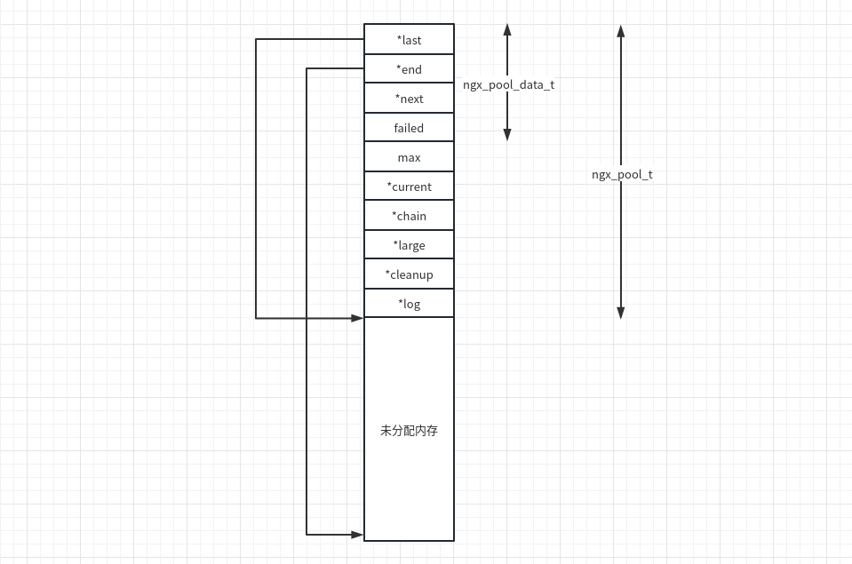
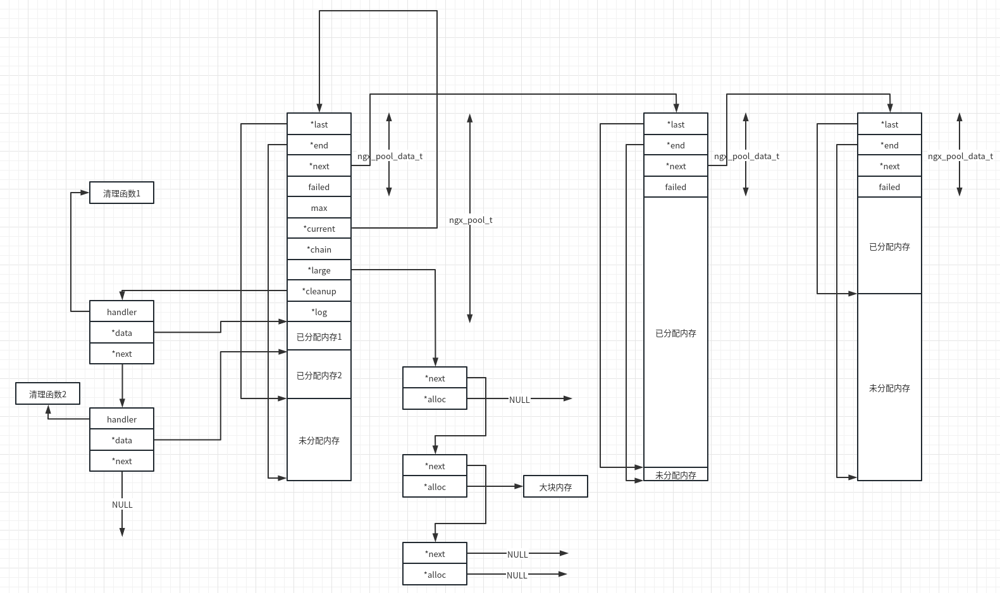
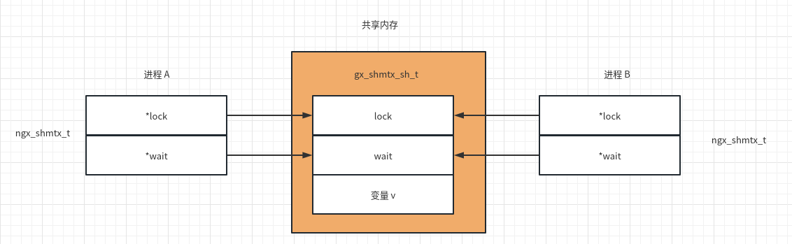
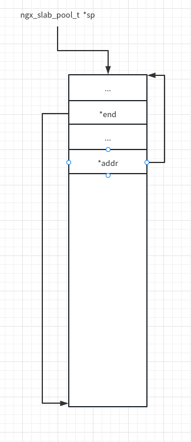
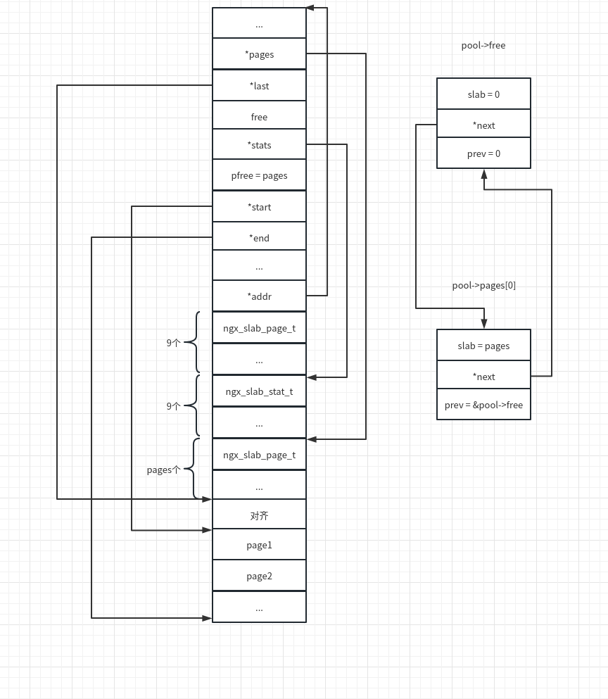
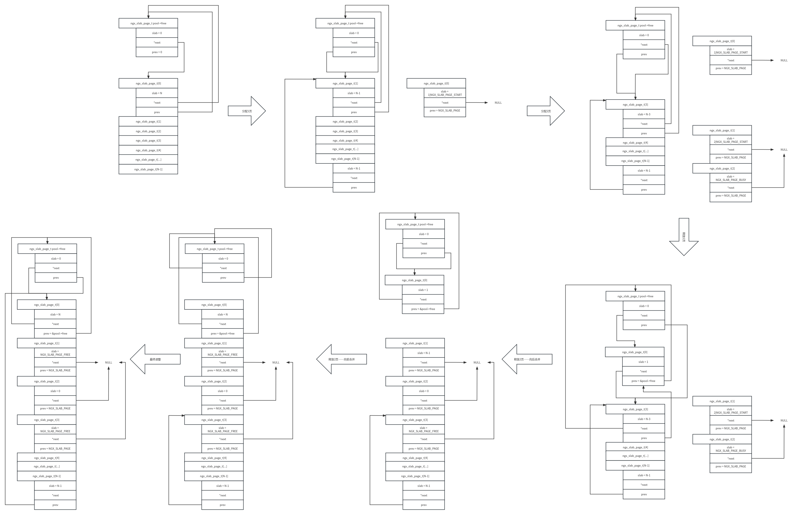

# Nginx 内存管理

nginx 由 C 语言实现。对于 C/C++ 这种需要程序员自行进行内存管理的语言来说，高效的内存管理机制对提高程序性能至关重要。大型项目为了提高性能都是实现自己的内存管理机制，nginx 也不例外。nginx 通过共享内存实现进程间的通讯。

## 进程内内存管理

为了实现高效的内存管理，nginx 实现了自己的内存池机制。

nginx 中，与内存池相关的结构主要有包括： `ngx_pool_s`、`ngx_pool_data_t`、`ngx_pool_large_t`、`ngx_pool_cleanup_s`。

```c
//src/core/ngx_palloc.h
/*
	内存池管理结构
*/
struct ngx_pool_s {
    ngx_pool_data_t       d;
    size_t                max;
    ngx_pool_t           *current;
    ngx_chain_t          *chain;
    ngx_pool_large_t     *large;
    ngx_pool_cleanup_t   *cleanup;
    ngx_log_t            *log;
};

/*
	内存池数据块结构
*/
typedef struct {
    u_char               *last;
    u_char               *end;
    ngx_pool_t           *next;
    ngx_uint_t            failed;
} ngx_pool_data_t;

/*
	大块内存管理结构
*/
typedef struct ngx_pool_large_s  ngx_pool_large_t;

struct ngx_pool_large_s {
    ngx_pool_large_t     *next;
    void                 *alloc;
};

/*
	内存清理
*/
typedef void (*ngx_pool_cleanup_pt)(void *data);

typedef struct ngx_pool_cleanup_s  ngx_pool_cleanup_t;

struct ngx_pool_cleanup_s {
    ngx_pool_cleanup_pt   handler;
    void                 *data;
    ngx_pool_cleanup_t   *next;
};
```

### 内存池创建

nginx 通过 `ngx_create_pool` 创建内存池。

```C
//src/core/ngx_palloc.c

/*
	size：内存池大小
	log：打印日志
*/
ngx_pool_t *
ngx_create_pool(size_t size, ngx_log_t *log)
{
    ngx_pool_t  *p;

    p = ngx_memalign(NGX_POOL_ALIGNMENT, size, log); //申请内存，如果系统支持内存对齐，则默认申请16字节对齐地址
    if (p == NULL) {
        return NULL;
    }
	//初始化
    p->d.last = (u_char *) p + sizeof(ngx_pool_t); //申请得到的内存块的前sizeof(ngx_pool_t)个字节用于结构体ngx_pool_t
    p->d.end = (u_char *) p + size;
    p->d.next = NULL;
    p->d.failed = 0;
	//内存块最大可以分配的内存
    size = size - sizeof(ngx_pool_t);
    p->max = (size < NGX_MAX_ALLOC_FROM_POOL) ? size : NGX_MAX_ALLOC_FROM_POOL; //宏定义NGX_MAX_ALLOC_FROM_POOL由系统调用getpagesize得到

    p->current = p; //指向自身
    p->chain = NULL;
    p->large = NULL;
    p->cleanup = NULL;
    p->log = log;

    return p;
}
```

根据上述代码，我们可以绘制 nginx 内存池初始化后的结构



### 申请内存

nginx 提供了3个 API 用于从内存池中申请内存：

+ ngx_palloc：基本 API，并将申请到的内存进行对齐。
+ ngx_pcalloc：对 ngx_palloc 进行简单封装，对申请到的内存进行初始化。
+ ngx_pnalloc：未考虑内存对齐。

以 `ngx_palloc` 为例进行分析。

```C
//src/core/ngx_palloc.c
/*
	pool：内存池
	size：内存大小
*/
void *
ngx_palloc(ngx_pool_t *pool, size_t size)
{
#if !(NGX_DEBUG_PALLOC)
    if (size <= pool->max) { //如果申请的内存小于 pool->max 则认为是小块内存
        return ngx_palloc_small(pool, size, 1);
    }
#endif
	//否则为大块内存
    return ngx_palloc_large(pool, size);
}
```

查看 `ngx_palloc_small`、`ngx_palloc_block`

```C
//src/core/ngx_palloc.c
/*
	pool：内存池
	size：内存大小
	align：是否对齐
*/
static ngx_inline void *
ngx_palloc_small(ngx_pool_t *pool, size_t size, ngx_uint_t align)
{
    u_char      *m;
    ngx_pool_t  *p;

    p = pool->current; //获取当前内存块

    do {
        m = p->d.last;

        if (align) {
            m = ngx_align_ptr(m, NGX_ALIGNMENT);
        }

        if ((size_t) (p->d.end - m) >= size) { //当前内存块有足够空间则分配
            p->d.last = m + size; //移动 last 指针

            return m;
        }

        p = p->d.next; //遍历内存块链表

    } while (p);

    return ngx_palloc_block(pool, size); //未找到能够分配的内存块则分配一块新的内存块
}

/*
	pool：内存池
	size：内存大小
*/
static void *
ngx_palloc_block(ngx_pool_t *pool, size_t size)
{
    u_char      *m;
    size_t       psize;
    ngx_pool_t  *p, *new;

    psize = (size_t) (pool->d.end - (u_char *) pool); //计算内存块大小

    m = ngx_memalign(NGX_POOL_ALIGNMENT, psize, pool->log);
    if (m == NULL) {
        return NULL;
    }

    new = (ngx_pool_t *) m;
	//初始化
    new->d.end = m + psize;
    new->d.next = NULL;
    new->d.failed = 0;
	//分配本次申请的内存
    m += sizeof(ngx_pool_data_t);
    m = ngx_align_ptr(m, NGX_ALIGNMENT);
    new->d.last = m + size;
	//遍历内存块链表，增加 failed 计数，如果某个内存块分配失败超过4次，则向后移动 current 指针
    for (p = pool->current; p->d.next; p = p->d.next) {
        if (p->d.failed++ > 4) {
            pool->current = p->d.next;
        }
    }

    p->d.next = new; //new 链接到最后

    return m;
}
```

大块内存分配参考 `ngx_palloc_large`

```C
//src/core/ngx_palloc.c
/*
	pool：内存池
	size：内存大小
*/
static void *
ngx_palloc_large(ngx_pool_t *pool, size_t size)
{
    void              *p;
    ngx_uint_t         n;
    ngx_pool_large_t  *large;

    p = ngx_alloc(size, pool->log); //得到大块内存
    if (p == NULL) {
        return NULL;
    }

    n = 0;
	//遍历大块内存链表，查看是否有空闲节点，有则直接使用
    for (large = pool->large; large; large = large->next) {
        if (large->alloc == NULL) {
            large->alloc = p;
            return p;
        }

        if (n++ > 3) { //限制循环次数
            break;
        }
    }

    large = ngx_palloc_small(pool, sizeof(ngx_pool_large_t), 1); //从内存池中获取内存作为大块内存的管理结构
    if (large == NULL) {
        ngx_free(p);
        return NULL;
    }
	//large 插入大块内存链表首部
    large->alloc = p;
    large->next = pool->large;
    pool->large = large;

    return p;
}
```

### 释放内存

根据之前的分析可以发现，nginx没有考虑小块内存的单独释放。在释放内存池时，小块内存会随之释放。大块内存可以单独释放，函数为 `ngx_pfree`。

```C
//src/core/ngx_palloc.c
/*
	pool：内存池
	p：待释放的大块内存
*/
ngx_int_t
ngx_pfree(ngx_pool_t *pool, void *p)
{
    ngx_pool_large_t  *l;
	//遍历大块内存链表找到p
    for (l = pool->large; l; l = l->next) {
        if (p == l->alloc) {
            ngx_log_debug1(NGX_LOG_DEBUG_ALLOC, pool->log, 0,
                           "free: %p", l->alloc);
            ngx_free(l->alloc);
            l->alloc = NULL;

            return NGX_OK;
        }
    }

    return NGX_DECLINED;
}
```

nginx 通过  `ngx_destroy_pool`

```C
//src/core/ngx_palloc.c
/*
	pool：内存池
*/
void
ngx_destroy_pool(ngx_pool_t *pool)
{
    ngx_pool_t          *p, *n;
    ngx_pool_large_t    *l;
    ngx_pool_cleanup_t  *c;
	//遍历清理函数链表，逐一调用
    for (c = pool->cleanup; c; c = c->next) {
        if (c->handler) {
            ngx_log_debug1(NGX_LOG_DEBUG_ALLOC, pool->log, 0,
                           "run cleanup: %p", c);
            c->handler(c->data);
        }
    }

#if (NGX_DEBUG)

    /*
     * we could allocate the pool->log from this pool
     * so we cannot use this log while free()ing the pool
     */

    for (l = pool->large; l; l = l->next) {
        ngx_log_debug1(NGX_LOG_DEBUG_ALLOC, pool->log, 0, "free: %p", l->alloc);
    }

    for (p = pool, n = pool->d.next; /* void */; p = n, n = n->d.next) {
        ngx_log_debug2(NGX_LOG_DEBUG_ALLOC, pool->log, 0,
                       "free: %p, unused: %uz", p, p->d.end - p->d.last);

        if (n == NULL) {
            break;
        }
    }

#endif
	//遍历大块内存链表并释放
    for (l = pool->large; l; l = l->next) {
        if (l->alloc) {
            ngx_free(l->alloc);
        }
    }
	//释放内存池内存块
    for (p = pool, n = pool->d.next; /* void */; p = n, n = n->d.next) {
        ngx_free(p);

        if (n == NULL) {
            break;
        }
    }
}
```

### 内存池结构

根据上述分析，可以得到 nginx 的内存池全景。



## 共享内存管理

nginx 采用的是单线程多进程的模型，进程之间通过共享内存进行通信。例如，要限制单个 ip 的访问次数，则需要通过共享内存记录同一个 ip 在不同进程间的访问次数的总和。

### 共享内存的申请及销毁

Linux 下，nginx 分别通过 `ngx_shm_alloc` 以及 `ngx_shm_free` 申请和销毁共享内存。nginx 在编译时，可以根据系统支持的系统调用选择不同的申请及销毁方法（shmget 和 mmap）。

```C
//src/os/unix/ngx_shmem.c

typedef struct {
    u_char      *addr;
    size_t       size;
    ngx_str_t    name;
    ngx_log_t   *log;
    ngx_uint_t   exists;   /* unsigned  exists:1;  */
} ngx_shm_t;

/*
	shm：共享内存
*/
ngx_int_t
ngx_shm_alloc(ngx_shm_t *shm)
{	//通过 mmap 申请共享内存
    shm->addr = (u_char *) mmap(NULL, shm->size,
                                PROT_READ|PROT_WRITE,
                                MAP_ANON|MAP_SHARED, -1, 0);

    if (shm->addr == MAP_FAILED) {
        ngx_log_error(NGX_LOG_ALERT, shm->log, ngx_errno,
                      "mmap(MAP_ANON|MAP_SHARED, %uz) failed", shm->size);
        return NGX_ERROR;
    }

    return NGX_OK;
}

/*
	shm：共享内存
*/
void
ngx_shm_free(ngx_shm_t *shm)
{	//通过 munmap 释放共享内存
    if (munmap((void *) shm->addr, shm->size) == -1) {
        ngx_log_error(NGX_LOG_ALERT, shm->log, ngx_errno,
                      "munmap(%p, %uz) failed", shm->addr, shm->size);
    }
}
```

### 互斥锁

共享内存本身不提供任何同步机制，需要其他方式实现对共享内存的访问控制。nginx 中主要包括以下锁相关的 API 以及数据结构。

```C
//src/core/ngx_shmtx.h
typedef struct {//本结构体位于共享内存中
    ngx_atomic_t   lock;
#if (NGX_HAVE_POSIX_SEM)
    ngx_atomic_t   wait;
#endif
} ngx_shmtx_sh_t;


typedef struct {
#if (NGX_HAVE_ATOMIC_OPS) //支持原子操作
    ngx_atomic_t  *lock; //指向 ngx_shmtx_sh_t lock 字段
#if (NGX_HAVE_POSIX_SEM) //支持信号量
    ngx_atomic_t  *wait; //指向 ngx_shmtx_sh_t wait 字段
    ngx_uint_t     semaphore;
    sem_t          sem;
#endif
#else //不支持原子操作则通过文件实现互斥锁
    ngx_fd_t       fd;
    u_char        *name;
#endif
    ngx_uint_t     spin;//控制自旋次数
} ngx_shmtx_t;


ngx_int_t ngx_shmtx_create(ngx_shmtx_t *mtx, ngx_shmtx_sh_t *addr,
    u_char *name);//创建锁
void ngx_shmtx_destroy(ngx_shmtx_t *mtx);//销毁锁
ngx_uint_t ngx_shmtx_trylock(ngx_shmtx_t *mtx);//尝试加锁
void ngx_shmtx_lock(ngx_shmtx_t *mtx);//尝试加锁直到成功
void ngx_shmtx_unlock(ngx_shmtx_t *mtx);//释放锁
ngx_uint_t ngx_shmtx_force_unlock(ngx_shmtx_t *mtx, ngx_pid_t pid);
```

#### 创建锁与销毁锁

```C
//src/core/ngx_shmtx.c
/*
	支持原子变量时创建锁的相关操作
*/
ngx_int_t
ngx_shmtx_create(ngx_shmtx_t *mtx, ngx_shmtx_sh_t *addr, u_char *name)
{
    mtx->lock = &addr->lock;
	//spin 为-1表示不能使用信号量，此时直接返回成功
    if (mtx->spin == (ngx_uint_t) -1) {
        return NGX_OK;
    }

    mtx->spin = 2048;

#if (NGX_HAVE_POSIX_SEM)

    mtx->wait = &addr->wait;

    if (sem_init(&mtx->sem, 1, 0) == -1) { //POSIX IPC，初始化未命名信号量，参考 man sem_init
        ngx_log_error(NGX_LOG_ALERT, ngx_cycle->log, ngx_errno,
                      "sem_init() failed");
    } else {
        mtx->semaphore = 1;//信号量初始化成功
    }

#endif

    return NGX_OK;
}

/*
	仅在使用信号量时才需要销毁
*/
void
ngx_shmtx_destroy(ngx_shmtx_t *mtx)
{
#if (NGX_HAVE_POSIX_SEM)

    if (mtx->semaphore) {
        if (sem_destroy(&mtx->sem) == -1) {
            ngx_log_error(NGX_LOG_ALERT, ngx_cycle->log, ngx_errno,
                          "sem_destroy() failed");
        }
    }

#endif
}
```

互斥锁的结构如下图



#### 获取锁与释放锁

nginx 通过 `ngx_shmtx_trylock` 和 `ngx_shmtx_lock` 获取锁。

```C
//src/core/ngx_shmtx.c
/*
	尝试获取锁，失败立刻返回
*/
ngx_uint_t
ngx_shmtx_trylock(ngx_shmtx_t *mtx)
{
    return (*mtx->lock == 0 && ngx_atomic_cmp_set(mtx->lock, 0, ngx_pid));//获取锁时 lock 设置为本进程 pid
}

/*
	获取锁，直到成功才返回
*/
void
ngx_shmtx_lock(ngx_shmtx_t *mtx)
{
    ngx_uint_t         i, n;

    ngx_log_debug0(NGX_LOG_DEBUG_CORE, ngx_cycle->log, 0, "shmtx lock");

    for ( ;; ) {

        if (*mtx->lock == 0 && ngx_atomic_cmp_set(mtx->lock, 0, ngx_pid)) {//获取成功立刻返回
            return;
        }

        if (ngx_ncpu > 1) {

            for (n = 1; n < mtx->spin; n <<= 1) {//n = n * 2，控制自旋次数

                for (i = 0; i < n; i++) {
                    ngx_cpu_pause(); //x86 下使用 pause 指令提升 cpu 性能，降低功耗，参考 https://www.felixcloutier.com/x86/pause.html
                }

                if (*mtx->lock == 0
                    && ngx_atomic_cmp_set(mtx->lock, 0, ngx_pid))//获取成功立刻返回
                {
                    return;
                }
            }
        }
//在自旋次数达到阈值的情况下，如果支持信号量，则通过信号量进行优化
#if (NGX_HAVE_POSIX_SEM)
		//如果信号量已初始化
        if (mtx->semaphore) {
            (void) ngx_atomic_fetch_add(mtx->wait, 1);//等待中的进程数量+1

            if (*mtx->lock == 0 && ngx_atomic_cmp_set(mtx->lock, 0, ngx_pid)) {
                (void) ngx_atomic_fetch_add(mtx->wait, -1);//成功获取锁，等待中的进程数量-1
                return;
            }

            ngx_log_debug1(NGX_LOG_DEBUG_CORE, ngx_cycle->log, 0,
                           "shmtx wait %uA", *mtx->wait);

            while (sem_wait(&mtx->sem) == -1) {
                ngx_err_t  err;

                err = ngx_errno;

                if (err != NGX_EINTR) {//除了 EINTR 以外的错误都应该退出
                    ngx_log_error(NGX_LOG_ALERT, ngx_cycle->log, err,
                                  "sem_wait() failed while waiting on shmtx");
                    break;
                }
            }

            ngx_log_debug0(NGX_LOG_DEBUG_CORE, ngx_cycle->log, 0,
                           "shmtx awoke");

            continue;
        }

#endif

        ngx_sched_yield();//竞争锁失败后，暂时让出 CPU
    }
}
/*
	释放锁
*/
void
ngx_shmtx_unlock(ngx_shmtx_t *mtx)
{
    if (mtx->spin != (ngx_uint_t) -1) {
        ngx_log_debug0(NGX_LOG_DEBUG_CORE, ngx_cycle->log, 0, "shmtx unlock");
    }

    if (ngx_atomic_cmp_set(mtx->lock, ngx_pid, 0)) {//lock 设置为0
        ngx_shmtx_wakeup(mtx); //唤醒其他等待的进程
    }
}

/*
	通过信号量唤醒其他等待的进程
*/
static void
ngx_shmtx_wakeup(ngx_shmtx_t *mtx)
{
#if (NGX_HAVE_POSIX_SEM)
    ngx_atomic_uint_t  wait;

    if (!mtx->semaphore) {
        return;
    }

    for ( ;; ) {

        wait = *mtx->wait;

        if ((ngx_atomic_int_t) wait <= 0) {//不存在其他等待的进程
            return;
        }

        if (ngx_atomic_cmp_set(mtx->wait, wait, wait - 1)) {//等待中的进程数量-1
            break;
        }
    }

    ngx_log_debug1(NGX_LOG_DEBUG_CORE, ngx_cycle->log, 0,
                   "shmtx wake %uA", wait);

    if (sem_post(&mtx->sem) == -1) {//唤醒处于 sem_wait 状态的进程
        ngx_log_error(NGX_LOG_ALERT, ngx_cycle->log, ngx_errno,
                      "sem_post() failed while wake shmtx");
    }

#endif
}
```

### 共享内存管理

nginx 中，一块完整的共享内存以 `ngx_shm_zone_t` 表示。

```C
//src/core/ngx_cycle.h
typedef struct ngx_shm_zone_s  ngx_shm_zone_t;

typedef ngx_int_t (*ngx_shm_zone_init_pt) (ngx_shm_zone_t *zone, void *data);

struct ngx_shm_zone_s {
    void                     *data; //通常指向创建该共享内存模块的上下文结构体
    ngx_shm_t                 shm;  //描述一块共享内存
    ngx_shm_zone_init_pt      init; //初始回调函数
    void                     *tag;  //与 shm.name 配合使用，进一步区分共享内存
    void                     *sync;
    ngx_uint_t                noreuse;  /* unsigned  noreuse:1; */
};

//src/os/unix/ngx_shmem.h
typedef struct {
    u_char      *addr; //起始地址
    size_t       size; //内存大小
    ngx_str_t    name; //内存名称
    ngx_log_t   *log;  //日志对象
    ngx_uint_t   exists;   /* unsigned  exists:1;  *///表示共享内存是否已经分配过
} ngx_shm_t;
```

tag 与 shm.name：通常，shm.name 用来为一标记一块共享内存。但是，如果一个模块 M1 已经创建一块共享内存 SM1，此时另一个模块获取名为 SM1 的内存，nginx 无法区分获取该共享内存的模块是 M1 还是另一个模块 Mn。此时，tag 就可以发挥作用。tag 通常被设置为当前模块的 ngx_module_t 变量。nginx 可以根据 tag 区分获取 SM1 的模块是 M1 还是 Mn，从而决定是返回 SM1 还是报错。

#### 配置解析

为了使用共享内存，需要在 nginx 配置文件中加上该共享内存的配置信息。以 `ngx_http_limit_req_module` 为例：

```
limit_req_zone $binary_remote_addr zone=one:10m rate=1r/s;
```

当检测到配置项 `limit_req_zone` 时，nginx 会调用 `ngx_http_limit_req_zone` 函数进行解析：

```C
//src/http/modules/ngx_http_limit_req_module.c

typedef struct {
    ngx_http_limit_req_shctx_t  *sh;
    ngx_slab_pool_t             *shpool; //共享内存管理结构
    /* integer value, 1 corresponds to 0.001 r/s */
    ngx_uint_t                   rate;
    ngx_http_complex_value_t     key;
    ngx_http_limit_req_node_t   *node;
} ngx_http_limit_req_ctx_t;

/*
	解析 limit_req_zone $binary_remote_addr zone=one:10m rate=1r/s;
*/
static char *
ngx_http_limit_req_zone(ngx_conf_t *cf, ngx_command_t *cmd, void *conf)
{
    u_char                            *p;
    size_t                             len;
    ssize_t                            size;
    ngx_str_t                         *value, name, s;
    ngx_int_t                          rate, scale;
    ngx_uint_t                         i;
    ngx_shm_zone_t                    *shm_zone;
    ngx_http_limit_req_ctx_t          *ctx;
    ngx_http_compile_complex_value_t   ccv;

    value = cf->args->elts;//存放参数 value[0]-value[4]：limit_req_zone $binary_remote_addr zone=one:10m rate=1r/s

    ctx = ngx_pcalloc(cf->pool, sizeof(ngx_http_limit_req_ctx_t)); //为 ngx_http_limit_req_ctx_t 分配内存
    if (ctx == NULL) {
        return NGX_CONF_ERROR;
    }

    ngx_memzero(&ccv, sizeof(ngx_http_compile_complex_value_t));
    

    ccv.cf = cf;
    ccv.value = &value[1]; //$binary_remote_addr
    ccv.complex_value = &ctx->key;

    if (ngx_http_compile_complex_value(&ccv) != NGX_OK) {
        return NGX_CONF_ERROR;
    }

    size = 0;
    rate = 1;
    scale = 1;
    name.len = 0;

    for (i = 2; i < cf->args->nelts; i++) {
		//value[2] zone=one:10m
        if (ngx_strncmp(value[i].data, "zone=", 5) == 0) {

            name.data = value[i].data + 5; //name = "one:10m"

            p = (u_char *) ngx_strchr(name.data, ':'); //p -> ":10m"

            if (p == NULL) {
                ngx_conf_log_error(NGX_LOG_EMERG, cf, 0,
                                   "invalid zone size \"%V\"", &value[i]);
                return NGX_CONF_ERROR;
            }

            name.len = p - name.data; //name.len = 3

            s.data = p + 1; // s = "10m"
            s.len = value[i].data + value[i].len - s.data; //s.len = 3

            size = ngx_parse_size(&s); //size = 1024*1024*10，共享内存大小

            if (size == NGX_ERROR) {
                ngx_conf_log_error(NGX_LOG_EMERG, cf, 0,
                                   "invalid zone size \"%V\"", &value[i]);
                return NGX_CONF_ERROR;
            }

            if (size < (ssize_t) (8 * ngx_pagesize)) {
                ngx_conf_log_error(NGX_LOG_EMERG, cf, 0,
                                   "zone \"%V\" is too small", &value[i]);
                return NGX_CONF_ERROR;
            }

            continue;
        }
		//value[3] = rate=1r/s
        if (ngx_strncmp(value[i].data, "rate=", 5) == 0) {

            len = value[i].len;
            p = value[i].data + len - 3;

            if (ngx_strncmp(p, "r/s", 3) == 0) {
                scale = 1;
                len -= 3;

            } else if (ngx_strncmp(p, "r/m", 3) == 0) {
                scale = 60;
                len -= 3;
            }

            rate = ngx_atoi(value[i].data + 5, len - 5); //rate = 1
            if (rate <= 0) {
                ngx_conf_log_error(NGX_LOG_EMERG, cf, 0,
                                   "invalid rate \"%V\"", &value[i]);
                return NGX_CONF_ERROR;
            }

            continue;
        }

        ngx_conf_log_error(NGX_LOG_EMERG, cf, 0,
                           "invalid parameter \"%V\"", &value[i]);
        return NGX_CONF_ERROR;
    }

    if (name.len == 0) {
        ngx_conf_log_error(NGX_LOG_EMERG, cf, 0,
                           "\"%V\" must have \"zone\" parameter",
                           &cmd->name);
        return NGX_CONF_ERROR;
    }

    ctx->rate = rate * 1000 / scale; //ctx->rate = 1*1000/1

    shm_zone = ngx_shared_memory_add(cf, &name, size, //创建名为 name 的共享内存，大小为 size，tag 指向 ngx_http_limit_req_module
                                     &ngx_http_limit_req_module);
    if (shm_zone == NULL) {
        return NGX_CONF_ERROR;
    }

    if (shm_zone->data) {
        ctx = shm_zone->data;

        ngx_conf_log_error(NGX_LOG_EMERG, cf, 0,
                           "%V \"%V\" is already bound to key \"%V\"",
                           &cmd->name, &name, &ctx->key.value);
        return NGX_CONF_ERROR;
    }

    shm_zone->init = ngx_http_limit_req_init_zone; //设置该共享内存的初始化函数
    shm_zone->data = ctx;

    return NGX_CONF_OK;
}
```

#### 创建 ngx_shm_zone_t

在 `ngx_http_limit_req_zone` 中，会调用 `ngx_shared_memory_add` 函数创建共享内存：

```C
//src/core/ngx_cycle.c
/*
	创建 ngx_shm_zone_t 并挂载到 cf->cycle->shared_memory 上
*/
ngx_shm_zone_t *
ngx_shared_memory_add(ngx_conf_t *cf, ngx_str_t *name, size_t size, void *tag)
{
    ngx_uint_t        i;
    ngx_shm_zone_t   *shm_zone;
    ngx_list_part_t  *part; //ngx_list_t 共享内存 list

    part = &cf->cycle->shared_memory.part;
    shm_zone = part->elts;
	//遍历共享内存链表，检查是否有 name 与 size 均一致的共享内存，有则返回
    for (i = 0; /* void */ ; i++) {

        if (i >= part->nelts) {
            if (part->next == NULL) {
                break;
            }
            part = part->next;
            shm_zone = part->elts;
            i = 0;
        }
		//比较 name 是否一致
        if (name->len != shm_zone[i].shm.name.len) {
            continue;
        }

        if (ngx_strncmp(name->data, shm_zone[i].shm.name.data, name->len)
            != 0)
        {
            continue;
        }

        if (tag != shm_zone[i].tag) { //name 一致但是 tag 不一致，直接报错返回
            ngx_conf_log_error(NGX_LOG_EMERG, cf, 0,
                            "the shared memory zone \"%V\" is "
                            "already declared for a different use",
                            &shm_zone[i].shm.name);
            return NULL;
        }

        if (shm_zone[i].shm.size == 0) {
            shm_zone[i].shm.size = size;
        }

        if (size && size != shm_zone[i].shm.size) {
            ngx_conf_log_error(NGX_LOG_EMERG, cf, 0,
                            "the size %uz of shared memory zone \"%V\" "
                            "conflicts with already declared size %uz",
                            size, &shm_zone[i].shm.name, shm_zone[i].shm.size);
            return NULL;
        }

        return &shm_zone[i]; //找到直接返回
    }

    shm_zone = ngx_list_push(&cf->cycle->shared_memory); //从链表中取出一个空闲项

    if (shm_zone == NULL) {
        return NULL;
    }
	//初始化该段共享内存
    shm_zone->data = NULL;
    shm_zone->shm.log = cf->cycle->log;
    shm_zone->shm.addr = NULL;
    shm_zone->shm.size = size; //10m
    shm_zone->shm.name = *name; //one
    shm_zone->shm.exists = 0;
    shm_zone->init = NULL;
    shm_zone->tag = tag;
    shm_zone->noreuse = 0;

    return shm_zone;
}
```

#### 共享内存创建

上面仅仅创建了 `ngx_shm_zone_t` 并将其挂载到 `cf->cycle->shared_memory` 下，共享内存真正的创建动作是在所有配置文件解析完成之后，由 nginx 逐个遍历创建的。

```C
ngx_cycle_t *
ngx_init_cycle(ngx_cycle_t *old_cycle)
{
    /* create shared memory */

    part = &cycle->shared_memory.part;
    shm_zone = part->elts;

    for (i = 0; /* void */ ; i++) {

        if (i >= part->nelts) {
            if (part->next == NULL) {
                break;
            }
            part = part->next;
            shm_zone = part->elts;
            i = 0;
        }

        if (shm_zone[i].shm.size == 0) {
            ngx_log_error(NGX_LOG_EMERG, log, 0,
                          "zero size shared memory zone \"%V\"",
                          &shm_zone[i].shm.name);
            goto failed;
        }

        shm_zone[i].shm.log = cycle->log;

        opart = &old_cycle->shared_memory.part;
        oshm_zone = opart->elts;

		//检测冲突        
        for (n = 0; /* void */ ; n++) {

            if (n >= opart->nelts) {
                if (opart->next == NULL) {
                    break;
                }
                opart = opart->next;
                oshm_zone = opart->elts;
                n = 0;
            }

            if (shm_zone[i].shm.name.len != oshm_zone[n].shm.name.len) {
                continue;
            }

            if (ngx_strncmp(shm_zone[i].shm.name.data,
                            oshm_zone[n].shm.name.data,
                            shm_zone[i].shm.name.len)
                != 0)
            {
                continue;
            }

            if (shm_zone[i].tag == oshm_zone[n].tag
                && shm_zone[i].shm.size == oshm_zone[n].shm.size
                && !shm_zone[i].noreuse)
            {
                shm_zone[i].shm.addr = oshm_zone[n].shm.addr;
#if (NGX_WIN32)
                shm_zone[i].shm.handle = oshm_zone[n].shm.handle;
#endif

                if (shm_zone[i].init(&shm_zone[i], oshm_zone[n].data)
                    != NGX_OK)
                {
                    goto failed;
                }

                goto shm_zone_found;
            }

            break;
        }

        if (ngx_shm_alloc(&shm_zone[i].shm) != NGX_OK) { //分配大小为10m的共享内存
            goto failed;
        }

        if (ngx_init_zone_pool(cycle, &shm_zone[i]) != NGX_OK) { //对共享内存管理机制进行初始化
            goto failed;
        }

        if (shm_zone[i].init(&shm_zone[i], NULL) != NGX_OK) { //针对不同的共享内存的特定初始化方法
            goto failed;
        }

    shm_zone_found:

        continue;
    }
}
```

#### 共享内存初始化

nginx 通过 slab 机制对共享内存进行管理，其中，涉及到三个关键的数据结构。

```C
typedef struct ngx_slab_page_s  ngx_slab_page_t;

struct ngx_slab_page_s { //用于管理内存页，记录内存页使用的各项信息
    uintptr_t         slab;
    ngx_slab_page_t  *next;
    uintptr_t         prev;
};


typedef struct { //用于统计信息
    ngx_uint_t        total;
    ngx_uint_t        used;

    ngx_uint_t        reqs;
    ngx_uint_t        fails;
} ngx_slab_stat_t;


typedef struct { //用于 slab 机制的核心结构体
    ngx_shmtx_sh_t    lock;

    size_t            min_size; //可以分配的最小内存
    size_t            min_shift; //最小内存对应的偏移值

    ngx_slab_page_t  *pages; //指向第一页的管理结构
    ngx_slab_page_t  *last;  //指向最后一页的管理结构
    ngx_slab_page_t   free;  //管理空闲页面

    ngx_slab_stat_t  *stats; //记录每种规格内存的统计信息
    ngx_uint_t        pfree; //空闲页数

    u_char           *start;
    u_char           *end;

    ngx_shmtx_t       mutex;

    u_char           *log_ctx;
    u_char            zero;

    unsigned          log_nomem:1;

    void             *data;
    void             *addr;
} ngx_slab_pool_t;
```

nginx 通过 `ngx_init_zone_pool` 进行初步初始化。

```C
//src/core/ngx_cycle.c
/*
	对共享内存进行初步初始化
*/
static ngx_int_t
ngx_init_zone_pool(ngx_cycle_t *cycle, ngx_shm_zone_t *zn)
{
    u_char           *file;
    ngx_slab_pool_t  *sp;

    sp = (ngx_slab_pool_t *) zn->shm.addr;

    if (zn->shm.exists) {//判断共享内存是否已经初始化完成

        if (sp == sp->addr) {
            return NGX_OK;
        }

#if (NGX_WIN32)

        /* remap at the required address */

        if (ngx_shm_remap(&zn->shm, sp->addr) != NGX_OK) {
            return NGX_ERROR;
        }

        sp = (ngx_slab_pool_t *) zn->shm.addr;

        if (sp == sp->addr) {
            return NGX_OK;
        }

#endif

        ngx_log_error(NGX_LOG_EMERG, cycle->log, 0,
                      "shared zone \"%V\" has no equal addresses: %p vs %p",
                      &zn->shm.name, sp->addr, sp);
        return NGX_ERROR;
    }

    sp->end = zn->shm.addr + zn->shm.size;
    sp->min_shift = 3;
    sp->addr = zn->shm.addr;

#if (NGX_HAVE_ATOMIC_OPS)//是否支持原子变量

    file = NULL;

#else//使用文件锁

    file = ngx_pnalloc(cycle->pool,
                       cycle->lock_file.len + zn->shm.name.len + 1);
    if (file == NULL) {
        return NGX_ERROR;
    }

    (void) ngx_sprintf(file, "%V%V%Z", &cycle->lock_file, &zn->shm.name);

#endif

    if (ngx_shmtx_create(&sp->mutex, &sp->lock, file) != NGX_OK) { //创建互斥锁
        return NGX_ERROR;
    }

    ngx_slab_init(sp); //进一步初始化

    return NGX_OK;
}
```



共享内存开始的位置被用作管理结构 `ngx_slab_pool_t`。初步初始化后，nginx 调用 `ngx_slab_init` 进行进一步的初始化操作。nginx 对共享内存进行分级管理。首先是 page 页，然后是 page 页内的 slab 块，nginx 通过 slot 对大小相同的 slab 块进行管理。

我们现在假定操作系统是64位，系统页面大小为4KB，nginx 默认页大小与操作系统一致，也为4KB。在我们假定了系统环境之后，下面一些变量的之也就确定了：

+ ngx_pagesize：4096
+ ngx_pagesize_shift：12，与 ngx_pagesize 相关，即 `1<<12`
+ ngx_slab_max_size：2048，页分配与 slot 分配的分界点，小于等于该值则进行 slot 分配，否则进行页分配
+ ngx_slab_exact_size：64，nginx 使用 bitmap 进行 slot 内存管理。当使用一个 uintptr_t 类型的位图表示一块4KB内存的使用状态时，我们需要把内存划分为64块，每块64KB
+ ngx_slab_exact_shift：6
+ pool->min_shift：3，固定值
+ pool->min_size：8，固定值

nginx 通过 `ngx_slab_init` 对共享内存进行了进一步的划分

```C
//src/core/ngx_slab.c
/*
	进一步处理 ngx_slab_pool_t
*/
void
ngx_slab_init(ngx_slab_pool_t *pool)
{
    u_char           *p;
    size_t            size;
    ngx_int_t         m;
    ngx_uint_t        i, n, pages;
    ngx_slab_page_t  *slots, *page;

    pool->min_size = (size_t) 1 << pool->min_shift; // 1<<3 = 8

    slots = ngx_slab_slots(pool); //将 slots 定位到 (pool) + sizeof(ngx_slab_pool_t) 之后的起始地址上

    p = (u_char *) slots;
    size = pool->end - p; //计算本内存中除去管理结构（ngx_slab_pool_t）之后的可用内存大小

    ngx_slab_junk(p, size);

    n = ngx_pagesize_shift - pool->min_shift; //12 - 3 = 9

    for (i = 0; i < n; i++) { //初始化 slots 数组，大小为 9 * sizeof(ngx_slab_page_t)
        /* only "next" is used in list head */
        slots[i].slab = 0;
        slots[i].next = &slots[i];
        slots[i].prev = 0;
    }

    p += n * sizeof(ngx_slab_page_t); //p 移动到 slots 数组末尾

    pool->stats = (ngx_slab_stat_t *) p;
    ngx_memzero(pool->stats, n * sizeof(ngx_slab_stat_t));//初始化 pool->stats 数组，大小为 9 * sizeof(ngx_slab_stat_t)

    p += n * sizeof(ngx_slab_stat_t); //p 移动到 pool->stats 数组末尾

    size -= n * (sizeof(ngx_slab_page_t) + sizeof(ngx_slab_stat_t)); //计算剩余可用的共享内存的大小

    pages = (ngx_uint_t) (size / (ngx_pagesize + sizeof(ngx_slab_page_t))); //计算剩余的内存可以分配成多少个 page

    pool->pages = (ngx_slab_page_t *) p; //pool->pages 移动到 pool->stats 数组的末尾
    ngx_memzero(pool->pages, pages * sizeof(ngx_slab_page_t));

    page = pool->pages;

    /* only "next" is used in list head */
    pool->free.slab = 0;
    pool->free.next = page;
    pool->free.prev = 0;

    page->slab = pages; //pages 为剩余的共享内存可以划分的页数
    page->next = &pool->free;
    page->prev = (uintptr_t) &pool->free;

    pool->start = ngx_align_ptr(p + pages * sizeof(ngx_slab_page_t), //进行内存对齐
                                ngx_pagesize);

    m = pages - (pool->end - pool->start) / ngx_pagesize; //对齐后可能导致可用内存页减少
    if (m > 0) { //进行可用内存页数量调整
        pages -= m;
        page->slab = pages;
    }

    pool->last = pool->pages + pages;
    pool->pfree = pages; //空闲页面数量

    pool->log_nomem = 1;
    pool->log_ctx = &pool->zero;
    pool->zero = '\0';
}
```

根据上面分析，可以得到初始化后的 `ngx_slab_pool_t` 结构体



#### 共享内存分配

nginx 中，通过 `ngx_slab_alloc` 进行共享内存分配，而 `ngx_slab_alloc` 又调用了`ngx_slab_alloc_locked`。`ngx_slab_alloc_locked` 中实现了 slot 分配，page 分配由 `ngx_slab_alloc_pages` 实现。

##### slot 分配

在物理页大小为 4096B 的前提下，nginx 将要申请的内存块划分为9种规格：

+ SMALL：8，16，32
+ EXACT：64
+ BIG：128，256，512，1024，2048
+ PAGE：4096

对于小于等于半页的内存而言，nginx 申请一整页内存后，会将其划分为多个特定大小的内存以供后续分配。例如，1页内存可以划分为512个 8B 内存，64 个 64B 内存。nginx 通过 bitmap 记录内存块的使用情况。对于上面三种不同类型的 slot 内存，nginx 有不同的存储 bitmap 的方式：

+ SMALL：slab 存储内存块大小的位移，page 中的前 n 个内存块作为 bitmap
+ EXACT：slab 作为 bitmap
+ BIG：slab 的高32位作为 bitmap，低32位存储内存块大小的位移

```C
//src/core/ngx_slab.c
/*
	共享内存分配
*/
void *
ngx_slab_alloc(ngx_slab_pool_t *pool, size_t size)
{
    void  *p;

    ngx_shmtx_lock(&pool->mutex); //获取互斥锁

    p = ngx_slab_alloc_locked(pool, size);

    ngx_shmtx_unlock(&pool->mutex); //释放互斥锁

    return p;
}

/*
	共享内存分配
*/
void *
ngx_slab_alloc_locked(ngx_slab_pool_t *pool, size_t size)
{
    size_t            s;
    uintptr_t         p, m, mask, *bitmap;
    ngx_uint_t        i, n, slot, shift, map;
    ngx_slab_page_t  *page, *prev, *slots;

    if (size > ngx_slab_max_size) { //申请的内存大小超过2048执行 pages 分配

        ngx_log_debug1(NGX_LOG_DEBUG_ALLOC, ngx_cycle->log, 0,
                       "slab alloc: %uz", size);

        page = ngx_slab_alloc_pages(pool, (size >> ngx_pagesize_shift) //将 size 向上取整转换为页数进行分配
                                          + ((size % ngx_pagesize) ? 1 : 0));
        if (page) {
            p = ngx_slab_page_addr(pool, page); //获取 page 对应的页面的起始地址

        } else {
            p = 0;
        }

        goto done;
    }

    if (size > pool->min_size) { //min_size 固定为8
        shift = 1;
        for (s = size - 1; s >>= 1; shift++) { /* void */ }//计算 size 对应的偏移量
        slot = shift - pool->min_shift; //min_shift 固定为3

    } else {
        shift = pool->min_shift;
        slot = 0;
    }

    pool->stats[slot].reqs++;

    ngx_log_debug2(NGX_LOG_DEBUG_ALLOC, ngx_cycle->log, 0,
                   "slab alloc: %uz slot: %ui", size, slot);

    slots = ngx_slab_slots(pool);//获取 slots 数组的首地址
    page = slots[slot].next;//size 大小的内存块对应的下标

    if (page->next != page) {//说明指定 slot 下的page 仍有页面具有空闲内存块

        if (shift < ngx_slab_exact_shift) { //分配 SMALL 内存

            bitmap = (uintptr_t *) ngx_slab_page_addr(pool, page);//根据页管理结构获取对应的页面，对于 SMALL 内存块的页面，其 bitmap 位于页数据空间的开始

            map = (ngx_pagesize >> shift) / (8 * sizeof(uintptr_t));//计算需要多少个 uintptr_t 作为位图

            for (n = 0; n < map; n++) {//遍历 bitmap 找出其中可用的内存块

                if (bitmap[n] != NGX_SLAB_BUSY) {//NGX_SLAB_BUSY = 0xffffffffffffffff

                    for (m = 1, i = 0; m; m <<= 1, i++) { //从最低位开始按位测试，找到等于 0 的那一位
                        if (bitmap[n] & m) {
                            continue;
                        }

                        bitmap[n] |= m; //将该位标记为 1

                        i = (n * 8 * sizeof(uintptr_t) + i) << shift;//计算偏移

                        p = (uintptr_t) bitmap + i;//找到对应内存块的地址

                        pool->stats[slot].used++;

                        if (bitmap[n] == NGX_SLAB_BUSY) {//如果 bitmap[n] 代表的64块内存已经用完，则检查其他内存块是否还有可用的，有则无须处理，否则说明该页已经全部用完，需要脱离对应链表
                            for (n = n + 1; n < map; n++) {
                                if (bitmap[n] != NGX_SLAB_BUSY) {
                                    goto done;
                                }
                            }

                            prev = ngx_slab_page_prev(page);//该页全满，从链表中摘除
                            prev->next = page->next;
                            page->next->prev = page->prev;

                            page->next = NULL;//进行相应设置
                            page->prev = NGX_SLAB_SMALL;
                        }

                        goto done;
                    }
                }
            }

        } else if (shift == ngx_slab_exact_shift) {//分配 EXACT 内存

            for (m = 1, i = 0; m; m <<= 1, i++) {//对于 EXACT 内存，slab 字段恰好可以作为 bitmap
                if (page->slab & m) {
                    continue;
                }

                page->slab |= m;//将对应的 bit 位标记为已用

                if (page->slab == NGX_SLAB_BUSY) {
                    prev = ngx_slab_page_prev(page);//该页全满，从链表中摘除
                    prev->next = page->next;
                    page->next->prev = page->prev;

                    page->next = NULL;//进行相应设置
                    page->prev = NGX_SLAB_EXACT;
                }

                p = ngx_slab_page_addr(pool, page) + (i << shift);//找到对应内存块的地址

                pool->stats[slot].used++;

                goto done;
            }

        } else { /* shift > ngx_slab_exact_shift *///分配 BIG 内存

            mask = ((uintptr_t) 1 << (ngx_pagesize >> shift)) - 1;//等价于 2^(4096/2^shift)-1
            mask <<= NGX_SLAB_MAP_SHIFT;//NGX_SLAB_MAP_SHIFT = 32

            for (m = (uintptr_t) 1 << NGX_SLAB_MAP_SHIFT, i = 0;//slab 的高32位存放的是 bitmap，这里对其按位测试
                 m & mask;
                 m <<= 1, i++)
            {
                if (page->slab & m) {
                    continue;
                }

                page->slab |= m;//找到某一 bit 为0,将其置为1

                if ((page->slab & NGX_SLAB_MAP_MASK) == mask) {//NGX_SLAB_MAP_MASK = 0xffffffff00000000，这里相等说明无可用内存块
                    prev = ngx_slab_page_prev(page);//该页全满，从链表中摘除
                    prev->next = page->next;
                    page->next->prev = page->prev;

                    page->next = NULL;//进行相应设置
                    page->prev = NGX_SLAB_BIG;
                }

                p = ngx_slab_page_addr(pool, page) + (i << shift);//找到对应内存块的地址

                pool->stats[slot].used++;

                goto done;
            }
        }

        ngx_slab_error(pool, NGX_LOG_ALERT, "ngx_slab_alloc(): page is busy");
        ngx_debug_point();
    }

    page = ngx_slab_alloc_pages(pool, 1);//上面的分配失败，说明当前 slot 已经没有可用内存块了，需要重新从空闲 page 中申请1页

    if (page) {//申请成功
        if (shift < ngx_slab_exact_shift) {//分配 SMALL 内存块
            bitmap = (uintptr_t *) ngx_slab_page_addr(pool, page);//获取 page 对应的数据页面的首地址

            n = (ngx_pagesize >> shift) / ((1 << shift) * 8);//n 表示需要多少个大小为 1<<shift 的内存块来存储 bitmap，比如，对于 8B 的内存块，需要 4096/8/(8*8)=8个内存块

            if (n == 0) {
                n = 1;
            }

            /* "n" elements for bitmap, plus one requested */

            for (i = 0; i < (n + 1) / (8 * sizeof(uintptr_t)); i++) {//bitmap 需要 n 个内存块，本次还要分配1个，所以是 n+1
                bitmap[i] = NGX_SLAB_BUSY;
            }

            m = ((uintptr_t) 1 << ((n + 1) % (8 * sizeof(uintptr_t)))) - 1;//以8B为例，m = 1 << 9 - 1 = 2^10 - 1，所以 m 的最低9位均为1
            bitmap[i] = m;//将 bitmap[0] 的低9位设置为1表示前9个内存块均已使用

            map = (ngx_pagesize >> shift) / (8 * sizeof(uintptr_t));//bitmap 需要多少个 uintptr_t

            for (i = i + 1; i < map; i++) {
                bitmap[i] = 0;
            }

            page->slab = shift;//存储内存块的位移量
            page->next = &slots[slot];//将当前 page 插入对应的 slot，此时 slot 链表一定为空，否则不可能走到这里
            page->prev = (uintptr_t) &slots[slot] | NGX_SLAB_SMALL;

            slots[slot].next = page;

            pool->stats[slot].total += (ngx_pagesize >> shift) - n;

            p = ngx_slab_page_addr(pool, page) + (n << shift);//找到对应内存块的地址

            pool->stats[slot].used++;

            goto done;

        } else if (shift == ngx_slab_exact_shift) {//分配 EXTRACT 内存块

            page->slab = 1;//使用 slab 作为 bitmap 时情况比较简单，1表示第一块内存已经被使用
            page->next = &slots[slot];
            page->prev = (uintptr_t) &slots[slot] | NGX_SLAB_EXACT;

            slots[slot].next = page;

            pool->stats[slot].total += 8 * sizeof(uintptr_t);

            p = ngx_slab_page_addr(pool, page);

            pool->stats[slot].used++;

            goto done;

        } else { /* shift > ngx_slab_exact_shift *///分配 BIG 内存块

            page->slab = ((uintptr_t) 1 << NGX_SLAB_MAP_SHIFT) | shift;
            page->next = &slots[slot];
            page->prev = (uintptr_t) &slots[slot] | NGX_SLAB_BIG;

            slots[slot].next = page;

            pool->stats[slot].total += ngx_pagesize >> shift;

            p = ngx_slab_page_addr(pool, page);

            pool->stats[slot].used++;

            goto done;
        }
    }

    p = 0;

    pool->stats[slot].fails++;

done:

    ngx_log_debug1(NGX_LOG_DEBUG_ALLOC, ngx_cycle->log, 0,
                   "slab alloc: %p", (void *) p);

    return (void *) p;
}
```

##### slot 释放

nginx 通过 `ngx_slab_free` 对 小块内存进行释放。

```C
//src/core/ngx_slab.c
/*
	释放小块内存
*/
void
ngx_slab_free(ngx_slab_pool_t *pool, void *p)
{
    ngx_shmtx_lock(&pool->mutex);//获取互斥锁

    ngx_slab_free_locked(pool, p);//释放小块内存

    ngx_shmtx_unlock(&pool->mutex);//释放互斥锁
}
```

其中，调用了 `ngx_slab_free_locked`

```C
//src/core/ngx_slab.c
/*
	释放小块内存
*/
void
ngx_slab_free_locked(ngx_slab_pool_t *pool, void *p)
{
    size_t            size;
    uintptr_t         slab, m, *bitmap;
    ngx_uint_t        i, n, type, slot, shift, map;
    ngx_slab_page_t  *slots, *page;

    ngx_log_debug1(NGX_LOG_DEBUG_ALLOC, ngx_cycle->log, 0, "slab free: %p", p);

    if ((u_char *) p < pool->start || (u_char *) p > pool->end) {//判断 p 指向的内存是否由 pool 管理
        ngx_slab_error(pool, NGX_LOG_ALERT, "ngx_slab_free(): outside of pool");
        goto fail;
    }

    n = ((u_char *) p - pool->start) >> ngx_pagesize_shift;//找到 p 对应的页管理结构 page
    page = &pool->pages[n];
    slab = page->slab;
    type = ngx_slab_page_type(page); //判断 page 的类型

    switch (type) {

    case NGX_SLAB_SMALL:

        shift = slab & NGX_SLAB_SHIFT_MASK;//NGX_SLAB_SHIFT_MASK = 0x000000000000000f，SMALL 类型的内存块中，slab 存放的是内存块大小的偏移
        size = (size_t) 1 << shift;//计算内存块大小

        if ((uintptr_t) p & (size - 1)) {//p 应该对齐到 size
            goto wrong_chunk;
        }

        n = ((uintptr_t) p & (ngx_pagesize - 1)) >> shift;//n 代表 p 位于 page 中的第几个块
        m = (uintptr_t) 1 << (n % (8 * sizeof(uintptr_t)));//m 代表第 n 块内存位于 uintptr_t 的第几位
        n /= 8 * sizeof(uintptr_t);//计算 p 位于哪个 uintptr_t
        bitmap = (uintptr_t *)//计算 bitmap 的起始位置
                             ((uintptr_t) p & ~((uintptr_t) ngx_pagesize - 1));

        if (bitmap[n] & m) {//bitmap[n] 的第 m 位为1说明这一块内存处于使用状态
            slot = shift - pool->min_shift;

            if (page->next == NULL) {//page->next == NULL 说明当前页面是全满页，释放一块内存之后需要重新加入对应链表中
                slots = ngx_slab_slots(pool);//page 插入 slot链表首部

                page->next = slots[slot].next;
                slots[slot].next = page;

                page->prev = (uintptr_t) &slots[slot] | NGX_SLAB_SMALL;
                page->next->prev = (uintptr_t) page | NGX_SLAB_SMALL;
            }

            bitmap[n] &= ~m; //bitmap[n] 的第 m 位置位 0

            n = (ngx_pagesize >> shift) / ((1 << shift) * 8);//n 表示需要多少个内存块来存放 bitmap

            if (n == 0) {
                n = 1;
            }

            i = n / (8 * sizeof(uintptr_t));
            m = ((uintptr_t) 1 << (n % (8 * sizeof(uintptr_t)))) - 1;

            if (bitmap[i] & ~m) {//判断用于表示 bitmap 的内存块的最后一块中，除了用于 bitmap 的比特位以外，其他比特位是否还有等于1的，有则表示还有处于使用状态的内存块
                goto done;
            }

            map = (ngx_pagesize >> shift) / (8 * sizeof(uintptr_t));

            for (i = i + 1; i < map; i++) {//判断是否还有处于使用状态的内存块
                if (bitmap[i]) {
                    goto done;
                }
            }
			//执行到这里，说明除了用于 bitmap 的内存块，其他所有内存块都是未使用状态，需要释放该页
            ngx_slab_free_pages(pool, page, 1);

            pool->stats[slot].total -= (ngx_pagesize >> shift) - n;

            goto done;
        }

        goto chunk_already_free;

    case NGX_SLAB_EXACT:

        m = (uintptr_t) 1 <<
                (((uintptr_t) p & (ngx_pagesize - 1)) >> ngx_slab_exact_shift);//计算 p 对应于位图中的第几位
        size = ngx_slab_exact_size;//内存块大小

        if ((uintptr_t) p & (size - 1)) {
            goto wrong_chunk;
        }

        if (slab & m) {
            slot = ngx_slab_exact_shift - pool->min_shift;

            if (slab == NGX_SLAB_BUSY) {//当前内存页是全满页，释放一块内存后需要插入对应链表的首部
                slots = ngx_slab_slots(pool);

                page->next = slots[slot].next;
                slots[slot].next = page;

                page->prev = (uintptr_t) &slots[slot] | NGX_SLAB_EXACT;
                page->next->prev = (uintptr_t) page | NGX_SLAB_EXACT;
            }

            page->slab &= ~m;

            if (page->slab) {//检查其他内存块是否处于使用状态
                goto done;
            }
			//所有内存块都处于未使用状态，释放该页
            ngx_slab_free_pages(pool, page, 1);

            pool->stats[slot].total -= 8 * sizeof(uintptr_t);

            goto done;
        }

        goto chunk_already_free;

    case NGX_SLAB_BIG:

        shift = slab & NGX_SLAB_SHIFT_MASK;
        size = (size_t) 1 << shift;//内存块大小

        if ((uintptr_t) p & (size - 1)) {
            goto wrong_chunk;
        }

        m = (uintptr_t) 1 << ((((uintptr_t) p & (ngx_pagesize - 1)) >> shift)
                              + NGX_SLAB_MAP_SHIFT);//找到内存块在 bitmap 中的位置

        if (slab & m) {
            slot = shift - pool->min_shift;

            if (page->next == NULL) {//当前内存页是全满页，释放一块内存后需要插入对应链表的首部
                slots = ngx_slab_slots(pool);

                page->next = slots[slot].next;
                slots[slot].next = page;

                page->prev = (uintptr_t) &slots[slot] | NGX_SLAB_BIG;
                page->next->prev = (uintptr_t) page | NGX_SLAB_BIG;
            }

            page->slab &= ~m;

            if (page->slab & NGX_SLAB_MAP_MASK) {
                goto done;
            }

            ngx_slab_free_pages(pool, page, 1);

            pool->stats[slot].total -= ngx_pagesize >> shift;

            goto done;
        }

        goto chunk_already_free;

    case NGX_SLAB_PAGE://按页释放内存

        if ((uintptr_t) p & (ngx_pagesize - 1)) {
            goto wrong_chunk;
        }

        if (!(slab & NGX_SLAB_PAGE_START)) {
            ngx_slab_error(pool, NGX_LOG_ALERT,
                           "ngx_slab_free(): page is already free");
            goto fail;
        }

        if (slab == NGX_SLAB_PAGE_BUSY) {
            ngx_slab_error(pool, NGX_LOG_ALERT,
                           "ngx_slab_free(): pointer to wrong page");
            goto fail;
        }

        size = slab & ~NGX_SLAB_PAGE_START;

        ngx_slab_free_pages(pool, page, size);

        ngx_slab_junk(p, size << ngx_pagesize_shift);

        return;
    }

    /* not reached */

    return;

done:

    pool->stats[slot].used--;

    ngx_slab_junk(p, size);

    return;

wrong_chunk:

    ngx_slab_error(pool, NGX_LOG_ALERT,
                   "ngx_slab_free(): pointer to wrong chunk");

    goto fail;

chunk_already_free:

    ngx_slab_error(pool, NGX_LOG_ALERT,
                   "ngx_slab_free(): chunk is already free");

fail:

    return;
}
```

##### 按页分配

nginx 通过 `ngx_slab_alloc_pages` 对共享内存按页分配。

```C
//src/core/ngx_slab.c
/*
	按页分配共享内存
*/
static ngx_slab_page_t *
ngx_slab_alloc_pages(ngx_slab_pool_t *pool, ngx_uint_t pages)
{
    ngx_slab_page_t  *page, *p;

    for (page = pool->free.next; page != &pool->free; page = page->next) {

        if (page->slab >= pages) {

            if (page->slab > pages) {
                page[page->slab - 1].prev = (uintptr_t) &page[pages];//为了之后方便空闲内存段的合并，空闲内存段的最后一页页管理结构的 prev 指针指向本段第一页的页管理结构

                page[pages].slab = page->slab - pages;//修改本段空闲共享内存的可用页数量
                page[pages].next = page->next;//将本段共享内存的前 pages 页摘除，并将剩余的部分链接到空闲链表中
                page[pages].prev = page->prev;

                p = (ngx_slab_page_t *) page->prev;
                p->next = &page[pages];
                page->next->prev = (uintptr_t) &page[pages];

            } else {//page->slab == pages，此时该段空闲内存刚好够分配，仅需要将该段空闲链表从 free 链表摘除
                p = (ngx_slab_page_t *) page->prev;
                p->next = page->next;
                page->next->prev = page->prev;
            }

            page->slab = pages | NGX_SLAB_PAGE_START;//将该页从空闲页链表中移除
            page->next = NULL;
            page->prev = NGX_SLAB_PAGE;

            pool->pfree -= pages;//更新总的空闲页数

            if (--pages == 0) {
                return page;
            }

            for (p = page + 1; pages; pages--) { //上面仅完成一页申请，这里连续申请直到满足需求
                p->slab = NGX_SLAB_PAGE_BUSY; //第一页之后的页的各个字段如下设置
                p->next = NULL;
                p->prev = NGX_SLAB_PAGE;
                p++;
            }

            return page;//由于申请的页面是连续的，这里仅返回第一页
        }
    }

    if (pool->log_nomem) {
        ngx_slab_error(pool, NGX_LOG_CRIT,
                       "ngx_slab_alloc() failed: no memory");
    }

    return NULL;
}
```

##### 按页释放

nginx 通过 `ngx_slab_free_pages` 对空闲页进行释放。

```C
//src/core/ngx_slab.c
/*
	释放页
*/
static void
ngx_slab_free_pages(ngx_slab_pool_t *pool, ngx_slab_page_t *page,
    ngx_uint_t pages)
{
    ngx_slab_page_t  *prev, *join;

    pool->pfree += pages;//更新总的空闲页数

    page->slab = pages--;

    if (pages) {//如果释放的页数大于1,那么将第1页后面的所有页面清空
        ngx_memzero(&page[1], pages * sizeof(ngx_slab_page_t));
    }

    if (page->next) {
        prev = ngx_slab_page_prev(page);
        prev->next = page->next;
        page->next->prev = page->prev;
    }
//nginx 对空闲页进行释放时，会对空闲页面前后的页面进行考察，如果空闲页面前后也是空闲的，nginx 会尝试将其合并
    join = page + page->slab;//join 是当前要释放的空闲页面之后的第一个页管理结构 ngx_slab_page_t
	//检查当前释放的页面能否和后面的页面进行合并
    if (join < pool->last) {

        if (ngx_slab_page_type(join) == NGX_SLAB_PAGE) {//检查 join 是否是一个完整的页面，而不是 slot 中的页面，因为只有全满页和全空页的 type 值会是 NGX_SLAB_PAGE

            if (join->next != NULL) { //说明 join 位于空闲链表中，将 join 与 page 进行合并
                pages += join->slab;
                page->slab += join->slab;//两段合并，可用页增加

                prev = ngx_slab_page_prev(join);
                prev->next = join->next;
                join->next->prev = join->prev;

                join->slab = NGX_SLAB_PAGE_FREE;
                join->next = NULL;
                join->prev = NGX_SLAB_PAGE;
            }
        }
    }
	//检查当前释放的页面能否和前面的页面进行合并
    if (page > pool->pages) {
        join = page - 1;

        if (ngx_slab_page_type(join) == NGX_SLAB_PAGE) {//检查 join 是否是一个完整的页面

            if (join->slab == NGX_SLAB_PAGE_FREE) {//找出空闲内存段的首页
                join = ngx_slab_page_prev(join);
            }

            if (join->next != NULL) {
                pages += join->slab;
                join->slab += page->slab;//两段合并，可用页增加

                prev = ngx_slab_page_prev(join);
                prev->next = join->next; //将 join 从空闲链表中摘除
                join->next->prev = join->prev;

                page->slab = NGX_SLAB_PAGE_FREE;
                page->next = NULL;
                page->prev = NGX_SLAB_PAGE;

                page = join;
            }
        }
    }
	//调整最后一个空闲页的 prev 指针
    if (pages) {
        page[pages].prev = (uintptr_t) page;
    }
	//将最终得到的空闲内存段插入到 free 链表的首部
    page->prev = (uintptr_t) &pool->free;
    page->next = pool->free.next;

    page->next->prev = (uintptr_t) page;

    pool->free.next = page;
}
```

nginx 释放页面的流程可以分为三步：

+ 检查要释放的页面是否可以与后面的页面合并
+ 检查要释放的页面是否可以与前面的页面合并
+ 将得到的空闲内存段插入 free 链表的首部

下图展示了 nginx 在进行页内存管理时的内存布局变化：


