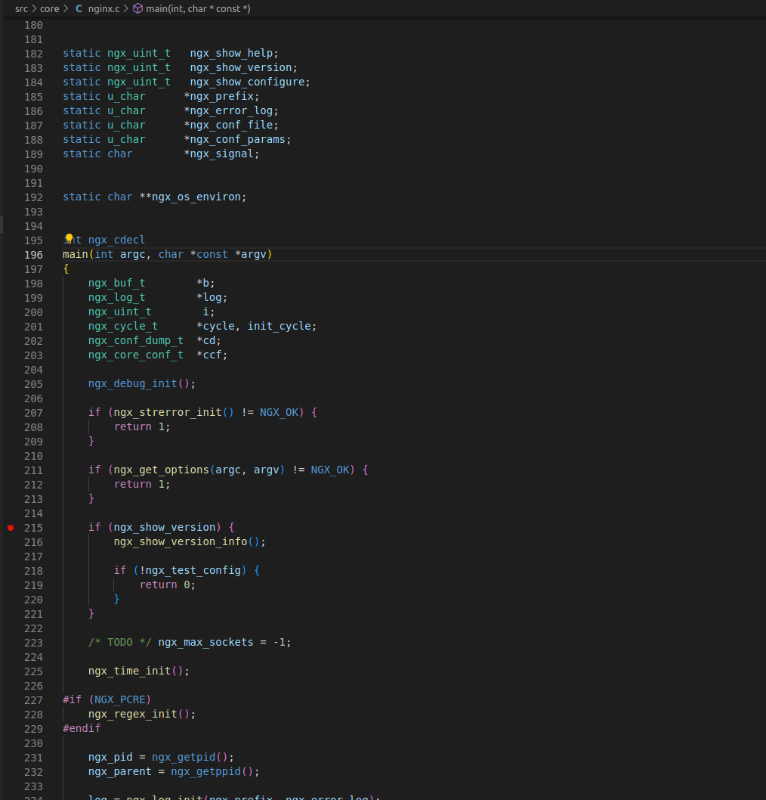
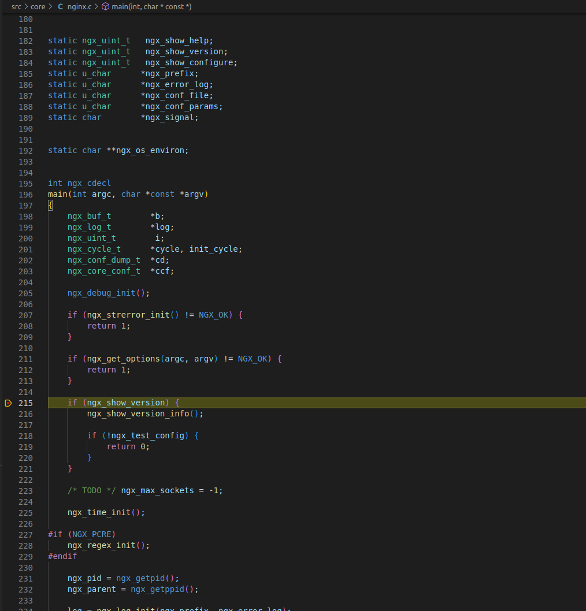
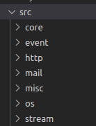

# Nginx

nginx 作为一款公认的高性能、高可靠性、高扩展性的 web 服务器，已经在工业界得到了广泛应用。

## nginx 编译安装调试

nginx本身支持多种平台，我们以 Ubuntu 为例，下载源码并进行编译安装，并使用 vscode 进行调试。

1. 安装 GCC

   ~~~shell
   sudo apt install build-essential
   ~~~

2. 下载依赖包

   + [nginx-1.23.3](https://nginx.org/download/nginx-1.23.3.tar.gz)
   + [pcre-8.45.tar.bz2](https://cfhcable.dl.sourceforge.net/project/pcre/pcre/8.45/pcre-8.45.tar.bz2)
   + [openssl-1.1.1t.tar.gz](https://www.openssl.org/source/openssl-1.1.1t.tar.gz)
   + [zlib-1.2.13](https://zlib.net/zlib-1.2.13.tar.gz)

   将所有压缩包解压放在同一目录下。

3. 编译安装

使用 configure 进行相关编译参数配置：

- `--with-debug`  启用[调试日志](https://nginx.org/en/docs/debugging_log.html)
- `--with-cc-opt='-O0 -g'` 主要用于 gdb 调试，使用 `-g` 包含 debug 符号信息，`-O0`标志禁用编译器优化
- `--prefix` 指定安装目录
- `--with-...` 指定依赖的源码位置

本次使用的编译选项如下：

````shell
./configure --with-debug --with-cc-opt='-O0 -g' \
--prefix=$HOME/文档/Learning/nginx源码分析/nginx-1.23.3/dist/ \
--with-http_ssl_module \
--with-pcre=../pcre-8.45 \
--with-zlib=../zlib-1.2.13 \
--with-openssl=../openssl-1.1.1t
````

configure 执行完成后继续执行 `make && make install` 完成安装工作。

3. 修改 nginx 配置文件

   在 nginx.conf 作如下修改，改变监听端口，关闭 nginx 的 daemon 模式并以单进程运行：

   ```
   daemon off; #新增
   master_process off; #新增
   listen       8080; #修改，由80改为8080
   ```

4. 安装 vscode 并完成 C++ 开发环境配置

   安装 [C++ extension for VS Code](https://marketplace.visualstudio.com/items?itemName=ms-vscode.cpptools)

5. 使用 vscode 打开解压后的代码目录，并在 .vscode 下创建配置文件

   + c_cpp_properties.json

     ```json
     {
         "configurations": [
             {
                 "name": "Linux",
                 "includePath": [
                     "${workspaceFolder}/**",
                     "${workspaceFolder}/../pcre-8.45",
                     "${workspaceFolder}/../openssl-1.1.1t/include"
                 ],
                 "defines": [],
                 "compilerPath": "/usr/bin/gcc",
                 "cStandard": "c17",
                 "cppStandard": "gnu++17",
                 "intelliSenseMode": "linux-gcc-x64"
             }
         ],
         "version": 4
     }
     ```

   + launch.json

     ````json
     {
         // Use IntelliSense to learn about possible attributes.
         // Hover to view descriptions of existing attributes.
         // For more information, visit: https://go.microsoft.com/fwlink/?linkid=830387
         "version": "0.2.0",
         "configurations": [
             {
                 "type": "cppdbg",
                 "request": "launch",
                 "name": "Debug",
                 "program": "${workspaceFolder}/dist/sbin/nginx",
                 "args": [],
                 "cwd": "${workspaceFolder}"
             }
         ]
     }
     ````

6. 开始调试

   在 `src/core/nginx.c +196` 中找到 main 函数并设置断点

   

   在 vscode 菜单中单击 运行-->调试（或者按下 F5）开始调试

   

   可以看到，nginx 已经在断点处暂停，此时按下 F5，nginx 会继续运行。

7. 访问 http://127.0.0.11:8080


可以看到，nginx 已经成功运行。

## nginx 源码结构

在 nginx 源码的 src 目录结构如下：



+ core 存储 nginx 的核心代码，其中有 nginx 的数据结构，包括红黑树、队列、数组、散列表等。其他的还包括 nginx 用到的核心结构体。nginx 的入口函数 main 位于 nginx.c 中。
+ event 存储事件处理相关模块代码。
+ http nginx 处理 HTTP 请求相关的模块代码。
+ mail nginx 作为邮件服务器的相关代码。
+ misc 包含 `ngx_cpp_test_module.cpp` 和 `ngx_google_perftools_module.c` 这两个文件，分别用于测试 nginx 中引用的头文件与 C++ 是否兼容以及支持 google `gperftools` 的实现。
+ os 平台相关代码。
+ stream TCP 反向代理功能的具体实现。