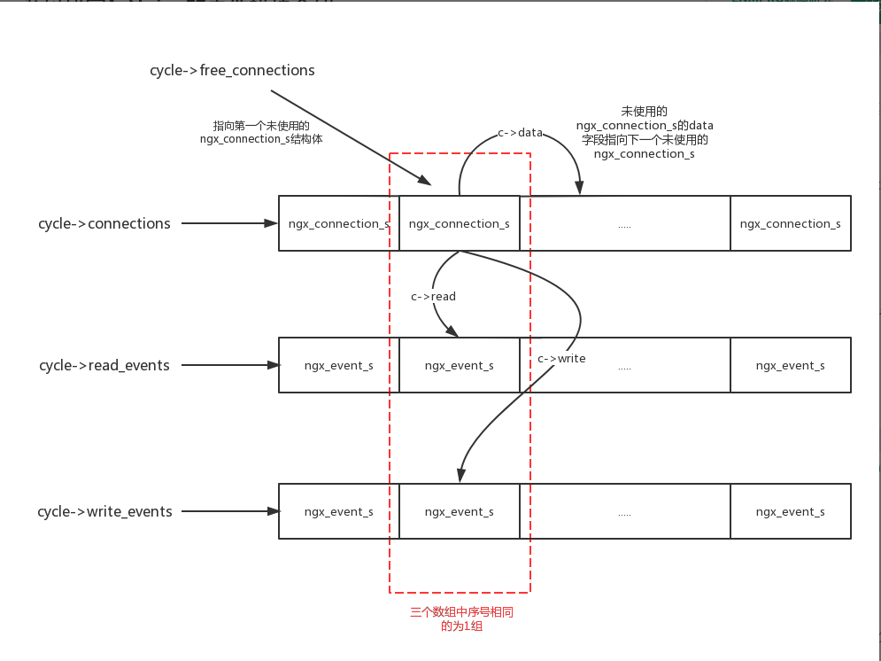
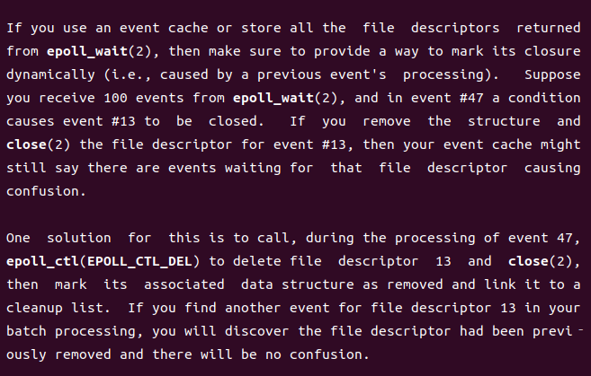

# 事件模块

nginx 的高性能除了自身优秀的设计理念以外，主要得益于各种高性能的 I/O 多路复用技术。nginx 在 I/O 多路复用技术的基础上，实现了自身强大的事件模块。在 linux 下，nginx 可以使用 select、poll、[epoll](https://blog.csdn.net/bandaoyu/article/details/106851848) 三种 I/O 多路复用技术，其中 epoll 是最优秀的 I/O 模型之一。

## epoll 相关系统调用

在 linux 中，有3个与 epoll 相关的调用，分别是 `epoll_create`、`epoll_ctl` 以及 `epoll_wait`。

### epoll_create

函数原型

```C
#include <sys/epoll.h>

int epoll_create(int size);
```

用于创建一个 epoll fd。

执行成功返回一个 epoll fd，失败返回 -1。

在早期的 `epoll_create` 实现中，size 用于通知内核调用这希望在当前 epoll 实例中添加的 fd 的数量，内核使用该参数作为事件描述相关数据结构的初始分配空间总数的提示。在后来的版本中已经不再需要该参数，但必须大于0，以确保兼容较旧的内核。

### epoll_ctl

函数原型

```C
#include <sys/epoll.h>

int epoll_ctl(int epfd, int op, int fd, struct epoll_event *event);
```

事件注册函数，用于向 epfd代表 epoll 中添加、修改或删除事件。

+ epfd：`epoll_create`  返回的 fd

+ op：要执行的动作，有三个取值

  + EPOLL_CTL_ADD 注册新的 fd
  + EPOLL_CTL_MOD 修改已注册的 fd 所对应的事件
  + EPOLL_CTL_DEL 删除 fd

+ fd：目标文件描述符

+ event：类型为 epoll_event，定义如下

  ```C
  typedef union epoll_data {
                 void        *ptr;
                 int          fd;
                 uint32_t     u32;
                 uint64_t     u64;
             } epoll_data_t;
  
             struct epoll_event {
                 uint32_t     events;      /* Epoll events *///决定了该 fd 监听的事件类型与工作模式
                 epoll_data_t data;        /* User data variable *///自定义的附加数据，例如 fd 关联的读事件处理函数、写事件处理函数等
             };
  ```

  events 可能的取值如下

  + EPOLLIN：监听 fd 的读事件
  + EPOLLOUT：监听 fd 的写事件
  + EPOLLRDHUP：判断远端 socket 是否关闭，参考  [TCP: When is EPOLLHUP generated](https://stackoverflow.com/questions/52976152/tcp-when-is-epollhup-generated)
  + EPOLLPRI：对于 tcp 来说，收到了带外数据
  + EPOLLERRP：监听的 fd 发生错误。即使不设置这个标志，这个事件也是被监听的
  + EPOLLHUP：socket 是否完全关闭，参考 [TCP: When is EPOLLHUP generated](https://stackoverflow.com/questions/52976152/tcp-when-is-epollhup-generated)。即使不设置这个标志，这个事件也是被监听的
  + EPOLLET：设置监听的 fd 的工作模式为边沿触发，系统默认为水平触发
  + EPOLLONESHOT：在一次与 fd 关联的事件被通知之后，该 fd 不再被监听
  + EPOLLWAKEUP：与 autosleep 相关
  + EPOLLEXCLUSIVE：用于避免某些场景下的惊群效应


### epoll_wait

函数原型

````C
       #include <sys/epoll.h>

       int epoll_wait(int epfd, struct epoll_event *events,
                      int maxevents, int timeout);
````

获取 epoll 中就绪的事件列表。

+ epfd：`epoll_create`  返回的 fd
+ events：已分配的 epoll_event* 数组，用于存放就绪的事件
+ maxevents：本次可以返回的最大事件数量，一般与 epoll_event* 数组大小相等
+ timeout：等待事件发生时的超时时间（单位为ms），如果为0，则立即返回；-1则发生阻塞

`epoll_wait` 执行成功返回就绪的 fd 数量，没有 fd 就绪则返回 0，出错返回-1并且设置 errno。

### 水平触发与边沿触发

水平触发（**level-triggered**，LT）：对于读写操作，只要内核读写缓冲区不满或不空，就返回读就绪或写就绪

边沿触发（**edge-triggered**，ET）：对于读写操作，只有内核读写缓冲区发生变化，才返回读就绪或写就绪

## event 模块相关配置

nginx 中与 event 模块相关的配置如下

+ worker_vconnections：默认512，设置单个 worker 进程可处理的最大连接数
+ use：指定 I/O 多路复用的具体实现，在 linux 下以 epoll、poll、select 的顺序选择
+ multi_accept：默认0，设置统一 worker 进程是否尽可能多地（在一次 accept 之后）接受等待队列中的连接请求
+ accept_mutex：默认0，是否打开 nginx 的负载均衡锁，此锁能够让多个 worker 进程顺序地与新的客户端建立连接。该选项用来避免惊群效应
+ accept_mutex_delay：默认500，获取负载均衡锁失败的 worker 进程多至少等待久之后才能再次抢锁。该配置还可设定等待 epoll_wait 超时的最大等待时间

## 事件模型

### 监听池

nginx 可以通过在 server 配置块中配置不同的端口实现对多个端口的监听，nginx 通过 ngx_listening_s 结构体实现对不同端口的管理。nginx 通过 ngx_cycle_s 的 listening 字段实现了对所有 ngx_listening_s 的集中化管理。

```C
//src/core/ngx_cycle.h
struct ngx_cycle_s {
    /*...*/
    ngx_array_t               listening;
     /*...*/
}

//src/core/ngx_connection.h
typedef struct ngx_listening_s  ngx_listening_t;

struct ngx_listening_s {
    ngx_socket_t        fd;//监听 fd

    struct sockaddr    *sockaddr;//监听的地址
    socklen_t           socklen;    /* size of sockaddr */
    size_t              addr_text_max_len;//addr_text 的最大长度
    ngx_str_t           addr_text;//ip 地址的字符串形式

    int                 type;//socket 类型

    int                 backlog;//监听 fd 的全连接队列的大小，即已经完成三次握手但还为处理的连接的最大数量
    int                 rcvbuf;//接受缓冲区大小
    int                 sndbuf;//发送缓冲区大小
#if (NGX_HAVE_KEEPALIVE_TUNABLE)//keepalive 相关
    int                 keepidle;//开始探测之前的闲置时间
    int                 keepintvl;//探测间隔
    int                 keepcnt;//放弃之前发送的探测包的数量
#endif

    /* handler of accepted connection */
    ngx_connection_handler_pt   handler;//连接建立成功之后的回调函数

    void               *servers;  /* array of ngx_http_in_addr_t, for example */

    ngx_log_t           log;
    ngx_log_t          *logp;

    size_t              pool_size;
    /* should be here because of the AcceptEx() preread */
    size_t              post_accept_buffer_size;//为新的连接创建的内存池的大小

    ngx_listening_t    *previous;
    ngx_connection_t   *connection;//当前监听 fd 对应的 ngx_connection_t 结构体

    ngx_rbtree_t        rbtree;
    ngx_rbtree_node_t   sentinel;

    ngx_uint_t          worker;

    unsigned            open:1;//当前 fd 是否有效：1代表有效，0代表关闭
    unsigned            remain:1;//ngx_cycle_t 来初始化 ngx_cycle_t 结构体时不关闭监听端口，主要用于重新加载配置文件或者 binary 升级时保留仍然使用的端口
    unsigned            ignore:1;//1代表忽略当前 fd，0则正常初始化

    unsigned            bound:1;       /* already bound */
    unsigned            inherited:1;   /* inherited from previous process */
    unsigned            nonblocking_accept:1;//未使用
    unsigned            listen:1;//当前 socket 已处于监听状态
    unsigned            nonblocking:1;//未使用
    unsigned            shared:1;    /* shared between threads or processes *///未使用
    unsigned            addr_ntop:1;
    unsigned            wildcard:1;

#if (NGX_HAVE_INET6)
    unsigned            ipv6only:1;
#endif
    unsigned            reuseport:1;//启用当前 socket 的 reuseport 特性
    unsigned            add_reuseport:1;//重新加载配置文件或者 binary 升级时，对于用同一个地址，如果新加载的配置文件中启用了 reuseport 而旧的未启用则设置该变量
    unsigned            keepalive:2;//是否启用 keepalive 特性

    unsigned            deferred_accept:1;//是否启用 TCP_DEFER_ACCEPT
    unsigned            delete_deferred:1;
    unsigned            add_deferred:1;
#if (NGX_HAVE_DEFERRED_ACCEPT && defined SO_ACCEPTFILTER)
    char               *accept_filter;
#endif
#if (NGX_HAVE_SETFIB)
    int                 setfib;
#endif

#if (NGX_HAVE_TCP_FASTOPEN)
    int                 fastopen;//tcp fastopen
#endif

};
```

### 连接池

nginx 将连接抽象为 ngx_connection_s 结构体，通过 ngx_cycle_s 的 connections 字段管理所有连接。

```C
//src/core/ngx_cycle.h
struct ngx_cycle_s {
    /*...*/
    ngx_connection_t         *free_connections;//指向可用连接
    ngx_uint_t                free_connection_n;//可用连接总数
    
    ngx_queue_t               reusable_connections_queue;//可被抢占的连接
    ngx_uint_t                reusable_connections_n;//可被抢占的连接总数
    
    ngx_uint_t                connection_n;//连接池总大小
    
    ngx_connection_t         *connections;//连接池，大小为 connection_n
    ngx_event_t              *read_events;//读事件池，大小为 connection_n
    ngx_event_t              *write_events;//写事件池，大小为 connection_n
     /*...*/
}

//src/core/ngx_core.h
typedef struct ngx_connection_s      ngx_connection_t;

//src/core/ngx_connection.h
struct ngx_connection_s {
    void               *data;//连接未使用时， data成员用于充当连接池中空闲连接链表中的 next指针。当连接被使用时， data的意义由使用它的 Nginx模块而定
    ngx_event_t        *read;//连接对应的读事件
    ngx_event_t        *write;//连接对应的写事件

    ngx_socket_t        fd;//连接对应的 fd
	//接收、发送数据的相关函数指针
    ngx_recv_pt         recv;
    ngx_send_pt         send;
    ngx_recv_chain_pt   recv_chain;
    ngx_send_chain_pt   send_chain;

    ngx_listening_t    *listening;//当 fd 为 listening fd 时，该字段指向对应的 ngx_listening_s 结构体

    off_t               sent;//该连接已发送的字节数

    ngx_log_t          *log;

    ngx_pool_t         *pool;//该连接关联的内存池

    int                 type;
	//accept 获取的全连接的相关字段
    struct sockaddr    *sockaddr;
    socklen_t           socklen;
    ngx_str_t           addr_text;

    ngx_proxy_protocol_t  *proxy_protocol;

#if (NGX_SSL || NGX_COMPAT)
    ngx_ssl_connection_t  *ssl;
#endif

    ngx_udp_connection_t  *udp;

    struct sockaddr    *local_sockaddr;//ngx_listening_s 中的 sockaddr 字段
    socklen_t           local_socklen;

    ngx_buf_t          *buffer;

    ngx_queue_t         queue;//该字段用来将当前连接以双向链表元素的形式添加到 ngx_cycle_t 核心结构体的 reusable_connections_queue 双向链表中，表示可以重用的连接

    ngx_atomic_uint_t   number;//连接使用次数。 ngx_connection_t 结构体每次建立一条来自客户端的连接，或者用于主动向后端服务器发起连接时（ ngx_peer_connection_t 也使用它）， number都会加1

    ngx_msec_t          start_time;
    ngx_uint_t          requests;

    unsigned            buffered:8;//缓存中的业务类型

    unsigned            log_error:3;     /* ngx_connection_log_error_e */

    unsigned            timedout:1;//连接超时
    unsigned            error:1;//连接处理过程中出现错误
    unsigned            destroyed:1;//该连接已销毁

    unsigned            idle:1;//连接是否空闲
    unsigned            reusable:1;//连接是否可复用，与上面的 queue字段是对应使用的 
    unsigned            close:1;//连接是否已关闭
    unsigned            shared:1;

    unsigned            sendfile:1;//表示正在将文件中的数据发往连接的另一端 
    unsigned            sndlowat:1;//表示只有在连接套接字对应的发送缓冲区必须满足最低设置的大小阈值时，事件驱动模块才会分发该事件
    unsigned            tcp_nodelay:2;   /* ngx_connection_tcp_nodelay_e *///表示如何使用 TCP 的 nodelay 特性
    unsigned            tcp_nopush:2;    /* ngx_connection_tcp_nopush_e *///表示如何使用 TCP的 nopush 特性

    unsigned            need_last_buf:1;
    unsigned            need_flush_buf:1;

#if (NGX_HAVE_SENDFILE_NODISKIO || NGX_COMPAT)
    unsigned            busy_count:2;
#endif

#if (NGX_THREADS || NGX_COMPAT)
    ngx_thread_task_t  *sendfile_task;
#endif
};
```

### 事件池

nginx 中将 fd 的读写事件抽象为 ngx_event_s 结构体。

```C
//src/core/ngx_core.h
typedef struct ngx_event_s           ngx_event_t;

//src/event/ngx_event.h
struct ngx_event_s {
    void            *data;//事件相关的对象, 通常指向 ngx_connection_t 连接对象

    unsigned         write:1;//1表示写事件

    unsigned         accept:1;//1表示 accept 事件，0表示 posted 事件

    /* used to detect the stale events in kqueue and epoll */
    unsigned         instance:1;//用于检测事件是否为陈旧事件

    /*
     * the event was passed or would be passed to a kernel;
     * in aio mode - operation was posted.
     */
    unsigned         active:1;//用于表示事件是否已被监听

    unsigned         disabled:1;//对于 epoll 没有意义

    /* the ready event; in aio mode 0 means that no operation can be posted */
    unsigned         ready:1;//表示当前事件是否准备就绪,允许这个事件的handler处理这个事件

    unsigned         oneshot:1;//对于 epoll 没有意义

    /* aio operation is complete */
    unsigned         complete:1;//用于异步aio事件的处理

    unsigned         eof:1;//表示当前处理的字符流已经结束
    unsigned         error:1;//事件处理过程出错

    unsigned         timedout:1;//表示该事件超时，回调函数遇到超时标记会关闭次事件关联的连接
    unsigned         timer_set:1;//对某事件添加定时器成功则置为1

    unsigned         delayed:1;//表示需要延迟处理该事件，仅用于限速功能

    unsigned         deferred_accept:1;//用于标识 accept 事件需要延迟处理。

    /* the pending eof reported by kqueue, epoll or in aio chain operation */
    unsigned         pending_eof:1;//标识该事件为断开连接事件。当断开连接事件触发时，该字段置为1

    unsigned         posted:1;

    unsigned         closed:1;

    /* to test on worker exit */
    unsigned         channel:1;
    unsigned         resolver:1;

    unsigned         cancelable:1;

#if (NGX_HAVE_KQUEUE)
    unsigned         kq_vnode:1;

    /* the pending errno reported by kqueue */
    int              kq_errno;
#endif

    /*
     * kqueue only:
     *   accept:     number of sockets that wait to be accepted
     *   read:       bytes to read when event is ready
     *               or lowat when event is set with NGX_LOWAT_EVENT flag
     *   write:      available space in buffer when event is ready
     *               or lowat when event is set with NGX_LOWAT_EVENT flag
     *
     * iocp: TODO
     *
     * otherwise:
     *   accept:     1 if accept many, 0 otherwise
     *   read:       bytes to read when event is ready, -1 if not known
     */

    int              available;//当系统不支持 kquee 机制并且开启了 muti_vaccept，则该字段为1。用于控制某个 worker 进程是否可以接受新的连接，当为1时会循环调用 accept 函数直到所有连接被 worker 进程接收完毕

    ngx_event_handler_pt  handler;//设置该事件的回调函数。根据不同的事件类型或不同的处理阶段，handler 会发生变化


#if (NGX_HAVE_IOCP)
    ngx_event_ovlp_t ovlp;
#endif

    ngx_uint_t       index;

    ngx_log_t       *log;

    ngx_rbtree_node_t   timer;//定时器节点

    /* the posted queue */
    ngx_queue_t      queue;

#if 0

    /* the threads support */

    /*
     * the event thread context, we store it here
     * if $(CC) does not understand __thread declaration
     * and pthread_getspecific() is too costly
     */

    void            *thr_ctx;

#if (NGX_EVENT_T_PADDING)

    /* event should not cross cache line in SMP */

    uint32_t         padding[NGX_EVENT_T_PADDING];
#endif
#endif
};
```

连接池、读事件池、写事件池的大小是相同的，相同下标的元素对应为1组，他们之间的关系如下图所示



## 事件模块初始化

### 相关模块定义

nginx 中，与事件（eopll 实现）相关的模块主要包括 ngx_events_module、ngx_event_core_module 和 ngx_epoll_module，这三个模块的定义如下

```C
//src/event/ngx_event.c
//ngx_events_module
ngx_module_t  ngx_events_module = {
    NGX_MODULE_V1,
    &ngx_events_module_ctx,                /* module context */
    ngx_events_commands,                   /* module directives */
    NGX_CORE_MODULE,                       /* module type */
    NULL,                                  /* init master */
    NULL,                                  /* init module */
    NULL,                                  /* init process */
    NULL,                                  /* init thread */
    NULL,                                  /* exit thread */
    NULL,                                  /* exit process */
    NULL,                                  /* exit master */
    NGX_MODULE_V1_PADDING
};

static ngx_core_module_t  ngx_events_module_ctx = {
    ngx_string("events"),
    NULL,
    ngx_event_init_conf
};

static ngx_command_t  ngx_events_commands[] = {

    { ngx_string("events"),
      NGX_MAIN_CONF|NGX_CONF_BLOCK|NGX_CONF_NOARGS,
      ngx_events_block,
      0,
      0,
      NULL },

      ngx_null_command
};

//src/event/ngx_event.h
typedef struct {//ngx_event_module_t 的定义，作为 event 模块的上下文
    ngx_str_t              *name;

    void                 *(*create_conf)(ngx_cycle_t *cycle);
    char                 *(*init_conf)(ngx_cycle_t *cycle, void *conf);

    ngx_event_actions_t     actions;//统一封装的事件处理函数，屏蔽不同 I/O 多路复用技术的差异
} ngx_event_module_t;

typedef struct {
    ngx_int_t  (*add)(ngx_event_t *ev, ngx_int_t event, ngx_uint_t flags);
    ngx_int_t  (*del)(ngx_event_t *ev, ngx_int_t event, ngx_uint_t flags);

    ngx_int_t  (*enable)(ngx_event_t *ev, ngx_int_t event, ngx_uint_t flags);
    ngx_int_t  (*disable)(ngx_event_t *ev, ngx_int_t event, ngx_uint_t flags);

    ngx_int_t  (*add_conn)(ngx_connection_t *c);
    ngx_int_t  (*del_conn)(ngx_connection_t *c, ngx_uint_t flags);

    ngx_int_t  (*notify)(ngx_event_handler_pt handler);

    ngx_int_t  (*process_events)(ngx_cycle_t *cycle, ngx_msec_t timer,
                                 ngx_uint_t flags);

    ngx_int_t  (*init)(ngx_cycle_t *cycle, ngx_msec_t timer);
    void       (*done)(ngx_cycle_t *cycle);
} ngx_event_actions_t;

//src/event/ngx_event.c
//ngx_event_core_module
ngx_module_t  ngx_event_core_module = {
    NGX_MODULE_V1,
    &ngx_event_core_module_ctx,            /* module context */
    ngx_event_core_commands,               /* module directives */
    NGX_EVENT_MODULE,                      /* module type */
    NULL,                                  /* init master */
    ngx_event_module_init,                 /* init module *///event 模块初始化
    ngx_event_process_init,                /* init process *///从进程角度对 event 模块进行进一步初始化
    NULL,                                  /* init thread */
    NULL,                                  /* exit thread */
    NULL,                                  /* exit process */
    NULL,                                  /* exit master */
    NGX_MODULE_V1_PADDING
};

static ngx_event_module_t  ngx_event_core_module_ctx = {//ngx_event_core_module 模块的上下文
    &event_core_name,
    ngx_event_core_create_conf,            /* create configuration */
    ngx_event_core_init_conf,              /* init configuration */

    { NULL, NULL, NULL, NULL, NULL, NULL, NULL, NULL, NULL, NULL }
};

static ngx_command_t  ngx_event_core_commands[] = {

    { ngx_string("worker_connections"),
      NGX_EVENT_CONF|NGX_CONF_TAKE1,
      ngx_event_connections,
      0,
      0,
      NULL },

    { ngx_string("use"),
      NGX_EVENT_CONF|NGX_CONF_TAKE1,
      ngx_event_use,
      0,
      0,
      NULL },

    { ngx_string("multi_accept"),
      NGX_EVENT_CONF|NGX_CONF_FLAG,
      ngx_conf_set_flag_slot,
      0,
      offsetof(ngx_event_conf_t, multi_accept),
      NULL },

    { ngx_string("accept_mutex"),
      NGX_EVENT_CONF|NGX_CONF_FLAG,
      ngx_conf_set_flag_slot,
      0,
      offsetof(ngx_event_conf_t, accept_mutex),
      NULL },

    { ngx_string("accept_mutex_delay"),
      NGX_EVENT_CONF|NGX_CONF_TAKE1,
      ngx_conf_set_msec_slot,
      0,
      offsetof(ngx_event_conf_t, accept_mutex_delay),
      NULL },

    { ngx_string("debug_connection"),
      NGX_EVENT_CONF|NGX_CONF_TAKE1,
      ngx_event_debug_connection,
      0,
      0,
      NULL },

      ngx_null_command
};

//src/event/modules/ngx_epoll_module.c
//ngx_epoll_module
ngx_module_t  ngx_epoll_module = {
    NGX_MODULE_V1,
    &ngx_epoll_module_ctx,               /* module context */
    ngx_epoll_commands,                  /* module directives */
    NGX_EVENT_MODULE,                    /* module type */
    NULL,                                /* init master */
    NULL,                                /* init module */
    NULL,                                /* init process */
    NULL,                                /* init thread */
    NULL,                                /* exit thread */
    NULL,                                /* exit process */
    NULL,                                /* exit master */
    NGX_MODULE_V1_PADDING
};

static ngx_event_module_t  ngx_epoll_module_ctx = {//eopll 模块的上下文
    &epoll_name,
    ngx_epoll_create_conf,               /* create configuration */
    ngx_epoll_init_conf,                 /* init configuration */

    {//eopll 模块对 actions 的赋值
        ngx_epoll_add_event,             /* add an event *///对 epoll 管理的 fd 进行监听事件的添加
        ngx_epoll_del_event,             /* delete an event *///对 epoll 管理的 fd 进行监听事件的删除
        ngx_epoll_add_event,             /* enable an event */
        ngx_epoll_del_event,             /* disable an event */
        ngx_epoll_add_connection,        /* add an connection *///将 fd 添加到 epoll 中并监听可读、可写以及连接断开事件
        ngx_epoll_del_connection,        /* delete an connection *///从 epoll 中删除某 fd
#if (NGX_HAVE_EVENTFD)
        ngx_epoll_notify,                /* trigger a notify */
#else
        NULL,                            /* trigger a notify */
#endif
        ngx_epoll_process_events,        /* process the events *///事件处理核心函数
        ngx_epoll_init,                  /* init the events *///eopll 相关资源初始化
        ngx_epoll_done,                  /* done the events *///释放 epoll 相关资源
    }
};

static ngx_command_t  ngx_epoll_commands[] = {

    { ngx_string("epoll_events"),
      NGX_EVENT_CONF|NGX_CONF_TAKE1,
      ngx_conf_set_num_slot,
      0,
      offsetof(ngx_epoll_conf_t, events),
      NULL },

    { ngx_string("worker_aio_requests"),
      NGX_EVENT_CONF|NGX_CONF_TAKE1,
      ngx_conf_set_num_slot,
      0,
      offsetof(ngx_epoll_conf_t, aio_requests),
      NULL },

      ngx_null_command
};
```

### 事件模块初始化

事件模块的主要初始化工作主要由 ngx_event_core_module 模块的 `ngx_event_module_init` 和 `ngx_event_process_init` 完成的。

#### ngx_event_module_init

```C
//src/event/ngx_event.c
/*
	对 event 模块需要用到的全局变量进行初始化
*/
static ngx_int_t
ngx_event_module_init(ngx_cycle_t *cycle)
{
    void              ***cf;
    u_char              *shared;
    size_t               size, cl;
    ngx_shm_t            shm;
    ngx_time_t          *tp;
    ngx_core_conf_t     *ccf;
    ngx_event_conf_t    *ecf;
	//获取相关配置
    cf = ngx_get_conf(cycle->conf_ctx, ngx_events_module);
    ecf = (*cf)[ngx_event_core_module.ctx_index];

    if (!ngx_test_config && ngx_process <= NGX_PROCESS_MASTER) {
        ngx_log_error(NGX_LOG_NOTICE, cycle->log, 0,
                      "using the \"%s\" event method", ecf->name);
    }

    ccf = (ngx_core_conf_t *) ngx_get_conf(cycle->conf_ctx, ngx_core_module);

    ngx_timer_resolution = ccf->timer_resolution;//初始化 ngx_timer_resolution，作用为设置每隔多久刷新一次时钟缓存

#if !(NGX_WIN32)
    {//检查 connections 配置是否超过系统限制
    ngx_int_t      limit;
    struct rlimit  rlmt;

    if (getrlimit(RLIMIT_NOFILE, &rlmt) == -1) {
        ngx_log_error(NGX_LOG_ALERT, cycle->log, ngx_errno,
                      "getrlimit(RLIMIT_NOFILE) failed, ignored");

    } else {
        if (ecf->connections > (ngx_uint_t) rlmt.rlim_cur
            && (ccf->rlimit_nofile == NGX_CONF_UNSET
                || ecf->connections > (ngx_uint_t) ccf->rlimit_nofile))
        {
            limit = (ccf->rlimit_nofile == NGX_CONF_UNSET) ?
                         (ngx_int_t) rlmt.rlim_cur : ccf->rlimit_nofile;

            ngx_log_error(NGX_LOG_WARN, cycle->log, 0,
                          "%ui worker_connections exceed "
                          "open file resource limit: %i",
                          ecf->connections, limit);
        }
    }
    }
#endif /* !(NGX_WIN32) */


    if (ccf->master == 0) {
        return NGX_OK;
    }

    if (ngx_accept_mutex_ptr) {
        return NGX_OK;
    }


    /* cl should be equal to or greater than cache line size */

    cl = 128;

    size = cl            /* ngx_accept_mutex */
           + cl          /* ngx_connection_counter */
           + cl;         /* ngx_temp_number */

#if (NGX_STAT_STUB)

    size += cl           /* ngx_stat_accepted */
           + cl          /* ngx_stat_handled */
           + cl          /* ngx_stat_requests */
           + cl          /* ngx_stat_active */
           + cl          /* ngx_stat_reading */
           + cl          /* ngx_stat_writing */
           + cl;         /* ngx_stat_waiting */

#endif
	//创建一块共享内存 nginx_shared_zone，存储负载均衡锁 ngx_accept_mutex、连接计数器 ngx_connection_counter、临时值 ngx_temp_number、随机数 ngx_random_number
    shm.size = size;
    ngx_str_set(&shm.name, "nginx_shared_zone");
    shm.log = cycle->log;

    if (ngx_shm_alloc(&shm) != NGX_OK) {
        return NGX_ERROR;
    }

    shared = shm.addr;

    ngx_accept_mutex_ptr = (ngx_atomic_t *) shared;
    ngx_accept_mutex.spin = (ngx_uint_t) -1;

    if (ngx_shmtx_create(&ngx_accept_mutex, (ngx_shmtx_sh_t *) shared,
                         cycle->lock_file.data)
        != NGX_OK)
    {
        return NGX_ERROR;
    }

    ngx_connection_counter = (ngx_atomic_t *) (shared + 1 * cl);

    (void) ngx_atomic_cmp_set(ngx_connection_counter, 0, 1);

    ngx_log_debug2(NGX_LOG_DEBUG_EVENT, cycle->log, 0,
                   "counter: %p, %uA",
                   ngx_connection_counter, *ngx_connection_counter);

    ngx_temp_number = (ngx_atomic_t *) (shared + 2 * cl);

    tp = ngx_timeofday();
	//初始化随机数 ngx_random_number
    ngx_random_number = (tp->msec << 16) + ngx_pid;

#if (NGX_STAT_STUB)

    ngx_stat_accepted = (ngx_atomic_t *) (shared + 3 * cl);
    ngx_stat_handled = (ngx_atomic_t *) (shared + 4 * cl);
    ngx_stat_requests = (ngx_atomic_t *) (shared + 5 * cl);
    ngx_stat_active = (ngx_atomic_t *) (shared + 6 * cl);
    ngx_stat_reading = (ngx_atomic_t *) (shared + 7 * cl);
    ngx_stat_writing = (ngx_atomic_t *) (shared + 8 * cl);
    ngx_stat_waiting = (ngx_atomic_t *) (shared + 9 * cl);

#endif

    return NGX_OK;
}
```

#### ngx_event_process_init

`ngx_event_process_init` 是在 worker 进程的初始化过程中调用的，完成了 event 模块的主要初始化工作。

```C
//src/os/unix/ngx_process_cycle.c
//ngx_worker_process_init
//+891
	for (i = 0; cycle->modules[i]; i++) {
        if (cycle->modules[i]->init_process) {
            if (cycle->modules[i]->init_process(cycle) == NGX_ERROR) {//当模块为 ngx_event_core_module 时，此处调用的是 ngx_event_process_init
                /* fatal */
                exit(2);
            }
        }
    }

//src/event/ngx_event.c
/*
	事件初始化的核心流程。
	1.根据配置确定是否使用负载均衡锁
	2.初始化相关队列
	3.初始化一颗红黑树，将其用作时间事件的定时器
	4.调用 event 模块的 actions.init 方法，对于 eopll 模块，调用的是 ngx_epoll_init，初始化 epoll 相关变量
	5.初始化连接池、事件池并建立关联
	6.遍历监听池，在连接池中给所有的监听 fd 分配连接
	7.为所有监听 fd 设置回调函数
	8.根据不同配置选择性地把监听 fd 加入 epoll
*/
static ngx_int_t
ngx_event_process_init(ngx_cycle_t *cycle)
{
    ngx_uint_t           m, i;
    ngx_event_t         *rev, *wev;
    ngx_listening_t     *ls;
    ngx_connection_t    *c, *next, *old;
    ngx_core_conf_t     *ccf;
    ngx_event_conf_t    *ecf;
    ngx_event_module_t  *module;
	//获取相关配置
    ccf = (ngx_core_conf_t *) ngx_get_conf(cycle->conf_ctx, ngx_core_module);
    ecf = ngx_event_get_conf(cycle->conf_ctx, ngx_event_core_module);

    if (ccf->master && ccf->worker_processes > 1 && ecf->accept_mutex) {//是否启用负载均衡锁
        ngx_use_accept_mutex = 1;
        ngx_accept_mutex_held = 0;
        ngx_accept_mutex_delay = ecf->accept_mutex_delay;

    } else {
        ngx_use_accept_mutex = 0;
    }

#if (NGX_WIN32)

    /*
     * disable accept mutex on win32 as it may cause deadlock if
     * grabbed by a process which can't accept connections
     */

    ngx_use_accept_mutex = 0;

#endif

    ngx_use_exclusive_accept = 0;

    ngx_queue_init(&ngx_posted_accept_events);//初始化连接建立事件暂存队列
    ngx_queue_init(&ngx_posted_next_events);
    ngx_queue_init(&ngx_posted_events);//初始化读/写事件暂存队列

    if (ngx_event_timer_init(cycle->log) == NGX_ERROR) {//初始化定时器
        return NGX_ERROR;
    }

    for (m = 0; cycle->modules[m]; m++) {
        if (cycle->modules[m]->type != NGX_EVENT_MODULE) {
            continue;
        }

        if (cycle->modules[m]->ctx_index != ecf->use) {//查找 epoll 模块
            continue;
        }

        module = cycle->modules[m]->ctx;

        if (module->actions.init(cycle, ngx_timer_resolution) != NGX_OK) {//对于 epoll 模块，这里调用了 ngx_epoll_init，其中初始化了一个类型为 ngx_event_actions_t 的全局变量 ngx_event_actions
            /* fatal */
            exit(2);
        }

        break;
    }

#if !(NGX_WIN32)

    if (ngx_timer_resolution && !(ngx_event_flags & NGX_USE_TIMER_EVENT)) {//设置了 timer_resolution 才会进行定时器的初始化
        struct sigaction  sa;
        struct itimerval  itv;

        ngx_memzero(&sa, sizeof(struct sigaction));
        sa.sa_handler = ngx_timer_signal_handler;//设置信号处理函数，将 ngx_event_timer_alarm 设置为1
        sigemptyset(&sa.sa_mask);

        if (sigaction(SIGALRM, &sa, NULL) == -1) {
            ngx_log_error(NGX_LOG_ALERT, cycle->log, ngx_errno,
                          "sigaction(SIGALRM) failed");
            return NGX_ERROR;
        }

        itv.it_interval.tv_sec = ngx_timer_resolution / 1000;
        itv.it_interval.tv_usec = (ngx_timer_resolution % 1000) * 1000;
        itv.it_value.tv_sec = ngx_timer_resolution / 1000;
        itv.it_value.tv_usec = (ngx_timer_resolution % 1000 ) * 1000;

        if (setitimer(ITIMER_REAL, &itv, NULL) == -1) {//定时发送 SIGALRM 信号
            ngx_log_error(NGX_LOG_ALERT, cycle->log, ngx_errno,
                          "setitimer() failed");
        }
    }

    if (ngx_event_flags & NGX_USE_FD_EVENT) {
        struct rlimit  rlmt;

        if (getrlimit(RLIMIT_NOFILE, &rlmt) == -1) {
            ngx_log_error(NGX_LOG_ALERT, cycle->log, ngx_errno,
                          "getrlimit(RLIMIT_NOFILE) failed");
            return NGX_ERROR;
        }

        cycle->files_n = (ngx_uint_t) rlmt.rlim_cur;

        cycle->files = ngx_calloc(sizeof(ngx_connection_t *) * cycle->files_n,
                                  cycle->log);
        if (cycle->files == NULL) {
            return NGX_ERROR;
        }
    }

#else

    if (ngx_timer_resolution && !(ngx_event_flags & NGX_USE_TIMER_EVENT)) {
        ngx_log_error(NGX_LOG_WARN, cycle->log, 0,
                      "the \"timer_resolution\" directive is not supported "
                      "with the configured event method, ignored");
        ngx_timer_resolution = 0;
    }

#endif
	//初始化连接池，大小由 worker_vconnections 决定，默认为512
    cycle->connections =
        ngx_alloc(sizeof(ngx_connection_t) * cycle->connection_n, cycle->log);
    if (cycle->connections == NULL) {
        return NGX_ERROR;
    }

    c = cycle->connections;
	//初始化读事件池，大小与连接池相同
    cycle->read_events = ngx_alloc(sizeof(ngx_event_t) * cycle->connection_n,
                                   cycle->log);
    if (cycle->read_events == NULL) {
        return NGX_ERROR;
    }

    rev = cycle->read_events;
    for (i = 0; i < cycle->connection_n; i++) {
        rev[i].closed = 1;//初始化为1，代表未使用
        rev[i].instance = 1;//初始化为1,用于检测陈旧事件
    }
	//初始化写事件池，大小与连接池相同
    cycle->write_events = ngx_alloc(sizeof(ngx_event_t) * cycle->connection_n,
                                    cycle->log);
    if (cycle->write_events == NULL) {
        return NGX_ERROR;
    }

    wev = cycle->write_events;
    for (i = 0; i < cycle->connection_n; i++) {
        wev[i].closed = 1;//初始化为1，代表未使用
    }

    i = cycle->connection_n;
    next = NULL;

    do {//读写事件池与连接池建立联系
        i--;

        c[i].data = next;//建立未使用连接链表
        c[i].read = &cycle->read_events[i];
        c[i].write = &cycle->write_events[i];
        c[i].fd = (ngx_socket_t) -1;

        next = &c[i];
    } while (i);

    cycle->free_connections = next;//空闲连接链表头部
    cycle->free_connection_n = cycle->connection_n;

    /* for each listening socket */

    ls = cycle->listening.elts;//在连接池中，为每个监听端口分配连接
    for (i = 0; i < cycle->listening.nelts; i++) {

#if (NGX_HAVE_REUSEPORT)
        if (ls[i].reuseport && ls[i].worker != ngx_worker) {
            continue;
        }
#endif

        c = ngx_get_connection(ls[i].fd, cycle->log);//为监听 fd 分配连接

        if (c == NULL) {
            return NGX_ERROR;
        }

        c->type = ls[i].type;
        c->log = &ls[i].log;

        c->listening = &ls[i];
        ls[i].connection = c;

        rev = c->read;

        rev->log = c->log;
        rev->accept = 1;//将监听 fd 的事件设置为 accept

#if (NGX_HAVE_DEFERRED_ACCEPT)
        rev->deferred_accept = ls[i].deferred_accept;
#endif

        if (!(ngx_event_flags & NGX_USE_IOCP_EVENT)
            && cycle->old_cycle)
        {
            if (ls[i].previous) {

                /*
                 * delete the old accept events that were bound to
                 * the old cycle read events array
                 */

                old = ls[i].previous->connection;

                if (ngx_del_event(old->read, NGX_READ_EVENT, NGX_CLOSE_EVENT)
                    == NGX_ERROR)
                {
                    return NGX_ERROR;
                }

                old->fd = (ngx_socket_t) -1;
            }
        }

#if (NGX_WIN32)

        if (ngx_event_flags & NGX_USE_IOCP_EVENT) {
            ngx_iocp_conf_t  *iocpcf;

            rev->handler = ngx_event_acceptex;

            if (ngx_use_accept_mutex) {
                continue;
            }

            if (ngx_add_event(rev, 0, NGX_IOCP_ACCEPT) == NGX_ERROR) {
                return NGX_ERROR;
            }

            ls[i].log.handler = ngx_acceptex_log_error;

            iocpcf = ngx_event_get_conf(cycle->conf_ctx, ngx_iocp_module);
            if (ngx_event_post_acceptex(&ls[i], iocpcf->post_acceptex)
                == NGX_ERROR)
            {
                return NGX_ERROR;
            }

        } else {
            rev->handler = ngx_event_accept;

            if (ngx_use_accept_mutex) {
                continue;
            }

            if (ngx_add_event(rev, NGX_READ_EVENT, 0) == NGX_ERROR) {
                return NGX_ERROR;
            }
        }

#else

        rev->handler = (c->type == SOCK_STREAM) ? ngx_event_accept//为所有监听 fd 设置回调函数
                                                : ngx_event_recvmsg;

#if (NGX_HAVE_REUSEPORT)

        if (ls[i].reuseport) {//在启用 reuseport 的情况下，多个进程共用一个端口也不会导致惊群问题，此时可以直接把监听 fd 的读事件加入 epoll
            if (ngx_add_event(rev, NGX_READ_EVENT, 0) == NGX_ERROR) {
                return NGX_ERROR;
            }

            continue;
        }

#endif

        if (ngx_use_accept_mutex) {//在启用负载均衡锁的情况下，每个 worker 不能直接把监听 fd 放入 epoll 中，需要在 worker 进程抢到锁之后才能监听
            continue;
        }

#if (NGX_HAVE_EPOLLEXCLUSIVE)
		//启用 epoll 的 EPOLLEXCLUSIVE 特性以避免惊群问题
        if ((ngx_event_flags & NGX_USE_EPOLL_EVENT)
            && ccf->worker_processes > 1)
        {
            ngx_use_exclusive_accept = 1;

            if (ngx_add_event(rev, NGX_READ_EVENT, NGX_EXCLUSIVE_EVENT)
                == NGX_ERROR)
            {
                return NGX_ERROR;
            }

            continue;
        }

#endif

        if (ngx_add_event(rev, NGX_READ_EVENT, 0) == NGX_ERROR) {//未采取上述任何一种避免惊群问题的措施
            return NGX_ERROR;
        }

#endif

    }

    return NGX_OK;
}
```

### 事件循环

#### ngx_worker_process_cycle

事件模块初始化完成后，nginx 在 `ngx_worker_process_cycle` 中开启了事件循环

```C
//src/os/unix/ngx_process_cycle.c
/*
	worker 进程循环函数
*/
static void
ngx_worker_process_cycle(ngx_cycle_t *cycle, void *data)
{
    ngx_int_t worker = (intptr_t) data;

    ngx_process = NGX_PROCESS_WORKER;
    ngx_worker = worker;

    ngx_worker_process_init(cycle, worker);//事件初始化

    ngx_setproctitle("worker process");//设置 worker 进程标题

    for ( ;; ) {

        if (ngx_exiting) {
            if (ngx_event_no_timers_left() == NGX_OK) {
                ngx_log_error(NGX_LOG_NOTICE, cycle->log, 0, "exiting");
                ngx_worker_process_exit(cycle);
            }
        }

        ngx_log_debug0(NGX_LOG_DEBUG_EVENT, cycle->log, 0, "worker cycle");

        ngx_process_events_and_timers(cycle);//事件处理

        if (ngx_terminate) {
            ngx_log_error(NGX_LOG_NOTICE, cycle->log, 0, "exiting");
            ngx_worker_process_exit(cycle);
        }

        if (ngx_quit) {
            ngx_quit = 0;
            ngx_log_error(NGX_LOG_NOTICE, cycle->log, 0,
                          "gracefully shutting down");
            ngx_setproctitle("worker process is shutting down");

            if (!ngx_exiting) {
                ngx_exiting = 1;
                ngx_set_shutdown_timer(cycle);
                ngx_close_listening_sockets(cycle);
                ngx_close_idle_connections(cycle);
                ngx_event_process_posted(cycle, &ngx_posted_events);
            }
        }

        if (ngx_reopen) {
            ngx_reopen = 0;
            ngx_log_error(NGX_LOG_NOTICE, cycle->log, 0, "reopening logs");
            ngx_reopen_files(cycle, -1);
        }
    }
}
```

#### ngx_process_events_and_timers

nginx 在 `ngx_process_events_and_timers` 中完成了对事件的处理

```C
//src/event/ngx_event.c
/*
	事件处理
*/
void
ngx_process_events_and_timers(ngx_cycle_t *cycle)
{
    ngx_uint_t  flags;
    ngx_msec_t  timer, delta;//timer 变量作为 epoll_wait 的第四个参数，用于设置 epoll 的阻塞时间

    if (ngx_timer_resolution) {//如果开启 timer_resolution 选项，nginx 会定时收到 SIGALARM 信号（在 ngx_event_process_init 中设置了定时器）
        timer = NGX_TIMER_INFINITE;//timer 设置为 NGX_TIMER_INFINITE（-1），即 epoll_wait 无限等待直到有事件发生或者信号到达
        flags = 0;

    } else {
        timer = ngx_event_find_timer();//从红黑树中找出最近一个待处理的事件，获取该事件与当前时间的差值作为 timer
        flags = NGX_UPDATE_TIME;//设置 NGX_UPDATE_TIME 表明需要刷新时间缓存

#if (NGX_WIN32)

        /* handle signals from master in case of network inactivity */

        if (timer == NGX_TIMER_INFINITE || timer > 500) {
            timer = 500;
        }

#endif
    }

    if (ngx_use_accept_mutex) {//是否开启负载均衡锁
        if (ngx_accept_disabled > 0) {//ngx_accept_disabled 代表当前 worker 进程的负载，大于0表示当前 worker 进程负载过高，不再接收新连接
            ngx_accept_disabled--;//计算方式 ngx_accept_disabled = ngx_cycle->connection_n / 8 - ngx_cycle->free_connection_n，大于0说明空闲连接小于八分之一

        } else {
            if (ngx_trylock_accept_mutex(cycle) == NGX_ERROR) {//在 ngx_trylock_accept_mutex 抢锁，如果抢到则将监听 fd 放入 epoll
                return;
            }

            if (ngx_accept_mutex_held) {//抢到锁，后续事件先暂存到队列里
                flags |= NGX_POST_EVENTS;//设置 NGX_POST_EVENTS 表明当前 worker 进程持有负载均衡锁

            } else {//未抢到锁，则设置 timer，修改 epoll_wait 阻塞时间
                if (timer == NGX_TIMER_INFINITE
                    || timer > ngx_accept_mutex_delay)
                {
                    timer = ngx_accept_mutex_delay;//timer 最大为 ngx_accept_mutex_delay
                }
            }
        }
    }

    if (!ngx_queue_empty(&ngx_posted_next_events)) {
        ngx_event_move_posted_next(cycle);
        timer = 0;
    }

    delta = ngx_current_msec;

    (void) ngx_process_events(cycle, timer, flags);//I/O 事件处理核心函数，ngx_process_events 是一个宏定义（ngx_event_actions.process_events）， 对于 epoll 来说，ngx_event_actions 在 ngx_epoll_init 中初始化（ngx_event_actions = ngx_epoll_module_ctx.actions;），所以这里实际上调用的是 epoll 对应的事件处理函数 ngx_epoll_process_events

    delta = ngx_current_msec - delta;

    ngx_log_debug1(NGX_LOG_DEBUG_EVENT, cycle->log, 0,
                   "timer delta: %M", delta);

    ngx_event_process_posted(cycle, &ngx_posted_accept_events);//开启负载均衡锁时，建立 ngx_posted_accept_events 队列用于暂存连接事件，待 accept 函数获取全连接后，优先处理；未开启的话则 ngx_posted_accept_events 为空

    if (ngx_accept_mutex_held) {//及时释放负载均衡锁
        ngx_shmtx_unlock(&ngx_accept_mutex);
    }

    ngx_event_expire_timers();//时间事件处理核心函数

    ngx_event_process_posted(cycle, &ngx_posted_events);//开启负载均衡锁时，I/O 事件暂存到 ngx_posted_events 延迟处理
}
```

#### ngx_epoll_process_events

对于 epoll 来说，I/O 事件的处理在 `ngx_epoll_process_events` 中完成

```C
//src/event/modules/ngx_epoll_module.c
/*
	epoll 对应的 I/O 处理函数
*/
static ngx_int_t
ngx_epoll_process_events(ngx_cycle_t *cycle, ngx_msec_t timer, ngx_uint_t flags)
{
    int                events;
    uint32_t           revents;
    ngx_int_t          instance, i;
    ngx_uint_t         level;
    ngx_err_t          err;
    ngx_event_t       *rev, *wev;
    ngx_queue_t       *queue;
    ngx_connection_t  *c;

    /* NGX_TIMER_INFINITE == INFTIM */

    ngx_log_debug1(NGX_LOG_DEBUG_EVENT, cycle->log, 0,
                   "epoll timer: %M", timer);

    events = epoll_wait(ep, event_list, (int) nevents, timer);//调用 epoll_wait 以获取就绪的 fd 列表 event_list

    err = (events == -1) ? ngx_errno : 0;

    if (flags & NGX_UPDATE_TIME || ngx_event_timer_alarm) {//设置 NGX_UPDATE_TIME 或者收到 SIGALRM 信号则需要更新时间缓存
        ngx_time_update();//nginx 为了避免多次调用时间相关系统调用而对时间进行了缓存，在 ngx_time_update 中对时间进行更新
    }

    if (err) {
        if (err == NGX_EINTR) {//没有就绪事件，epoll_wait 被 SIGALRM 信号打断

            if (ngx_event_timer_alarm) {
                ngx_event_timer_alarm = 0;
                return NGX_OK;
            }

            level = NGX_LOG_INFO;

        } else {//发生其他错误
            level = NGX_LOG_ALERT;
        }

        ngx_log_error(level, cycle->log, err, "epoll_wait() failed");
        return NGX_ERROR;
    }

    if (events == 0) {//没有就绪事件
        if (timer != NGX_TIMER_INFINITE) {
            return NGX_OK;
        }

        ngx_log_error(NGX_LOG_ALERT, cycle->log, 0,
                      "epoll_wait() returned no events without timeout");
        return NGX_ERROR;
    }

    for (i = 0; i < events; i++) {
        c = event_list[i].data.ptr;//data.ptr 为自定义数据，这里是该 fd 在连接池中的地址

        instance = (uintptr_t) c & 1;//提取连接地址的最后一位
        c = (ngx_connection_t *) ((uintptr_t) c & (uintptr_t) ~1);//地址还原

        rev = c->read;

        if (c->fd == -1 || rev->instance != instance) {//陈旧事件检查

            /*
             * the stale event from a file descriptor
             * that was just closed in this iteration
             */

            ngx_log_debug1(NGX_LOG_DEBUG_EVENT, cycle->log, 0,
                           "epoll: stale event %p", c);
            continue;
        }

        revents = event_list[i].events;

        ngx_log_debug3(NGX_LOG_DEBUG_EVENT, cycle->log, 0,
                       "epoll: fd:%d ev:%04XD d:%p",
                       c->fd, revents, event_list[i].data.ptr);

        if (revents & (EPOLLERR|EPOLLHUP)) {//如果触发的是错误或者断开连接事件，则追加读写事件，在调用读写事件的回调函数时能够处理这些异常
            ngx_log_debug2(NGX_LOG_DEBUG_EVENT, cycle->log, 0,
                           "epoll_wait() error on fd:%d ev:%04XD",
                           c->fd, revents);

            /*
             * if the error events were returned, add EPOLLIN and EPOLLOUT
             * to handle the events at least in one active handler
             */

            revents |= EPOLLIN|EPOLLOUT;
        }

#if 0
        if (revents & ~(EPOLLIN|EPOLLOUT|EPOLLERR|EPOLLHUP)) {
            ngx_log_error(NGX_LOG_ALERT, cycle->log, 0,
                          "strange epoll_wait() events fd:%d ev:%04XD",
                          c->fd, revents);
        }
#endif

        if ((revents & EPOLLIN) && rev->active) {//触发的是读事件

#if (NGX_HAVE_EPOLLRDHUP)
            if (revents & EPOLLRDHUP) {
                rev->pending_eof = 1;
            }
#endif

            rev->ready = 1;
            rev->available = -1;

            if (flags & NGX_POST_EVENTS) {//NGX_POST_EVENTS 被设置说明持有负载均衡锁
                queue = rev->accept ? &ngx_posted_accept_events//accept 事件则放入 ngx_posted_accept_events 队列，否则放入 ngx_posted_events
                                    : &ngx_posted_events;

                ngx_post_event(rev, queue);

            } else {
                rev->handler(rev);//未开启负载均衡锁或者当前 worker 进程未持有锁，则直接调用对应的回调函数进行事件处理；在请求的不同阶段调用的回调函数也不同
            }
        }

        wev = c->write;

        if ((revents & EPOLLOUT) && wev->active) {//触发的是写事件

            if (c->fd == -1 || wev->instance != instance) {//陈旧事件检查

                /*
                 * the stale event from a file descriptor
                 * that was just closed in this iteration
                 */

                ngx_log_debug1(NGX_LOG_DEBUG_EVENT, cycle->log, 0,
                               "epoll: stale event %p", c);
                continue;
            }

            wev->ready = 1;
#if (NGX_THREADS)
            wev->complete = 1;
#endif

            if (flags & NGX_POST_EVENTS) {//与读事件类似，根据是否持有负载均衡锁分别处理
                ngx_post_event(wev, &ngx_posted_events);

            } else {
                wev->handler(wev);
            }
        }
    }

    return NGX_OK;
}
```

#### ngx_event_expire_timers

```C
//src/event/ngx_event_timer.c
/*
	超时事件处理
*/
void
ngx_event_expire_timers(void)
{
    ngx_event_t        *ev;
    ngx_rbtree_node_t  *node, *root, *sentinel;

    sentinel = ngx_event_timer_rbtree.sentinel;

    for ( ;; ) {
        root = ngx_event_timer_rbtree.root;

        if (root == sentinel) {//红黑树是空的
            return;
        }

        node = ngx_rbtree_min(root, sentinel);//从红黑树中获取超时时间最近的节点

        /* node->key > ngx_current_msec */

        if ((ngx_msec_int_t) (node->key - ngx_current_msec) > 0) {//超时时间最近的节点未超时则直接返回
            return;
        }

        ev = ngx_rbtree_data(node, ngx_event_t, timer);//获取 ndoe 对应的事件

        ngx_log_debug2(NGX_LOG_DEBUG_EVENT, ev->log, 0,
                       "event timer del: %d: %M",
                       ngx_event_ident(ev->data), ev->timer.key);

        ngx_rbtree_delete(&ngx_event_timer_rbtree, &ev->timer);

#if (NGX_DEBUG)
        ev->timer.left = NULL;
        ev->timer.right = NULL;
        ev->timer.parent = NULL;
#endif

        ev->timer_set = 0;

        ev->timedout = 1;//打上超时标记

        ev->handler(ev);//调用 ev 对应的事件处理函数，该函数会处理超时事件
    }
}
```

## 惊群效应的处理

nginx 中的[惊群效应](https://zhuanlan.zhihu.com/p/359774959)主要发生在 epoll_wait 以及 accept 两个系统调用上。

1. 监听 fd 被 epoll 管理、监听后，多个worker 进程阻塞在 epoll_wait 上。当一个客户端通过三次握手与 nginx 建立好连接之后，触发监听 fd 的可读事件，此时处于阻塞状态的多个 worker 进程会被同时唤醒来处理此次事件
2. 阻塞在 accept 的多个 worker 进程会在三次握手建立连接之后被同时唤醒处理连接事件

nginx 中有多种方式避免惊群问题

+ 负载均衡锁——在监听 fd 之前先抢锁，只有抢到的 worker 进程才能对 fd 进行监听，有效避免了惊群问题
+ reuseport——linux 3.9 之后可以启用的内核级别的负载均衡，多个连接请求只唤醒一个进程
+ accept 自身优化——从 linux 2.6 之后，accept 函数自身解决了惊群问题
+ EPOLLEXCLUSIVE——从 linux 4.5 之后，epoll 提供了 EPOLLEXCLUSIVE 关键字，可以避免惊群问题

上述措施体现在 `ngx_event_process_init`  中

```C
//src/event/ngx_event.c
//ngx_event_process_init
//+617
#if (NGX_HAVE_REUSEPORT)

        if (ls[i].reuseport) {//在启用 reuseport 的情况下，多个进程共用一个端口也不会导致惊群问题，此时可以直接把监听 fd 的读事件加入 epoll
            if (ngx_add_event(rev, NGX_READ_EVENT, 0) == NGX_ERROR) {
                return NGX_ERROR;
            }

            continue;
        }

#endif

        if (ngx_use_accept_mutex) {//在启用负载均衡锁的情况下，每个 worker 不能直接把监听 fd 放入 epoll 中，需要在 worker 进程抢到锁之后才能监听
            continue;
        }

#if (NGX_HAVE_EPOLLEXCLUSIVE)
		//启用 epoll 的 EPOLLEXCLUSIVE 特性以避免惊群问题
        if ((ngx_event_flags & NGX_USE_EPOLL_EVENT)
            && ccf->worker_processes > 1)
        {
            ngx_use_exclusive_accept = 1;

            if (ngx_add_event(rev, NGX_READ_EVENT, NGX_EXCLUSIVE_EVENT)
                == NGX_ERROR)
            {
                return NGX_ERROR;
            }

            continue;
        }

#endif

        if (ngx_add_event(rev, NGX_READ_EVENT, 0) == NGX_ERROR) {//未采取上述任何一种避免惊群问题的措施
            return NGX_ERROR;
        }

#endif
```

## 陈旧事件的处理

在 epoll man 手册中有一段提示



意思是说如果使用 fd 缓存的话在某些场景下会引起混乱。比如，在 #47 的事件处理过程中导致 #13 被关闭，恰好处理了某一个监听 fd 的事件再次得到了编号为 13 的 fd，此时就会产生歧义。

nginx 使用了比较巧妙的办法解决了上述问题。

1. 在 nginx_event_s 中添加 instance 并初始化为1，此动作仅在初始化事件池时进行一次

   ```C
   unsigned         instance:1;//用于检测事件是否为陈旧事件
   
   //
       rev = cycle->read_events;
       for (i = 0; i < cycle->connection_n; i++) {
           rev[i].closed = 1;//初始化为1，代表未使用
           rev[i].instance = 1;//初始化为1,用于检测陈旧事件
       }
   ```

2. 从连接池中获取新连接时，把该连接对应的读写事件的 instance 取反

   ```C
   //src/core/ngx_connection.c
   //ngx_get_connection
   //+1147
       instance = rev->instance;
   
       ngx_memzero(rev, sizeof(ngx_event_t));
       ngx_memzero(wev, sizeof(ngx_event_t));
   
       rev->instance = !instance;
       wev->instance = !instance;
   ```

3. 对于大部分平台来说，指针地址都是对齐的，最后几位都是0。nginx 利用 connection 的最后一位存储当前 instance 的值

   ```C
   //src/event/modules/ngx_epoll_module.c
   //ngx_epoll_add_event
   //+621
       ee.data.ptr = (void *) ((uintptr_t) c | ev->instance);
   ```

4. 读写事件触发后进行相应判断

   ```C
   //src/event/modules/ngx_epoll_module.c
   //ngx_epoll_process_events
   //+837
   		c = event_list[i].data.ptr;//data.ptr 为自定义数据，这里是该 fd 在连接池中的地址
   
           instance = (uintptr_t) c & 1;//提取连接地址的最后一位作为 instance
           c = (ngx_connection_t *) ((uintptr_t) c & (uintptr_t) ~1);//抹除最后一位将连接池地址还原
   
           rev = c->read;
   
           if (c->fd == -1 || rev->instance != instance) {//陈旧事件检查；正常情况下，instance 与 rev->instance 的值应该相同；如果出现前述的连接池复用的情况则 rev->instance 会经过步骤2的处理，此时 rev->instance 的值会被取反，rev->instance != instance 成立，即检测到陈旧事件；写事件的处理逻辑类似
   
               /*
                * the stale event from a file descriptor
                * that was just closed in this iteration
                */
   
               ngx_log_debug1(NGX_LOG_DEBUG_EVENT, cycle->log, 0,
                              "epoll: stale event %p", c);
               continue;
           }
   ```