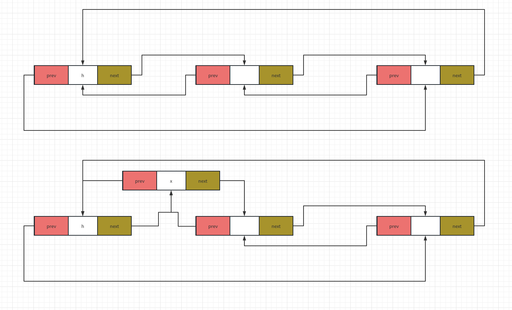
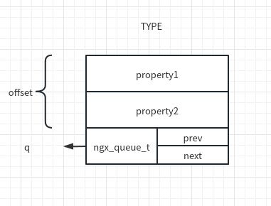
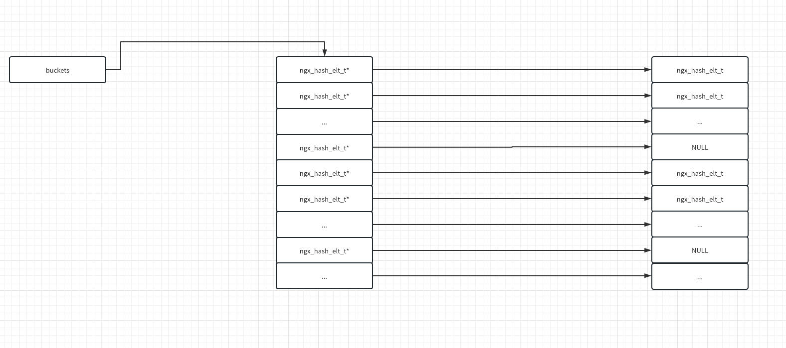
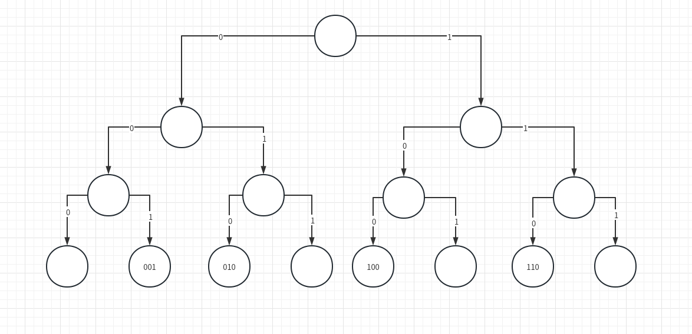

# 数据结构

nginx 对很多基本的数据类型和数据结构进行了封装。

## 字符串

C 语言原生的字符串使用 `\0` 作为结束标志，是一种非二进制安全的字符串。网络传输的字节流可能出现 `\0` 的情况，如果使用 C 语言原生的字符串，则可能出现字符串被截断的情况。因此，nginx 对字符串进行了简单封装。

```C
//src/core/ngx_string.h
typedef struct {
    size_t      len;
    u_char     *data;
} ngx_str_t;
```

可以看到，len 记录字符串长度，data 指向字符串的存储空间，这样就可以避免截断的问题。

## 数组

nginx 实现了自己的数组，其定义如下：

```C
//src/core/ngx_array.h
typedef struct {
    void        *elts; //指向实际存储的数据
    ngx_uint_t   nelts;//数据个数
    size_t       size; //单个数据的大小
    ngx_uint_t   nalloc;//已经分配的存储区域的大小
    ngx_pool_t  *pool;//存储该数组的内存池
} ngx_array_t;
```

### 创建数组

nginx 通过 `ngx_array_create` 创建数组。

```C
//src/core/ngx_array.c
/*
	p：内存池
	n：元素个数
	size：每个元素的大小
*/
ngx_array_t *
ngx_array_create(ngx_pool_t *p, ngx_uint_t n, size_t size)
{
    ngx_array_t *a;

    a = ngx_palloc(p, sizeof(ngx_array_t));//首先，从内存池上申请数组的管理结构
    if (a == NULL) {
        return NULL;
    }

    if (ngx_array_init(a, p, n, size) != NGX_OK) {//为数组开辟存储空间并初始化相应字段
        return NULL;
    }

    return a;
}
```

### 插入数据

nginx 通过 `ngx_array_push` 向数组插入数据。

```C
//src/core/ngx_array.c
/*
	a：数组
*/
void *
ngx_array_push(ngx_array_t *a)
{
    void        *elt, *new;
    size_t       size;
    ngx_pool_t  *p;

    if (a->nelts == a->nalloc) {//数组已经满了

        /* the array is full */

        size = a->size * a->nalloc;

        p = a->pool;

        if ((u_char *) a->elts + size == p->d.last
            && p->d.last + a->size <= p->d.end)//如果 a->etls 所在的页面还有足够的空间
        {
            /*
             * the array allocation is the last in the pool
             * and there is space for new allocation
             */

            p->d.last += a->size;//继续分配一个元素的空间
            a->nalloc++;

        } else {
            /* allocate a new array */

            new = ngx_palloc(p, 2 * size);//将 a 的存储空间翻倍
            if (new == NULL) {
                return NULL;
            }

            ngx_memcpy(new, a->elts, size);//将原存储空间的元素拷贝到新的空间中
            a->elts = new;
            a->nalloc *= 2;
        }
    }

    elt = (u_char *) a->elts + a->size * a->nelts;//找到插入元素所在的内存地址
    a->nelts++;//元素数量++

    return elt;
}
```

## 链表

nginx 对链表进行了封装。

```C
//src/core/ngx_list.h
//链表节点的数据结构
struct ngx_list_part_s {
    void             *elts; //指向节点数据的实际存储区域
    ngx_uint_t        nelts;//当前链表节点上已分配的数据量
    ngx_list_part_t  *next;//指向链表的下一个节点
};
//表头的数据结构
typedef struct {
    ngx_list_part_t  *last;//链表最后一个节点
    ngx_list_part_t   part;//链表第一个节点
    size_t            size;//每个数据的大小
    ngx_uint_t        nalloc;//每个节点所包含的数据个数
    ngx_pool_t       *pool;//内存池
} ngx_list_t;
```

### 创建链表

nginx 通过 `ngx_list_create` 创建链表。

```C
//src/core/ngx_list.c
/*
	pool：内存池
	n：每个节点包含的元素个数
	size：元素大小
*/
ngx_list_t *
ngx_list_create(ngx_pool_t *pool, ngx_uint_t n, size_t size)
{
    ngx_list_t  *list;

    list = ngx_palloc(pool, sizeof(ngx_list_t));//初始化链表管理结构
    if (list == NULL) {
        return NULL;
    }

    if (ngx_list_init(list, pool, n, size) != NGX_OK) {//初始化表头中的各个字段并申请第一个节点
        return NULL;
    }

    return list;
}
```

### 插入数据

nginx 通过 `ngx_list_push` 进行插入。与数组一样，nginx 在链表进行插入时，不会直接赋值到数据节点上，而是返回内存地址由用户自行操作。

```C
//src/core/ngx_list.c
/*
	l：链表
*/
void *
ngx_list_push(ngx_list_t *l)
{
    void             *elt;
    ngx_list_part_t  *last;//链表最后一个元素

    last = l->last;

    if (last->nelts == l->nalloc) {//判断 last 节点是否已满了

        /* the last part is full, allocate a new list part */

        last = ngx_palloc(l->pool, sizeof(ngx_list_part_t));//申请一个新节点的管理结构
        if (last == NULL) {
            return NULL;
        }

        last->elts = ngx_palloc(l->pool, l->nalloc * l->size);//位新节点分配存储区域
        if (last->elts == NULL) {
            return NULL;
        }

        last->nelts = 0;
        last->next = NULL;

        l->last->next = last;//新节点插入链表尾部
        l->last = last;
    }

    elt = (char *) last->elts + l->size * last->nelts;//返回地址
    last->nelts++;

    return elt;
}
```

## 队列

nginx 中的队列由包含头节点的双向循环链表实现。nginx 中的队列与 linux 内核中的队列的实现是相似的。nginx 队列的相关操作都位于 `src/core/ngx_queue.h` 中。

```C
typedef struct ngx_queue_s  ngx_queue_t;

struct ngx_queue_s {
    ngx_queue_t  *prev;
    ngx_queue_t  *next;
};
```

从定义上看，队列只有前驱节点和后继节点。

### 初始化

nginx 通过 `ngx_queue_init` 实现队列初始化。

```C
#define ngx_queue_init(q)                                                     \
    (q)->prev = q;                                                            \
    (q)->next = q
```

队列初始化时，由节点 q 的 prev 和 next 指针都指向自身，此时表示 q 是一个只有头节点的空队列。

### 插入数据

nginx 支持通过头插法和尾插法向队列中插入数据，下面是头插法。

```C
#define ngx_queue_insert_head(h, x)                                           \
    (x)->next = (h)->next;                                                    \
    (x)->next->prev = x;                                                      \
    (x)->prev = h;                                                            \
    (h)->next = x
```

插入过程比较简单，下图进行了展示



### 删除节点

nginx 通过 `ngx_queue_remove` 删除节点。

```C
#define ngx_queue_remove(x)                                                   \
    (x)->next->prev = (x)->prev;                                              \
    (x)->prev->next = (x)->next;                                              \
    (x)->prev = NULL;                                                         \
    (x)->next = NULL
```

### 获取数据

队列节点中并没有数据域。nginx 通过 `offsetof` 获取队列节点对应的数据。

```C
#define ngx_queue_data(q, type, link)                                         \
    (type *) ((u_char *) q - offsetof(type, link))
```

查看 `offsetof` 的定义

```C
///usr/lib/gcc/x86_64-linux-gnu/11/include/stddef.h
/* Offset of member MEMBER in a struct of type TYPE. */
#define offsetof(TYPE, MEMBER) __builtin_offsetof (TYPE, MEMBER)
```

注释很明确，`offsetof` 可以获取结构体 TYPE 中的成员 MEMBER 相对于 TYPE 的偏移量。nginx 在使用队列的时候，`ngx_queue_t` 都是作为结构体的一个成员出现的。在这种情况下，通过上面的宏定义，我们就可以根据节点 q 的地址，获取其所在的结构体变量的首地址了。



## 哈希表

nginx 使用开放地址法实现了哈希表。

### 数据结构

nginx 中的基本哈希表涉及以下数据结构：

```C
//src/core/ngx_hash.h
//哈希表的元素，用于存储 key-value 对
typedef struct {
    void             *value;//value，指向用户自定义元素的指针
    u_short           len;//name 的长度
    u_char            name[1];//key，柔性数组，参考 https://blog.csdn.net/weixin_60719453/article/details/120196673
} ngx_hash_elt_t;

//基本哈希表结构
typedef struct {
    ngx_hash_elt_t  **buckets;//指向哈希表的首地址，指向第一个桶
    ngx_uint_t        size;//哈希表中桶的总数
} ngx_hash_t;

//用于表示即将添加到哈希表中的元素
typedef struct {
    ngx_str_t         key;//key
    ngx_uint_t        key_hash;//哈希值
    void             *value;//value
} ngx_hash_key_t;

//哈希表初始化结构
typedef struct {
    ngx_hash_t       *hash;//指向基本哈希表
    ngx_hash_key_pt   key; //哈希函数

    ngx_uint_t        max_size;//哈希表中桶的最大个数
    ngx_uint_t        bucket_size;//每个桶的最大字节大小

    char             *name;//哈希表名称
    ngx_pool_t       *pool;//哈希表所在的内存池
    ngx_pool_t       *temp_pool;//创建哈希表时的临时内存池，创建完成后回收
} ngx_hash_init_t;
```

哈希表初始化后示例：



### 初始化

nginx 中，基本哈希表通过 `ngx_hash_init` 进行初始化。总体流程为计算桶的数量、计算哈希表的总大小、申请内存、初始化每一个哈希表元素。

```C
//src/core/ngx_hash.c
//用于计算 ngx_hash_elt_t 的真正大小并对齐到 void* 的长度
#define NGX_HASH_ELT_SIZE(name)                                               \
    (sizeof(void *) + ngx_align((name)->key.len + 2, sizeof(void *)))

/*
	hinit：哈希表初始化结构
	names：ngx_hash_key_t 数组
	nelts：names 中元素的数量
*/
ngx_int_t
ngx_hash_init(ngx_hash_init_t *hinit, ngx_hash_key_t *names, ngx_uint_t nelts)
{
    u_char          *elts;
    size_t           len;
    u_short         *test;
    ngx_uint_t       i, n, key, size, start, bucket_size;
    ngx_hash_elt_t  *elt, **buckets;

    if (hinit->max_size == 0) {
        ngx_log_error(NGX_LOG_EMERG, hinit->pool->log, 0,
                      "could not build %s, you should "
                      "increase %s_max_size: %i",
                      hinit->name, hinit->name, hinit->max_size);
        return NGX_ERROR;
    }

    if (hinit->bucket_size > 65536 - ngx_cacheline_size) {
        ngx_log_error(NGX_LOG_EMERG, hinit->pool->log, 0,
                      "could not build %s, too large "
                      "%s_bucket_size: %i",
                      hinit->name, hinit->name, hinit->bucket_size);
        return NGX_ERROR;
    }
	//检查桶的大小是否足够容纳 names 中的每一个元素
    for (n = 0; n < nelts; n++) {
        if (names[n].key.data == NULL) {
            continue;
        }
		//由于每一个桶的最后都有一个空的 void* 指针，所以需要 + sizeof(void *)
        if (hinit->bucket_size < NGX_HASH_ELT_SIZE(&names[n]) + sizeof(void *))
        {
            ngx_log_error(NGX_LOG_EMERG, hinit->pool->log, 0,
                          "could not build %s, you should "
                          "increase %s_bucket_size: %i",
                          hinit->name, hinit->name, hinit->bucket_size);
            return NGX_ERROR;
        }
    }
	//test 用于临时保存每个桶的当前大小
    test = ngx_alloc(hinit->max_size * sizeof(u_short), hinit->pool->log);
    if (test == NULL) {
        return NGX_ERROR;
    }
	//计算需要的桶的数量的下界 start：根据 ngx_hash_elt_t 结构，每个元素需要的空间要大于 2 * sizeof(void *)，每个桶可以存储的字节数为
    bucket_size = hinit->bucket_size - sizeof(void *);//bucket_size，所以每个桶至多能存放 (bucket_size / (2 * sizeof(void *))) 个元素，则需要的桶的数量最少为 nelts / (bucket_size / (2 * sizeof(void *)))

    start = nelts / (bucket_size / (2 * sizeof(void *)));
    start = start ? start : 1;

    if (hinit->max_size > 10000 && nelts && hinit->max_size / nelts < 100) {
        start = hinit->max_size - 1000;
    }

    for (size = start; size <= hinit->max_size; size++) {//从 start 开始，计算存放 netls 个元素需要多少个桶

        ngx_memzero(test, size * sizeof(u_short));

        for (n = 0; n < nelts; n++) {
            if (names[n].key.data == NULL) {
                continue;
            }

            key = names[n].key_hash % size;//根据哈希值计算桶的位置
            len = test[key] + NGX_HASH_ELT_SIZE(&names[n]);//增加 key 所在的桶的大小

#if 0
            ngx_log_error(NGX_LOG_ALERT, hinit->pool->log, 0,
                          "%ui: %ui %uz \"%V\"",
                          size, key, len, &names[n].key);
#endif

            if (len > bucket_size) {//size 个桶放不下，需要桶的数量 +1
                goto next;
            }

            test[key] = (u_short) len;//更新 key 所在的桶的当前大小
        }

        goto found;//所有元素均放入桶中，则此时的 size 就是正确的 size

    next:

        continue;
    }

    size = hinit->max_size;

    ngx_log_error(NGX_LOG_WARN, hinit->pool->log, 0,
                  "could not build optimal %s, you should increase "
                  "either %s_max_size: %i or %s_bucket_size: %i; "
                  "ignoring %s_bucket_size",
                  hinit->name, hinit->name, hinit->max_size,
                  hinit->name, hinit->bucket_size, hinit->name);
//桶的精确数量已经确定，下面开始计算 buckets 区域的总长度
found:
	//每个桶都有一个8字节的 NULL指针
    for (i = 0; i < size; i++) {
        test[i] = sizeof(void *);
    }

    for (n = 0; n < nelts; n++) {
        if (names[n].key.data == NULL) {
            continue;
        }

        key = names[n].key_hash % size;//根据哈希值计算桶的位置
        len = test[key] + NGX_HASH_ELT_SIZE(&names[n]);//增加 key 所在的桶的大小

        if (len > 65536 - ngx_cacheline_size) {
            ngx_log_error(NGX_LOG_EMERG, hinit->pool->log, 0,
                          "could not build %s, you should "
                          "increase %s_max_size: %i",
                          hinit->name, hinit->name, hinit->max_size);
            ngx_free(test);
            return NGX_ERROR;
        }

        test[key] = (u_short) len;//更新 test
    }

    len = 0;//计算所有桶的数据的总长度

    for (i = 0; i < size; i++) {
        if (test[i] == sizeof(void *)) {
            continue;
        }
		//在这里，将桶的数据长度对齐到 ngx_cacheline_size。CPU 在将数据加载到高速缓存时是一次加载一个数据块，将数据对齐到 ngx_cacheline_size 可以更好地利用高速缓存
        test[i] = (u_short) (ngx_align(test[i], ngx_cacheline_size));

        len += test[i];
    }
	//这里，桶的数量 size 和总的数据长度 len 都已经确定，可以在内存池上分配空间了
    if (hinit->hash == NULL) {//ngx_hash_wildcard_t 是通配符哈希表，其中包含 ngx_hash_t，所以这里直接申请了 ngx_hash_wildcard_t，同时申请了桶的存储区域，可以节省一次内存申请
        hinit->hash = ngx_pcalloc(hinit->pool, sizeof(ngx_hash_wildcard_t)
                                             + size * sizeof(ngx_hash_elt_t *));
        if (hinit->hash == NULL) {
            ngx_free(test);
            return NGX_ERROR;
        }

        buckets = (ngx_hash_elt_t **)//buckets 定位到桶的存储区域
                      ((u_char *) hinit->hash + sizeof(ngx_hash_wildcard_t));

    } else {
        buckets = ngx_pcalloc(hinit->pool, size * sizeof(ngx_hash_elt_t *));
        if (buckets == NULL) {
            ngx_free(test);
            return NGX_ERROR;
        }
    }

    elts = ngx_palloc(hinit->pool, len + ngx_cacheline_size);//申请桶的数据存储区域
    if (elts == NULL) {
        ngx_free(test);
        return NGX_ERROR;
    }

    elts = ngx_align_ptr(elts, ngx_cacheline_size);//将 elts 对齐到 ngx_cacheline_size

    for (i = 0; i < size; i++) {
        if (test[i] == sizeof(void *)) {
            continue;
        }

        buckets[i] = (ngx_hash_elt_t *) elts;//对每个桶的地址进行初始化
        elts += test[i];
    }

    for (i = 0; i < size; i++) {
        test[i] = 0;//清空 test
    }

    for (n = 0; n < nelts; n++) {
        if (names[n].key.data == NULL) {
            continue;
        }

        key = names[n].key_hash % size;//根据哈希值找到桶
        elt = (ngx_hash_elt_t *) ((u_char *) buckets[key] + test[key]);//桶的起始地址加上桶的当前长度得到当前的 ngx_hash_elt_t*
		//初始化 ngx_hash_elt_t 中的各个字段
        elt->value = names[n].value;
        elt->len = (u_short) names[n].key.len;

        ngx_strlow(elt->name, names[n].key.data, names[n].key.len);//拷贝 name

        test[key] = (u_short) (test[key] + NGX_HASH_ELT_SIZE(&names[n]));//更新桶的当前长度
    }

    for (i = 0; i < size; i++) {//将每个桶的结束元素设置为 NULL
        if (buckets[i] == NULL) {
            continue;
        }

        elt = (ngx_hash_elt_t *) ((u_char *) buckets[i] + test[i]);

        elt->value = NULL;//表示当前桶的结束
    }

    ngx_free(test);

    hinit->hash->buckets = buckets;
    hinit->hash->size = size;

#if 0

    for (i = 0; i < size; i++) {
        ngx_str_t   val;
        ngx_uint_t  key;

        elt = buckets[i];

        if (elt == NULL) {
            ngx_log_error(NGX_LOG_ALERT, hinit->pool->log, 0,
                          "%ui: NULL", i);
            continue;
        }

        while (elt->value) {
            val.len = elt->len;
            val.data = &elt->name[0];

            key = hinit->key(val.data, val.len);

            ngx_log_error(NGX_LOG_ALERT, hinit->pool->log, 0,
                          "%ui: %p \"%V\" %ui", i, elt, &val, key);

            elt = (ngx_hash_elt_t *) ngx_align_ptr(&elt->name[0] + elt->len,
                                                   sizeof(void *));
        }
    }

#endif

    return NGX_OK;
}
```

### 查找

nginx 通过 `ngx_hash_find` 对普通哈希表进行查找。

```C
//src/core/ngx_hash.c
/*
	hash：哈希表
	key：哈希值
	name：实际关键字地址
	len：实际关键字长度
*/
void *
ngx_hash_find(ngx_hash_t *hash, ngx_uint_t key, u_char *name, size_t len)
{
    ngx_uint_t       i;
    ngx_hash_elt_t  *elt;

#if 0
    ngx_log_error(NGX_LOG_ALERT, ngx_cycle->log, 0, "hf:\"%*s\"", len, name);
#endif

    elt = hash->buckets[key % hash->size];//根据哈希值找到对应的桶

    if (elt == NULL) {
        return NULL;
    }

    while (elt->value) {//桶的结束标记为 NULL
        if (len != (size_t) elt->len) {
            goto next;//长度不匹配则判断下一个元素
        }

        for (i = 0; i < len; i++) {
            if (name[i] != elt->name[i]) {
                goto next;//name 不匹配则判断下一个元素
            }
        }

        return elt->value;

    next:
		//获取下一个元素
        elt = (ngx_hash_elt_t *) ngx_align_ptr(&elt->name[0] + elt->len,
                                               sizeof(void *));
        continue;
    }

    return NULL;
}
```

## 基数树

基数树也是一种二叉查找树。它要求每个节点存储的必须是32位整形数据。插入节点时，先将 key 转换为32位长度的二进制数据，从左至右遇到0插入左子树，遇到1插入又子树。

```C
//src/core/ngx_radix_tree.h
typedef struct ngx_radix_node_s  ngx_radix_node_t;

//节点结构体
struct ngx_radix_node_s {
    ngx_radix_node_t  *right;//右节点
    ngx_radix_node_t  *left; //左节点
    ngx_radix_node_t  *parent;//父节点
    uintptr_t          value;//节点值
};

//基数树结构体
typedef struct {
    ngx_radix_node_t  *root;//根节点
    ngx_pool_t        *pool;//内存池
    ngx_radix_node_t  *free;//已分配但未使用的节点
    char              *start;//已分配但未使用的内存的首地址
    size_t             size;//已分配但未使用的内存的大小
} ngx_radix_tree_t;
```

### 初始化

nginx 通过 `ngx_radix_tree_create` 初始化一棵基数树。

```C
//src/core/ngx_radix_tree.c
/*
	pool：内存池
	preallocate：是否预分配节点
*/
ngx_radix_tree_t *
ngx_radix_tree_create(ngx_pool_t *pool, ngx_int_t preallocate)
{
    uint32_t           key, mask, inc;
    ngx_radix_tree_t  *tree;

    tree = ngx_palloc(pool, sizeof(ngx_radix_tree_t));//申请 ngx_radix_tree_t
    if (tree == NULL) {
        return NULL;
    }
	//初始化 ngx_radix_tree_t
    tree->pool = pool;
    tree->free = NULL;
    tree->start = NULL;
    tree->size = 0;

    tree->root = ngx_radix_alloc(tree);//申请一个基数树节点
    if (tree->root == NULL) {
        return NULL;
    }
	//初始化 root 节点
    tree->root->right = NULL;
    tree->root->left = NULL;
    tree->root->parent = NULL;
    tree->root->value = NGX_RADIX_NO_VALUE;//NGX_RADIX_NO_VALUE = (uintptr_t) -1

    if (preallocate == 0) {
        return tree;
    }

    /*
     * Preallocation of first nodes : 0, 1, 00, 01, 10, 11, 000, 001, etc.
     * increases TLB hits even if for first lookup iterations.
     * On 32-bit platforms the 7 preallocated bits takes continuous 4K,
     * 8 - 8K, 9 - 16K, etc.  On 64-bit platforms the 6 preallocated bits
     * takes continuous 4K, 7 - 8K, 8 - 16K, etc.  There is no sense to
     * to preallocate more than one page, because further preallocation
     * distributes the only bit per page.  Instead, a random insertion
     * may distribute several bits per page.
     *
     * Thus, by default we preallocate maximum
     *     6 bits on amd64 (64-bit platform and 4K pages)
     *     7 bits on i386 (32-bit platform and 4K pages)
     *     7 bits on sparc64 in 64-bit mode (8K pages)
     *     8 bits on sparc64 in 32-bit mode (8K pages)
     */

    if (preallocate == -1) {//进行预分配，确保节点都在同一页上，提高 TLB 的命中率
        switch (ngx_pagesize / sizeof(ngx_radix_node_t)) {

        /* amd64 */
        case 128:
            preallocate = 6;
            break;

        /* i386, sparc64 */
        case 256:
            preallocate = 7;
            break;

        /* sparc64 in 32-bit mode */
        default:
            preallocate = 8;
        }
    }

    mask = 0;//假如 preallocate = 7,基数树的节点总个数为 2^(preallocate+1)-1，每一层个数为 2^(7-preallocate)
    inc = 0x80000000;       //preallocate 7         6        5         4         3         2        1
						    //mask     10000000  11000000 11100000  11110000  11111000  11111100 11111110
    while (preallocate--) { //inc      10000000  01000000 00100000  00010000  00001000  00000100 00000010
							//节点个数      2         4        8         16        32        64       128
        key = 0;
        mask >>= 1;
        mask |= 0x80000000;

        do {
            if (ngx_radix32tree_insert(tree, key, mask, NGX_RADIX_NO_VALUE)
                != NGX_OK)
            {
                return NULL;
            }

            key += inc;

        } while (key);//key 溢出之后值为0,循环退出

        inc >>= 1;
    }

    return tree;
}
```

假设现在有一棵三层基数树，插入4个节点：0X20000000、0X40000000、0X80000000、0Xc0000000，插入之后的结构如下图：



### 插入

nginx 通过 `ngx_radix32tree_insert` 向基数树插入节点，通过 `ngx_radix32tree_delete` 删除节点。

```C
//src/core/ngx_radix_tree.c
/*
	tree：基树
	key：key
	mask：掩码，根据 mask 中1的个数确定节点要插入第几层
	value：value
*/
ngx_int_t
ngx_radix32tree_insert(ngx_radix_tree_t *tree, uint32_t key, uint32_t mask,
    uintptr_t value)
{
    uint32_t           bit;
    ngx_radix_node_t  *node, *next;

    bit = 0x80000000;

    node = tree->root;
    next = tree->root;

    while (bit & mask) {
        if (key & bit) {//1 向右
            next = node->right;

        } else {//0 向左
            next = node->left;
        }

        if (next == NULL) {//node 为叶子节点
            break;
        }

        bit >>= 1;

        node = next;
    }

    if (next) {//next 不为空说明 node 不是叶子节点
        if (node->value != NGX_RADIX_NO_VALUE) {//该节点已经有值则返回 NGX_BUSY
            return NGX_BUSY;
        }

        node->value = value;//赋值
        return NGX_OK;
    }

    while (bit & mask) {//node 为叶子节点，则尚未达到要插入的深度，则需要申请节点以创建完整路径
        next = ngx_radix_alloc(tree);
        if (next == NULL) {
            return NGX_ERROR;
        }

        next->right = NULL;
        next->left = NULL;
        next->parent = node;
        next->value = NGX_RADIX_NO_VALUE;

        if (key & bit) {
            node->right = next;

        } else {
            node->left = next;
        }

        bit >>= 1;
        node = next;
    }

    node->value = value;//赋值

    return NGX_OK;
}

/*
	tree：基树
	key：key
	mask：掩码，根据 mask 中1的个数确定要删除的节点在第几层
	value：value
*/
ngx_int_t
ngx_radix32tree_delete(ngx_radix_tree_t *tree, uint32_t key, uint32_t mask)
{
    uint32_t           bit;
    ngx_radix_node_t  *node;

    bit = 0x80000000;
    node = tree->root;

    while (node && (bit & mask)) {//找到要删除的节点
        if (key & bit) {
            node = node->right;

        } else {
            node = node->left;
        }

        bit >>= 1;
    }

    if (node == NULL) {//说明要删除的节点不存在
        return NGX_ERROR;
    }

    if (node->right || node->left) {//要删除的节点不是叶子节点，直接将其置为 NGX_RADIX_NO_VALUE
        if (node->value != NGX_RADIX_NO_VALUE) {
            node->value = NGX_RADIX_NO_VALUE;
            return NGX_OK;
        }

        return NGX_ERROR;
    }

    for ( ;; ) {//要删除的节点是叶子节点
        if (node->parent->right == node) {
            node->parent->right = NULL;

        } else {
            node->parent->left = NULL;
        }

        node->right = tree->free;//将该节点插入 tree 的空闲链表
        tree->free = node;
		//在这里要沿着 node 向根节点的方向进行判断，将该路径上所有删除叶子节点后变成 NGX_RADIX_NO_VALUE 状态并且没有子节点的节点全部删除
        node = node->parent;

        if (node->right || node->left) {
            break;
        }

        if (node->value != NGX_RADIX_NO_VALUE) {
            break;
        }

        if (node->parent == NULL) {
            break;
        }
    }

    return NGX_OK;
}
```
