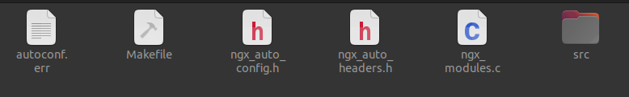

# 跨平台实现

nginx 一个广受欢迎的重要原因是其跨平台实现。为了实现这个目标，nginx 针对不同平台对信号量、锁、进程控制、共享内存等接口进行了封装。

## configure 实现

nginx 使用 autotool 工具产生 configure 文件以进安装工作。configure 文件位于源码目录的根目录下，执行 configure 之后，nginx生成了 Makefile 文件以及 objs 目录。

objs 目录下的内容如下



对 configure 文件如何生成这些目录进行分析

```shell
#!/bin/sh

# Copyright (C) Igor Sysoev
# Copyright (C) Nginx, Inc.

#与 LC_ALL 相关内容参见：https://blog.csdn.net/tongxinhaonan/article/details/64905714?utm_medium=distribute.pc_relevant.none-task-blog-2~default~baidujs_baidulandingword~default-0-64905714-blog-97917713.235^v38^pc_relevant_anti_vip_base&spm=1001.2101.3001.4242.1&utm_relevant_index=3
LC_ALL=C #去除所有本地化设置
export LC_ALL

. auto/options #解析 configure 参数，输出帮助信息
. auto/init #初始化相关文件（Makefile、ngx_modules.c 等）
. auto/sources #初始化源代码变量

test -d $NGX_OBJS || mkdir -p $NGX_OBJS #新建 objs 目录
#新建 ngx_auto_headers.h 以及 ngx_auto_config.h
echo > $NGX_AUTO_HEADERS_H
echo > $NGX_AUTOCONF_ERR
#将 configure 命令选项写入 ngx_auto_config.h
echo "#define NGX_CONFIGURE \"$NGX_CONFIGURE\"" > $NGX_AUTO_CONFIG_H


if [ $NGX_DEBUG = YES ]; then
    have=NGX_DEBUG . auto/have
fi

#开始检查系统平台
if test -z "$NGX_PLATFORM"; then
    echo "checking for OS"

    NGX_SYSTEM=`uname -s 2>/dev/null` #操作系统类型
    NGX_RELEASE=`uname -r 2>/dev/null` #内核版本
    NGX_MACHINE=`uname -m 2>/dev/null` #体系结构

    echo " + $NGX_SYSTEM $NGX_RELEASE $NGX_MACHINE"

    NGX_PLATFORM="$NGX_SYSTEM:$NGX_RELEASE:$NGX_MACHINE";

    case "$NGX_SYSTEM" in
        MINGW32_* | MINGW64_* | MSYS_*)
            NGX_PLATFORM=win32
        ;;
    esac

else
    echo "building for $NGX_PLATFORM"
    NGX_SYSTEM=$NGX_PLATFORM
fi
#编译器检查
. auto/cc/conf

if [ "$NGX_PLATFORM" != win32 ]; then
    . auto/headers #非 win32 平台上对头文件进行 inlude 测试
fi
#操作系统检查，根据 $NGX_PLATFORM 以及 $NGX_MACHINE 进行相关设置
. auto/os/conf

if [ "$NGX_PLATFORM" != win32 ]; then
    . auto/unix #非 win32 平台上针对系统相关特性进行检查（比如 I\O 多路复用）
fi

. auto/threads #检查线程池支持（用于部分 nginx 模块）
. auto/modules #生成 ngx_modules 数组
. auto/lib/conf #检查 pcre、openssl、zlib、libgd、perl等的支持
#case 语法参见： https://blog.csdn.net/wangzhicheng987/article/details/122614501
case ".$NGX_PREFIX" in
    .)
        NGX_PREFIX=${NGX_PREFIX:-/usr/local/nginx} #未指定 --prefix 选项，这默认的 prefix 路径为 /usr/local/nginx
        have=NGX_PREFIX value="\"$NGX_PREFIX/\"" . auto/define #NGX_PREFIX 的定义写入头文件 $NGX_AUTO_CONFIG_H
    ;;

    .!)
        NGX_PREFIX=
    ;;

    *)
        have=NGX_PREFIX value="\"$NGX_PREFIX/\"" . auto/define
    ;;
esac
#将各个目录的文件路径写入配置文件的头文件
if [ ".$NGX_CONF_PREFIX" != "." ]; then
    have=NGX_CONF_PREFIX value="\"$NGX_CONF_PREFIX/\"" . auto/define
fi

have=NGX_SBIN_PATH value="\"$NGX_SBIN_PATH\"" . auto/define
have=NGX_CONF_PATH value="\"$NGX_CONF_PATH\"" . auto/define
have=NGX_PID_PATH value="\"$NGX_PID_PATH\"" . auto/define
have=NGX_LOCK_PATH value="\"$NGX_LOCK_PATH\"" . auto/define
have=NGX_ERROR_LOG_PATH value="\"$NGX_ERROR_LOG_PATH\"" . auto/define

if [ ".$NGX_ERROR_LOG_PATH" = "." ]; then
    have=NGX_ERROR_LOG_STDERR . auto/have
fi

have=NGX_HTTP_LOG_PATH value="\"$NGX_HTTP_LOG_PATH\"" . auto/define
have=NGX_HTTP_CLIENT_TEMP_PATH value="\"$NGX_HTTP_CLIENT_TEMP_PATH\""
. auto/define
have=NGX_HTTP_PROXY_TEMP_PATH value="\"$NGX_HTTP_PROXY_TEMP_PATH\""
. auto/define
have=NGX_HTTP_FASTCGI_TEMP_PATH value="\"$NGX_HTTP_FASTCGI_TEMP_PATH\""
. auto/define
have=NGX_HTTP_UWSGI_TEMP_PATH value="\"$NGX_HTTP_UWSGI_TEMP_PATH\""
. auto/define
have=NGX_HTTP_SCGI_TEMP_PATH value="\"$NGX_HTTP_SCGI_TEMP_PATH\""
. auto/define
#构建 makefile 文件以及第三方依赖库
. auto/make
. auto/lib/make
. auto/install

# STUB
. auto/stubs
#添加 nginx 运行的用户以及组定义
have=NGX_USER value="\"$NGX_USER\"" . auto/define
have=NGX_GROUP value="\"$NGX_GROUP\"" . auto/define

if [ ".$NGX_BUILD" != "." ]; then
    have=NGX_BUILD value="\"$NGX_BUILD\"" . auto/define
fi
#输出模块配置信息
. auto/summary

```

configure 脚本通过 `auto/feature` 文件检测是否存在函数、宏定义、引用等。例如，在 `auto/unix` 中，利用 feature 检测是否存在 mmap 内存映射

```shell
ngx_feature="mmap(MAP_ANON|MAP_SHARED)" #特性名称
ngx_feature_name="NGX_HAVE_MAP_ANON" #特性宏定义
ngx_feature_run=yes #运行类型，取值为 yes、no、bug、value。如果设置为 yes，则将特性写入 ngx_auto_config.h 中；no 则不操作
ngx_feature_incs="#include <sys/mman.h>" #测试代码中包含的头文件，不存在则报错
ngx_feature_path= #通过编译器 -I 选型附加的目录
ngx_feature_libs= #链接时的额外选项
ngx_feature_test="void *p; #测试用的代码片段
                  p = mmap(NULL, 4096, PROT_READ|PROT_WRITE,
                           MAP_ANON|MAP_SHARED, -1, 0);
                  if (p == MAP_FAILED) return 1;"
. auto/feature
```

针对要测试的特性，设置好上述变量，然后调用 `auto/feature` 进行测试，将测试结果通过宏开关的形式写入配置文件中。

```shell

# Copyright (C) Igor Sysoev
# Copyright (C) Nginx, Inc.


echo $ngx_n "checking for $ngx_feature ...$ngx_c"

cat << END >> $NGX_AUTOCONF_ERR

----------------------------------------
checking for $ngx_feature

END

ngx_found=no
#将 ngx_feature_name 转换为大写
if test -n "$ngx_feature_name"; then
    ngx_have_feature=`echo $ngx_feature_name \
                   | tr abcdefghijklmnopqrstuvwxyz ABCDEFGHIJKLMNOPQRSTUVWXYZ`
fi
#生成编译器的 -I 选项
if test -n "$ngx_feature_path"; then
    for ngx_temp in $ngx_feature_path; do
        ngx_feature_inc_path="$ngx_feature_inc_path -I $ngx_temp"
    done
fi
#生成测试程序 $NGX_AUTOTEST.c
cat << END > $NGX_AUTOTEST.c

#include <sys/types.h>
$NGX_INCLUDE_UNISTD_H
$ngx_feature_incs

int main(void) {
    $ngx_feature_test;
    return 0;
}

END

#编译测试程序
ngx_test="$CC $CC_TEST_FLAGS $CC_AUX_FLAGS $ngx_feature_inc_path \
          -o $NGX_AUTOTEST $NGX_AUTOTEST.c $NGX_TEST_LD_OPT $ngx_feature_libs"

ngx_feature_inc_path=
#执行生成的测试程序
eval "/bin/sh -c \"$ngx_test\" >> $NGX_AUTOCONF_ERR 2>&1"

#运行测试编译结果
if [ -x $NGX_AUTOTEST ]; then

    case "$ngx_feature_run" in
#yes 表示需要运行测试程序成功，随后将该特性和宏定义1写入 ngx_auto_config.h 中，运行失败或者程序推出状态不为0时，编译连接测试通过但执行失败
        yes)
            # /bin/sh is used to intercept "Killed" or "Abort trap" messages
            if /bin/sh -c $NGX_AUTOTEST >> $NGX_AUTOCONF_ERR 2>&1; then
                echo " found"
                ngx_found=yes

                if test -n "$ngx_feature_name"; then
                    have=$ngx_have_feature . auto/have
                fi

            else
                echo " found but is not working"
            fi
        ;;
#与 yes 不同，这里会将 value 写入 ngx_auto_config.h
        value)
            # /bin/sh is used to intercept "Killed" or "Abort trap" messages
            if /bin/sh -c $NGX_AUTOTEST >> $NGX_AUTOCONF_ERR 2>&1; then
                echo " found"
                ngx_found=yes

                cat << END >> $NGX_AUTO_CONFIG_H

#ifndef $ngx_feature_name
#define $ngx_feature_name  `$NGX_AUTOTEST`
#endif

END
            else
                echo " found but is not working"
            fi
        ;;
#如果测试程序运行不成功，将该特性和宏定义1写入 ngx_auto_config.h 
        bug)
            # /bin/sh is used to intercept "Killed" or "Abort trap" messages
            if /bin/sh -c $NGX_AUTOTEST >> $NGX_AUTOCONF_ERR 2>&1; then
                echo " not found"

            else
                echo " found"
                ngx_found=yes

                if test -n "$ngx_feature_name"; then
                    have=$ngx_have_feature . auto/have
                fi
            fi
        ;;
#no 或其他情况，只要编译通过就将宏定义1写入 ngx_auto_config.h
        *)
            echo " found"
            ngx_found=yes

            if test -n "$ngx_feature_name"; then
                have=$ngx_have_feature . auto/have
            fi
        ;;

    esac

else
    echo " not found"

    echo "----------"    >> $NGX_AUTOCONF_ERR
    cat $NGX_AUTOTEST.c  >> $NGX_AUTOCONF_ERR
    echo "----------"    >> $NGX_AUTOCONF_ERR
    echo $ngx_test       >> $NGX_AUTOCONF_ERR
    echo "----------"    >> $NGX_AUTOCONF_ERR
fi

rm -rf $NGX_AUTOTEST*

```

## 原子操作和锁

nginx 针对不同平台抽象出各平台的原子操作。主要代码位于 `src/os/unix/ngx_atomic.h` 以及 `src/os/win32/ngx_atomic.h` 中。

可以看到，针对原子操作，nginx 主要定义了以下对象

```C
typedef xxx                        ngx_atomic_int_t;
typedef xxx                        ngx_atomic_uint_t;
typedef volatile ngx_atomic_uint_t  ngx_atomic_t;

#define ngx_atomic_cmp_set(lock, old, new) //比较和设置
#define ngx_atomic_fetch_add(value, add)   //原子加减
#define ngx_memory_barrier()  //内存屏障
#define ngx_cpu_pause()  //cpu 暂停

void ngx_spinlock(ngx_atomic_t *lock, ngx_atomic_int_t value, ngx_uint_t spin); //自旋锁
//互斥锁
#define ngx_trylock(lock)  (*(lock) == 0 && ngx_atomic_cmp_set(lock, 0, 1))
#define ngx_unlock(lock)    *(lock) = 0
```

在 `ngx_atomic.h` 中，通过多级的条件编译根据 configure 脚本产生的宏定义的结果选择合适的原子操作实现方式。

```C
#if (NGX_HAVE_LIBATOMIC)
...
#elif (NGX_HAVE_GCC_ATOMIC)
...
#elif (NGX_DARWIN_ATOMIC)
...
...
#endif
//最后，如果一种方式都不支持，nginx 实现了一个简单的伪原子操作
#if !(NGX_HAVE_ATOMIC_OPS)

#define NGX_HAVE_ATOMIC_OPS  0

typedef int32_t                     ngx_atomic_int_t;
typedef uint32_t                    ngx_atomic_uint_t;
typedef volatile ngx_atomic_uint_t  ngx_atomic_t;
#define NGX_ATOMIC_T_LEN            (sizeof("-2147483648") - 1)


static ngx_inline ngx_atomic_uint_t
ngx_atomic_cmp_set(ngx_atomic_t *lock, ngx_atomic_uint_t old,
    ngx_atomic_uint_t set)
{
    if (*lock == old) {
        *lock = set;
        return 1;
    }

    return 0;
}


static ngx_inline ngx_atomic_int_t
ngx_atomic_fetch_add(ngx_atomic_t *value, ngx_atomic_int_t add)
{
    ngx_atomic_int_t  old;

    old = *value;
    *value += add;

    return old;
}

#define ngx_memory_barrier()
#define ngx_cpu_pause()

#endif

void ngx_spinlock(ngx_atomic_t *lock, ngx_atomic_int_t value, ngx_uint_t spin);

#define ngx_trylock(lock)  (*(lock) == 0 && ngx_atomic_cmp_set(lock, 0, 1))
#define ngx_unlock(lock)    *(lock) = 0
```

[内存屏障](https://zhuanlan.zhihu.com/p/577590227)，也称内存栅栏，内存栅障，屏障指令等， 是一类同步屏障指令，是CPU或编译器在对内存随机访问的操作中的一个同步点，使得此点之前的所有读写操作都执行后才可以开始执行此点之后的操作。内存屏障在 nginx 中的典型应用场景是在 `ngx_times.c` 中

```C
//src/core/ngx_times.c
void
ngx_time_update(void)
{
    p1 = &cached_err_log_time[slot][0];
    p2 = &cached_http_log_time[slot][0];
    p3 = &cached_http_log_iso8601[slot][0];
    p4 = &cached_syslog_time[slot][0];
    
    ngx_memory_barrier();

    ngx_cached_time = tp;
    ngx_cached_http_time.data = p0;
    ngx_cached_err_log_time.data = p1;
    ngx_cached_http_log_time.data = p2;
    ngx_cached_http_log_iso8601.data = p3;
    ngx_cached_syslog_time.data = p4;
}
```

编译器会重新安排指令以提高缓存命中率，如果没有内存屏障，则可能的执行顺序如下

```C
 //相同变量的代码放到一起执行以提高缓存命中率
	p1 = &cached_err_log_time[slot][0];
	ngx_cached_err_log_time.data = p1;
//假如在这里，执行流程被信号中断而信号处理函数中又调用了 ngx_time_update，此时 cached_err_log_time 与 cached_http_log_time 就可能不一致
    p2 = &cached_http_log_time[slot][0];
	ngx_cached_http_log_time.data = p2;

    p3 = &cached_http_log_iso8601[slot][0];
    ngx_cached_http_log_iso8601.data = p3;

    p4 = &cached_syslog_time[slot][0];
    ngx_cached_syslog_time.data = p4;
```

`ngx_pause` 是用来优化自旋等待循环中的 CPU 的性能的，目前仅在 `__i386__ || __i386 || __amd64__ || __amd64` 体系下实现，具体可参考 https://www.felixcloutier.com/x86/pause.html

nginx 利用原子操作实现了互斥锁。如果平台支持 POSIX 信号量，nginx 会使用信号量对互斥锁进行优化。具体在《Nginx 内存管理》中进行了介绍。
