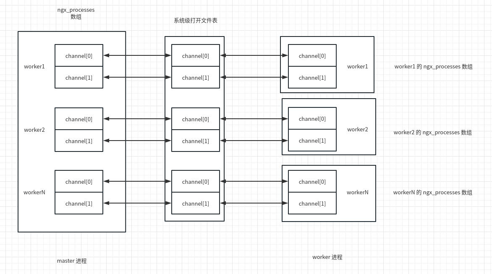
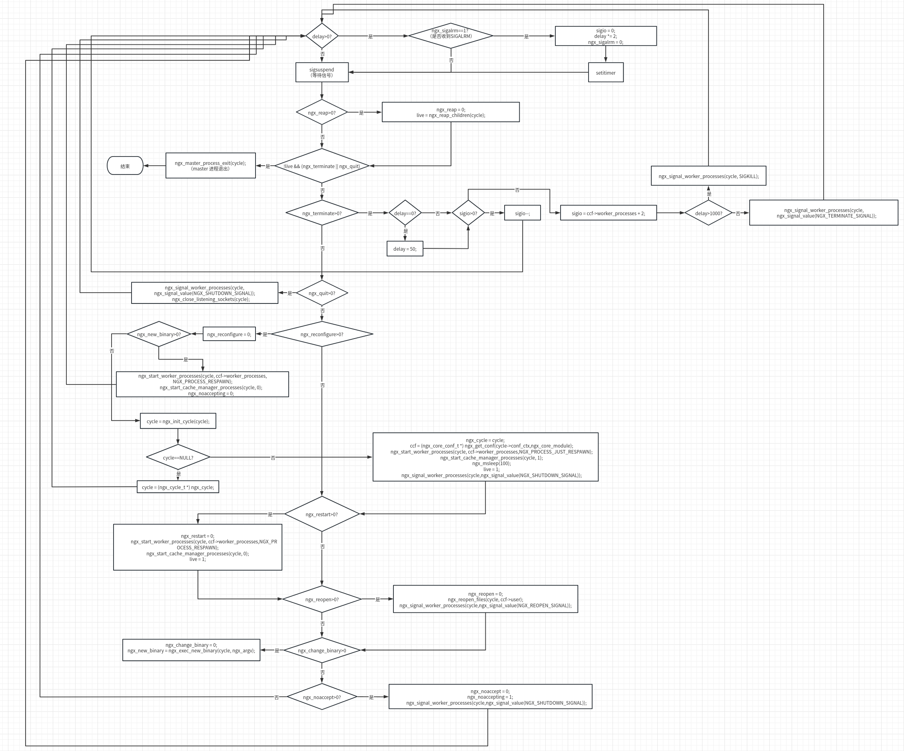

# 进程管理

nginx 在工作方式上分为单进程模式和多进程模式两种，进程运行又分为 daemon 模式和非 daemon 模式。

+ daemon 模式：守护进程模式。在 daemon 模式下 nginx 会以非交互的方式在后台运行。
+ 非 daemon  模式：在非 daemon 模式下，启动 nginx  的终端会成为 master 进程的父进程。
+ 单进程模式：只启动一个进程对外提供服务。
+ 多进程模式：分别启动一个 master 进程以及数个 worker 进程，master 进程负责管理，worker 进程对外提供服务。

配置文件中，通过指令 `daemon` 和 `master_process` 控制 nginx 的进程模式。`daemon` 为 on 代表开启守护模式，`master_process` 为 on 代表开启多进程模式。在启用多进程模式的情况下，`worker_processes` 指令可以用于指定 worker 进程的数量，默认为1。

在没有配置 `daemon` 和 `master_process` 指令时，nginx 会执行默认配置。

```C
//src/core/nginx.c
static char *
ngx_core_module_init_conf(ngx_cycle_t *cycle, void *conf)
{
    ngx_core_conf_t  *ccf = conf;

    ngx_conf_init_value(ccf->daemon, 1);//默认启用 daemon 模式
    ngx_conf_init_value(ccf->master, 1);//默认启用多进程模式
    ngx_conf_init_msec_value(ccf->timer_resolution, 0);
    ngx_conf_init_msec_value(ccf->shutdown_timeout, 0);

    ngx_conf_init_value(ccf->worker_processes, 1);//默认启动一个 worker 进程
    /*.../
}
```

nginx 在 main 函数中设置了 daemon 模式。

```C
//src/core/nginx.c +348
/*
	nginx main 函数
*/
int ngx_cdecl
main(int argc, char *const *argv)
{
    /*...*/
    if (!ngx_inherited && ccf->daemon) {//如果 ngx_inherited 等于0并且 ccf->daemon 不等于0，则进入 daemon 模式
        if (ngx_daemon(cycle->log) != NGX_OK) {
            return 1;
        }

        ngx_daemonized = 1;
    }
    /*...*/
}

//src/os/unix/ngx_daemon.c
/*
	派生子进程进入 daemon 模式
*/
ngx_int_t
ngx_daemon(ngx_log_t *log)
{
    int  fd;

    switch (fork()) {//fork 函数在父进程中返回子进程的 pid，在子进程中返回 0
    case -1:
        ngx_log_error(NGX_LOG_EMERG, log, ngx_errno, "fork() failed");
        return NGX_ERROR;

    case 0:
        break;

    default://父进程中直接退出
        exit(0);
    }
	//以下逻辑仅在子进程中执行
    ngx_parent = ngx_pid;
    ngx_pid = ngx_getpid();

    if (setsid() == -1) {//创建新的会话，子进程成为新的进程组组长
        ngx_log_error(NGX_LOG_EMERG, log, ngx_errno, "setsid() failed");
        return NGX_ERROR;
    }

    umask(0);

    fd = open("/dev/null", O_RDWR);//以下将子进程的标准输入和标准输出重定向到 /dev/null
    if (fd == -1) {
        ngx_log_error(NGX_LOG_EMERG, log, ngx_errno,
                      "open(\"/dev/null\") failed");
        return NGX_ERROR;
    }

    if (dup2(fd, STDIN_FILENO) == -1) {
        ngx_log_error(NGX_LOG_EMERG, log, ngx_errno, "dup2(STDIN) failed");
        return NGX_ERROR;
    }

    if (dup2(fd, STDOUT_FILENO) == -1) {
        ngx_log_error(NGX_LOG_EMERG, log, ngx_errno, "dup2(STDOUT) failed");
        return NGX_ERROR;
    }

#if 0
    if (dup2(fd, STDERR_FILENO) == -1) {
        ngx_log_error(NGX_LOG_EMERG, log, ngx_errno, "dup2(STDERR) failed");
        return NGX_ERROR;
    }
#endif

    if (fd > STDERR_FILENO) {
        if (close(fd) == -1) {
            ngx_log_error(NGX_LOG_EMERG, log, ngx_errno, "close() failed");
            return NGX_ERROR;
        }
    }

    return NGX_OK;
}
```

## 进程相关数据结构

首先，我们需要了解 nginx 对进程进行抽象的数据结构

```C
//src/os/unix/ngx_process.c
ngx_int_t        ngx_last_process; //ngx_processes 数组中有意义（当前有效或曾经有效）的进程，最大的下标+1（下标从0开始计算）
ngx_process_t    ngx_processes[NGX_MAX_PROCESSES]; //所有的子进程数组，NGX_MAX_PROCESSES 为1024，也就是 nginx 子进程不能超过1024个。

//src/os/unix/ngx_process.h
typedef struct {
    ngx_pid_t           pid; //进程 pid
    int                 status; //进程状态，waitpid 调用获取
    ngx_socket_t        channel[2]; //基于匿名socket的进程之间通信的管道，由 socketpair 创建，并通过 fork 由子进程继承。但一般是单向通信，channel[0] 只用来写，channel [1] 只用来读。
 
    ngx_spawn_proc_pt   proc; //子进程的循环方法，比如 worker 进程是 ngx_worker_process_cycle
    void               *data; //fork 子进程后，会执行 proc(cycle,data)
    char               *name; //进程名称
 
    unsigned            respawn:1; //为1时表示受 master 管理的子进程，死掉可以复活
    unsigned            just_spawn:1; //为1时表示刚刚新 fork 的子进程，在重新加载配置文件时，会使用到
    unsigned            detached:1; //为1时表示游离的新的子进程，一般用在升级 binary 时，会 fork 一个新的 master 子进程，这时新 master 进程是 detached 状态，不受原来的 master 进程管理
    unsigned            exiting:1; //为1时表示正在主动退出，一般收到 SIGQUIT 或 SIGTERM 信号后，会置该值为1，区别于子进程的异常被动退出
    unsigned            exited:1; //为1时表示进程已退出，并通过 waitpid 系统调用回收
} ngx_process_t;
```

## master 进程

nginx 的 main 函数中创建了 master 进程。

```C
//src/core/nginx.c +379
/*
	nginx main 函数
*/
int ngx_cdecl
main(int argc, char *const *argv)
{
    /*...*/
    if (ngx_process == NGX_PROCESS_SINGLE) {
        ngx_single_process_cycle(cycle);//单进程模式

    } else {
        ngx_master_process_cycle(cycle);//多进程模式
    }
    /*...*/
}
```

可以看到，nginx 通过 `ngx_master_process_cycle` 进入了多进程模式。

```C
//src/os/unix/ngx_process_cycle.c
/*
	总体流程：
	1.初始化信号掩码屏蔽相关信号
	2.设置进程 title
	3.调用 ngx_start_worker_processes 创建 worker 进程
	4.调用 ngx_start_cache_manager_processes 创建 cache 相关进程
	5.调用 sigsuspend 挂起进程等待信号
*/
void
ngx_master_process_cycle(ngx_cycle_t *cycle)
{
    char              *title;
    u_char            *p;
    size_t             size;
    ngx_int_t          i;
    ngx_uint_t         sigio;
    sigset_t           set;
    struct itimerval   itv;
    ngx_uint_t         live;
    ngx_msec_t         delay;
    ngx_core_conf_t   *ccf;

    sigemptyset(&set);
    sigaddset(&set, SIGCHLD);
    sigaddset(&set, SIGALRM);
    sigaddset(&set, SIGIO);
    sigaddset(&set, SIGINT);
    sigaddset(&set, ngx_signal_value(NGX_RECONFIGURE_SIGNAL));
    sigaddset(&set, ngx_signal_value(NGX_REOPEN_SIGNAL));
    sigaddset(&set, ngx_signal_value(NGX_NOACCEPT_SIGNAL));
    sigaddset(&set, ngx_signal_value(NGX_TERMINATE_SIGNAL));
    sigaddset(&set, ngx_signal_value(NGX_SHUTDOWN_SIGNAL));
    sigaddset(&set, ngx_signal_value(NGX_CHANGEBIN_SIGNAL));

    if (sigprocmask(SIG_BLOCK, &set, NULL) == -1) {//屏蔽相关信号
        ngx_log_error(NGX_LOG_ALERT, cycle->log, ngx_errno,
                      "sigprocmask() failed");
    }

    sigemptyset(&set);


    size = sizeof(master_process);

    for (i = 0; i < ngx_argc; i++) {
        size += ngx_strlen(ngx_argv[i]) + 1;
    }

    title = ngx_pnalloc(cycle->pool, size);
    if (title == NULL) {
        /* fatal */
        exit(2);
    }

    p = ngx_cpymem(title, master_process, sizeof(master_process) - 1);
    for (i = 0; i < ngx_argc; i++) {
        *p++ = ' ';
        p = ngx_cpystrn(p, (u_char *) ngx_argv[i], size);
    }

    ngx_setproctitle(title);//修改进程在 ps 中的 title，例如，master 进程显示为 nginx: master process


    ccf = (ngx_core_conf_t *) ngx_get_conf(cycle->conf_ctx, ngx_core_module);

    ngx_start_worker_processes(cycle, ccf->worker_processes, //创建 worker 进程
                               NGX_PROCESS_RESPAWN);
    ngx_start_cache_manager_processes(cycle, 0);//创建 cache 进程

    ngx_new_binary = 0;
    delay = 0;
    sigio = 0;
    live = 1;

    for ( ;; ) {
        if (delay) {
            if (ngx_sigalrm) {
                sigio = 0;
                delay *= 2;
                ngx_sigalrm = 0;
            }

            ngx_log_debug1(NGX_LOG_DEBUG_EVENT, cycle->log, 0,
                           "termination cycle: %M", delay);

            itv.it_interval.tv_sec = 0;
            itv.it_interval.tv_usec = 0;
            itv.it_value.tv_sec = delay / 1000;
            itv.it_value.tv_usec = (delay % 1000 ) * 1000;

            if (setitimer(ITIMER_REAL, &itv, NULL) == -1) {
                ngx_log_error(NGX_LOG_ALERT, cycle->log, ngx_errno,
                              "setitimer() failed");
            }
        }

        ngx_log_debug0(NGX_LOG_DEBUG_EVENT, cycle->log, 0, "sigsuspend");

        sigsuspend(&set);//挂起进程等待信号

        /*...*/
    }
}
```

## worker 进程

master 进程通过 `ngx_start_worker_processes` 函数进行了 worker 进程的创建。

```C
//src/os/unix/ngx_process_cycle.c
/*
	cycle：nginx 的运行时核心结构体
	n：worker 进程的数量
	type：进程属性标志
*/
static void
ngx_start_worker_processes(ngx_cycle_t *cycle, ngx_int_t n, ngx_int_t type)
{
    ngx_int_t  i;

    ngx_log_error(NGX_LOG_NOTICE, cycle->log, 0, "start worker processes");

    for (i = 0; i < n; i++) {

        ngx_spawn_process(cycle, ngx_worker_process_cycle,//创建子进程
                          (void *) (intptr_t) i, "worker process", type);

        ngx_pass_open_channel(cycle);//将新创建的子进程的信息广播给其他子进程
    }
}

//src/core/ngx_core.h
typedef struct ngx_cycle_s           ngx_cycle_t;

//src/core/ngx_cycle.h
struct ngx_cycle_s {
    void                  ****conf_ctx;//保存所有模块配置结构的指针
    ngx_pool_t               *pool;//用于 ngx_cycle_t 内存池
	//日志对象
    ngx_log_t                *log;
    ngx_log_t                 new_log;

    ngx_uint_t                log_use_stderr;  /* unsigned  log_use_stderr:1; */

    ngx_connection_t        **files;//文件句柄
    ngx_connection_t         *free_connections;//可用连接池
    ngx_uint_t                free_connection_n;//可用连接池中连接的总数
	//模块信息
    ngx_module_t            **modules;
    ngx_uint_t                modules_n;
    ngx_uint_t                modules_used;    /* unsigned  modules_used:1; */

    ngx_queue_t               reusable_connections_queue;
    ngx_uint_t                reusable_connections_n;
    time_t                    connections_reuse_time;

    ngx_array_t               listening;//监听的端口以及参数
    ngx_array_t               paths;//保存 nginx 所要操作的目录

    ngx_array_t               config_dump;
    ngx_rbtree_t              config_dump_rbtree;
    ngx_rbtree_node_t         config_dump_sentinel;

    ngx_list_t                open_files;//标识 nginx 已经打开的所有文件
    ngx_list_t                shared_memory;//保存共享内存的链表

    ngx_uint_t                connection_n;//进程中所有连接对象的总数
    ngx_uint_t                files_n;

    ngx_connection_t         *connections;//指向当前进程中的所有连接对象
    ngx_event_t              *read_events;//指向当前进程中的所有读事件对象
    ngx_event_t              *write_events;//指向当前进程中的所有写事件对象

    ngx_cycle_t              *old_cycle;//初始化时的临时 cycle

    ngx_str_t                 conf_file;//配置文件相对于安装目录的路径名称
    ngx_str_t                 conf_param;//处理配置文件时需要特殊处理的在命令行携带的参数，一般是 -g 选项携带的参数
    ngx_str_t                 conf_prefix;//配置文件所在目录的路径
    ngx_str_t                 prefix;//安装目录的路径
    ngx_str_t                 error_log;
    ngx_str_t                 lock_file;//用于进程间同步的文件锁
    ngx_str_t                 hostname;//主机名
};

//src/os/unix/ngx_process.h
//type 的枚举值如下
#define NGX_MAX_PROCESSES         1024//nginx 最大支持的进程数量

#define NGX_PROCESS_NORESPAWN     -1//子进程退出，父进程不会再次重启
#define NGX_PROCESS_JUST_SPAWN    -2//子进程为刚刚创建的进程，用于与老的子进程进行区分
#define NGX_PROCESS_RESPAWN       -3//子进程退出，父进程不会再次重启
#define NGX_PROCESS_JUST_RESPAWN  -4//子进程为刚刚创建的进程，用于与老的子进程进行区分，以及子进程退出后执行重启操作
#define NGX_PROCESS_DETACHED      -5//当前派生的进程与原来的父进程之间没有任何关系
```

`ngx_spawn_process` 函数中创建了 worker 进程

```C
//src/os/unix/ngx_process.c
/*
	创建 worker 进程的具体操作，proc 为创建子进程的回调函数，data 为回调函数的参数，name 为 worker 进程的名称
*/
ngx_pid_t
ngx_spawn_process(ngx_cycle_t *cycle, ngx_spawn_proc_pt proc, void *data,
    char *name, ngx_int_t respawn)
{
    u_long     on;
    ngx_pid_t  pid;
    ngx_int_t  s;

    if (respawn >= 0) {
        s = respawn;

    } else {
        for (s = 0; s < ngx_last_process; s++) {
            if (ngx_processes[s].pid == -1) {//ngx_processes 类型为 ngx_process_t 的数组，保存进程信息
                break;
            }
        }

        if (s == NGX_MAX_PROCESSES) {//nginx 创建的最大进程数量为1024
            ngx_log_error(NGX_LOG_ALERT, cycle->log, 0,
                          "no more than %d processes can be spawned",
                          NGX_MAX_PROCESSES);
            return NGX_INVALID_PID;
        }
    }


    if (respawn != NGX_PROCESS_DETACHED) {

        /* Solaris 9 still has no AF_LOCAL */

        if (socketpair(AF_UNIX, SOCK_STREAM, 0, ngx_processes[s].channel) == -1)//创建 unix 域套接字用于进程间通信
        {
            ngx_log_error(NGX_LOG_ALERT, cycle->log, ngx_errno,
                          "socketpair() failed while spawning \"%s\"", name);
            return NGX_INVALID_PID;
        }

        ngx_log_debug2(NGX_LOG_DEBUG_CORE, cycle->log, 0,
                       "channel %d:%d",
                       ngx_processes[s].channel[0],
                       ngx_processes[s].channel[1]);

        if (ngx_nonblocking(ngx_processes[s].channel[0]) == -1) {//将 socketpair 得到的套接字设置为非阻塞
            ngx_log_error(NGX_LOG_ALERT, cycle->log, ngx_errno,
                          ngx_nonblocking_n " failed while spawning \"%s\"",
                          name);
            ngx_close_channel(ngx_processes[s].channel, cycle->log);
            return NGX_INVALID_PID;
        }

        if (ngx_nonblocking(ngx_processes[s].channel[1]) == -1) {//将 socketpair 得到的套接字设置为非阻塞
            ngx_log_error(NGX_LOG_ALERT, cycle->log, ngx_errno,
                          ngx_nonblocking_n " failed while spawning \"%s\"",
                          name);
            ngx_close_channel(ngx_processes[s].channel, cycle->log);
            return NGX_INVALID_PID;
        }

        on = 1;
        if (ioctl(ngx_processes[s].channel[0], FIOASYNC, &on) == -1) {//FIOASYNC：设置信号驱动的异步I/O标志
            ngx_log_error(NGX_LOG_ALERT, cycle->log, ngx_errno,
                          "ioctl(FIOASYNC) failed while spawning \"%s\"", name);
            ngx_close_channel(ngx_processes[s].channel, cycle->log);
            return NGX_INVALID_PID;
        }

        if (fcntl(ngx_processes[s].channel[0], F_SETOWN, ngx_pid) == -1) {//用于信号驱动的异步I/O，指定接收 SIGIO 和 SIGURG 的信号的套接字属主
            ngx_log_error(NGX_LOG_ALERT, cycle->log, ngx_errno,
                          "fcntl(F_SETOWN) failed while spawning \"%s\"", name);
            ngx_close_channel(ngx_processes[s].channel, cycle->log);
            return NGX_INVALID_PID;
        }
		//在调用 exec 函数后，如果 close-on-exec 标志不为0则关闭此文件，否则不关闭。close-on-exec 默认为0，需要通过 FD_CLOEXEC 设置为非0值
        if (fcntl(ngx_processes[s].channel[0], F_SETFD, FD_CLOEXEC) == -1) {//当 master 执行 exec 后，关闭套接字
            ngx_log_error(NGX_LOG_ALERT, cycle->log, ngx_errno,
                          "fcntl(FD_CLOEXEC) failed while spawning \"%s\"",
                           name);
            ngx_close_channel(ngx_processes[s].channel, cycle->log);
            return NGX_INVALID_PID;
        }

        if (fcntl(ngx_processes[s].channel[1], F_SETFD, FD_CLOEXEC) == -1) {//当 worker 执行 exec 后，关闭套接字
            ngx_log_error(NGX_LOG_ALERT, cycle->log, ngx_errno,
                          "fcntl(FD_CLOEXEC) failed while spawning \"%s\"",
                           name);
            ngx_close_channel(ngx_processes[s].channel, cycle->log);
            return NGX_INVALID_PID;
        }

        ngx_channel = ngx_processes[s].channel[1];

    } else {//标识当前进程是新建的 master 进程，将其管道都置为-1
        ngx_processes[s].channel[0] = -1;
        ngx_processes[s].channel[1] = -1;
    }

    ngx_process_slot = s;//在 ngx_processes 中的下标


    pid = fork();//创建 worker 进程

    switch (pid) {

    case -1://出错
        ngx_log_error(NGX_LOG_ALERT, cycle->log, ngx_errno,
                      "fork() failed while spawning \"%s\"", name);
        ngx_close_channel(ngx_processes[s].channel, cycle->log);
        return NGX_INVALID_PID;

    case 0://子进程执行
        ngx_parent = ngx_pid;
        ngx_pid = ngx_getpid();
        proc(cycle, data);//调用回调函数
        break;

    default://父进程执行
        break;
    }

    ngx_log_error(NGX_LOG_NOTICE, cycle->log, 0, "start %s %P", name, pid);

    ngx_processes[s].pid = pid;//存储子进程 pid
    ngx_processes[s].exited = 0;

    if (respawn >= 0) {//如果 respawn 大于0说明是在重启子进程
        return pid;
    }
	//保存当前进程的各个属性
    ngx_processes[s].proc = proc;
    ngx_processes[s].data = data;
    ngx_processes[s].name = name;
    ngx_processes[s].exiting = 0;

    switch (respawn) {

    case NGX_PROCESS_NORESPAWN:
        ngx_processes[s].respawn = 0;
        ngx_processes[s].just_spawn = 0;
        ngx_processes[s].detached = 0;
        break;

    case NGX_PROCESS_JUST_SPAWN:
        ngx_processes[s].respawn = 0;
        ngx_processes[s].just_spawn = 1;
        ngx_processes[s].detached = 0;
        break;

    case NGX_PROCESS_RESPAWN:
        ngx_processes[s].respawn = 1;
        ngx_processes[s].just_spawn = 0;
        ngx_processes[s].detached = 0;
        break;

    case NGX_PROCESS_JUST_RESPAWN:
        ngx_processes[s].respawn = 1;
        ngx_processes[s].just_spawn = 1;
        ngx_processes[s].detached = 0;
        break;

    case NGX_PROCESS_DETACHED:
        ngx_processes[s].respawn = 0;
        ngx_processes[s].just_spawn = 0;
        ngx_processes[s].detached = 1;
        break;
    }

    if (s == ngx_last_process) {
        ngx_last_process++;
    }

    return pid;
}
```

再来看一下 `ngx_pass_open_channel` 函数

```C
//src/os/unix/ngx_process_cycle.c
/*
	创建子进程之后执行，广播刚创建的子进程的信息
*/
static void
ngx_pass_open_channel(ngx_cycle_t *cycle)
{
    ngx_int_t      i;
    ngx_channel_t  ch;

    ngx_memzero(&ch, sizeof(ngx_channel_t));

    ch.command = NGX_CMD_OPEN_CHANNEL;
    ch.pid = ngx_processes[ngx_process_slot].pid;
    ch.slot = ngx_process_slot;
    ch.fd = ngx_processes[ngx_process_slot].channel[0];

    for (i = 0; i < ngx_last_process; i++) {
		//跳过刚创建的子进程、不存在的子进程以及父进程关闭的子进程
        if (i == ngx_process_slot
            || ngx_processes[i].pid == -1
            || ngx_processes[i].channel[0] == -1)
        {
            continue;
        }

        ngx_log_debug6(NGX_LOG_DEBUG_CORE, cycle->log, 0,
                      "pass channel s:%i pid:%P fd:%d to s:%i pid:%P fd:%d",
                      ch.slot, ch.pid, ch.fd,
                      i, ngx_processes[i].pid,
                      ngx_processes[i].channel[0]);

        /* TODO: NGX_AGAIN */
		//向所有 worker 进程发送刚创建的 worker 进程的信息
        ngx_write_channel(ngx_processes[i].channel[0],
                          &ch, sizeof(ngx_channel_t), cycle->log);
    }
}
```

## 进程间通信

master 进程负责管理 worker 进程，相关管理工作是通过信号量实现的。

### 信号定义

```C
//src/os/unix/ngx_process.c
typedef struct {
    int     signo;   //需要处理的信号
    char   *signame; //信号对应的名称
    char   *name;	 //信号对应的 nginx 命令
    void  (*handler)(int signo, siginfo_t *siginfo, void *ucontext); //信号回调函数
} ngx_signal_t;

//ngx_signal_t 类型的数组
ngx_signal_t  signals[] = {
    { ngx_signal_value(NGX_RECONFIGURE_SIGNAL),
      "SIG" ngx_value(NGX_RECONFIGURE_SIGNAL),
      "reload",
      ngx_signal_handler },//SIGHUP nginx -s reload 重新加载新的配置文件

    { ngx_signal_value(NGX_REOPEN_SIGNAL),
      "SIG" ngx_value(NGX_REOPEN_SIGNAL),
      "reopen",
      ngx_signal_handler },//SIGUSR1 nginx -s reopen 重新打开文件，一般配合 mv 操作，用于日志切割

    { ngx_signal_value(NGX_NOACCEPT_SIGNAL),
      "SIG" ngx_value(NGX_NOACCEPT_SIGNAL),
      "",
      ngx_signal_handler },//SIGWINCH 平滑升级时，一般通过这个信号让旧的 worker 进程平滑退出

    { ngx_signal_value(NGX_TERMINATE_SIGNAL),
      "SIG" ngx_value(NGX_TERMINATE_SIGNAL),
      "stop",
      ngx_signal_handler },//SIGTERM nginx -s stop 强制退出

    { ngx_signal_value(NGX_SHUTDOWN_SIGNAL),
      "SIG" ngx_value(NGX_SHUTDOWN_SIGNAL),
      "quit",
      ngx_signal_handler },//SIGQUIT nginx -s quit 平滑退出

    { ngx_signal_value(NGX_CHANGEBIN_SIGNAL),
      "SIG" ngx_value(NGX_CHANGEBIN_SIGNAL),
      "",
      ngx_signal_handler },//SIGUSR2 平滑升级时，通过该信号启动新的 master 进程

    { SIGALRM, "SIGALRM", "", ngx_signal_handler },//定时器信号

    { SIGINT, "SIGINT", "", ngx_signal_handler },//强制退出

    { SIGIO, "SIGIO", "", ngx_signal_handler },//信号驱动 I/O

    { SIGCHLD, "SIGCHLD", "", ngx_signal_handler },//SIGCHLD 子进程退出

    { SIGSYS, "SIGSYS, SIG_IGN", "", NULL },//系统调用异常

    { SIGPIPE, "SIGPIPE, SIG_IGN", "", NULL },//broken pipe

    { 0, NULL, "", NULL }
};
```

### 信号注册

nginx 在 main 函数中调用了 `ngx_init_signals` 进行信号注册。

```C
//src/os/unix/ngx_process.c
/*
	进行信号注册
*/
ngx_int_t
ngx_init_signals(ngx_log_t *log)
{
    ngx_signal_t      *sig;
    struct sigaction   sa;

    for (sig = signals; sig->signo != 0; sig++) {
        ngx_memzero(&sa, sizeof(struct sigaction));

        if (sig->handler) {//如果指定了信号处理函数则设置 SA_SIGINFO，此时由 sa_sigaction 指定信号处理函数
            sa.sa_sigaction = sig->handler;
            sa.sa_flags = SA_SIGINFO;

        } else {
            sa.sa_handler = SIG_IGN;//未指定信号处理函数则忽略该信号
        }

        sigemptyset(&sa.sa_mask);//清空 sa.sa_mask
        if (sigaction(sig->signo, &sa, NULL) == -1) {//sigaction 手册：https://man7.org/linux/man-pages/man2/sigaction.2.html
#if (NGX_VALGRIND)
            ngx_log_error(NGX_LOG_ALERT, log, ngx_errno,
                          "sigaction(%s) failed, ignored", sig->signame);
#else
            ngx_log_error(NGX_LOG_EMERG, log, ngx_errno,
                          "sigaction(%s) failed", sig->signame);
            return NGX_ERROR;
#endif
        }
    }

    return NGX_OK;
}
```

### 信号处理

```C
//src/os/unix/ngx_process.c
/*
	信号处理
*/
static void
ngx_signal_handler(int signo, siginfo_t *siginfo, void *ucontext)
{
    char            *action;
    ngx_int_t        ignore;
    ngx_err_t        err;
    ngx_signal_t    *sig;

    ignore = 0;

    err = ngx_errno;

    for (sig = signals; sig->signo != 0; sig++) {
        if (sig->signo == signo) {
            break;
        }
    }

    ngx_time_sigsafe_update();

    action = "";

    switch (ngx_process) {

    case NGX_PROCESS_MASTER://master 进程在收到不同的信号之后，根据信号量设置相应的全局变量
    case NGX_PROCESS_SINGLE:
        switch (signo) {

        case ngx_signal_value(NGX_SHUTDOWN_SIGNAL)://SIGQUIT
            ngx_quit = 1;
            action = ", shutting down";
            break;

        case ngx_signal_value(NGX_TERMINATE_SIGNAL)://IGINT、SIGTERM
        case SIGINT:
            ngx_terminate = 1;
            action = ", exiting";
            break;

        case ngx_signal_value(NGX_NOACCEPT_SIGNAL)://SIGWINCH
            if (ngx_daemonized) {
                ngx_noaccept = 1;
                action = ", stop accepting connections";
            }
            break;

        case ngx_signal_value(NGX_RECONFIGURE_SIGNAL)://SIGHUP
            ngx_reconfigure = 1;
            action = ", reconfiguring";
            break;

        case ngx_signal_value(NGX_REOPEN_SIGNAL)://SIGUSR1
            ngx_reopen = 1;
            action = ", reopening logs";
            break;

        case ngx_signal_value(NGX_CHANGEBIN_SIGNAL)://SIGUSR2
            if (ngx_getppid() == ngx_parent || ngx_new_binary > 0) {

                /*
                 * Ignore the signal in the new binary if its parent is
                 * not changed, i.e. the old binary's process is still
                 * running.  Or ignore the signal in the old binary's
                 * process if the new binary's process is already running.
                 */

                action = ", ignoring";
                ignore = 1;
                break;
            }

            ngx_change_binary = 1;
            action = ", changing binary";
            break;

        case SIGALRM:
            ngx_sigalrm = 1;
            break;

        case SIGIO:
            ngx_sigio = 1;
            break;

        case SIGCHLD:
            ngx_reap = 1;
            break;
        }

        break;

    case NGX_PROCESS_WORKER://与 master 进程类似，worker 进程根据信号量设置自身的全局变量
    case NGX_PROCESS_HELPER:
        switch (signo) {

        case ngx_signal_value(NGX_NOACCEPT_SIGNAL)://SIGWINCH
            if (!ngx_daemonized) {
                break;
            }
            ngx_debug_quit = 1;
            /* fall through */
        case ngx_signal_value(NGX_SHUTDOWN_SIGNAL)://SIGQUIT
            ngx_quit = 1;
            action = ", shutting down";
            break;

        case ngx_signal_value(NGX_TERMINATE_SIGNAL)://SIGTERM
        case SIGINT:
            ngx_terminate = 1;
            action = ", exiting";
            break;

        case ngx_signal_value(NGX_REOPEN_SIGNAL)://SIGUSR1
            ngx_reopen = 1;
            action = ", reopening logs";
            break;

        case ngx_signal_value(NGX_RECONFIGURE_SIGNAL)://SIGHUP，SIGUSR2
        case ngx_signal_value(NGX_CHANGEBIN_SIGNAL):
        case SIGIO:
            action = ", ignoring";
            break;
        }

        break;
    }

    if (siginfo && siginfo->si_pid) {
        ngx_log_error(NGX_LOG_NOTICE, ngx_cycle->log, 0,
                      "signal %d (%s) received from %P%s",
                      signo, sig->signame, siginfo->si_pid, action);

    } else {
        ngx_log_error(NGX_LOG_NOTICE, ngx_cycle->log, 0,
                      "signal %d (%s) received%s",
                      signo, sig->signame, action);
    }

    if (ignore) {
        ngx_log_error(NGX_LOG_CRIT, ngx_cycle->log, 0,
                      "the changing binary signal is ignored: "
                      "you should shutdown or terminate "
                      "before either old or new binary's process");
    }

    if (signo == SIGCHLD) {//子进程回收
        ngx_process_get_status();
    }

    ngx_set_errno(err);
}
```

|  信号量  |     全局变量      |      进程      |                             说明                             |
| :------: | :---------------: | :------------: | :----------------------------------------------------------: |
|  SIGHUP  |  ngx_reconfigure  |     master     |                       重新加载配置文件                       |
| SIGUSR1  |    ngx_reopen     | master、worker |                  重新打开文件，用于日志切割                  |
| SIGWINCH |   ngx_noaccept    | master、worker | 平滑升级时，通过该信号使旧的 worker 进程退出、设置 ngx_debug_quit |
| SIGWINCH |   ngx_noaccept    |     worker     |                   设置 ngx_debug_quit 变量                   |
| SIGTERM  |   ngx_terminate   | master、worker |                           强制退出                           |
| SIGQUIT  |     ngx_quit      | master、worker |                           平滑退出                           |
| SIGUSR2  | ngx_change_binary |     master     |          平滑升级时，通过该信号启动新的 master 进程          |
| SIGALARM |     ngx_alarm     |     master     |                          定时器信号                          |
|  SIGINT  |   ngx_terminate   | master、worker |                           强制退出                           |
|  SIGIO   |     ngx_sigio     |     master     |                         信号驱动 I/O                         |
| SIGCHLD  |     ngx_reap      |     master     |                          子进程退出                          |

master 进程在收到 SIGCHLD 信号后会进行子进程的回收

```C
//src/os/unix/ngx_process.c
/*
	回收子进程，避免僵尸进程
*/
static void
ngx_process_get_status(void)
{
    int              status;
    char            *process;
    ngx_pid_t        pid;
    ngx_err_t        err;
    ngx_int_t        i;
    ngx_uint_t       one;

    one = 0;

    for ( ;; ) {
        pid = waitpid(-1, &status, WNOHANG);//waitpid：https://man7.org/linux/man-pages/man3/wait.3p.html

        if (pid == 0) {//在指定 WNOHANG 的情况下返回0,说明子进程还未改变状态
            return;
        }

        if (pid == -1) {//出错
            err = ngx_errno;

            if (err == NGX_EINTR) {//waitpid 被 SIGINT 中断
                continue;
            }

            if (err == NGX_ECHILD && one) {
                return;
            }

            /*
             * Solaris always calls the signal handler for each exited process
             * despite waitpid() may be already called for thi终端s process.
             *
             * When several processes exit at the same time FreeBSD may
             * erroneously call the signal handler for exited process
             * despite waitpid() may be already called for this process.
             */

            if (err == NGX_ECHILD) {
                ngx_log_error(NGX_LOG_INFO, ngx_cycle->log, err,
                              "waitpid() failed");
                return;
            }

            ngx_log_error(NGX_LOG_ALERT, ngx_cycle->log, err,
                          "waitpid() failed");
            return;
        }


        one = 1;
        process = "unknown process";

        for (i = 0; i < ngx_last_process; i++) {//找到退出的子进程并记录其状态
            if (ngx_processes[i].pid == pid) {
                ngx_processes[i].status = status;
                ngx_processes[i].exited = 1;//被父进程回收
                process = ngx_processes[i].name;
                break;
            }
        }

        if (WTERMSIG(status)) {
#ifdef WCOREDUMP
            ngx_log_error(NGX_LOG_ALERT, ngx_cycle->log, 0,
                          "%s %P exited on signal %d%s",
                          process, pid, WTERMSIG(status),
                          WCOREDUMP(status) ? " (core dumped)" : "");
#else
            ngx_log_error(NGX_LOG_ALERT, ngx_cycle->log, 0,
                          "%s %P exited on signal %d",
                          process, pid, WTERMSIG(status));
#endif

        } else {
            ngx_log_error(NGX_LOG_NOTICE, ngx_cycle->log, 0,
                          "%s %P exited with code %d",
                          process, pid, WEXITSTATUS(status));
        }

        if (WEXITSTATUS(status) == 2 && ngx_processes[i].respawn) {//宏定义 WEXITSTATUS 获取子进程的退出状态，子进程在调用ngx_worker_process_init 进行初始化的过程中，如果出错的话会执行 exit(2)
            ngx_log_error(NGX_LOG_ALERT, ngx_cycle->log, 0,
                          "%s %P exited with fatal code %d "
                          "and cannot be respawned",
                          process, pid, WEXITSTATUS(status));
            ngx_processes[i].respawn = 0;//这里将 respawn 置为0是因为子进程是在初始化过程中出错导致结束，此时不能再将子进程重新拉起
        }

        ngx_unlock_mutexes(pid);
    }
}
```

### worker 进程的信号处理机制

worker 进程通过 `ngx_worker_process_cycle` 中的主循环对信号进行处理。

```C
//src/os/unix/ngx_process_cycle.c
/*
	worker 进程的
*/
static void
ngx_worker_process_cycle(ngx_cycle_t *cycle, void *data)
{
    ngx_int_t worker = (intptr_t) data;

    ngx_process = NGX_PROCESS_WORKER;
    ngx_worker = worker;

    ngx_worker_process_init(cycle, worker);

    ngx_setproctitle("worker process");

    for ( ;; ) {

        if (ngx_exiting) {
            if (ngx_event_no_timers_left() == NGX_OK) {
                ngx_log_error(NGX_LOG_NOTICE, cycle->log, 0, "exiting");
                ngx_worker_process_exit(cycle);
            }
        }

        ngx_log_debug0(NGX_LOG_DEBUG_EVENT, cycle->log, 0, "worker cycle");

        ngx_process_events_and_timers(cycle);

        if (ngx_terminate) {//接收到强制退出信号
            ngx_log_error(NGX_LOG_NOTICE, cycle->log, 0, "exiting");
            ngx_worker_process_exit(cycle);
        }

        if (ngx_quit) {//接收到平滑退出信号
            ngx_quit = 0;
            ngx_log_error(NGX_LOG_NOTICE, cycle->log, 0,
                          "gracefully shutting down");
            ngx_setproctitle("worker process is shutting down");

            if (!ngx_exiting) {//进行相关清理动作
                ngx_exiting = 1;
                ngx_set_shutdown_timer(cycle);
                ngx_close_listening_sockets(cycle);
                ngx_close_idle_connections(cycle);
                ngx_event_process_posted(cycle, &ngx_posted_events);
            }
        }

        if (ngx_reopen) {//重新打开 log
            ngx_reopen = 0;
            ngx_log_error(NGX_LOG_NOTICE, cycle->log, 0, "reopening logs");
            ngx_reopen_files(cycle, -1);
        }
    }
}
```

### master 进程与 worker 进程的通信机制

nginx 采用了多种进程之间的通信方式，socket channel 是其中之一。目前，这种方式主要用于 master 进程向 worker 进程广播消息，包括以下5种：

```C
//src/os/unix/ngx_process_cycle.h
#define NGX_CMD_OPEN_CHANNEL   1 //新建或发布一个通信管道
#define NGX_CMD_CLOSE_CHANNEL  2//关闭一个通信管道
#define NGX_CMD_QUIT           3//平滑退出
#define NGX_CMD_TERMINATE      4//强制退出
#define NGX_CMD_REOPEN         5//重新打开文件
```

根据之前对 worker 进程创建过程的分析可知，在 fork 之前，master 进程会在 ngx_processes 数组中找到一个空闲的位置s，然后调用 socketpair 创建一对匿名的 socket，将这对匿名的 socket 存放在 ngx_processes[s] 的 channel 中，然后 fork。由于 fork 的特性，子进程会继承这对 socket。此时，master 进程向 channel[0] 写入数据，worker 进程就可以从 channel[1] 读取数据，反之亦然。



在后续的初始化过程中，子进程关闭了 channel[0]，并将 channel[1] 添加到 nginx 高效的事件框架中，最终实现了 master 进程向子进程的消息同步。

除了 master 进程向子进程发送消息以外，nginx 还通过[进程间传递文件描述符](https://pureage.info/2015/03/19/passing-file-descriptors.html)的技术提供了子进程之间互相通信的机制。

### master 进程的信号处理机制

master 进程在 `ngx_master_process_cycle` 中调用了 `sigsuspend` 以等待信号的到来，并根据相应的全局变量进行进一步处理。

`ngx_master_process_cycle` 中代码执行逻辑如下图



```C
//src/os/unix/ngx_process_cycle.c
/*
	总体流程：
	1.初始化信号掩码屏蔽相关信号
	2.设置进程 title
	3.调用 ngx_start_worker_processes 创建 worker 进程
	4.调用 ngx_start_cache_manager_processes 创建 cache 相关进程
	5.调用 sigsuspend 挂起进程等待信号
*/
void
ngx_master_process_cycle(ngx_cycle_t *cycle)
{
    /*...*/
    for ( ;; ) {
        if (delay) {//delay 标示等待子进程退出的时间，单位为毫秒
            if (ngx_sigalrm) {
                sigio = 0;
                delay *= 2;
                ngx_sigalrm = 0;
            }

            ngx_log_debug1(NGX_LOG_DEBUG_EVENT, cycle->log, 0,
                           "termination cycle: %M", delay);

            itv.it_interval.tv_sec = 0;
            itv.it_interval.tv_usec = 0;
            itv.it_value.tv_sec = delay / 1000;
            itv.it_value.tv_usec = (delay % 1000 ) * 1000;

            if (setitimer(ITIMER_REAL, &itv, NULL) == -1) {//设定定时器，ITIMER_REAL 方式为到期发送 SIGALRM
                ngx_log_error(NGX_LOG_ALERT, cycle->log, ngx_errno,
                              "setitimer() failed");
            }
        }

        ngx_log_debug0(NGX_LOG_DEBUG_EVENT, cycle->log, 0, "sigsuspend");

        sigsuspend(&set);//进程挂起，等待信号

        ngx_time_update();

        ngx_log_debug1(NGX_LOG_DEBUG_EVENT, cycle->log, 0,
                       "wake up, sigio %i", sigio);

        if (ngx_reap) {//收到 SIGCHLD 表明有子进程退出
            ngx_reap = 0;
            ngx_log_debug0(NGX_LOG_DEBUG_EVENT, cycle->log, 0, "reap children");

            live = ngx_reap_children(cycle);//检查所有子进程并对结束的子进程进行后续处理，返回 live 表示是否有子进程存活
        }

        if (!live && (ngx_terminate || ngx_quit)) {
            ngx_master_process_exit(cycle);//master 进程退出
        }

        if (ngx_terminate) {//触发子进程强制退出（SIGTERM、SIGINT 信号处理）
            if (delay == 0) {
                delay = 50;
            }

            if (sigio) {
                sigio--;
                continue;
            }

            sigio = ccf->worker_processes + 2 /* cache processes */;

            if (delay > 1000) {
                ngx_signal_worker_processes(cycle, SIGKILL);//超过1000ms还有未结束的子进程则发送 SIGKILL
            } else {
                ngx_signal_worker_processes(cycle,
                                       ngx_signal_value(NGX_TERMINATE_SIGNAL));//向子进程发送 SIGTERM
            }

            continue;
        }

        if (ngx_quit) {//收到 SIGQUI 信号，触发子进程平滑退出
            ngx_signal_worker_processes(cycle,//向 worker 进程发送 SIGQUIT 信号
                                        ngx_signal_value(NGX_SHUTDOWN_SIGNAL));
            ngx_close_listening_sockets(cycle);//关闭监听的套接字

            continue;
        }

        if (ngx_reconfigure) {//收到 SIGHUP 信号，重新加载新的配置文件
            ngx_reconfigure = 0;

            if (ngx_new_binary) {
                ngx_start_worker_processes(cycle, ccf->worker_processes,
                                           NGX_PROCESS_RESPAWN);
                ngx_start_cache_manager_processes(cycle, 0);
                ngx_noaccepting = 0;

                continue;
            }

            ngx_log_error(NGX_LOG_NOTICE, cycle->log, 0, "reconfiguring");

            cycle = ngx_init_cycle(cycle);//构造新的 cycle
            if (cycle == NULL) {
                cycle = (ngx_cycle_t *) ngx_cycle;
                continue;
            }

            ngx_cycle = cycle;
            ccf = (ngx_core_conf_t *) ngx_get_conf(cycle->conf_ctx,
                                                   ngx_core_module);
            ngx_start_worker_processes(cycle, ccf->worker_processes,//fork 新的 worker 进程
                                       NGX_PROCESS_JUST_RESPAWN);
            ngx_start_cache_manager_processes(cycle, 1);

            /* allow new processes to start */
            ngx_msleep(100);

            live = 1;
            ngx_signal_worker_processes(cycle,//旧的 worker 进程退出
                                        ngx_signal_value(NGX_SHUTDOWN_SIGNAL));
        }

        if (ngx_restart) {//启动新的子进程
            ngx_restart = 0;
            ngx_start_worker_processes(cycle, ccf->worker_processes,
                                       NGX_PROCESS_RESPAWN);
            ngx_start_cache_manager_processes(cycle, 0);
            live = 1;
        }

        if (ngx_reopen) {//收到 SIGUSR1 信号，重新打开文件
            ngx_reopen = 0;
            ngx_log_error(NGX_LOG_NOTICE, cycle->log, 0, "reopening logs");
            ngx_reopen_files(cycle, ccf->user);
            ngx_signal_worker_processes(cycle,//向所有子进程发送 SIGUSR1
                                        ngx_signal_value(NGX_REOPEN_SIGNAL));
        }

        if (ngx_change_binary) {//平滑升级 nginx 服务
            ngx_change_binary = 0;
            ngx_log_error(NGX_LOG_NOTICE, cycle->log, 0, "changing binary");
            ngx_new_binary = ngx_exec_new_binary(cycle, ngx_argv);//启动新版本的 master 进程
        }

        if (ngx_noaccept) {
            ngx_noaccept = 0;
            ngx_noaccepting = 1;
            ngx_signal_worker_processes(cycle,//子进程平滑退出
                                        ngx_signal_value(NGX_SHUTDOWN_SIGNAL));
        }
    }
}
```

#### 进程退出

当 master 进程收到 SIGCHLD 信号后，会将 ngx_reap 置为1并检查子进程状态，`ngx_reap_children` 是 nginx 进程回收的关键函数。

nginx 中的进程退出包含多种场景：

1. worker 进程异常退出
2. 通过 nginx -s stop 或者 nginx -s quit 使全部进程退出
3. 通过 SIGINT，SIGTERM，SIGQUIT 使进程全部退出
4. binary 升级期间，新的 master 进程异常退出

nginx 在 `ngx_reap_children` 中对上述场景进行了处理。

```C
//src/os/unix/ngx_process_cycle.c
/*
	回收子进程并进行相应处理
*/
static ngx_uint_t
ngx_reap_children(ngx_cycle_t *cycle)
{
    ngx_int_t         i, n;
    ngx_uint_t        live;
    ngx_channel_t     ch;
    ngx_core_conf_t  *ccf;

    ngx_memzero(&ch, sizeof(ngx_channel_t));

    ch.command = NGX_CMD_CLOSE_CHANNEL;
    ch.fd = -1;

    live = 0;
    for (i = 0; i < ngx_last_process; i++) {

        ngx_log_debug7(NGX_LOG_DEBUG_EVENT, cycle->log, 0,
                       "child: %i %P e:%d t:%d d:%d r:%d j:%d",
                       i,
                       ngx_processes[i].pid,
                       ngx_processes[i].exiting,
                       ngx_processes[i].exited,
                       ngx_processes[i].detached,
                       ngx_processes[i].respawn,
                       ngx_processes[i].just_spawn);

        if (ngx_processes[i].pid == -1) {
            continue;
        }

        if (ngx_processes[i].exited) {//exited 表示子进程已经退出并且被 master 进程回收

            if (!ngx_processes[i].detached) {//子进程不是 detach 进程
                ngx_close_channel(ngx_processes[i].channel, cycle->log);

                ngx_processes[i].channel[0] = -1;
                ngx_processes[i].channel[1] = -1;

                ch.pid = ngx_processes[i].pid;
                ch.slot = i;

                for (n = 0; n < ngx_last_process; n++) {//向所有子进程广播 NGX_CMD_CLOSE_CHANNEL
                    if (ngx_processes[n].exited
                        || ngx_processes[n].pid == -1
                        || ngx_processes[n].channel[0] == -1)
                    {
                        continue;
                    }

                    ngx_log_debug3(NGX_LOG_DEBUG_CORE, cycle->log, 0,
                                   "pass close channel s:%i pid:%P to:%P",
                                   ch.slot, ch.pid, ngx_processes[n].pid);

                    /* TODO: NGX_AGAIN */

                    ngx_write_channel(ngx_processes[n].channel[0],
                                      &ch, sizeof(ngx_channel_t), cycle->log);
                }
            }

            if (ngx_processes[i].respawn
                && !ngx_processes[i].exiting
                && !ngx_terminate
                && !ngx_quit)//进程需要重启并且不是主动退出并且没有收到退出信号，这里对应的是子进程异常退出
            {
                if (ngx_spawn_process(cycle, ngx_processes[i].proc,
                                      ngx_processes[i].data,
                                      ngx_processes[i].name, i)//重启子进程
                    == NGX_INVALID_PID)
                {
                    ngx_log_error(NGX_LOG_ALERT, cycle->log, 0,
                                  "could not respawn %s",
                                  ngx_processes[i].name);
                    continue;
                }


                ngx_pass_open_channel(cycle);//广播子进程重启事件

                live = 1;

                continue;
            }

            if (ngx_processes[i].pid == ngx_new_binary) {//退出的子进程是新的 master 进程

                ccf = (ngx_core_conf_t *) ngx_get_conf(cycle->conf_ctx,
                                                       ngx_core_module);

                if (ngx_rename_file((char *) ccf->oldpid.data,
                                    (char *) ccf->pid.data)//恢复使用旧的 pid 文件
                    == NGX_FILE_ERROR)
                {
                    ngx_log_error(NGX_LOG_ALERT, cycle->log, ngx_errno,
                                  ngx_rename_file_n " %s back to %s failed "
                                  "after the new binary process \"%s\" exited",
                                  ccf->oldpid.data, ccf->pid.data, ngx_argv[0]);
                }

                ngx_new_binary = 0;//新的 master 进程已经退出，重置 ngx_new_binary
                if (ngx_noaccepting) {//ngx_noaccepting 为1说明旧的 worker 进程已经退出，需要重启 worker 进程
                    ngx_restart = 1;//主循环中检测到 ngx_restart 之后会重启 worker 进程
                    ngx_noaccepting = 0;
                }
            }

            if (i == ngx_last_process - 1) {
                ngx_last_process--;

            } else {
                ngx_processes[i].pid = -1;
            }

        } else if (ngx_processes[i].exiting || !ngx_processes[i].detached) {
            live = 1;//存在正常工作的 worker 进程，将 live 置为1
        }
    }

    return live;
}
```

当 master 进程收到 SIGTERM 或者 SIGQUIT 信号时，会设置 ngx_terminate 或 ngx_quit 并通过 channel 向所有子进程广播 NGX_CMD_TERMINATE 或 NGX_CMD_QUIT，子进程通过事件框架收到相应信号后会设置自身的全局变量 ngx_terminate 或 ngx_quit 并执行相应的退出动作。在这个过程中，子进程的退出可能无法被一次 waitpid 全部收集，需要等到下一次循环才能收集到，为了避免给同一个子进程重复发送退出指令，nginx 采取了以下措施：

+ ngx_quit：一旦给某个子进程发送了 NGX_CMD_QUIT 指令，master 进程会将其 exiting 置为1，当下次发送 NGX_CMD_QUIT 指令时就会忽略该子进程

  ```C
  //src/os/unix/ngx_process_cycle.c
  //ngx_master_process_cycle
  //+203
          if (ngx_quit) {
              ngx_signal_worker_processes(cycle,
                                          ngx_signal_value(NGX_SHUTDOWN_SIGNAL));
              ngx_close_listening_sockets(cycle);
  
              continue;
          }
  
  //src/os/unix/ngx_process_cycle.c
  //ngx_signal_worker_processes
  //+501
                  if (signo != ngx_signal_value(NGX_REOPEN_SIGNAL)) {
                      ngx_processes[i].exiting = 1;//signo 不等于 ngx_signal_value(NGX_REOPEN_SIGNAL)，则将 exiting 设置为1
                  }
  //+490
          if (ngx_processes[i].exiting//如果 exiting 等于1且发送的是 ngx_signal_value(NGX_SHUTDOWN_SIGNAL) 命令（NGX_CMD_QUIT）则不处理
              && signo == ngx_signal_value(NGX_SHUTDOWN_SIGNAL))
          {
              continue;
          }
  ```

+ ngx_terminate：通过变量 sigio 来避免这个问题。在第一次向子进程广播 NGX_CMD_TERMINATE 指令之前，sigio 会被设置为 worker 进程数加2（2个 cache 进程），之后每收到一次信号，sigio 减1，直到 sigio 减为0之后才会再次给子进程发送指令。sigio 大于0期间，master 进程不会给子进程发送指令

  ```C
  //src/os/unix/ngx_process_cycle.c
  //ngx_master_process_cycle
  //+186
              if (sigio) {
                  sigio--;
                  continue;
              }
  
              sigio = ccf->worker_processes + 2 /* cache processes */;
  ```

nginx 通过超时机制实现对子进程退出过程的超时控制。nginx 在第一次处理 ngx_terminate 时，会将 delay 从0改为50。之后会设置一个 delay 毫秒的定时器，该定时器会在超时之后向 master 进程自身发送 SIGALRM 信号。在收到 SIGALRM，nginx 会将 delay 翻倍并重设定时器。如果 delay 超过 1000 并且此时仍然有子进程没有退出，那么 nginx 会向这些子进程发送 SIGKILL 将其杀死。

```C
//src/os/unix/ngx_process_cycle.c
//ngx_master_process_cycle
    for ( ;; ) {
        if (delay) {
            if (ngx_sigalrm) {
                sigio = 0;
                delay *= 2;
                ngx_sigalrm = 0;
            }

            ngx_log_debug1(NGX_LOG_DEBUG_EVENT, cycle->log, 0,
                           "termination cycle: %M", delay);

            itv.it_interval.tv_sec = 0;
            itv.it_interval.tv_usec = 0;
            itv.it_value.tv_sec = delay / 1000;
            itv.it_value.tv_usec = (delay % 1000 ) * 1000;

            if (setitimer(ITIMER_REAL, &itv, NULL) == -1) {//设定定时器
                ngx_log_error(NGX_LOG_ALERT, cycle->log, ngx_errno,
                              "setitimer() failed");
            }
        }
        
        /*...*/
        
        
        if (ngx_terminate) {
            if (delay == 0) {
                delay = 50;
            }

            if (sigio) {
                sigio--;
                continue;
            }

            sigio = ccf->worker_processes + 2 /* cache processes */;

            if (delay > 1000) {//超时，发送 SIGKILL
                ngx_signal_worker_processes(cycle, SIGKILL);
            } else {
                ngx_signal_worker_processes(cycle,
                                       ngx_signal_value(NGX_TERMINATE_SIGNAL));
            }

            continue;
        }
    }
```

#### 重新加载配置文件

nginx 支持在不停服务的情况下重新加载配置文件并生效。通过 nginx -s reload 向 master 进程发送 SIGHUP 信号，信号处理函数会置 ngx_reconfigure 为1。

当主循环检测到 ngx_reconfigure 为1时会调用 `ngx_init_cycle` 生成一个新的 cycle 对象从而加载新的配置文件，启动新的 worker 进程，休眠 100ms，将 live 置为1。最后，通过 channel 向旧的 worker进程发送 NGX_CMD_QUIT 使其优雅退出。

可以看到，nginx 通过新旧进程替换的方式完成了配置文件的重新加载。这里有一个问题，master 进程在结束子进程时，如何区分新旧子进程。区别在于调用 `ngx_start_worker_processes` 时传递的参数。

```C
//创建子进程时
    ngx_start_worker_processes(cycle, ccf->worker_processes,
                               NGX_PROCESS_RESPAWN);
//重新加载配置文件时
            ngx_start_worker_processes(cycle, ccf->worker_processes,
                                       NGX_PROCESS_JUST_RESPAWN);

//ngx_start_worker_processes 调用了 ngx_spawn_process
    case NGX_PROCESS_RESPAWN:
        ngx_processes[s].respawn = 1;
        ngx_processes[s].just_spawn = 0;
        ngx_processes[s].detached = 0;
        break;

    case NGX_PROCESS_JUST_RESPAWN:
        ngx_processes[s].respawn = 1;
        ngx_processes[s].just_spawn = 1;
        ngx_processes[s].detached = 0;
        break;

//ngx_signal_worker_processes
        if (ngx_processes[i].just_spawn) {
            ngx_processes[i].just_spawn = 0;
            continue;
        }
```

重新加载配置文件时传递的参数为 NGX_PROCESS_JUST_RESPAWN。根据 `ngx_spawn_process` 的源码可知，此时子进程的 just_spawn 和 respawn 均会被置为1，而旧的子进程仅 respawn 被置为1。结合 `ngx_signal_worker_processes` 的代码，在向子进程发送命令时，如果子进程的 just_spawn 为1，就会跳过发送命令的过程并将 just_spawn 置为0，这样就可以避免杀死新的 worker 进程并且在下一次 reload 时正确处理本次新生成的 worker 进程。

在重新加载配置文件的逻辑中，还有一个 ngx_new_binary 为真的逻辑。ngx_new_binary 是 binary 升级时新的 master 进程的 pid，走到这个分支说明旧的 master 进程收到的是人工触发的 SIGHUP 信号（通过 kill），这可能是升级失败后的回滚操作，所以没有重新加载配置文件而是直接拉起了新的子进程。

#### binary 升级

nginx 支持不停机的情况下进行平滑升级，一般操作步骤是：

1. 向旧的 master 进程发送 SIGUSR2 信号，产生新的 master 进程和 worker 进程
2. 向旧的 worker 进程发送 SIGWINCH 信号，此时旧的 worker 进程全部退出
3. 向旧的 master 进程发送 SIGQUIT 信号，使其退出

SIGUSR2 信号对应的全局变量是 ngx_change_binary，主循环中检测到 ngx_change_binary 为1之后，会调用 `ngx_exec_new_binary` 创建新的 master 进程，并将新 master 进程的 pid 保存到 ngx_new_binary 中。

```C
//src/os/unix/ngx_process_cycle.c
//ngx_master_process_cycle
//+262
        if (ngx_change_binary) {
            ngx_change_binary = 0;
            ngx_log_error(NGX_LOG_NOTICE, cycle->log, 0, "changing binary");
            ngx_new_binary = ngx_exec_new_binary(cycle, ngx_argv);
        }
```

在新建 master 进程的时候存在一个问题，即旧的 master 进程仍然存在，对于旧的 master 进程已经监听的端口，如果新的 master 进程进行 bind 操作，会由于端口以被占用而报错，nginx 利用 exec 函数的特性解决了这个问题。exec 在进行程序替换的时候，对于进程创建的 fd，在替换之后仍然是有效的（除非 fd 设置了 FD_CLOEXEC）。旧的 master 进程通过构造一个特殊的环境变量 NGINX 将旧的 master 进程中监听的 fd 的信息传递给了新的 master 进程，这样，新的 master 进程仍然可以使用这些 fd。

`ngx_exec_new_binary` 的具体实现如下

~~~~C
//src/os/unix/ngx_process.h
typedef struct {
    char         *path;//binary 路径
    char         *name;//新的 master 进程的名词
    char *const  *argv;//命令行参数
    char *const  *envp;//环境变量
} ngx_exec_ctx_t;

//src/core/nginx.c
/*
	新建 master 进程
*/
ngx_pid_t
ngx_exec_new_binary(ngx_cycle_t *cycle, char *const *argv)
{
    char             **env, *var;
    u_char            *p;
    ngx_uint_t         i, n;
    ngx_pid_t          pid;
    ngx_exec_ctx_t     ctx;
    ngx_core_conf_t   *ccf;
    ngx_listening_t   *ls;

    ngx_memzero(&ctx, sizeof(ngx_exec_ctx_t));

    ctx.path = argv[0];//nginx 的完整执行路径，比如 /home/nginx/bin/nginx
    ctx.name = "new binary process";
    ctx.argv = argv;
	//下面是对环境变量的处理，新的 master 进程除了要继承原有的环境变量以外，还要继承一个特殊构造的环境变量 NGINX
    n = 2;
    env = ngx_set_environment(cycle, &n);
    if (env == NULL) {
        return NGX_INVALID_PID;
    }

    var = ngx_alloc(sizeof(NGINX_VAR)//var 用于保存待构造的环境变量 NGINX
                    + cycle->listening.nelts * (NGX_INT32_LEN + 1) + 2,
                    cycle->log);
    if (var == NULL) {
        ngx_free(env);
        return NGX_INVALID_PID;
    }

    p = ngx_cpymem(var, NGINX_VAR "=", sizeof(NGINX_VAR));//构造 NGINX=

    ls = cycle->listening.elts;
    for (i = 0; i < cycle->listening.nelts; i++) {//cycle->listening 中保存的是用于监听的 fd 
        p = ngx_sprintf(p, "%ud;", ls[i].fd);
    }//最终构造的环境变量类似于：NGINX=8;9;10;11;12;13;

    *p = '\0';

    env[n++] = var;//保存 var

#if (NGX_SETPROCTITLE_USES_ENV)

    /* allocate the spare 300 bytes for the new binary process title */

    env[n++] = "SPARE=XXXXXXXXXXXXXXXXXXXXXXXXXXXXXXXXXXXXXXXXXXXXXXXXXXXXXX"
               "XXXXXXXXXXXXXXXXXXXXXXXXXXXXXXXXXXXXXXXXXXXXXXXXXXXXXXXXXXXX"
               "XXXXXXXXXXXXXXXXXXXXXXXXXXXXXXXXXXXXXXXXXXXXXXXXXXXXXXXXXXXX"
               "XXXXXXXXXXXXXXXXXXXXXXXXXXXXXXXXXXXXXXXXXXXXXXXXXXXXXXXXXXXX"
               "XXXXXXXXXXXXXXXXXXXXXXXXXXXXXXXXXXXXXXXXXXXXXXXXXXXXXXXXXXXX";

#endif

    env[n] = NULL;

#if (NGX_DEBUG)
    {
    char  **e;
    for (e = env; *e; e++) {
        ngx_log_debug1(NGX_LOG_DEBUG_CORE, cycle->log, 0, "env: %s", *e);
    }
    }
#endif

    ctx.envp = (char *const *) env;//设置环境变量

    ccf = (ngx_core_conf_t *) ngx_get_conf(cycle->conf_ctx, ngx_core_module);
	//重命名 pid 文件，加上 old 后缀
    if (ngx_rename_file(ccf->pid.data, ccf->oldpid.data) == NGX_FILE_ERROR) {
        ngx_log_error(NGX_LOG_ALERT, cycle->log, ngx_errno,
                      ngx_rename_file_n " %s to %s failed "
                      "before executing new binary process \"%s\"",
                      ccf->pid.data, ccf->oldpid.data, argv[0]);

        ngx_free(env);
        ngx_free(var);

        return NGX_INVALID_PID;
    }

    pid = ngx_execute(cycle, &ctx);//调用 ngx_spawn_process 创建新的 master 进程

    if (pid == NGX_INVALID_PID) {
        if (ngx_rename_file(ccf->oldpid.data, ccf->pid.data)
            == NGX_FILE_ERROR)
        {
            ngx_log_error(NGX_LOG_ALERT, cycle->log, ngx_errno,
                          ngx_rename_file_n " %s back to %s failed after "
                          "an attempt to execute new binary process \"%s\"",
                          ccf->oldpid.data, ccf->pid.data, argv[0]);
        }
    }

    ngx_free(env);
    ngx_free(var);

    return pid;
}

//src/os/unix/ngx_process.c
/*
	调用 ngx_spawn_process 创建新的 master 进程
*/
ngx_pid_t
ngx_execute(ngx_cycle_t *cycle, ngx_exec_ctx_t *ctx)
{
    return ngx_spawn_process(cycle, ngx_execute_proc, ctx, ctx->name,
                             NGX_PROCESS_DETACHED);//新的 master 进程的 detached 标记会被置为1
}
~~~~

新建的 master 进程会执行 `ngx_execute_proc` ，其实现如下

```C
//src/os/unix/ngx_process.c
/*
	将当前进程替换为新的 binary
*/
static void
ngx_execute_proc(ngx_cycle_t *cycle, void *data)
{
    ngx_exec_ctx_t  *ctx = data;

    if (execve(ctx->path, ctx->argv, ctx->envp) == -1) {//调用 execve 函数实现新的 binary 进程替换
        ngx_log_error(NGX_LOG_ALERT, cycle->log, ngx_errno,
                      "execve() failed while executing %s \"%s\"",
                      ctx->name, ctx->path);
    }

    exit(1);
}
```

当新的 master 进程重新开始从 main 函数执行的时候，会调用 `ngx_add_inherited_sockets` 检测是否存在 NGINX 环境变量，如果存在，则说明是新建的 master 进程，需要进行相应的处理。

```C
//src/core/nginx.c
/*
	
*/
static ngx_int_t
ngx_add_inherited_sockets(ngx_cycle_t *cycle)
{
    u_char           *p, *v, *inherited;
    ngx_int_t         s;
    ngx_listening_t  *ls;

    inherited = (u_char *) getenv(NGINX_VAR);//查找环境变量 NGINX

    if (inherited == NULL) {//不存在说明是正常的 nginx 启动而不是 binary 升级
        return NGX_OK;
    }

    ngx_log_error(NGX_LOG_NOTICE, cycle->log, 0,
                  "using inherited sockets from \"%s\"", inherited);

    if (ngx_array_init(&cycle->listening, cycle->pool, 10,
                       sizeof(ngx_listening_t))
        != NGX_OK)
    {
        return NGX_ERROR;
    }

    for (p = inherited, v = p; *p; p++) {//将 NGINX 进行拆分存放到 cycle->listening 中
        if (*p == ':' || *p == ';') {
            s = ngx_atoi(v, p - v);
            if (s == NGX_ERROR) {
                ngx_log_error(NGX_LOG_EMERG, cycle->log, 0,
                              "invalid socket number \"%s\" in " NGINX_VAR
                              " environment variable, ignoring the rest"
                              " of the variable", v);
                break;
            }

            v = p + 1;

            ls = ngx_array_push(&cycle->listening);
            if (ls == NULL) {
                return NGX_ERROR;
            }

            ngx_memzero(ls, sizeof(ngx_listening_t));

            ls->fd = (ngx_socket_t) s;
            ls->inherited = 1;
        }
    }

    if (v != p) {
        ngx_log_error(NGX_LOG_EMERG, cycle->log, 0,
                      "invalid socket number \"%s\" in " NGINX_VAR
                      " environment variable, ignoring", v);
    }

    ngx_inherited = 1;//表示是否新建 master 进程的标识

    return ngx_set_inherited_sockets(cycle);//调用 getsockopt 获取 fd 的各个属性
}
```

当 ngx_inherited 等于1的时候，nginx 不会再次 fork 以进入 daemon 模式

```C
//src/core/nginx.c
//main
//+348
    if (!ngx_inherited && ccf->daemon) {//此时新的 master 进程已经不属于任何终端了，不需要调用 ngx_daemon 了
        if (ngx_daemon(cycle->log) != NGX_OK) {
            return 1;
        }

        ngx_daemonized = 1;
    }
```

新的 master 进程成功执行后，会创建新的 worker 进程，此时会进入新旧 nginx 集群并行的状态。用户对新集群的状态进行检查，如果集群运行正常，则可以向旧的 master 进程发送 SIGWINCH 信号，使旧的 worker 进程平滑退出。最后，如果确定不再需要旧的 master 进程，则向其发送 SIGQUIT 信号，让旧的 nginx 进程完全退出。
