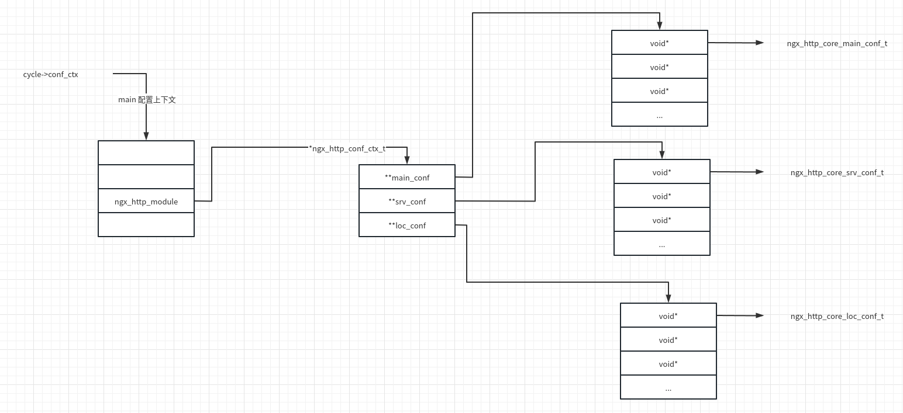
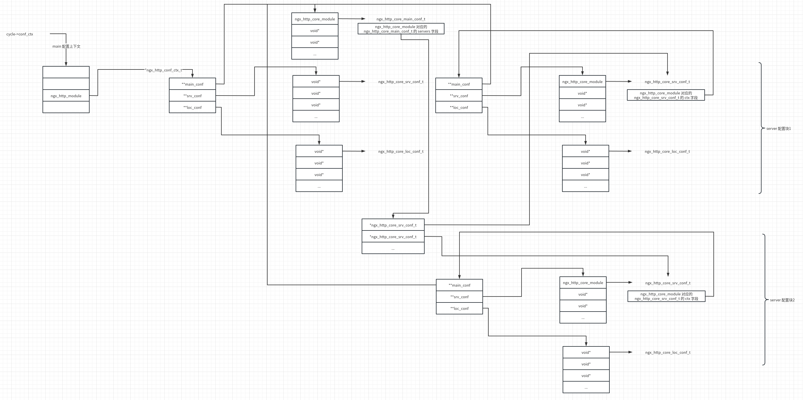
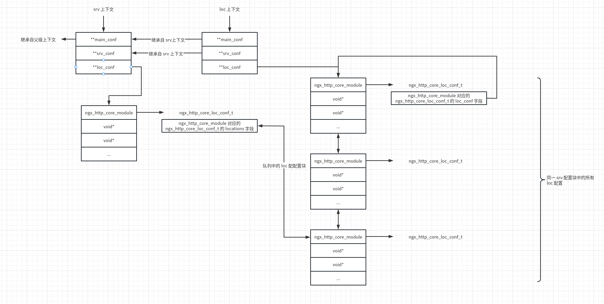
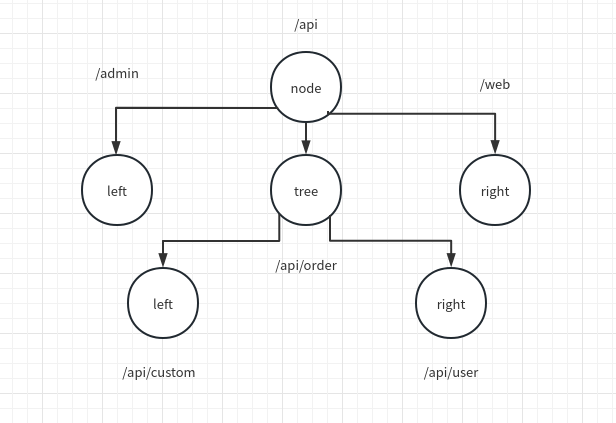

# nginx 配置文件解析

在 nginx 中，配置文件分为配置块（例如 event/http/server/location）与单条指令（例如 worker_processes/root/rewrite）。

+ 配置块可以嵌套，例如 http 中可以嵌套 server 块，server 块中还可以嵌套 location 块。
+ 单条指令可以配置在不同的配置块，例如 root 可以同时配置在 http、server 和 location 配置块中。

## 配置文件简介

```
worker_processes  1;#配置 worker 进程的数目，可以时数字或者 auto，一般等于 CPU 的核数。
error_log  logs/error.log error;#错误日志的输出位置以及日志级别
events {#配置块，events 用于配置事件模型
	use epoll;#use 用于配置 I/O 多路复用的类型
    worker_connections  1024;#每个 worker 进程最多可建立的连接数
}

http {#http 配置块
    log_format  main  '$remote_addr - $remote_user [$time_local] "$request" ' #日志格式
                      '$status $body_bytes_sent "$http_referer" '
                      '"$http_user_agent" "$http_x_forwarded_for"';

    access_log  logs/access.log  main;#访问日志

    server {#server 配置块，用于配置一个虚拟服务器
        listen       8080;#用于配置监听的 IP 以及端口，该配置可选项非常多
        server_name  localhost;#用于配置基于名称的虚拟服务器，当 http 请求的 HOST 与该服务器名称匹配成功时，才会由该服务器处理

        # pass the PHP scripts to FastCGI server listening on 127.0.0.1:9000
        
        location ~ \.php$ {#由嗯与匹配指定请求的 URI，匹配成功时才会选择该 location 处理
            root           html;
            fastcgi_pass   127.0.0.1:9000;#将 http 请求以 FastCGI 协议转发给上游的 FPM 进程处理
            fastcgi_index  index.php;
            fastcgi_param  SCRIPT_FILENAME  /scripts$fastcgi_script_name;
            include        fastcgi_params;
        }
    }
```

nginx 配置解析是分散到各个模块的，每个模块都有一个 commands 数组，数组类型为 `ngx_command_t`

```C
//src/core/ngx_core.h
typedef struct ngx_command_s         ngx_command_t;

//src/core/ngx_conf_file.h
struct ngx_command_s {
    ngx_str_t             name;
    ngx_uint_t            type;
    char               *(*set)(ngx_conf_t *cf, ngx_command_t *cmd, void *conf);
    ngx_uint_t            conf;
    ngx_uint_t            offset;
    void                 *post;
};
```

其中，各个字段的含义如下：

+ name：配置指令的名称，如 fastcgi_pass
+ type：指令类型。分为四种
  + 指令可配置位置
    + NGX_MAIN_CONF 不能出现在配置块中，只能出现在配置文件中的指令，比如 worker_processes
    + NGX_EVENT_CONF 只能出现在 events 配置块中的指令
    + NGX_HTTP_MAIN_CONF 只能出现在 http 配置块中的指令
    + NGX_HTTP_SRV_CONF 只能出现在 server 配置块中的指令
    + NGX_HTTP_LOC_CONF 只能出现在 location 配置块中的指令
    + NGX_HTTP_UPS_CONF 只能出现在 upstream 配置块中的指令
  + 校验指令参数数目
    + NGX_CONF_NOARGS 该指令没有参数
    + NGX_CONF_TAKEn 该指令必须有 n 个参数
    + NGX_CONF_TAKEmn 该指令有 m 或 n 个参数
    + NGX_CONF_1MORE 该指令至少有1个参数
    + NGX_CONF_2MORE 该指令至少有2个参数
    + NGX_CONF_ANY 该指令有任意数目的参数
  + 表示指令是单条指令还是配置块
    + NGX_CONF_BLOCK 表示指令为一个配置块
  + 其他
    + NGX_CONF_FLAG 该指令只能配置为 on/off
    + NGX_DIRECT_CONF 表示该指令的存储地址可以直接获取，不需要额外分配
+ set：指向该配置对应的处理函数
+ conf/offset：表示偏移量，通过偏移量可以定位到该配置的存储地址
+ post：可以指向多种结构，与具体的指令有关

## 相关数据结构

`ngx_cycle_t` 以及 `ngx_module_t` 中包含了配置相关字段。

```C
//src/core/ngx_core.h
typedef struct ngx_cycle_s           ngx_cycle_t;
typedef struct ngx_module_s          ngx_module_t;

//src/core/ngx_cycle.h
struct ngx_cycle_s {
    void                  ****conf_ctx; //配置上下文数组，每个模块的配置文件数据结构的指针地址都会按照模块的 index 索引放置在该数组中
    ngx_pool_t               *pool;//内存池

    /*...*/

    ngx_module_t            **modules;//模块
    ngx_uint_t                modules_n;//模块个数
    ngx_uint_t                modules_used;    /* unsigned  modules_used:1; */

    /*...*/            
};

//src/core/ngx_module.h
struct ngx_module_s {
    ngx_uint_t            ctx_index;
    ngx_uint_t            index; //模块 index

    char                 *name;//模块名称

    /*...*/ 

    void                 *ctx;//模块上下文
    ngx_command_t        *commands;//模块支持的命令集
    ngx_uint_t            type;//模块类型

    /*...*/ 
};
```

## 解析 main 配置

main 配置属于 NGX_MAIN_CONF 类型，只能出现在配置文件中，不能出现在配置块中。只能由核心模块进行解析。main 配置的解析可以分为两步：创建 main 配置上下文；解析所有配置指令。

### ngx_core_module 相关配置

下列配置均位于 `nginx.c` 中。

```C
//首先是 ngx_core_module 的定义
ngx_module_t  ngx_core_module = {
    NGX_MODULE_V1,
    &ngx_core_module_ctx,                  /* module context *///core module 上下文
    ngx_core_commands,                     /* module directives *///core module 支持的命令集
    NGX_CORE_MODULE,                       /* module type */
    NULL,                                  /* init master */
    NULL,                                  /* init module */
    NULL,                                  /* init process */
    NULL,                                  /* init thread */
    NULL,                                  /* exit thread */
    NULL,                                  /* exit process */
    NULL,                                  /* exit master */
    NGX_MODULE_V1_PADDING
};

//ngx_core_module_ctx 上下文
static ngx_core_module_t  ngx_core_module_ctx = {
    ngx_string("core"),
    ngx_core_module_create_conf,//创建一个 ngx_core_conf_t 结构体
    ngx_core_module_init_conf
};
//ngx_core_module_t 的定义如下
typedef struct {
    ngx_str_t             name;
    void               *(*create_conf)(ngx_cycle_t *cycle);
    char               *(*init_conf)(ngx_cycle_t *cycle, void *conf);
} ngx_core_module_t;

//core module 的 commands 数组，定义了 core module 支持的指令
static ngx_command_t  ngx_core_commands[] = {

    { ngx_string("daemon"),
      NGX_MAIN_CONF|NGX_DIRECT_CONF|NGX_CONF_FLAG,
      ngx_conf_set_flag_slot,
      0,
      offsetof(ngx_core_conf_t, daemon),
      NULL },

    { ngx_string("master_process"),
      NGX_MAIN_CONF|NGX_DIRECT_CONF|NGX_CONF_FLAG,
      ngx_conf_set_flag_slot,
      0,
      offsetof(ngx_core_conf_t, master),
      NULL },

    { ngx_string("timer_resolution"),
      NGX_MAIN_CONF|NGX_DIRECT_CONF|NGX_CONF_TAKE1,
      ngx_conf_set_msec_slot,
      0,
      offsetof(ngx_core_conf_t, timer_resolution),
      NULL },

    { ngx_string("pid"),
      NGX_MAIN_CONF|NGX_DIRECT_CONF|NGX_CONF_TAKE1,
      ngx_conf_set_str_slot,
      0,
      offsetof(ngx_core_conf_t, pid),
      NULL },

    /*...*/,

      ngx_null_command
};
```

ngx_core_conf_t 是最终要得到的 main 配置结构体，其定义如下

```C
//各个字段对应于配置文件中可以设置的各个指令
typedef struct {
    ngx_flag_t                daemon;
    ngx_flag_t                master;

    ngx_msec_t                timer_resolution;
    ngx_msec_t                shutdown_timeout;

    ngx_int_t                 worker_processes;
    ngx_int_t                 debug_points;

    ngx_int_t                 rlimit_nofile;
    off_t                     rlimit_core;

    int                       priority;

    ngx_uint_t                cpu_affinity_auto;
    ngx_uint_t                cpu_affinity_n;
    ngx_cpuset_t             *cpu_affinity;

    char                     *username;
    ngx_uid_t                 user;
    ngx_gid_t                 group;

    ngx_str_t                 working_directory;
    ngx_str_t                 lock_file;

    ngx_str_t                 pid;
    ngx_str_t                 oldpid;

    ngx_array_t               env;
    char                    **environment;

    ngx_uint_t                transparent;  /* unsigned  transparent:1; */
} ngx_core_conf_t;
```

### 配置解析

#### ngx_conf_t 初始化

配置解析的入口函数都是 `ngx_conf_parse`。在调用之前，首先要初始化 `ngx_conf_t` 这个参数。

```C
//src/core/ngx_core.h
typedef struct ngx_conf_s            ngx_conf_t;

//src/core/ngx_conf_file.h
struct ngx_conf_s {
    char                 *name;//字符串，当前读取到的配置名称
    ngx_array_t          *args;//数组，当前读取到的配置参数

    ngx_cycle_t          *cycle;
    ngx_pool_t           *pool;
    ngx_pool_t           *temp_pool;
    ngx_conf_file_t      *conf_file;
    ngx_log_t            *log;

    void                 *ctx;//上下文，配置解析后，结果通常会存储在某结构体的某字段。通过 ctx 字段可以获取该字段。
    ngx_uint_t            module_type;//模块类型
    ngx_uint_t            cmd_type;//指令类型

    ngx_conf_handler_pt   handler;
    void                 *handler_conf;
};
```

`ngx_init_cycle` 中对 main 配置的`ngx_conf_t` 进行了初始化。

```C
//src/core/ngx_cycle.c
/*
	cycle 初始化
*/
ngx_cycle_t *
ngx_init_cycle(ngx_cycle_t *old_cycle)
{
    /*...*/
    cycle->conf_ctx = ngx_pcalloc(pool, ngx_max_module * sizeof(void *));//为 cycle->conf_ctx 分配内存
    if (cycle->conf_ctx == NULL) {
        ngx_destroy_pool(pool);
        return NULL;
    }
	/*...*/
    for (i = 0; cycle->modules[i]; i++) {
        if (cycle->modules[i]->type != NGX_CORE_MODULE) {
            continue;
        }

        module = cycle->modules[i]->ctx;//获得模块的上下文，类型为 ngx_core_module_t

        if (module->create_conf) {
            rv = module->create_conf(cycle);//遍历所有核心模块，调用每个模块的 create_conf 方法创建配置结构体，存储到上下文数组
            if (rv == NULL) {
                ngx_destroy_pool(pool);
                return NULL;
            }
            cycle->conf_ctx[cycle->modules[i]->index] = rv;//根据 module 的 index，将 rv 存储到 conf_ctx 的对应位置
        }
    }
    /*...*/
    //初始化 ngx_conf_t
    conf.ctx = cycle->conf_ctx;
    conf.cycle = cycle;
    conf.pool = pool;
    conf.log = log;
    conf.module_type = NGX_CORE_MODULE;
    conf.cmd_type = NGX_MAIN_CONF;  
    
#if 0
    log->log_level = NGX_LOG_DEBUG_ALL;
#endif

    if (ngx_conf_param(&conf) != NGX_CONF_OK) {//解析命令行中的配置参数，内部调用 ngx_conf_parse
        environ = senv;
        ngx_destroy_cycle_pools(&conf);
        return NULL;
    }

    if (ngx_conf_parse(&conf, &cycle->conf_file) != NGX_CONF_OK) {//解析配置文件
        environ = senv;
        ngx_destroy_cycle_pools(&conf);
        return NULL;
    }

    if (ngx_test_config && !ngx_quiet_mode) {
        ngx_log_stderr(0, "the configuration file %s syntax is ok",
                       cycle->conf_file.data);
    }

    for (i = 0; cycle->modules[i]; i++) {
        if (cycle->modules[i]->type != NGX_CORE_MODULE) {
            continue;
        }

        module = cycle->modules[i]->ctx;

        if (module->init_conf) {
            if (module->init_conf(cycle,
                                  cycle->conf_ctx[cycle->modules[i]->index])
                == NGX_CONF_ERROR)
            {
                environ = senv;
                ngx_destroy_cycle_pools(&conf);
                return NULL;
            }
        }
    }
    /*...*/
}
```

#### ngx_conf_parse

`ngx_conf_parse` 中的主要工作是按行读取配置文件，并且解析成 token 数组，将 token 数组进行模块 commends 命令集匹配和设置。我们来看 `ngx_conf_parse` 的具体实现

```C
//src/core/ngx_conf_file.c
/*
	配置解析的核心函数
*/
char *
ngx_conf_parse(ngx_conf_t *cf, ngx_str_t *filename)
{
    char             *rv;
    ngx_fd_t          fd;
    ngx_int_t         rc;
    ngx_buf_t         buf;
    ngx_conf_file_t  *prev, conf_file;
    enum {
        parse_file = 0,
        parse_block,
        parse_param
    } type;

#if (NGX_SUPPRESS_WARN)
    fd = NGX_INVALID_FILE;
    prev = NULL;
#endif

    if (filename) {//打开配置文件

        /* open configuration file */

        fd = ngx_open_file(filename->data, NGX_FILE_RDONLY, NGX_FILE_OPEN, 0);

        if (fd == NGX_INVALID_FILE) {
            ngx_conf_log_error(NGX_LOG_EMERG, cf, ngx_errno,
                               ngx_open_file_n " \"%s\" failed",
                               filename->data);
            return NGX_CONF_ERROR;
        }

        prev = cf->conf_file;

        cf->conf_file = &conf_file;

        if (ngx_fd_info(fd, &cf->conf_file->file.info) == NGX_FILE_ERROR) {
            ngx_log_error(NGX_LOG_EMERG, cf->log, ngx_errno,
                          ngx_fd_info_n " \"%s\" failed", filename->data);
        }

        cf->conf_file->buffer = &buf;//配置文件 buf，默认大小为4096

        buf.start = ngx_alloc(NGX_CONF_BUFFER, cf->log);
        if (buf.start == NULL) {
            goto failed;
        }

        buf.pos = buf.start;
        buf.last = buf.start;
        buf.end = buf.last + NGX_CONF_BUFFER;
        buf.temporary = 1;

        cf->conf_file->file.fd = fd;
        cf->conf_file->file.name.len = filename->len;
        cf->conf_file->file.name.data = filename->data;
        cf->conf_file->file.offset = 0;
        cf->conf_file->file.log = cf->log;
        cf->conf_file->line = 1;

        type = parse_file;

        if (ngx_dump_config
#if (NGX_DEBUG)
            || 1
#endif
           )
        {
            if (ngx_conf_add_dump(cf, filename) != NGX_OK) {
                goto failed;
            }

        } else {
            cf->conf_file->dump = NULL;
        }

    } else if (cf->conf_file->file.fd != NGX_INVALID_FILE) {

        type = parse_block;//解析配置块

    } else {
        type = parse_param;//解析命令行参数
    }


    for ( ;; ) {
        rc = ngx_conf_read_token(cf);//将配置信息按行解析为一个个单词

        /*
         * ngx_conf_read_token() may return
         *
         *    NGX_ERROR             there is error 出错
         *    NGX_OK                the token terminated by ";" was found 遇到结尾符号，表示解析成功
         *    NGX_CONF_BLOCK_START  the token terminated by "{" was found 遇到配置块开始标识{
         *    NGX_CONF_BLOCK_DONE   the "}" was found 遇到配置块结束标识}
         *    NGX_CONF_FILE_DONE    the configuration file is done 文件解析结束
         */

        if (rc == NGX_ERROR) {
            goto done;
        }

        if (rc == NGX_CONF_BLOCK_DONE) {//配置块解析结束

            if (type != parse_block) {
                ngx_conf_log_error(NGX_LOG_EMERG, cf, 0, "unexpected \"}\"");
                goto failed;
            }

            goto done;
        }

        if (rc == NGX_CONF_FILE_DONE) {//配置文件解析结束

            if (type == parse_block) {
                ngx_conf_log_error(NGX_LOG_EMERG, cf, 0,
                                   "unexpected end of file, expecting \"}\"");
                goto failed;
            }

            goto done;
        }

        if (rc == NGX_CONF_BLOCK_START) {//配置块解析开始

            if (type == parse_param) {
                ngx_conf_log_error(NGX_LOG_EMERG, cf, 0,
                                   "block directives are not supported "
                                   "in -g option");
                goto failed;
            }
        }

        /* rc == NGX_OK || rc == NGX_CONF_BLOCK_START */
		//遇到 NGX_OK 和 NGX_CONF_BLOCK_START
        if (cf->handler) {

            /*
             * the custom handler, i.e., that is used in the http's
             * "types { ... }" directive
             */

            if (rc == NGX_CONF_BLOCK_START) {
                ngx_conf_log_error(NGX_LOG_EMERG, cf, 0, "unexpected \"{\"");
                goto failed;
            }

            rv = (*cf->handler)(cf, NULL, cf->handler_conf);
            if (rv == NGX_CONF_OK) {
                continue;
            }

            if (rv == NGX_CONF_ERROR) {
                goto failed;
            }

            ngx_conf_log_error(NGX_LOG_EMERG, cf, 0, "%s", rv);

            goto failed;
        }


        rc = ngx_conf_handler(cf, rc);//解析得到的配置存放在 cf->args 数组中

        if (rc == NGX_ERROR) {
            goto failed;
        }
    }

failed:

    rc = NGX_ERROR;

done:

    if (filename) {
        if (cf->conf_file->buffer->start) {
            ngx_free(cf->conf_file->buffer->start);
        }

        if (ngx_close_file(fd) == NGX_FILE_ERROR) {
            ngx_log_error(NGX_LOG_ALERT, cf->log, ngx_errno,
                          ngx_close_file_n " %s failed",
                          filename->data);
            rc = NGX_ERROR;
        }

        cf->conf_file = prev;
    }

    if (rc == NGX_ERROR) {
        return NGX_CONF_ERROR;
    }

    return NGX_CONF_OK;
}
```

#### ngx_conf_read_token

`ngx_conf_read_token` 的主要工作是将配置文件分解成单个单词的数组。例如配置文件中遇到空格为分隔符号，遇到 `;` 为结束符号。每一个数组就是一条配置命令语句。数组会放置到 cf->args 数组上。

```C
//src/core/ngx_conf_file.c
/*
	将配置文件解析为 token
	token 是两个相邻空格，换行符，单引号或双引号之间的字符串
*/
static ngx_int_t
ngx_conf_read_token(ngx_conf_t *cf)
{
    u_char      *start, ch, *src, *dst;
    off_t        file_size;
    size_t       len;
    ssize_t      n, size;
    ngx_uint_t   found, need_space, last_space, sharp_comment, variable;
    ngx_uint_t   quoted, s_quoted, d_quoted, start_line;
    ngx_str_t   *word;
    ngx_buf_t   *b, *dump;

    found = 0;//是否找到一个完整的 token
    need_space = 0;//标志位，当接下来扫描到的字符需要是空格/水平制表符/回车符/换行符时置为1
    last_space = 1;//标志位，当扫描到空格/水平制表符/回车符/换行符时置为1
    sharp_comment = 0;//表示当前扫描到的字符是否在一个#开头的注释中
    variable = 0;//遇到 $ ，表示一个变量
    quoted = 0;//标志位，当扫描到一个转义序列时置为1
    s_quoted = 0;//标志位，当扫描到一个单引号时置为1
    d_quoted = 0;//标志位，当扫描到一个双引号时置为1

    cf->args->nelts = 0;//cf->args 用来存放 token 的数组
    b = cf->conf_file->buffer;//存放配置内容
    dump = cf->conf_file->dump;
    start = b->pos;//b->pos 表示当前要扫描的字符内容，start 表示 token 的起始字符
    start_line = cf->conf_file->line;

    file_size = ngx_file_size(&cf->conf_file->file.info);

    for ( ;; ) {

        if (b->pos >= b->last) {//buf 中的数据已经处理完毕，需要判断文件是否已经处理完毕，如果没有则继续处理

            if (cf->conf_file->file.offset >= file_size) {

                if (cf->args->nelts > 0 || !last_space) {

                    if (cf->conf_file->file.fd == NGX_INVALID_FILE) {
                        ngx_conf_log_error(NGX_LOG_EMERG, cf, 0,
                                           "unexpected end of parameter, "
                                           "expecting \";\"");
                        return NGX_ERROR;
                    }

                    ngx_conf_log_error(NGX_LOG_EMERG, cf, 0,
                                  "unexpected end of file, "
                                  "expecting \";\" or \"}\"");
                    return NGX_ERROR;
                }

                return NGX_CONF_FILE_DONE;//返回配置文件解析完毕
            }

            len = b->pos - start;//已扫描的 buf 长度

            if (len == NGX_CONF_BUFFER) {//已扫描全部 buf
                cf->conf_file->line = start_line;

                if (d_quoted) {
                    ch = '"';

                } else if (s_quoted) {
                    ch = '\'';

                } else {//字符串太长，一个 buf 都无法存储一个 token
                    ngx_conf_log_error(NGX_LOG_EMERG, cf, 0,
                                       "too long parameter \"%*s...\" started",
                                       10, start);
                    return NGX_ERROR;
                }
				//参数太多，可能缺少右双引号或者右单引号
                ngx_conf_log_error(NGX_LOG_EMERG, cf, 0,
                                   "too long parameter, probably "
                                   "missing terminating \"%c\" character", ch);
                return NGX_ERROR;
            }

            if (len) {//len > 0 表示当前 token 还未解析完毕，将这部分字符拷贝到缓冲区头
                ngx_memmove(b->start, start, len);
            }

            size = (ssize_t) (file_size - cf->conf_file->file.offset);//配置文件未读入的长度

            if (size > b->end - (b->start + len)) {//buf 中未使用的空间，与文件剩余大小，取小值作为 size
                size = b->end - (b->start + len);
            }

            n = ngx_read_file(&cf->conf_file->file, b->start + len, size, //从文件的 offset 个字节的偏移出继续读入 size 个字节放入b中 len 之后的位置
                              cf->conf_file->file.offset);

            if (n == NGX_ERROR) {
                return NGX_ERROR;
            }

            if (n != size) {
                ngx_conf_log_error(NGX_LOG_EMERG, cf, 0,
                                   ngx_read_file_n " returned "
                                   "only %z bytes instead of %z",
                                   n, size);
                return NGX_ERROR;
            }

            b->pos = b->start + len;//b->pos 指向有效数据的开始
            b->last = b->pos + n;//b->last 指向有效数据的结束
            start = b->start;//start 指向缓冲区起始地址

            if (dump) {
                dump->last = ngx_cpymem(dump->last, b->pos, size);
            }
        }//if (b->pos >= b->last)

        ch = *b->pos++;

        if (ch == LF) {//遇到换行符
            cf->conf_file->line++;//已扫描的配置文件行数+1

            if (sharp_comment) {//如果 sharp_comment == 1 并且遇到换行符说明配置结束，则将 sharp_comment 置为0
                sharp_comment = 0;
            }
        }
		//带#的行，继续遍历，直到遇到换行符
        if (sharp_comment) {
            continue;
        }

        if (quoted) {//表示上一个字符为\,那么当前字符就是转义序列的一部分
            quoted = 0;//将 quoted 设置为0,表示转义序列结束
            continue;
        }

        if (need_space) {//当前扫描到的字符需要是空格
            if (ch == ' ' || ch == '\t' || ch == CR || ch == LF) {
                last_space = 1;//置为1,因为扫描到了相关字符
                need_space = 0;//置为0,因为满足须求
                continue;
            }

            if (ch == ';') {//表示一个简单配置项解析结束
                return NGX_OK;
            }

            if (ch == '{') {//遇到{表示一个复杂配置项解析开始
                return NGX_CONF_BLOCK_START;
            }

            if (ch == ')') {
                last_space = 1;
                need_space = 0;

            } else {
                ngx_conf_log_error(NGX_LOG_EMERG, cf, 0,
                                   "unexpected \"%c\"", ch);
                return NGX_ERROR;
            }
        }

        if (last_space) {//上一个字符是换行，空格等分割 token 的分隔符，

            start = b->pos - 1;//如果当前扫描到的字符不为分隔符，意味着当前扫描到的字符为下一个 token，start 指向当前扫描的字符
            start_line = cf->conf_file->line;

            if (ch == ' ' || ch == '\t' || ch == CR || ch == LF) {//连续的分隔符看作一个
                continue;
            }

            switch (ch) {

            case ';':
            case '{'://此时，cf->args 必须已经存储了元素，否则说明配置有误
                if (cf->args->nelts == 0) {
                    ngx_conf_log_error(NGX_LOG_EMERG, cf, 0,
                                       "unexpected \"%c\"", ch);
                    return NGX_ERROR;
                }

                if (ch == '{') {
                    return NGX_CONF_BLOCK_START;//复杂配置开始
                }

                return NGX_OK;

                case '}'://遇到}之前一定会遇到;，遇到}则表明 cf->args 中的元素已经处理完毕，否则说明配置有误
                if (cf->args->nelts != 0) {
                    ngx_conf_log_error(NGX_LOG_EMERG, cf, 0,
                                       "unexpected \"}\"");
                    return NGX_ERROR;
                }

                return NGX_CONF_BLOCK_DONE;

            case '#'://注释开始
                sharp_comment = 1;
                continue;

            case '\\'://转义序列开始
                quoted = 1;
                last_space = 0;
                continue;

            case '"'://当前为双引号，并且前一个字符为分隔符，说明是一个左双引号
                start++;//该双引号之后必定存在一个 token，start++ 为其第一个字符
                d_quoted = 1;
                last_space = 0;
                continue;

            case '\''://当前为单引号，与双引号同理
                start++;
                s_quoted = 1;
                last_space = 0;
                continue;

            case '$'://说明一个变量开始
                variable = 1;
                last_space = 0;
                continue;

            default://其他字符说明是 token 中的字符
                last_space = 0;
            }

        } else {//if (last_space) 上一个扫描到的字符不是分隔符
            if (ch == '{' && variable) {
                continue;
            }

            variable = 0;

            if (ch == '\\') {//转义序列开始
                quoted = 1;
                continue;
            }

            if (ch == '$') {//变量开始
                variable = 1;
                continue;
            }

            if (d_quoted) {//之前遇到一个双引号
                if (ch == '"') {//如果当前字符为双引号，必为右双引号，说明已经遇到一个完整的、双引号包围的 token
                    d_quoted = 0;
                    need_space = 1;//右双引号之后需要出现空格
                    found = 1;
                }

            } else if (s_quoted) {//单引号与双引号同理
                if (ch == '\'') {
                    s_quoted = 0;
                    need_space = 1;
                    found = 1;
                }

            } else if (ch == ' ' || ch == '\t' || ch == CR || ch == LF
                       || ch == ';' || ch == '{')//如果当前是分隔符，意味着一个 token 结束
            {
                last_space = 1;
                found = 1;
            }

            if (found) {//找到了一个 token
                word = ngx_array_push(cf->args);//申请一个元素
                if (word == NULL) {
                    return NGX_ERROR;
                }

                word->data = ngx_pnalloc(cf->pool, b->pos - 1 - start + 1);//为元素分配空间
                if (word->data == NULL) {
                    return NGX_ERROR;
                }
				//将 token 拷贝到刚才申请的内存中
                for (dst = word->data, src = start, len = 0;
                     src < b->pos - 1;
                     len++)
                {
                    if (*src == '\\') {
                        switch (src[1]) {
                        case '"':
                        case '\'':
                        case '\\'://token 下一个字符为单引号，双引号，反斜杠，那么直接退出循环
                            src++;
                            break;

                        case 't'://说明与下一个字符t构成水平制表符，直接拷贝
                            *dst++ = '\t';
                            src += 2;
                            continue;

                        case 'r'://说明与下一个字符r构成回车符，直接拷贝
                            *dst++ = '\r';
                            src += 2;
                            continue;

                        case 'n'://说明与下一个字符n构成换行符，直接拷贝
                            *dst++ = '\n';
                            src += 2;
                            continue;
                        }

                    }
                    *dst++ = *src++;
                }
                *dst = '\0';//加上字符串结束符
                word->len = len;

                if (ch == ';') {
                    return NGX_OK;//配置行结束
                }

                if (ch == '{') {
                    return NGX_CONF_BLOCK_START;//配置块开始
                }

                found = 0;
            }
        }
    }
}
```

#### ngx_conf_handler

`ngx_conf_handler` 中实现了配置值的设置。

```C
//src/core/ngx_conf_file.c
/*
	将 ngx_conf_read_token 解析得到的配置设置到具体的配置结构上
*/
static ngx_int_t
ngx_conf_handler(ngx_conf_t *cf, ngx_int_t last)
{
    char           *rv;
    void           *conf, **confp;
    ngx_uint_t      i, found;
    ngx_str_t      *name;
    ngx_command_t  *cmd;

    name = cf->args->elts;//这里是 ngx_conf_read_token 解析得到的配置数组

    found = 0;

    for (i = 0; cf->cycle->modules[i]; i++) {//循环各个模块

        cmd = cf->cycle->modules[i]->commands;//获取模块的指令数组
        if (cmd == NULL) {
            continue;
        }

        for ( /* void */ ; cmd->name.len; cmd++) {//针对当前模块支持的指令数组进行循环

            if (name->len != cmd->name.len) {
                continue;
            }

            if (ngx_strcmp(name->data, cmd->name.data) != 0) {
                continue;
            }//上面的 if 判断了当前模块支持的指令中，是否有与解析得到的指令同名的指令

            found = 1;//找到同名指令

            if (cf->cycle->modules[i]->type != NGX_CONF_MODULE
                && cf->cycle->modules[i]->type != cf->module_type)
            {
                continue;
            }

            /* is the directive's location right ? */

            if (!(cmd->type & cf->cmd_type)) {//校验指令类型
                continue;
            }

            if (!(cmd->type & NGX_CONF_BLOCK) && last != NGX_OK) {
                ngx_conf_log_error(NGX_LOG_EMERG, cf, 0,
                                  "directive \"%s\" is not terminated by \";\"",
                                  name->data);
                return NGX_ERROR;
            }

            if ((cmd->type & NGX_CONF_BLOCK) && last != NGX_CONF_BLOCK_START) {
                ngx_conf_log_error(NGX_LOG_EMERG, cf, 0,
                                   "directive \"%s\" has no opening \"{\"",
                                   name->data);
                return NGX_ERROR;
            }

            /* is the directive's argument count right ? */
			//校验参数数目
            if (!(cmd->type & NGX_CONF_ANY)) {

                if (cmd->type & NGX_CONF_FLAG) {

                    if (cf->args->nelts != 2) {
                        goto invalid;
                    }

                } else if (cmd->type & NGX_CONF_1MORE) {

                    if (cf->args->nelts < 2) {
                        goto invalid;
                    }

                } else if (cmd->type & NGX_CONF_2MORE) {

                    if (cf->args->nelts < 3) {
                        goto invalid;
                    }

                } else if (cf->args->nelts > NGX_CONF_MAX_ARGS) {

                    goto invalid;

                } else if (!(cmd->type & argument_number[cf->args->nelts - 1]))
                {
                    goto invalid;
                }
            }

            /* set up the directive's configuration context */
			//设置指令的配置上下文，conf.ctx = cycle->conf_ctx
            conf = NULL;

            if (cmd->type & NGX_DIRECT_CONF) {//ngx_core_commands 中的指令均设置了 NGX_DIRECT_CONF
                conf = ((void **) cf->ctx)[cf->cycle->modules[i]->index];

            } else if (cmd->type & NGX_MAIN_CONF) {
                conf = &(((void **) cf->ctx)[cf->cycle->modules[i]->index]);

            } else if (cf->ctx) {
                confp = *(void **) ((char *) cf->ctx + cmd->conf);

                if (confp) {
                    conf = confp[cf->cycle->modules[i]->ctx_index];
                }
            }
			//cf 为 ngx_conf_t，cmd 为指令结构，conf 为模块自定义的配置文件数据结构地址，set 函数是 cmd 中自定义的针对本命令的解析函数
            rv = cmd->set(cf, cmd, conf);

            if (rv == NGX_CONF_OK) {
                return NGX_OK;
            }

            if (rv == NGX_CONF_ERROR) {
                return NGX_ERROR;
            }

            ngx_conf_log_error(NGX_LOG_EMERG, cf, 0,
                               "\"%s\" directive %s", name->data, rv);

            return NGX_ERROR;
        }
    }

    if (found) {
        ngx_conf_log_error(NGX_LOG_EMERG, cf, 0,
                           "\"%s\" directive is not allowed here", name->data);

        return NGX_ERROR;
    }

    ngx_conf_log_error(NGX_LOG_EMERG, cf, 0,
                       "unknown directive \"%s\"", name->data);

    return NGX_ERROR;

invalid:

    ngx_conf_log_error(NGX_LOG_EMERG, cf, 0,
                       "invalid number of arguments in \"%s\" directive",
                       name->data);

    return NGX_ERROR;
}
```

##### 配置解析函数

`ngx_conf_handler` 针对不同的命令调用了其自身的命令解析函数 `cmd->set`，下面以 daemon 为例：

```C
//src/core/ngx_conf_file.c
/*
	ngx_conf_set_flag_slot 是 daemon 对应的解析函数，daemon 是一个 NGX_CONF_FLAG 类型的指令，即只能为 on/off，ngx_conf_set_flag_slot 是一个解析该类型配置的通用函数，daemon 指令初始化时的相关字段如下
	 { ngx_string("daemon"),
      NGX_MAIN_CONF|NGX_DIRECT_CONF|NGX_CONF_FLAG,
      ngx_conf_set_flag_slot,
      0,
      offsetof(ngx_core_conf_t, daemon),
      NULL }
*/
char *
ngx_conf_set_flag_slot(ngx_conf_t *cf, ngx_command_t *cmd, void *conf)
{
    char  *p = conf;

    ngx_str_t        *value;
    ngx_flag_t       *fp;
    ngx_conf_post_t  *post;

    fp = (ngx_flag_t *) (p + cmd->offset);//根据偏移量获取 daemon 的地址

    if (*fp != NGX_CONF_UNSET) {
        return "is duplicate";
    }

    value = cf->args->elts;

    if (ngx_strcasecmp(value[1].data, (u_char *) "on") == 0) {//根据配置情况设置 daemon
        *fp = 1;

    } else if (ngx_strcasecmp(value[1].data, (u_char *) "off") == 0) {
        *fp = 0;

    } else {
        ngx_conf_log_error(NGX_LOG_EMERG, cf, 0,
                     "invalid value \"%s\" in \"%s\" directive, "
                     "it must be \"on\" or \"off\"",
                     value[1].data, cmd->name.data);
        return NGX_CONF_ERROR;
    }

    if (cmd->post) {//daemon 未定义
        post = cmd->post;
        return post->post_handler(cf, post, fp);
    }

    return NGX_CONF_OK;
}
```

nginx 中针对不同类型的配置实现了不同类型的解析函数

```C
//
char *ngx_conf_set_flag_slot(ngx_conf_t *cf, ngx_command_t *cmd, void *conf);
char *ngx_conf_set_str_slot(ngx_conf_t *cf, ngx_command_t *cmd, void *conf);
char *ngx_conf_set_str_array_slot(ngx_conf_t *cf, ngx_command_t *cmd,
    void *conf);
char *ngx_conf_set_keyval_slot(ngx_conf_t *cf, ngx_command_t *cmd, void *conf);
char *ngx_conf_set_num_slot(ngx_conf_t *cf, ngx_command_t *cmd, void *conf);
char *ngx_conf_set_size_slot(ngx_conf_t *cf, ngx_command_t *cmd, void *conf);
char *ngx_conf_set_off_slot(ngx_conf_t *cf, ngx_command_t *cmd, void *conf);
char *ngx_conf_set_msec_slot(ngx_conf_t *cf, ngx_command_t *cmd, void *conf);
char *ngx_conf_set_sec_slot(ngx_conf_t *cf, ngx_command_t *cmd, void *conf);
char *ngx_conf_set_bufs_slot(ngx_conf_t *cf, ngx_command_t *cmd, void *conf);
char *ngx_conf_set_enum_slot(ngx_conf_t *cf, ngx_command_t *cmd, void *conf);
char *ngx_conf_set_bitmask_slot(ngx_conf_t *cf, ngx_command_t *cmd, void *conf);
```

## 解析 events 配置

从上面的分析可以看到，nginx 中配置信息的解析是一个递归的过程。针对每一条解析得到的配置，nginx 会遍历各个模块所支持的指令集合，查找支持的指令并调用指令特定的解析函数尝试进行解析。对于复杂指令，其解析函数内部会继续调用 `ngx_conf_parse` 进行递归解析。

### events 模块的相关配

我们首先查看 events 模块中与指令相关的配置。

```C
//src/event/ngx_event.c
//events 模块的定义，类型为 NGX_CORE_MODULE
ngx_module_t  ngx_events_module = {
    NGX_MODULE_V1,
    &ngx_events_module_ctx,                /* module context *///events 模块的上下文
    ngx_events_commands,                   /* module directives *///events 模块支持的指令集
    NGX_CORE_MODULE,                       /* module type */
    NULL,                                  /* init master */
    NULL,                                  /* init module */
    NULL,                                  /* init process */
    NULL,                                  /* init thread */
    NULL,                                  /* exit thread */
    NULL,                                  /* exit process */
    NULL,                                  /* exit master */
    NGX_MODULE_V1_PADDING
};

//events 模块的上下文定义
static ngx_core_module_t  ngx_events_module_ctx = {
    ngx_string("events"),
    NULL,
    ngx_event_init_conf
};

//指令集
static ngx_command_t  ngx_events_commands[] = {

    { ngx_string("events"),
      NGX_MAIN_CONF|NGX_CONF_BLOCK|NGX_CONF_NOARGS,
      ngx_events_block,//events 配置快的解析函数
      0,
      0,
      NULL },

      ngx_null_command
};

//events core 模块定义，类型为 NGX_EVENT_MODULE
ngx_module_t  ngx_event_core_module = {
    NGX_MODULE_V1,
    &ngx_event_core_module_ctx,            /* module context */
    ngx_event_core_commands,               /* module directives */
    NGX_EVENT_MODULE,                      /* module type */
    NULL,                                  /* init master */
    ngx_event_module_init,                 /* init module */
    ngx_event_process_init,                /* init process */
    NULL,                                  /* init thread */
    NULL,                                  /* exit thread */
    NULL,                                  /* exit process */
    NULL,                                  /* exit master */
    NGX_MODULE_V1_PADDING
};

//events core 模块上下文
static ngx_event_module_t  ngx_event_core_module_ctx = {
    &event_core_name,
    ngx_event_core_create_conf,            /* create configuration */
    ngx_event_core_init_conf,              /* init configuration */

    { NULL, NULL, NULL, NULL, NULL, NULL, NULL, NULL, NULL, NULL }
};

//events core 模块支持的指令集
static ngx_command_t  ngx_event_core_commands[] = {

    { ngx_string("worker_connections"),
      NGX_EVENT_CONF|NGX_CONF_TAKE1,
      ngx_event_connections,
      0,
      0,
      NULL },

    { ngx_string("use"),
      NGX_EVENT_CONF|NGX_CONF_TAKE1,
      ngx_event_use,
      0,
      0,
      NULL },

    { ngx_string("multi_accept"),
      NGX_EVENT_CONF|NGX_CONF_FLAG,
      ngx_conf_set_flag_slot,
      0,
      offsetof(ngx_event_conf_t, multi_accept),
      NULL },

    { ngx_string("accept_mutex"),
      NGX_EVENT_CONF|NGX_CONF_FLAG,
      ngx_conf_set_flag_slot,
      0,
      offsetof(ngx_event_conf_t, accept_mutex),
      NULL },

    { ngx_string("accept_mutex_delay"),
      NGX_EVENT_CONF|NGX_CONF_TAKE1,
      ngx_conf_set_msec_slot,
      0,
      offsetof(ngx_event_conf_t, accept_mutex_delay),
      NULL },

    { ngx_string("debug_connection"),
      NGX_EVENT_CONF|NGX_CONF_TAKE1,
      ngx_event_debug_connection,
      0,
      0,
      NULL },

      ngx_null_command
};

//src/event/ngx_event.h
//events 模块配置结构体
typedef struct {
    ngx_uint_t    connections;
    ngx_uint_t    use;

    ngx_flag_t    multi_accept;
    ngx_flag_t    accept_mutex;

    ngx_msec_t    accept_mutex_delay;

    u_char       *name;

#if (NGX_DEBUG)
    ngx_array_t   debug_connection;
#endif
} ngx_event_conf_t;
```

### ngx_events_block

```C
//src/event/ngx_event.c
/*
	在 main 配置解析的过程中，当遇到 events 指令时，最终调用的是该函数
	conf：ngx_conf_handler 中的代码 “conf = &(((void **) cf->ctx)[cf->cycle->modules[i]->index]);“ 获取了 events 模块的配置上下文，该上下文对应的是 ngx_events_module 模块，ngx_events_module 是一个 NGX_CORE_MODULE 模块
*/
static char *
ngx_events_block(ngx_conf_t *cf, ngx_command_t *cmd, void *conf)
{
    char                 *rv;
    void               ***ctx;
    ngx_uint_t            i;
    ngx_conf_t            pcf;
    ngx_event_module_t   *m;

    if (*(void **) conf) {
        return "is duplicate";
    }

    /* count the number of the event modules and set up their indices */

    ngx_event_max_module = ngx_count_modules(cf->cycle, NGX_EVENT_MODULE);

    ctx = ngx_pcalloc(cf->pool, sizeof(void *));//创建 events 配置上下文
    if (ctx == NULL) {
        return NGX_CONF_ERROR;
    }

    *ctx = ngx_pcalloc(cf->pool, ngx_event_max_module * sizeof(void *));//指向所有 events 模块的配置结构体数组
    if (*ctx == NULL) {
        return NGX_CONF_ERROR;
    }

    *(void **) conf = ctx;//conf指向 events 配置上下文

    for (i = 0; cf->cycle->modules[i]; i++) {
        if (cf->cycle->modules[i]->type != NGX_EVENT_MODULE) {//ngx_event_core_module 的类型也是 event module
            continue;
        }

        m = cf->cycle->modules[i]->ctx;

        if (m->create_conf) {//遍历所有 event 模块，创建配置结构
            (*ctx)[cf->cycle->modules[i]->ctx_index] =
                                                     m->create_conf(cf->cycle);
            if ((*ctx)[cf->cycle->modules[i]->ctx_index] == NULL) {
                return NGX_CONF_ERROR;
            }
        }
    }
	//修改 cf 的配置上下文，模块类型，指令类型；原 cf 暂存在 pcf 变量中
    pcf = *cf;
    cf->ctx = ctx;
    cf->module_type = NGX_EVENT_MODULE;
    cf->cmd_type = NGX_EVENT_CONF;
	//解析 events 配置块中的配置项
    rv = ngx_conf_parse(cf, NULL);
	//还原 cf
    *cf = pcf;

    if (rv != NGX_CONF_OK) {
        return rv;
    }

    for (i = 0; cf->cycle->modules[i]; i++) {
        if (cf->cycle->modules[i]->type != NGX_EVENT_MODULE) {
            continue;
        }

        m = cf->cycle->modules[i]->ctx;

        if (m->init_conf) {
            rv = m->init_conf(cf->cycle,
                              (*ctx)[cf->cycle->modules[i]->ctx_index]);
            if (rv != NGX_CONF_OK) {
                return rv;
            }
        }
    }

    return NGX_CONF_OK;
}
```

流程会沿着 `ngx_events_block`、 `ngx_conf_parse` 、`ngx_conf_handler` 的调用链继续执行

```` C
//src/core/ngx_conf_file.c
/*
	将 ngx_conf_read_token 解析得到的配置设置到具体的配置结构上
*/
static ngx_int_t
ngx_conf_handler(ngx_conf_t *cf, ngx_int_t last)
{
			/*...*/

            /* set up the directive's configuration context */
			//设置指令的配置上下文，conf.ctx = cycle->conf_ctx
            conf = NULL;

            if (cmd->type & NGX_DIRECT_CONF) 
                conf = ((void **) cf->ctx)[cf->cycle->modules[i]->index];

            } else if (cmd->type & NGX_MAIN_CONF) {
                conf = &(((void **) cf->ctx)[cf->cycle->modules[i]->index]);

            } else if (cf->ctx) {//从上面 events core 模块指令集的定义可知，解析 events 配置块的具体配置时会走到这个分支
                confp = *(void **) ((char *) cf->ctx + cmd->conf);//events core 模块指令集的 conf 均为0

                if (confp) {//在这里获取了 modules[i] 对应的配置结构体的首地址，结构体均已在 ngx_events_block 中初始化完成
                    conf = confp[cf->cycle->modules[i]->ctx_index];
                }
            }
			//cf 为 ngx_conf_t，cmd 为指令结构，conf 为模块自定义的配置文件数据结构地址，set 函数是 cmd 中自定义的针对本命令的解析函数
            rv = cmd->set(cf, cmd, conf);

            if (rv == NGX_CONF_OK) {
                return NGX_OK;
            }

            if (rv == NGX_CONF_ERROR) {
                return NGX_ERROR;
            }

            ngx_conf_log_error(NGX_LOG_EMERG, cf, 0,
                               "\"%s\" directive %s", name->data, rv);

            return NGX_ERROR;
        }
    }

    /*...*/

    return NGX_ERROR;
}
````

## 解析 http 配置

### main 配置解析

http 指令的相关配置如下

```C
//src/http/ngx_http.c
static ngx_command_t  ngx_http_commands[] = {

    { ngx_string("http"),
      NGX_MAIN_CONF|NGX_CONF_BLOCK|NGX_CONF_NOARGS,
      ngx_http_block,
      0,
      0,
      NULL },

      ngx_null_command
};


static ngx_core_module_t  ngx_http_module_ctx = {
    ngx_string("http"),
    NULL,
    NULL
};


ngx_module_t  ngx_http_module = {
    NGX_MODULE_V1,
    &ngx_http_module_ctx,                  /* module context */
    ngx_http_commands,                     /* module directives */
    NGX_CORE_MODULE,                       /* module type */
    NULL,                                  /* init master */
    NULL,                                  /* init module */
    NULL,                                  /* init process */
    NULL,                                  /* init thread */
    NULL,                                  /* exit thread */
    NULL,                                  /* exit process */
    NULL,                                  /* exit master */
    NGX_MODULE_V1_PADDING
};
```

可以看到，http 指令类型包括 `NGX_MAIN_CONF`，所以调用 `ngx_http_block` 函数时，获取 conf 参数的方式如下

```C
//src/core/ngx_conf_file.c
//ngx_conf_handler
            } else if (cmd->type & NGX_MAIN_CONF) {
                conf = &(((void **) cf->ctx)[cf->cycle->modules[i]->index]);
```

此时，conf 指向的是 main 配置上下文数组对应索引的位置。

```C
//src/http/ngx_http_config.h
//http 配置上下文结构
typedef struct {
    void        **main_conf;
    void        **srv_conf;
    void        **loc_conf;
} ngx_http_conf_ctx_t;

//src/http/ngx_http.c
/*
	ngx_http_block 的流程：
	1.http 配置上下文创建
	2.调用所有 http 模块的 create_main_conf，create_srv_conf，create_loc_conf 方法创建配置上下文
	3.修改 cf->ctx、cf->mudule_type、cf-cmd_type
	4.调用 ngx_conf_parse 解析 http 配置块
*/
static char *
ngx_http_block(ngx_conf_t *cf, ngx_command_t *cmd, void *conf)
{
    char                        *rv;
    ngx_uint_t                   mi, m, s;
    ngx_conf_t                   pcf;
    ngx_http_module_t           *module;
    ngx_http_conf_ctx_t         *ctx;
    ngx_http_core_loc_conf_t    *clcf;
    ngx_http_core_srv_conf_t   **cscfp;
    ngx_http_core_main_conf_t   *cmcf;

    if (*(ngx_http_conf_ctx_t **) conf) {
        return "is duplicate";
    }

    /* the main http context */

    ctx = ngx_pcalloc(cf->pool, sizeof(ngx_http_conf_ctx_t));//创建 http 配置上下文结构
    if (ctx == NULL) {
        return NGX_CONF_ERROR;
    }

    *(ngx_http_conf_ctx_t **) conf = ctx;//将其放到 main 配置上下文数组 ngx_http_module 对应索引的位置


    /* count the number of the http modules and set up their indices */

    ngx_http_max_module = ngx_count_modules(cf->cycle, NGX_HTTP_MODULE);


    /* the http main_conf context, it is the same in the all http contexts */
	
    ctx->main_conf = ngx_pcalloc(cf->pool,//为 main_conf，srv_conf，loc_conf 分别分配内存
                                 sizeof(void *) * ngx_http_max_module);
    if (ctx->main_conf == NULL) {
        return NGX_CONF_ERROR;
    }


    /*
     * the http null srv_conf context, it is used to merge
     * the server{}s' srv_conf's
     */

    ctx->srv_conf = ngx_pcalloc(cf->pool, sizeof(void *) * ngx_http_max_module);
    if (ctx->srv_conf == NULL) {
        return NGX_CONF_ERROR;
    }


    /*
     * the http null loc_conf context, it is used to merge
     * the server{}s' loc_conf's
     */

    ctx->loc_conf = ngx_pcalloc(cf->pool, sizeof(void *) * ngx_http_max_module);
    if (ctx->loc_conf == NULL) {
        return NGX_CONF_ERROR;
    }


    /*
     * create the main_conf's, the null srv_conf's, and the null loc_conf's
     * of the all http modules
     */

    for (m = 0; cf->cycle->modules[m]; m++) {
        if (cf->cycle->modules[m]->type != NGX_HTTP_MODULE) {
            continue;
        }

        module = cf->cycle->modules[m]->ctx;
        mi = cf->cycle->modules[m]->ctx_index;

        if (module->create_main_conf) {
            ctx->main_conf[mi] = module->create_main_conf(cf);
            if (ctx->main_conf[mi] == NULL) {
                return NGX_CONF_ERROR;
            }
        }

        if (module->create_srv_conf) {
            ctx->srv_conf[mi] = module->create_srv_conf(cf);
            if (ctx->srv_conf[mi] == NULL) {
                return NGX_CONF_ERROR;
            }
        }

        if (module->create_loc_conf) {
            ctx->loc_conf[mi] = module->create_loc_conf(cf);
            if (ctx->loc_conf[mi] == NULL) {
                return NGX_CONF_ERROR;
            }
        }
    }
	//将配置上下文修改为 http 配置上下文
    pcf = *cf;
    cf->ctx = ctx;

    for (m = 0; cf->cycle->modules[m]; m++) {
        if (cf->cycle->modules[m]->type != NGX_HTTP_MODULE) {
            continue;
        }

        module = cf->cycle->modules[m]->ctx;

        if (module->preconfiguration) {
            if (module->preconfiguration(cf) != NGX_OK) {
                return NGX_CONF_ERROR;
            }
        }
    }

    /* parse inside the http{} block */
	//设置当前配置只能由 http 模块解析，配置类型为 NGX_HTTP_MAIN_CONF
    cf->module_type = NGX_HTTP_MODULE;
    cf->cmd_type = NGX_HTTP_MAIN_CONF;
    rv = ngx_conf_parse(cf, NULL);//开始解析 http 配置块

    if (rv != NGX_CONF_OK) {
        goto failed;
    }

    /*
     * init http{} main_conf's, merge the server{}s' srv_conf's
     * and its location{}s' loc_conf's
     */

    /*...*/

failed:

    *cf = pcf;

    return rv;
}
```

http 配置块的存储结果如图所示



对于具备多种类型的指令，其最终解析到的位置是由指令中的偏移量决定的，以 root 指令为例

```C
//src/http/ngx_http_core_module.c
//root 指令的定义
    { ngx_string("root"),
      NGX_HTTP_MAIN_CONF|NGX_HTTP_SRV_CONF|NGX_HTTP_LOC_CONF|NGX_HTTP_LIF_CONF
                        |NGX_CONF_TAKE1,//这里说明 root 指令可以出现在 main 配置，srv 配置和 loc 配置中
      ngx_http_core_root,
      NGX_HTTP_LOC_CONF_OFFSET,//cmd->conf 字段
      0,
      NULL },

//src/http/ngx_http_config.h
#define NGX_HTTP_LOC_CONF_OFFSET   offsetof(ngx_http_conf_ctx_t, loc_conf)
```

当解析 root 指令时，流程继续执行到 `ngx_conf_handler` 中

```C
////src/core/ngx_conf_file.c
//ngx_conf_handler
            } else if (cf->ctx) {
                confp = *(void **) ((char *) cf->ctx + cmd->conf);//cf->xtc 是 http 配置上下文，cmd->conf 是 root 指令对应的偏移量，此时 confp 对应于 ngx_http_core_loc_conf_t 的首地址，也就是说，root 指令最终被存储到了 ngx_http_core_loc_conf_t 中

                if (confp) {
                    conf = confp[cf->cycle->modules[i]->ctx_index];
                }
            }
```

### server 配置解析

server 指令定义如下：

```C
//src/http/ngx_http_core_module.c
    { ngx_string("server"),
      NGX_HTTP_MAIN_CONF|NGX_CONF_BLOCK|NGX_CONF_NOARGS,
      ngx_http_core_server,
      0,
      0,
      NULL },
```

server 指令的处理函数为 `ngx_http_core_server`

```C
//src/http/ngx_http_core_module.c
/*
	解析 server 配置的流程：
	1.创建 srv 上下文
	2.调用所有 http 模块的 create_srv_conf，create_loc_conf 方法创建配置上下文
	3.修改 cf->ctx、cf-cmd_type
	4.调用 ngx_conf_parse 解析 server 配置块
*/
static char *
ngx_http_core_server(ngx_conf_t *cf, ngx_command_t *cmd, void *dummy)
{
    char                        *rv;
    void                        *mconf;
    size_t                       len;
    u_char                      *p;
    ngx_uint_t                   i;
    ngx_conf_t                   pcf;
    ngx_http_module_t           *module;
    struct sockaddr_in          *sin;
    ngx_http_conf_ctx_t         *ctx, *http_ctx;
    ngx_http_listen_opt_t        lsopt;
    ngx_http_core_srv_conf_t    *cscf, **cscfp;
    ngx_http_core_main_conf_t   *cmcf;

    ctx = ngx_pcalloc(cf->pool, sizeof(ngx_http_conf_ctx_t));
    if (ctx == NULL) {
        return NGX_CONF_ERROR;
    }

    http_ctx = cf->ctx;
    ctx->main_conf = http_ctx->main_conf;//srv 上下文的 main_conf 继承自 http 的 main_conf

    /* the server{}'s srv_conf */

    ctx->srv_conf = ngx_pcalloc(cf->pool, sizeof(void *) * ngx_http_max_module);//创建 srv_conf 数组
    if (ctx->srv_conf == NULL) {
        return NGX_CONF_ERROR;
    }

    /* the server{}'s loc_conf */

    ctx->loc_conf = ngx_pcalloc(cf->pool, sizeof(void *) * ngx_http_max_module);//创建 loc_conf 数组
    if (ctx->loc_conf == NULL) {
        return NGX_CONF_ERROR;
    }
	//调用所有 http 模块的 create_srv_conf 和 create_loc_conf 初始化配置结构体
    for (i = 0; cf->cycle->modules[i]; i++) {
        if (cf->cycle->modules[i]->type != NGX_HTTP_MODULE) {
            continue;
        }

        module = cf->cycle->modules[i]->ctx;

        if (module->create_srv_conf) {
            mconf = module->create_srv_conf(cf);
            if (mconf == NULL) {
                return NGX_CONF_ERROR;
            }

            ctx->srv_conf[cf->cycle->modules[i]->ctx_index] = mconf;
        }

        if (module->create_loc_conf) {
            mconf = module->create_loc_conf(cf);
            if (mconf == NULL) {
                return NGX_CONF_ERROR;
            }

            ctx->loc_conf[cf->cycle->modules[i]->ctx_index] = mconf;
        }
    }


    /* the server configuration context */

    cscf = ctx->srv_conf[ngx_http_core_module.ctx_index];//获取 ngx_http_core_module 对应的 srv_conf
    cscf->ctx = ctx;//将当前 ctx（srv）上下文保存在 cscf 的 ctx 字段上


    cmcf = ctx->main_conf[ngx_http_core_module.ctx_index];//获取 ngx_http_core_module 对应的 main_conf

    cscfp = ngx_array_push(&cmcf->servers);//将 cscf 保存到 ngx_http_core_module 对应的 main_conf 的 servers 数组中
    if (cscfp == NULL) {
        return NGX_CONF_ERROR;
    }

    *cscfp = cscf;


    /* parse inside server{} */

    pcf = *cf;//保存 http 上下文
    cf->ctx = ctx;//设置当前上下文为 srv 上下文
    cf->cmd_type = NGX_HTTP_SRV_CONF;

    rv = ngx_conf_parse(cf, NULL);//递归调用 ngx_conf_parse 解析 server 配置块中的指令

    *cf = pcf;//恢复 http 上下文

    /*...*/

    return rv;
}
```

server 配置块与 http 配置块之间的关联关系



### location 配置解析

location 配置用于匹配特定的 URI，其基本语法为 `location [=|~|~*|^~] uri{...}`、`location @name uri{...}`。

+ = 用于定义精确匹配，请求的 URI 与配置的 URI 完全匹配才能生效，精确匹配内部不能嵌套其他 location
+ ～ 和 ~* 分别定义区分大小写的正则匹配规则和不区分大小写的正则匹配规则，正则匹配成功时，立即结束 location 查找
+ ^~ 用于定义最大前缀匹配，该类型的 location 即使匹配成功也不会结束查找，而是会继续查找匹配长度更大的 location。只包含 URI 的 location 也是最大前缀匹配。二者的区别在于：以 ^~ 开始的 location 在匹配成功时不会执行后续的正则匹配，直接选择该 location，而只包含 URI 的 location 在匹配成功时依然会执行后续的正则匹配，匹配不成功时才会选择该 location
+ @ 用于定义命名 location，该类型的 location 只能用于请求重定向，并且不支持嵌套

location 指令的定义如下

```C
//src/http/ngx_http_core_module.c
    { ngx_string("location"),
      NGX_HTTP_SRV_CONF|NGX_HTTP_LOC_CONF|NGX_CONF_BLOCK|NGX_CONF_TAKE12,
      ngx_http_core_location,
      NGX_HTTP_SRV_CONF_OFFSET,
      0,
      NULL },
```

location 配置块的解析函数为 `ngx_http_core_location`

```C
//src/http/ngx_http_core_module.c
/*
	解析 location 配置的流程：
	1.创建 loc 配置上下文
	2.调用所有 http 模块的 create_loc_conf 方法创建配置上下文
	3.解析 location 匹配模式
	4.修改 cf->ctx、cf-cmd_type
	5.调用 ngx_conf_parse 解析 location 配置块
*/
static char *
ngx_http_core_location(ngx_conf_t *cf, ngx_command_t *cmd, void *dummy)
{
    char                      *rv;
    u_char                    *mod;
    size_t                     len;
    ngx_str_t                 *value, *name;
    ngx_uint_t                 i;
    ngx_conf_t                 save;
    ngx_http_module_t         *module;
    ngx_http_conf_ctx_t       *ctx, *pctx;
    ngx_http_core_loc_conf_t  *clcf, *pclcf;

    ctx = ngx_pcalloc(cf->pool, sizeof(ngx_http_conf_ctx_t));//创建 loc 上下文
    if (ctx == NULL) {
        return NGX_CONF_ERROR;
    }

    pctx = cf->ctx;//父级配置上下文
    ctx->main_conf = pctx->main_conf;//继承自 http 上下文
    ctx->srv_conf = pctx->srv_conf;//继承子 srv 上下文

    ctx->loc_conf = ngx_pcalloc(cf->pool, sizeof(void *) * ngx_http_max_module);//创建 loc 上下文
    if (ctx->loc_conf == NULL) {
        return NGX_CONF_ERROR;
    }

    for (i = 0; cf->cycle->modules[i]; i++) {//调用所有 http 模块的 create_loc_conf 方法创建配置上下文
        if (cf->cycle->modules[i]->type != NGX_HTTP_MODULE) {
            continue;
        }

        module = cf->cycle->modules[i]->ctx;

        if (module->create_loc_conf) {
            ctx->loc_conf[cf->cycle->modules[i]->ctx_index] =
                                                   module->create_loc_conf(cf);
            if (ctx->loc_conf[cf->cycle->modules[i]->ctx_index] == NULL) {
                return NGX_CONF_ERROR;
            }
        }
    }

    clcf = ctx->loc_conf[ngx_http_core_module.ctx_index];//clcf：ngx_http_core_module 在当前 loc 上下文中对应的 ngx_http_core_loc_conf_t
    clcf->loc_conf = ctx->loc_conf;//clcf 的 loc_conf 字段指向当前的 loc 上下文的 loc_conf

    value = cf->args->elts;

    if (cf->args->nelts == 3) {//对 location 配置块的匹配模式进行解析，ngx_http_core_loc_conf_t 中的部分字段用于标识 location 匹配模式以及类型

        /*...*/

    } else {

        /*...*/
    }

    pclcf = pctx->loc_conf[ngx_http_core_module.ctx_index];//pclcf：ngx_http_core_module 在父级上下文中对应的 loc_conf

    if (cf->cmd_type == NGX_HTTP_LOC_CONF) {//嵌套 location 校验

        /* nested location */

		/*...*/
    }

    if (ngx_http_add_location(cf, &pclcf->locations, clcf) != NGX_OK) {//将 clcf 插入 pclcf->locations 这个队列中
        return NGX_CONF_ERROR;
    }

    save = *cf;
    cf->ctx = ctx;//修改上下文为 loc 上下文
    cf->cmd_type = NGX_HTTP_LOC_CONF;

    rv = ngx_conf_parse(cf, NULL);

    *cf = save;

    return rv;
}
```

location 配置块与 server 配置块之间的关系



对于嵌套的 location 配置块，其组织关系与上图类似。子 location 配置块被插入到父 location 配置块的 locations 队列中。

#### 配置合并

根据 http/srv/loc 的配置解析过程可知，最终解析结束之后，配置存储结构中包括3个 loc_conf 数组，2个 srv_conf 数组以及1个 main_conf 数组。对于可以同时出现在多个配置块中的配置，nginx 需要将其进行合并以确定配置的最终有效值。

http 模块中，除了包含创建配置的方法以外，还包括以下回调方法

```C
//src/http/ngx_http_config.h
typedef struct {
    /**/
    char       *(*merge_srv_conf)(ngx_conf_t *cf, void *prev, void *conf);//合并 srv 配置

    /**/
    char       *(*merge_loc_conf)(ngx_conf_t *cf, void *prev, void *conf);//合并 loc 配置
} ngx_http_module_t;
```

在 `ngx_http_block` 中解析 http 配置块完成之后，nginx 继续调用 `ngx_http_merge_servers` 进行了配置合并

```C
//src/http/ngx_http.c
//ngx_http_block
    /* parse inside the http{} block */

    cf->module_type = NGX_HTTP_MODULE;
    cf->cmd_type = NGX_HTTP_MAIN_CONF;
    rv = ngx_conf_parse(cf, NULL);

    if (rv != NGX_CONF_OK) {
        goto failed;
    }

    /*
     * init http{} main_conf's, merge the server{}s' srv_conf's
     * and its location{}s' loc_conf's
     */

    cmcf = ctx->main_conf[ngx_http_core_module.ctx_index];
    cscfp = cmcf->servers.elts;

    for (m = 0; cf->cycle->modules[m]; m++) {//循环所有 http 模块
        if (cf->cycle->modules[m]->type != NGX_HTTP_MODULE) {
            continue;
        }

        module = cf->cycle->modules[m]->ctx;
        mi = cf->cycle->modules[m]->ctx_index;

        /* init http{} main_conf's */

        if (module->init_main_conf) {
            rv = module->init_main_conf(cf, ctx->main_conf[mi]);//对 main 配置进行初始化
            if (rv != NGX_CONF_OK) {
                goto failed;
            }
        }

        rv = ngx_http_merge_servers(cf, cmcf, module, mi);//合并配置
        if (rv != NGX_CONF_OK) {
            goto failed;
        }
    }

/*
	cf：http 上下文
	cmcf：ngx_http_core_module 在 http 上下文 main_conf 数组中对应的 ngx_http_core_main_conf_t
	module：http 模块
	ctx_index：模块 id
	合并方法：对于同一个配置，当子级别的上下文没有该方法时，合并当前级别上下文的值到子级别上下。例如，对于 root 配置，如果 srv 上下文没有值，则合并 http 上下文的配置到 srv 上下文；如果 loc 上下文没有值，则合并 srv 上下文的配置到 loc 上下文
*/
static char *
ngx_http_merge_servers(ngx_conf_t *cf, ngx_http_core_main_conf_t *cmcf,
    ngx_http_module_t *module, ngx_uint_t ctx_index)
{
    char                        *rv;
    ngx_uint_t                   s;
    ngx_http_conf_ctx_t         *ctx, saved;
    ngx_http_core_loc_conf_t    *clcf;
    ngx_http_core_srv_conf_t   **cscfp;

    cscfp = cmcf->servers.elts;//server 数组
    ctx = (ngx_http_conf_ctx_t *) cf->ctx;//http 上下文
    saved = *ctx;
    rv = NGX_CONF_OK;

    for (s = 0; s < cmcf->servers.nelts; s++) {

        /* merge the server{}s' srv_conf's */

        ctx->srv_conf = cscfp[s]->ctx->srv_conf;//获取每个 srv 上下文的 srv_conf 数组

        if (module->merge_srv_conf) {//saved.srv_conf[ctx_index] 是 http 上下文的 srv_conf 数组，这里与 srv 上下文的 srv_conf 数组进行了合并
            rv = module->merge_srv_conf(cf, saved.srv_conf[ctx_index],
                                        cscfp[s]->ctx->srv_conf[ctx_index]);
            if (rv != NGX_CONF_OK) {
                goto failed;
            }
        }

        if (module->merge_loc_conf) {

            /* merge the server{}'s loc_conf */

            ctx->loc_conf = cscfp[s]->ctx->loc_conf;//获取每个 srv 上下文的 loc_conf 数组

            rv = module->merge_loc_conf(cf, saved.loc_conf[ctx_index],//合并 http 上下文的与 srv 上下文的 loc_conf 数组
                                        cscfp[s]->ctx->loc_conf[ctx_index]);
            if (rv != NGX_CONF_OK) {
                goto failed;
            }

            /* merge the locations{}' loc_conf's */

            clcf = cscfp[s]->ctx->loc_conf[ngx_http_core_module.ctx_index];//srv 上下文的 loc_conf 数组

            rv = ngx_http_merge_locations(cf, clcf->locations,//合并 srv 与 loc 上下文的 loc_conf 数组
                                          cscfp[s]->ctx->loc_conf,
                                          module, ctx_index);
            if (rv != NGX_CONF_OK) {
                goto failed;
            }
        }
    }

failed:

    *ctx = saved;

    return rv;
}
```

#### location 配置再处理

nginx 对 location 配置块进行了排序优化，该工作在 `ngx_http_block` 中完成

```c
//src/http/ngx_http.c
//ngx_http_block
    /* create location trees */

    for (s = 0; s < cmcf->servers.nelts; s++) {

        clcf = cscfp[s]->ctx->loc_conf[ngx_http_core_module.ctx_index];

        if (ngx_http_init_locations(cf, cscfp[s], clcf) != NGX_OK) {//对 location 配置块进行了排序以及拆分
            return NGX_CONF_ERROR;
        }

        if (ngx_http_init_static_location_trees(cf, clcf) != NGX_OK) {//此时，location 双向链表中仅剩下了精确匹配以及最大长度匹配，nginx 将其建立为一棵三叉树，具体思路为：找到 location 链表的中间节点将 location 链表分为三部分：中间节点、左边节点集合以及右边节点集合，对中间节点的内嵌节点集合（嵌套 location）、左边节点集合以及右边节点集合分别递归处理，最终将 location 链表的所有节点建立为一棵完整的三叉树
            return NGX_CONF_ERROR;
        }
    }

//src/http/ngx_http.c
/*
	对 location 配置块进行了排序以及拆分
*/
static ngx_int_t
ngx_http_init_locations(ngx_conf_t *cf, ngx_http_core_srv_conf_t *cscf,
    ngx_http_core_loc_conf_t *pclcf)
{
    ngx_uint_t                   n;
    ngx_queue_t                 *q, *locations, *named, tail;
    ngx_http_core_loc_conf_t    *clcf;
    ngx_http_location_queue_t   *lq;
    ngx_http_core_loc_conf_t   **clcfp;
#if (NGX_PCRE)
    ngx_uint_t                   r;
    ngx_queue_t                 *regex;
#endif

    locations = pclcf->locations;

    if (locations == NULL) {
        return NGX_OK;
    }

    ngx_queue_sort(locations, ngx_http_cmp_locations);//对 location 配置块进行稳定排序，顺序为精确匹配、最大长度匹配、正则匹配、命名 location、noname location，其中精确匹配以及最大长度匹配基于 URI 进行字典排序

    named = NULL;
    n = 0;
#if (NGX_PCRE)
    regex = NULL;
    r = 0;
#endif

    for (q = ngx_queue_head(locations);
         q != ngx_queue_sentinel(locations);
         q = ngx_queue_next(q))
    {
        lq = (ngx_http_location_queue_t *) q;

        clcf = lq->exact ? lq->exact : lq->inclusive;

        if (ngx_http_init_locations(cf, NULL, clcf) != NGX_OK) {//对于嵌套 location 进行递归处理
            return NGX_ERROR;
        }

#if (NGX_PCRE)

        if (clcf->regex) {
            r++;

            if (regex == NULL) {//记录第一个 正则匹配的 location 的位置
                regex = q;
            }

            continue;
        }

#endif

        if (clcf->named) {//记录第一个命名 location 的位置
            n++;

            if (named == NULL) {
                named = q;
            }

            continue;
        }

        if (clcf->noname) {
            break;//此时 q 指向第一个 noname location
        }
    }

    if (q != ngx_queue_sentinel(locations)) {
        ngx_queue_split(locations, q, &tail);//拆分 location 队列，tail 中存放的是 noname location
    }

    if (named) {//拷贝所有命名 location
        clcfp = ngx_palloc(cf->pool,
                           (n + 1) * sizeof(ngx_http_core_loc_conf_t *));
        if (clcfp == NULL) {
            return NGX_ERROR;
        }

        cscf->named_locations = clcfp;

        for (q = named;//将所有命名 location 拷贝到 cscf->named_locations 中
             q != ngx_queue_sentinel(locations);
             q = ngx_queue_next(q))
        {
            lq = (ngx_http_location_queue_t *) q;

            *(clcfp++) = lq->exact;
        }

        *clcfp = NULL;

        ngx_queue_split(locations, named, &tail);//将命名 location 拆分到 tail 中
    }

#if (NGX_PCRE)

    if (regex) {//拷贝所有正则 location

        clcfp = ngx_palloc(cf->pool,
                           (r + 1) * sizeof(ngx_http_core_loc_conf_t *));
        if (clcfp == NULL) {
            return NGX_ERROR;
        }

        pclcf->regex_locations = clcfp;

        for (q = regex;//将所有正则 location 拷贝到 pclcf->regex_locations
             q != ngx_queue_sentinel(locations);
             q = ngx_queue_next(q))
        {
            lq = (ngx_http_location_queue_t *) q;

            *(clcfp++) = lq->exact;
        }

        *clcfp = NULL;

        ngx_queue_split(locations, regex, &tail);//将正则 location 拆分到 tail 中
    }

#endif

    return NGX_OK;
}
```

location 三叉树结构如下


